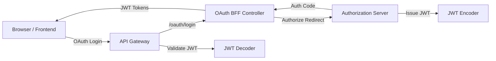

# Security OAuth and JWT Module

## Overview
The **security_oauth_and_jwt** module provides the foundational security building blocks for OpenFrame and Flamingo services, focusing on **OAuth 2.0**, **OpenID Connect**, **JWT issuance and validation**, and **PKCE-based browser flows**.

This module is consumed primarily by:
- The **Authorization Server** (for token issuance and OIDC flows)
- The **Gateway Service** (for JWT validation and API protection)
- Frontend BFF-style OAuth flows via the Gateway

It is intentionally split into two logical parts:
1. **JWT Core Security** – cryptographic key handling and JWT encoder/decoder setup
2. **OAuth BFF Utilities** – browser-oriented OAuth flows, PKCE, redirects, and dev tooling

---

## Responsibilities

- Centralized RSA-based JWT signing and verification
- Externalized JWT configuration (issuer, audience, keys)
- OAuth 2.0 Authorization Code + PKCE helper utilities
- Gateway-facing OAuth BFF endpoints (`/oauth/*`)
- Secure cookie-based token handling
- Developer-friendly OAuth ticket exchange (non-production)

---

## High-Level Architecture

---

## Core Components

### JWT Security (Core)
- **JwtSecurityConfig** – Spring Security beans for JWT encoding/decoding
- **JwtConfig** – Loads RSA keys and JWT metadata from configuration

See: [JWT Core](JWT Core Security.md)

---

### OAuth Utilities & BFF
- **OAuthBffController** – Gateway-facing OAuth endpoints
- **PKCEUtils** – PKCE state, verifier, and challenge utilities
- **DefaultRedirectTargetResolver** – Determines safe redirect targets
- **InMemoryOAuthDevTicketStore** – Dev-only token exchange helper

See: [OAuth BFF and PKCE](OAuth BFF and PKCE.md)

---

### Shared Constants and Helpers
- **SecurityConstants** – Standard token names and headers
- **NoopForwardedHeadersContributor** – Default forwarded-header handler

See: [Shared Utilities](Shared Utilities.md)

---

## Relationship to Other Modules

- **authorization_service_core**: Issues OAuth tokens and OIDC responses
- **gateway_service_core**: Uses JWT decoder and OAuth BFF endpoints
- **api_service_core / external_api_service_core**: Protected by JWT validation

This module does **not** implement user authentication itself; it provides reusable security primitives consumed by other services.

---

## Security Notes

- RSA keys must be rotated using external configuration
- PKCE is mandatory for browser-based OAuth flows
- Dev ticket exchange must be disabled in production environments

---

## Summary

The **security_oauth_and_jwt** module acts as the cryptographic and protocol backbone for OpenFrame authentication. It cleanly separates JWT mechanics from OAuth browser flows, enabling secure, scalable, and developer-friendly authentication across the platform.
