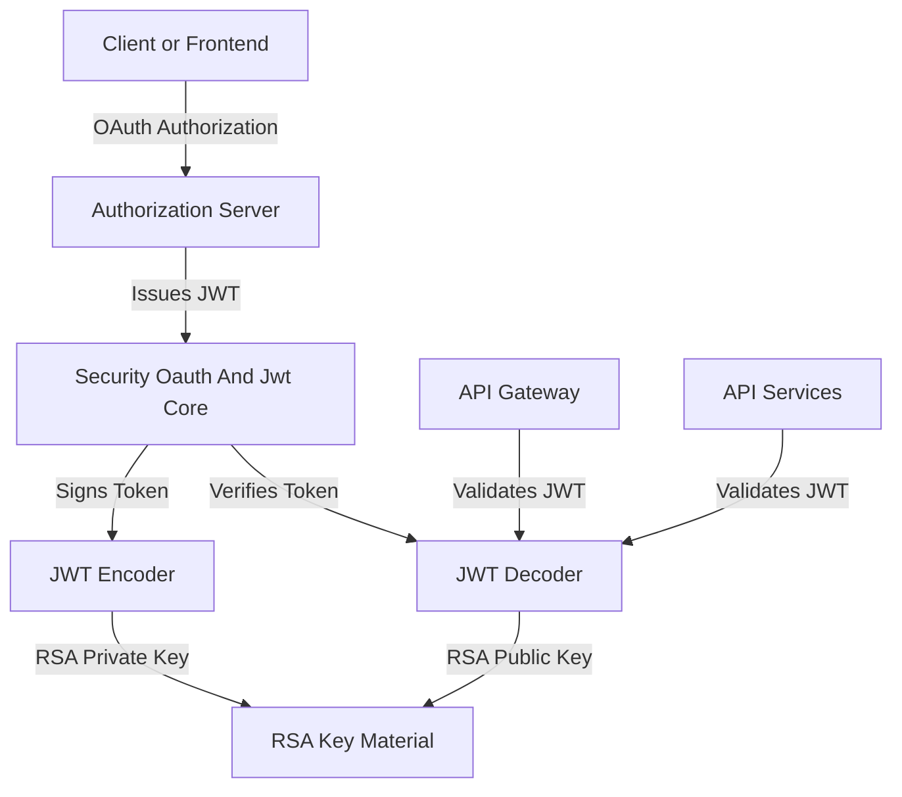
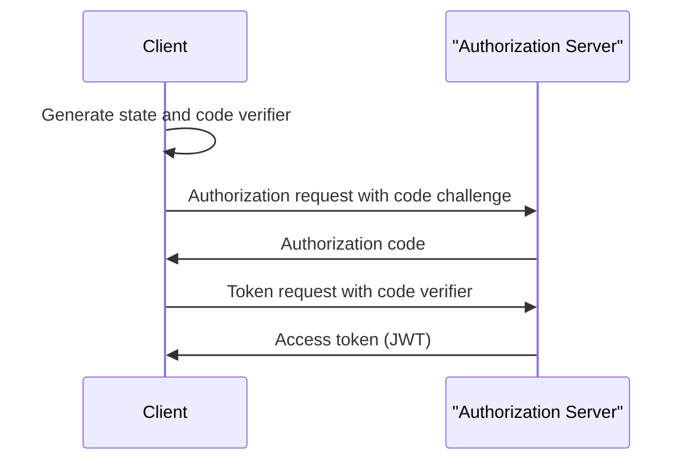

# Security Oauth And Jwt Core

## Overview

The **Security Oauth And Jwt Core** module provides the foundational security building blocks for OAuth 2.0 and JWT-based authentication across the OpenFrame and Flamingo platform. It is designed as a **shared, low-level security library** that is consumed by higher-level services such as:

- Authorization Server
- API Service
- Gateway Service
- OAuth BFF and frontend authentication flows

This module focuses on **cryptographic correctness, standards compliance, and reusability**, rather than business-specific authorization logic.

At its core, it delivers:

- JWT signing and verification infrastructure based on RSA keys
- Centralized JWT configuration (issuer, audience, keys)
- OAuth-related constants shared across services
- PKCE (Proof Key for Code Exchange) utilities for secure OAuth flows

---

## Responsibilities and Scope

The Security Oauth And Jwt Core module is intentionally narrow in scope. It:

- ✅ Provides JWT encoder and decoder beans
- ✅ Loads and parses RSA keys securely
- ✅ Defines shared OAuth and token constants
- ✅ Implements PKCE helpers for OAuth authorization code flows

It does **not**:

- ❌ Implement OAuth endpoints or controllers
- ❌ Manage user sessions or identities
- ❌ Enforce tenant-specific or role-based authorization rules

Those concerns are handled by higher-level modules such as the Authorization Server and Gateway Service.

---

## High-Level Architecture

The following diagram shows how Security Oauth And Jwt Core fits into the broader authentication flow.

---

## Core Components

### JWT Security Configuration

**Component:** `JwtSecurityConfig`

This configuration class wires Spring Security’s JWT infrastructure using Nimbus JOSE + JWT.

**Key responsibilities:**

- Exposes a `JwtEncoder` bean for signing access tokens
- Exposes a `JwtDecoder` bean for validating incoming tokens
- Uses RSA public/private keys provided by `JwtConfig`

**Why this matters:**

- Ensures a single, consistent JWT signing and verification mechanism across services
- Supports asymmetric cryptography, enabling token verification without sharing private keys

---

### JWT Configuration

**Component:** `JwtConfig`

This service is responsible for loading and managing JWT-related configuration values from application properties.

**Managed configuration:**

- RSA public key
- RSA private key
- Token issuer
- Token audience

**Key behaviors:**

- Parses PEM-encoded RSA keys
- Converts Base64-encoded key material into Java `RSAPublicKey` and `RSAPrivateKey`
- Acts as the single source of truth for JWT cryptographic configuration

This component is consumed directly by `JwtSecurityConfig`.

---

### OAuth and Token Constants

**Component:** `SecurityConstants`

This utility class defines shared constants used across OAuth and token-handling logic.

**Examples include:**

- Standard token names (`access_token`, `refresh_token`)
- Custom HTTP header names for token propagation
- Authorization-related query parameters

Centralizing these constants avoids duplication and subtle mismatches between services.

---

### PKCE Utilities

**Component:** `PKCEUtils`

PKCE (Proof Key for Code Exchange) is a critical security mechanism for OAuth 2.0 authorization code flows, especially for browser-based and public clients.

**Provided functionality:**

- Secure generation of `state` parameters to mitigate CSRF attacks
- Generation of cryptographically strong `code_verifier` values
- Creation of SHA-256–based `code_challenge` values
- URL-safe Base64 encoding utilities

**Typical usage:**

- Frontend or BFF generates state and code verifier
- Authorization request includes the code challenge
- Token exchange validates the verifier against the original challenge

---

## OAuth PKCE Flow (Conceptual)

The diagram below illustrates how PKCE utilities from this module support a standard OAuth flow.

---

## Interaction With Other Modules

Security Oauth And Jwt Core is a **dependency-only module**. It is not deployed on its own.

It is commonly used by:

- Authorization Server modules for issuing tokens
- Gateway Service modules for validating tokens
- API services that rely on JWT-based authentication
- OAuth BFF components coordinating frontend login flows

When changes are made to this module, they can have **platform-wide security implications**, so backward compatibility and careful key management are critical.

---

## Design Principles

- **Security-first**: Uses industry-standard algorithms and libraries
- **Centralization**: One place for JWT and OAuth primitives
- **Reusability**: Designed to be shared across many services
- **Minimalism**: Avoids business logic and policy decisions

---

## Summary

The **Security Oauth And Jwt Core** module forms the cryptographic and protocol-level foundation of authentication within OpenFrame. By isolating JWT handling, PKCE utilities, and OAuth constants into a single shared module, the platform ensures consistency, security, and maintainability across all services that participate in authentication and authorization flows.
