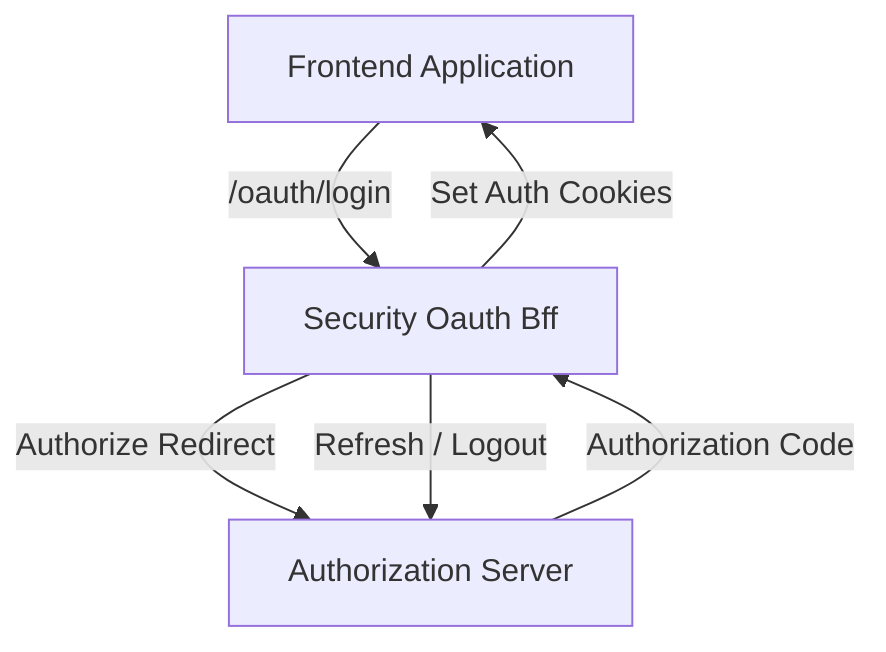
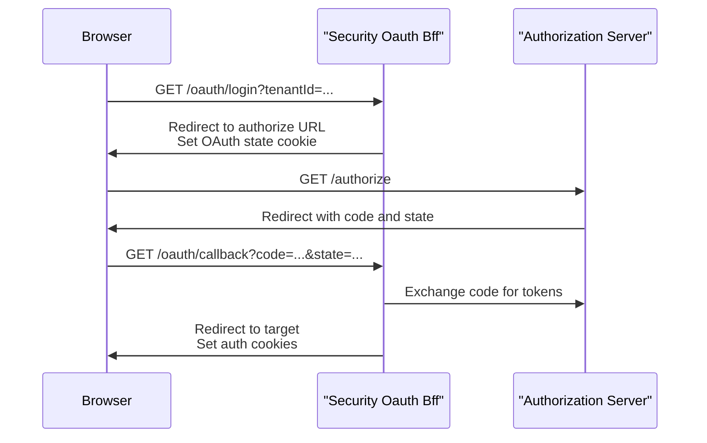
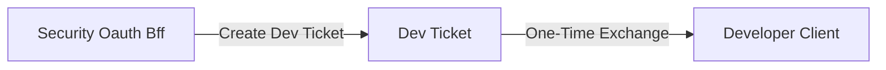

# Security Oauth Bff

## Overview

The **Security Oauth Bff** module acts as a Backend-for-Frontend (BFF) layer that orchestrates OAuth 2.0 and OpenID Connect authentication flows for OpenFrame clients, particularly the web frontend. It centralizes OAuth redirects, state handling, token exchange, refresh, logout, and developer-friendly workflows while abstracting the underlying authorization server complexity from clients.

This module is designed for **reactive, cookie-based authentication** and integrates tightly with:
- The Authorization Server (for OAuth and SSO flows)
- Gateway and security infrastructure (for cookies and headers)
- Frontend applications (as the single OAuth entry point)

Key goals:
- Provide a simple OAuth surface for frontends
- Enforce secure redirect and state handling
- Support PKCE, multi-tenant OAuth, and SSO
- Enable development workflows without exposing tokens to browsers

---

## Responsibilities

The Security Oauth Bff module is responsible for:

- Initializing OAuth login and continuation flows
- Managing OAuth state via signed cookies
- Handling authorization callbacks and token exchange
- Issuing and refreshing authentication cookies
- Coordinating logout and token revocation
- Providing optional development-only token exchange helpers

It does **not** implement OAuth itself; instead, it delegates protocol-heavy operations to lower-level OAuth and authorization services while focusing on request orchestration and client-facing behavior.

---

## Core Components

### OAuth Bff Controller

**Component:** `OAuthBffController`

The OAuth Bff Controller exposes HTTP endpoints under the `/oauth` path and represents the public API of the Security Oauth Bff module.

Main endpoints:

- **GET /oauth/login**  
  Starts a new OAuth authorization flow. Clears existing auth cookies, builds the authorization redirect, creates a signed state token, and redirects the user agent to the authorization server.

- **GET /oauth/continue**  
  Re-initializes an OAuth authorization redirect without clearing cookies. This is used in continuation flows such as SSO finalization where an authenticated principal already exists.

- **GET /oauth/callback**  
  Handles the OAuth authorization callback. Exchanges the authorization code for tokens, sets authentication cookies, clears OAuth state cookies, and redirects back to the resolved client target.

- **POST /oauth/refresh**  
  Refreshes access tokens using a refresh token obtained from cookies or headers. Returns updated authentication cookies.

- **GET /oauth/logout**  
  Revokes refresh tokens and clears all authentication cookies.

- **GET /oauth/dev-exchange**  
  Development-only endpoint that exchanges a temporary developer ticket for tokens via response headers.

The controller is conditionally enabled via configuration and designed for reactive, non-blocking execution.

---

### In-Memory OAuth Dev Ticket Store

**Component:** `InMemoryOAuthDevTicketStore`

This component provides a lightweight, in-memory implementation of a developer ticket store used exclusively in development or non-production environments.

Responsibilities:

- Generate one-time developer tickets associated with OAuth tokens
- Temporarily store tokens keyed by ticket ID
- Allow single-use consumption of tickets

Characteristics:

- Backed by a concurrent in-memory map
- Tickets are UUID-based and ephemeral
- Automatically removed on consumption

This implementation is loaded only when no other `OAuthDevTicketStore` bean is provided, allowing production systems to replace it with a more secure or persistent implementation.

---

### Default Redirect Target Resolver

**Component:** `DefaultRedirectTargetResolver`

The Default Redirect Target Resolver determines the final redirect destination after OAuth flows complete.

Resolution strategy:

1. Use the explicitly requested `redirectTo` parameter if present
2. Fall back to the HTTP `Referer` header
3. Default to `/` if no other information is available

This logic ensures safe and predictable redirects while minimizing client-side configuration.

Like other components in this module, it is conditionally loaded and can be overridden by custom implementations.

---

## High-Level Architecture

The Security Oauth Bff module sits between frontend clients and the authorization infrastructure, acting as the single OAuth entry point.

---

## OAuth Login and Callback Flow

The following diagram illustrates a typical OAuth login sequence handled by the Security Oauth Bff module.

---

## Development Ticket Flow

For development environments, the module supports an optional ticket-based flow that avoids exposing tokens directly in redirects.

In this flow:

- Tokens are associated with a temporary ticket
- The ticket is appended to the redirect target
- The client exchanges the ticket for tokens via a secure endpoint
- Tokens are returned via response headers and the ticket is invalidated

---

## Configuration and Enablement

The Security Oauth Bff module is conditionally enabled using configuration properties. This allows it to be deployed only in environments where OAuth BFF behavior is required.

Key configuration concepts:

- Enable or disable the entire module
- Control OAuth state cookie TTL
- Enable or disable developer ticket functionality

Exact property names and defaults are defined in the surrounding security and gateway configuration.

---

## Security Considerations

- OAuth state is signed and stored in HTTP-only cookies to prevent CSRF attacks
- Redirect targets are resolved server-side to reduce open redirect risks
- Refresh tokens are never exposed in URLs
- Development-only endpoints are gated by configuration flags

---

## How This Module Fits Into the System

Within the broader OpenFrame platform, the Security Oauth Bff module:

- Serves frontend applications as their OAuth entry point
- Delegates authentication and SSO logic to the Authorization Server
- Relies on shared cookie and security infrastructure
- Integrates seamlessly with the Gateway and API services via cookies

By isolating OAuth orchestration in a dedicated BFF layer, the system achieves clearer separation of concerns, improved security posture, and a simpler integration model for clients.
