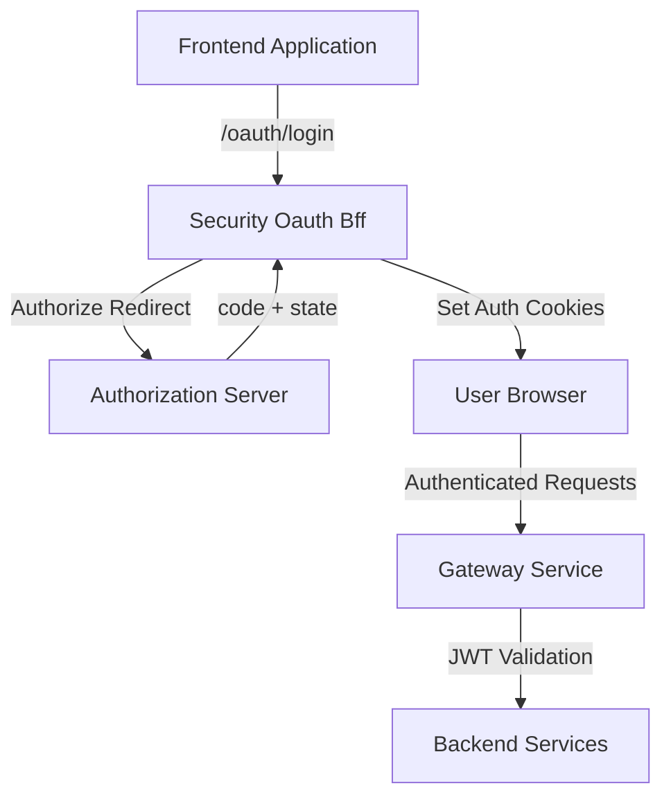
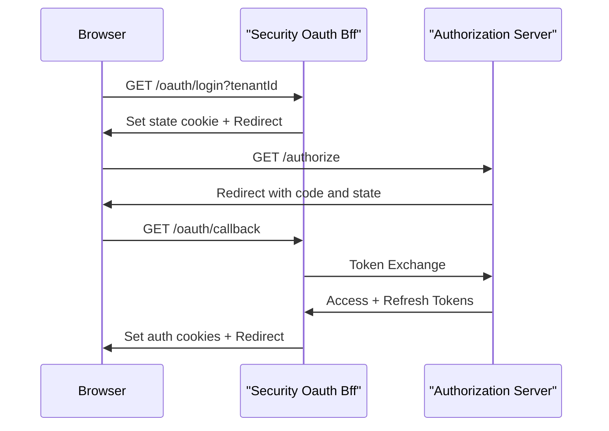

# Security Oauth Bff

## Overview

Security Oauth Bff is the backend-for-frontend (BFF) module responsible for orchestrating OAuth 2.0 and OpenID Connect authentication flows between frontend clients, the Gateway, and the Authorization Server. It provides a browser-friendly API that manages redirects, PKCE and state handling, secure cookie management, token refresh, logout, and development-only token exchange flows.

This module sits at the edge of the security stack and acts as the single OAuth entry point for frontend applications, shielding them from direct interaction with the Authorization Server and internal token services.

---

## Responsibilities

Security Oauth Bff is responsible for:

- Initializing OAuth login and continuation flows
- Managing OAuth state and PKCE lifecycle
- Handling authorization callbacks and token exchange
- Issuing and clearing authentication cookies
- Refreshing access tokens using refresh tokens
- Revoking tokens on logout
- Supporting development-only token handoff via short-lived tickets
- Resolving safe redirect targets after authentication

---

## Position in the Platform

Security Oauth Bff integrates tightly with several other platform modules:

- **Gateway Service Core**: Exposes the BFF endpoints and applies edge security policies
- **Authorization Server**: Performs OAuth authorization, SSO, and token issuance
- **Security Oauth And Jwt Core**: Provides shared constants, JWT, PKCE, and OAuth utilities
- **Frontend Service**: Initiates login, refresh, and logout flows through this BFF

Security Oauth Bff does not implement OAuth protocols itself. Instead, it coordinates flows and enforces platform-specific behavior around cookies, redirects, and multi-tenant context.

---

## High-Level Architecture

---

## Core Components

### OAuthBffController

**Component:** `OAuthBffController`

The OAuthBffController is the main entry point for all OAuth-related HTTP interactions. It exposes a browser-oriented API under the `/oauth` path and is conditionally enabled when gateway OAuth support is active.

Key endpoints include:

- **GET /oauth/login**
  - Initializes a new OAuth authorization flow
  - Clears existing authentication cookies
  - Generates state and PKCE data
  - Redirects the browser to the Authorization Server

- **GET /oauth/continue**
  - Similar to login, but preserves existing cookies
  - Used after SSO completion or chained authentication flows

- **GET /oauth/callback**
  - Handles redirects from the Authorization Server
  - Exchanges authorization code for tokens
  - Sets access and refresh token cookies
  - Clears OAuth state cookies
  - Redirects the user back to the resolved target

- **POST /oauth/refresh**
  - Refreshes access tokens using a refresh token
  - Supports cookie-based and header-based refresh tokens

- **GET /oauth/logout**
  - Revokes refresh tokens
  - Clears authentication cookies

- **GET /oauth/dev-exchange**
  - Development-only endpoint
  - Exchanges a short-lived dev ticket for auth headers

The controller itself is intentionally thin and delegates most logic to services such as OAuthBffService, CookieService, and OAuthDevTicketStore.

---

### InMemory OAuth Dev Ticket Store

**Component:** `InMemoryOAuthDevTicketStore`

This component provides a simple, in-memory implementation of the OAuthDevTicketStore interface. It is only active when no other implementation is provided.

Responsibilities:

- Generates random, one-time-use tickets
- Temporarily associates issued OAuth tokens with tickets
- Allows secure, single-consumption retrieval of tokens

This mechanism is designed strictly for development and debugging scenarios and should not be relied on in production environments.

---

### Default Redirect Target Resolver

**Component:** `DefaultRedirectTargetResolver`

The Default Redirect Target Resolver determines where a user should be redirected after authentication.

Resolution strategy:

1. Use the explicitly requested `redirectTo` parameter if provided
2. Fallback to the HTTP Referer header
3. Default to the root path (`/`) if no other information is available

This ensures a safe and predictable redirect behavior while avoiding hard dependencies on frontend routing logic.

---

### Noop Forwarded Headers Contributor

**Component:** `NoopForwardedHeadersContributor`

This is a fallback implementation of the Forwarded Headers Contributor abstraction. When no other contributor is present, it performs no modifications to outgoing headers.

Purpose:

- Acts as a safe default in reactive environments
- Allows platform deployments to override forwarded header behavior when needed
- Prevents accidental header injection

---

## OAuth Login Flow

---

## Security Considerations

- OAuth state is signed and stored in short-lived cookies to mitigate CSRF attacks
- Redirect targets are validated and resolved defensively
- Refresh tokens are never exposed in URLs
- Authentication cookies are centrally managed via CookieService
- Development-only features are gated by configuration flags

---

## Configuration Highlights

Common configuration properties used by Security Oauth Bff include:

- OAuth enablement flag at the gateway level
- OAuth state cookie time-to-live
- Development ticket enablement

Exact property names and defaults are defined in the surrounding gateway and security configuration modules.

---

## Summary

Security Oauth Bff provides a clean, secure, and frontend-friendly abstraction over complex OAuth and SSO workflows. By centralizing redirect logic, cookie handling, and token lifecycle management, it simplifies frontend development while enforcing consistent security practices across the OpenFrame platform.
