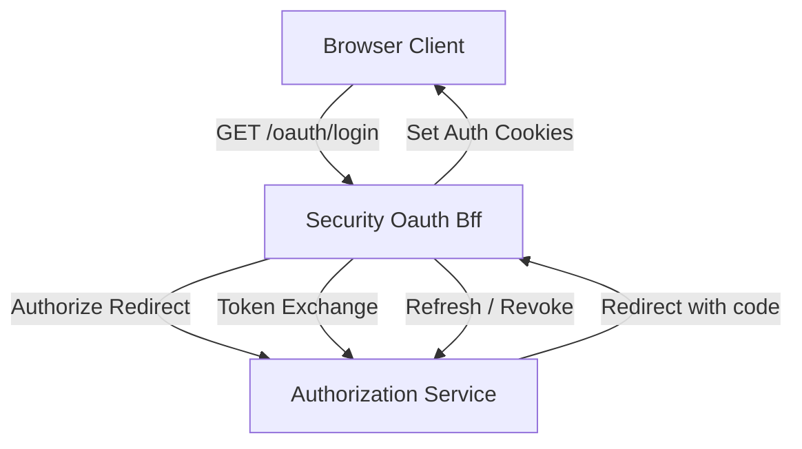
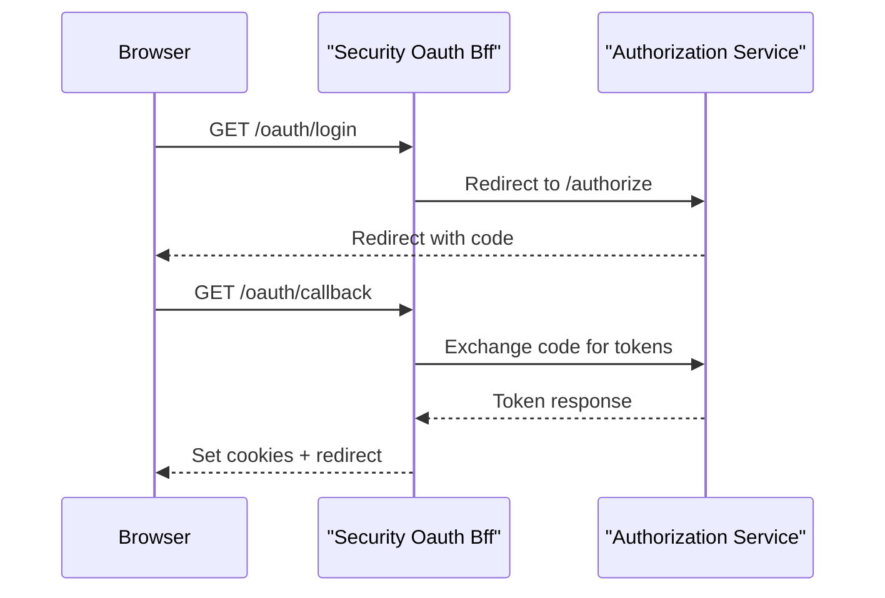

# Security Oauth Bff

## Overview

The **Security Oauth Bff** module acts as the Backend-for-Frontend (BFF) layer for OAuth 2.0 and OpenID Connect flows within the OpenFrame platform. It provides a browser-friendly OAuth façade that:

- Initiates OAuth login and continuation flows
- Manages PKCE and state handling via secure cookies
- Handles authorization callbacks and token exchanges
- Refreshes and revokes tokens
- Provides optional developer-friendly token exchange mechanisms

This module is designed to sit behind the Gateway and in front of frontend clients, abstracting the complexity of OAuth, cookies, and redirects while integrating tightly with the platform’s authorization and security infrastructure.

---

## Position in the Platform Architecture

Security Oauth Bff does not implement OAuth itself. Instead, it orchestrates OAuth flows by collaborating with several other platform modules:

- **Authorization Service Core** – provides the OAuth 2.0 / OIDC authorization server and SSO logic
- **Gateway Service Core** – exposes public endpoints and applies security, CORS, and routing
- **Security Oauth Support** – shared OAuth, JWT, and PKCE utilities
- **Data Persistence Mongo** – stores registered clients, tokens, and tenant configuration

The BFF focuses on HTTP-level concerns (redirects, cookies, headers) that are specific to browser-based flows.

---

## High-Level Architecture

---

## Core Responsibilities

The Security Oauth Bff module is responsible for:

- **OAuth Flow Orchestration**: Building authorization URLs, handling callbacks, and coordinating token exchanges
- **State and PKCE Management**: Issuing and validating state values stored in short-lived cookies
- **Cookie Management**: Setting, clearing, and refreshing access and refresh token cookies
- **Redirect Safety**: Resolving safe redirect targets and preventing invalid or missing redirects
- **Developer Experience**: Providing optional development-only token exchange via temporary tickets

---

## Main Components

### OAuth Bff Controller

**Component:** `OAuthBffController`

The controller exposes the public OAuth-related HTTP endpoints under the `/oauth` path. It is conditionally enabled via configuration and serves as the primary entry point for frontend clients.

**Key Endpoints:**

- **GET /oauth/login**  
  Initiates a fresh OAuth login flow. Clears existing auth cookies, builds an authorization redirect, and sets a state cookie.

- **GET /oauth/continue**  
  Continues an OAuth flow without clearing cookies. Used after SSO finalization when a principal already exists.

- **GET /oauth/callback**  
  Handles the OAuth authorization code callback, exchanges the code for tokens, sets auth cookies, and redirects the user.

- **POST /oauth/refresh**  
  Refreshes access tokens using a refresh token from cookies or headers.

- **GET /oauth/logout**  
  Revokes refresh tokens and clears authentication cookies.

- **GET /oauth/dev-exchange**  
  Development-only endpoint to exchange a short-lived ticket for tokens via response headers.

**Controller Flow Example:**

---

### Redirect Target Resolution

**Component:** `DefaultRedirectTargetResolver`

This component determines where the user should be redirected after authentication. Its resolution strategy is:

1. Use the explicit `redirectTo` parameter if provided
2. Fall back to the HTTP `Referer` header
3. Default to the root path (`/`)

The resolver is reactive and pluggable, allowing custom implementations to override the default behavior.

---

### Developer Ticket Store

**Component:** `InMemoryOAuthDevTicketStore`

The developer ticket store supports a development and debugging workflow where tokens are not immediately written to cookies. Instead:

- A short-lived ticket is generated and appended to the redirect URL
- The frontend can later exchange this ticket for tokens

The default implementation is:

- In-memory
- Thread-safe
- Automatically enabled only when no custom implementation is provided

This mechanism is guarded by configuration and should not be relied upon for production token handling.

---

### Forwarded Headers Handling

**Component:** `NoopForwardedHeadersContributor`

This is a default, no-operation implementation for forwarded headers contribution. It exists to:

- Provide a safe default when no forwarded header logic is required
- Allow other modules or deployments to supply their own implementation

By marking it as primary and conditional, the platform ensures predictable behavior without forcing forwarded header usage.

---

## Security Considerations

Security Oauth Bff enforces several important security practices:

- **Short-lived OAuth State Cookies** to mitigate CSRF attacks
- **HTTP-only Auth Cookies** for access and refresh tokens
- **Redirect Validation** to prevent invalid or missing redirect targets
- **Conditional Dev Features** that can be disabled entirely in production

The module relies on upstream security configuration from the Gateway and shared OAuth support libraries for JWT validation and PKCE enforcement.

---

## Configuration Overview

The module is primarily controlled through configuration properties, including:

- Enabling or disabling the OAuth BFF endpoints
- State cookie time-to-live values
- Enabling or disabling developer ticket functionality

Exact property names and defaults are defined in platform configuration and should be managed centrally.

---

## How This Module Fits Together

In summary, **Security Oauth Bff** is the glue between browser clients and the platform’s OAuth infrastructure. It keeps frontend applications simple by:

- Hiding OAuth protocol complexity
- Managing cookies and redirects consistently
- Providing a single, stable OAuth entry point across tenants and identity providers

For deeper details on authorization logic, token persistence, or identity provider integration, refer to the relevant platform modules rather than duplicating that logic here.
