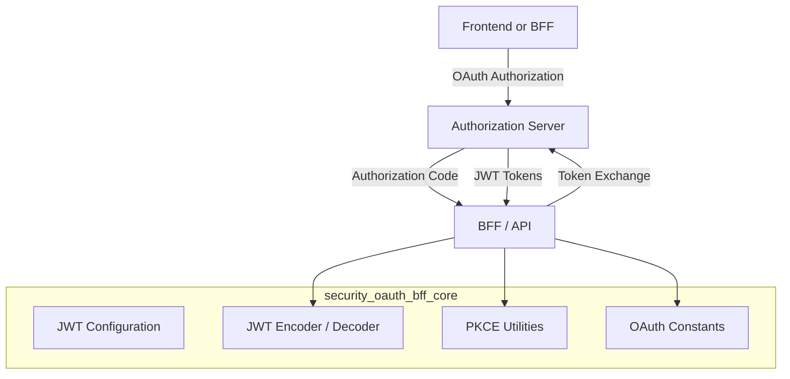
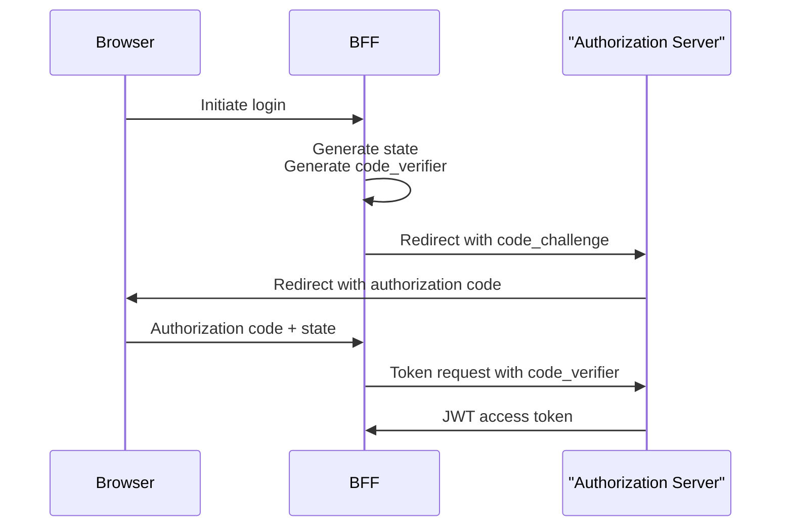

# security_oauth_bff_core

## Overview

The **security_oauth_bff_core** module provides the foundational security primitives used by OpenFrame services acting as OAuth2 / OIDC **Backend-for-Frontend (BFF)** components. It focuses on **JWT handling**, **OAuth2 token conventions**, and **PKCE (Proof Key for Code Exchange)** utilities that are reused across gateway, API, and authorization-related services.

This module is intentionally small and composable. It does **not** expose controllers or persistence layers; instead, it supplies configuration beans, constants, and cryptographic helpers that higher-level modules (such as `security_oauth_web`, `gateway_service_core`, and `authorization_service_core`) build upon.

---

## Responsibilities

The module is responsible for:

- Configuring JWT **encoding and decoding** using RSA keys
- Centralizing JWT-related configuration (issuer, audience, key material)
- Defining shared OAuth token and header constants
- Providing secure PKCE utilities for OAuth2 authorization code flows

---

## High-Level Architecture



---

## Core Components

### 1. JwtSecurityConfig

**Component:** `JwtSecurityConfig`

This Spring configuration class defines the **JWT encoder and decoder beans** used across OpenFrame services.

**Key responsibilities:**

- Builds a `JwtEncoder` using RSA public/private keys
- Builds a `JwtDecoder` using the RSA public key
- Uses Nimbus JOSE + JWT under the hood

**Why it matters:**

- Ensures all JWTs are signed and verified consistently
- Decouples cryptographic setup from business logic
- Enables centralized key rotation via configuration

**Used by:**

- API services
- Gateway services
- OAuth BFF layers

---

### 2. JwtConfig

**Component:** `JwtConfig`

`JwtConfig` is a configuration-backed service responsible for loading and parsing JWT-related settings.

**Key responsibilities:**

- Loads RSA public and private keys from configuration
- Parses PEM-encoded private keys
- Exposes issuer and audience values

**Configuration properties:**

```text
jwt.public-key
jwt.private-key
jwt.issuer
jwt.audience
```

**Why it matters:**

- Keeps sensitive key material out of code
- Supports environment-specific JWT configuration
- Acts as the single source of truth for JWT identity metadata

---

### 3. SecurityConstants

**Component:** `SecurityConstants`

A lightweight constants holder defining common OAuth2 and token-related names.

**Defined constants include:**

- Authorization query parameter names
- Access and refresh token names
- HTTP header names for token propagation

**Why it matters:**

- Prevents duplication and inconsistencies across services
- Ensures gateways, APIs, and clients agree on token semantics

---

### 4. PKCEUtils

**Component:** `PKCEUtils`

A utility class implementing **PKCE (Proof Key for Code Exchange)** helpers required for secure OAuth2 authorization flows.

**Key responsibilities:**

- Generate cryptographically secure `state` values (CSRF protection)
- Generate PKCE `code_verifier`
- Derive PKCE `code_challenge` using SHA-256
- Provide URL-safe Base64 encoding

**Why it matters:**

- Enables secure OAuth2 flows for browser-based and public clients
- Prevents authorization code interception attacks
- Required for modern OAuth2 best practices

---

## OAuth2 + PKCE Flow Context

The utilities in this module are typically used as part of the following flow:



---

## Relationship to Other Modules

This module is **foundational** and is consumed by higher-level security and API modules:

- **security_oauth_web**: Implements OAuth BFF controllers and redirect handling
- **authorization_service_core**: Uses JWT configuration and PKCE concepts during auth flows
- **gateway_service_core**: Validates JWTs at the edge
- **api_service_core_graphql_rest**: Relies on JWT decoding for request authentication

This module intentionally avoids direct dependencies on web, persistence, or transport layers.

---

## Design Principles

- **Minimal surface area**: Only core security primitives
- **Configuration-driven**: No hardcoded secrets or keys
- **Reusable**: Shared across multiple OpenFrame services
- **Standards-compliant**: OAuth2, OIDC, JWT, PKCE best practices

---

## Summary

The **security_oauth_bff_core** module forms the cryptographic and protocol backbone of OpenFrame’s OAuth2 and JWT-based security model. By centralizing JWT configuration, token conventions, and PKCE utilities, it enables consistent, secure authentication flows across the entire platform while remaining lightweight and easy to integrate.
