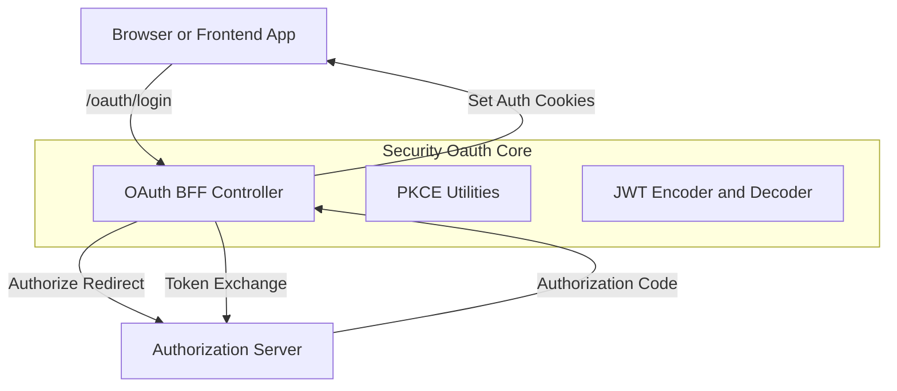
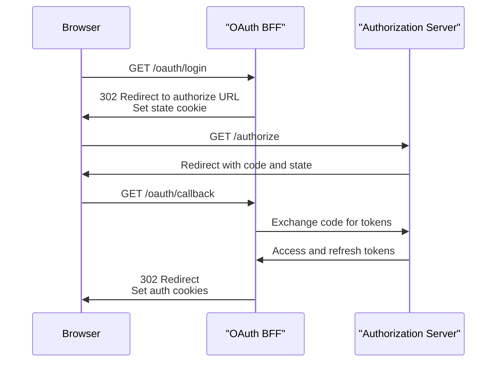

# Security Oauth Core

## Overview

The **Security Oauth Core** module provides the foundational OAuth 2.0, OpenID Connect–adjacent, and JWT security building blocks used across the OpenFrame platform. It acts as the glue between:

- The **Authorization Server** (for login, SSO, and token issuance)
- The **Gateway and API layers** (for token validation and propagation)
- The **Frontend and BFF flows** (for browser-safe OAuth handling)

This module focuses on:

- JWT encoding and decoding using RSA keys
- OAuth BFF (Backend-for-Frontend) flows with PKCE and state handling
- Secure cookie-based token handling
- Developer-friendly OAuth tooling for local and non-production flows

It is intentionally opinionated and minimal, providing defaults that can be overridden by higher-level services when needed.

---

## Responsibilities

The Security Oauth Core module is responsible for:

- **JWT cryptography**: Configuring encoders and decoders backed by RSA keys
- **OAuth constants**: Defining shared token and header naming conventions
- **PKCE utilities**: Generating verifiers, challenges, and CSRF-safe state values
- **OAuth BFF endpoints**: Handling browser-based OAuth login, callback, refresh, and logout flows
- **Redirect resolution**: Safely determining post-authentication redirect targets
- **Developer tooling**: Providing an in-memory dev ticket mechanism for token inspection

---

## High-Level Architecture

The module sits between the Gateway / Frontend layer and the Authorization Server, translating browser-oriented OAuth flows into secure token handling.

---

## Core Components

### JWT Security Configuration

**JwtSecurityConfig** wires Spring Security’s JWT encoder and decoder using RSA keys provided by configuration.

Key characteristics:

- Uses **Nimbus JOSE JWT** under the hood
- Publishes a `JwtEncoder` backed by an RSA JWK set
- Publishes a `JwtDecoder` backed by the RSA public key

This configuration is consumed by API, Gateway, and Authorization Server modules to ensure consistent token validation.

---

### JWT Configuration

**JwtConfig** is a configuration-backed service that:

- Loads RSA public and private keys
- Parses PEM-encoded private keys
- Exposes issuer and audience metadata

It is driven by application properties under the `jwt` prefix and acts as the single source of truth for cryptographic material.

---

### OAuth Security Constants

**SecurityConstants** defines shared constants used across OAuth flows:

- Token names (`access_token`, `refresh_token`)
- Header names (`Access-Token`, `Refresh-Token`)
- Common query parameter keys

This ensures consistent naming across Gateway, BFF, and frontend integrations.

---

### PKCE Utilities

**PKCEUtils** provides static helpers required for OAuth 2.0 Authorization Code flows with PKCE:

- Secure random **state** generation (CSRF protection)
- Secure random **code verifier** generation
- SHA-256–based **code challenge** derivation
- URL-safe Base64 encoding helpers

These utilities are used when building authorization redirects and validating callbacks.

---

### OAuth BFF Controller

**OAuthBffController** exposes browser-facing OAuth endpoints under `/oauth`.

Supported flows:

- `GET /oauth/login` – Initiates OAuth login, clears auth cookies, sets state cookie
- `GET /oauth/continue` – Continues OAuth without clearing existing session
- `GET /oauth/callback` – Handles authorization code exchange and cookie setup
- `POST /oauth/refresh` – Refreshes tokens using refresh token cookie or header
- `GET /oauth/logout` – Revokes refresh token and clears auth cookies
- `GET /oauth/dev-exchange` – Developer-only token exchange using a dev ticket

The controller:

- Uses **HTTP-only cookies** for browser safety
- Supports optional **dev ticket propagation** for local tooling
- Guards against open redirects by validating redirect targets

---

### Redirect Target Resolution

**DefaultRedirectTargetResolver** determines where users are redirected after OAuth completion:

- Prefers an explicit `redirectTo` parameter
- Falls back to the `Referer` header
- Defaults to `/` if no valid target is found

This logic is intentionally conservative to reduce redirect-based attack vectors.

---

### Forwarded Headers Handling

**NoopForwardedHeadersContributor** is a safe default implementation that:

- Performs no header mutation
- Is only active when no other forwarded-header contributor is defined

This avoids unintended trust of proxy headers in environments where they are not explicitly configured.

---

### OAuth Developer Ticket Store

**InMemoryOAuthDevTicketStore** provides a lightweight, in-memory mechanism for:

- Temporarily storing issued tokens
- Exchanging them via a short-lived developer ticket

This is useful for:

- Local development
- Debugging OAuth flows
- CLI or tooling integrations

It is guarded by configuration and intended for non-production use only.

---

## OAuth Login and Callback Flow

The following sequence illustrates a typical browser-based OAuth login:

---

## Integration Within the Platform

Security Oauth Core is a foundational dependency for:

- **Authorization Server Core** – Token issuance and SSO flows
- **Gateway Service Core** – JWT validation and request authentication
- **API Service Core** – Securing REST and GraphQL endpoints
- **Frontend Applications** – Browser-safe authentication flows via BFF

It does not persist data itself and relies on higher-level services for user, tenant, and token storage.

---

## Design Principles

- **Security-first defaults** with explicit opt-in for developer conveniences
- **Clear separation** between browser-facing and service-facing OAuth logic
- **Minimal surface area** to reduce misconfiguration risk
- **Extensibility** via conditional beans and override-friendly components

---

## Summary

The **Security Oauth Core** module establishes the cryptographic and OAuth foundation of OpenFrame. By centralizing JWT handling, PKCE utilities, and browser-safe OAuth flows, it enables consistent, secure authentication across the entire platform while remaining flexible enough for development and multi-tenant deployments.
