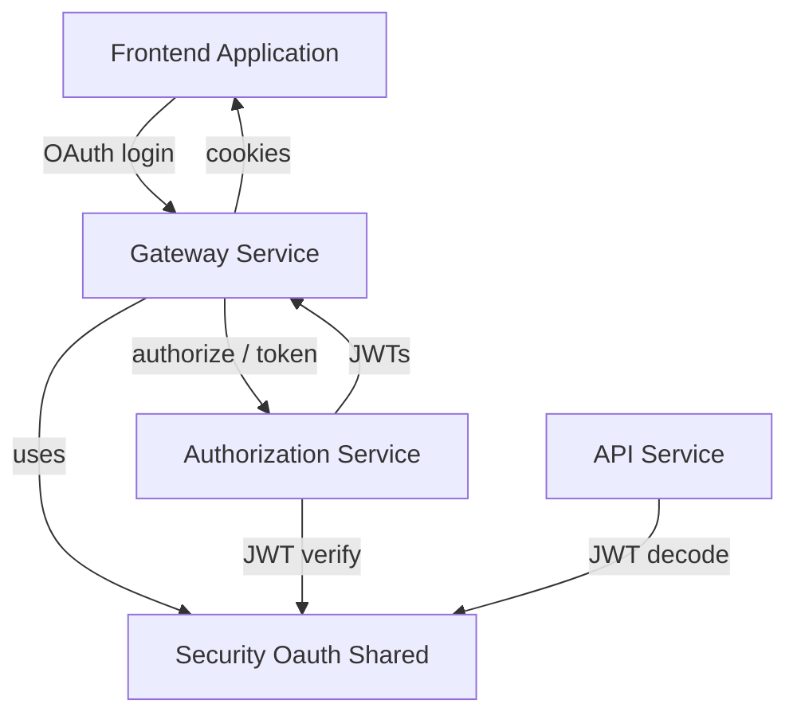
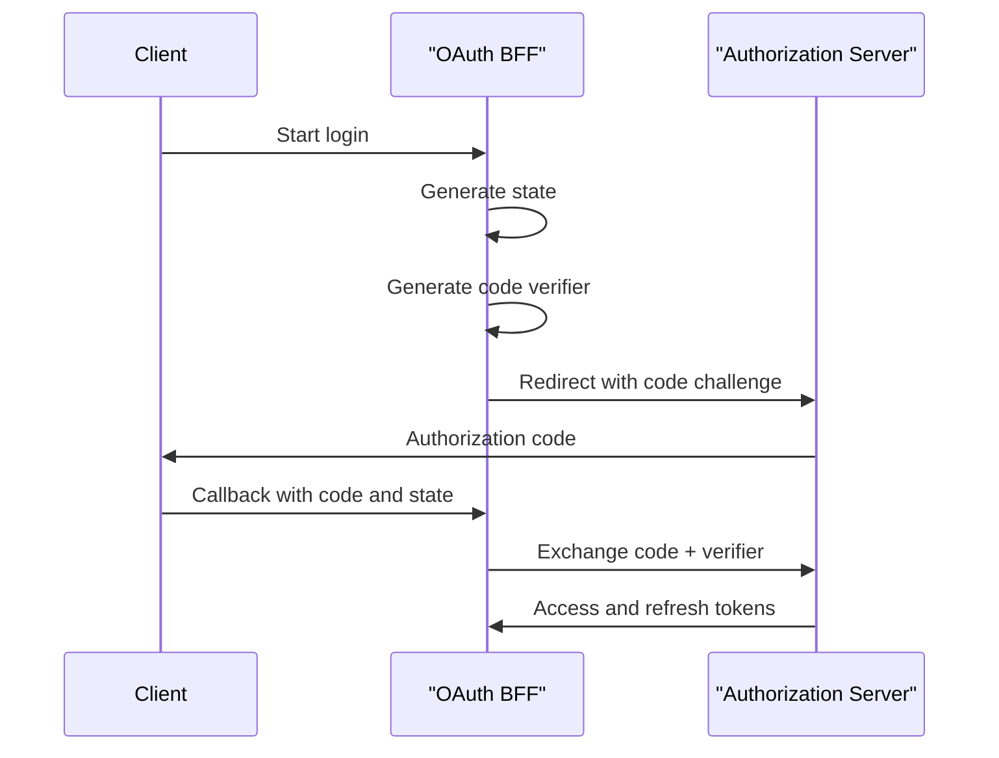

# Security Oauth Shared

## Overview

Security Oauth Shared is a foundational module that provides reusable OAuth2, PKCE, and JWT security building blocks shared across the OpenFrame platform. It centralizes common security primitives used by the Gateway, Authorization Server, API services, and frontend BFF flows, ensuring consistent token handling, redirect safety, and cryptographic correctness.

This module does **not** implement a full authorization server by itself. Instead, it supplies:

- JWT encoder and decoder configuration
- OAuth and PKCE utilities
- Shared OAuth constants
- Backend-for-Frontend (BFF) OAuth endpoints
- Development-only token exchange helpers
- Default redirect resolution logic

By keeping these concerns in Security Oauth Shared, higher-level services can focus on business logic while relying on a single, audited implementation of OAuth-related mechanics.

---

## Responsibilities

Security Oauth Shared is responsible for:

- Configuring RSA-backed JWT signing and verification
- Loading and managing JWT key material and metadata
- Providing PKCE helpers for OAuth2 Authorization Code flows
- Defining shared OAuth token and header conventions
- Acting as a BFF layer for browser-based OAuth flows
- Managing short-lived development OAuth tickets
- Resolving safe redirect targets after authentication

---

## Position in the Platform

Security Oauth Shared sits below service-specific security configurations and above low-level cryptographic primitives. It is consumed by multiple core services, including:

- Gateway service for browser-facing OAuth flows
- Authorization service for token issuance and validation
- API services that need JWT decoding
- Frontend applications via BFF endpoints

---

## Core Components

### JWT Security Configuration

**Component:** Jwt Security Config

This configuration provides Spring Security beans for JWT encoding and decoding using RSA keys.

Key characteristics:

- Uses Nimbus JOSE JWT implementation
- Builds a JWK set from RSA public and private keys
- Exposes both encoder and decoder beans
- Shared across services that need token signing or verification

JWTs produced and consumed through this configuration are compatible across Gateway, Authorization, and API services.

---

### JWT Configuration

**Component:** Jwt Config

Jwt Config is responsible for loading JWT-related configuration from application properties.

Responsibilities include:

- Loading RSA public keys
- Loading and decoding RSA private keys from PEM format
- Exposing issuer and audience metadata

This design allows keys to be externally managed (for example via secrets or configuration servers) without changing application code.

---

### OAuth Security Constants

**Component:** Security Constants

This utility class defines shared constants used across OAuth and BFF flows, including:

- Token names
- Cookie names
- Header names
- Query parameter names

By centralizing these constants, the platform avoids subtle mismatches between services and clients.

---

### PKCE Utilities

**Component:** PKCE Utils

PKCE Utils provides cryptographically secure helpers required for OAuth2 Authorization Code flows with PKCE.

Supported operations:

- Generate random state values for CSRF protection
- Generate secure code verifiers
- Generate SHA-256 based code challenges
- Perform URL-safe Base64 encoding

These utilities are used during OAuth login initiation and callback handling to ensure standards-compliant and secure flows.

---

### OAuth BFF Controller

**Component:** OAuth Bff Controller

The OAuth Bff Controller acts as a Backend-for-Frontend layer that mediates OAuth flows for browser-based clients.

Key endpoints:

- `GET /oauth/login` – Initializes OAuth login, PKCE, and state handling
- `GET /oauth/continue` – Continues OAuth flows after intermediate steps
- `GET /oauth/callback` – Handles authorization code callbacks and token exchange
- `POST /oauth/refresh` – Refreshes access tokens using refresh tokens
- `GET /oauth/logout` – Revokes refresh tokens and clears cookies
- `GET /oauth/dev-exchange` – Development-only token exchange endpoint

Responsibilities:

- Managing OAuth state cookies
- Delegating OAuth protocol logic to the BFF service layer
- Writing access and refresh tokens to secure cookies
- Performing safe redirect handling
- Providing developer-friendly token access when enabled

This controller is conditionally enabled and primarily used by the Gateway service.

---

### Development Ticket Store

**Component:** In Memory OAuth Dev Ticket Store

This component provides a lightweight, in-memory implementation of a development-only OAuth ticket store.

Purpose:

- Allows temporary exchange of OAuth tokens via a short-lived ticket
- Enables local development and debugging without exposing cookies
- Automatically removed after ticket consumption

Characteristics:

- Non-persistent
- Thread-safe
- Automatically disabled when a custom implementation is provided

This component must not be relied on in production environments.

---

### Redirect Target Resolution

**Component:** Default Redirect Target Resolver

This resolver determines the final redirect target after OAuth completion.

Resolution strategy:

1. Use the explicitly requested redirect target if provided
2. Fallback to the HTTP Referer header
3. Default to root path

This ensures predictable and safe redirect behavior while avoiding hard dependencies on frontend routing.

---

## Security Considerations

- RSA private keys must be securely stored and rotated
- Development ticket exchange should be disabled in production
- Redirect targets should always be validated by higher-level services
- PKCE is enforced to protect public clients
- State parameters are mandatory to mitigate CSRF attacks

---

## Summary

Security Oauth Shared provides the security backbone for OAuth and JWT handling across the OpenFrame ecosystem. By centralizing cryptography, PKCE logic, BFF orchestration, and shared conventions, it reduces duplication, improves security posture, and ensures consistent authentication behavior across all services.