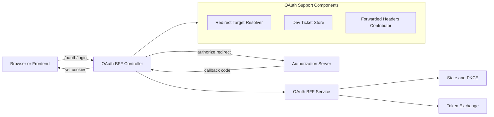
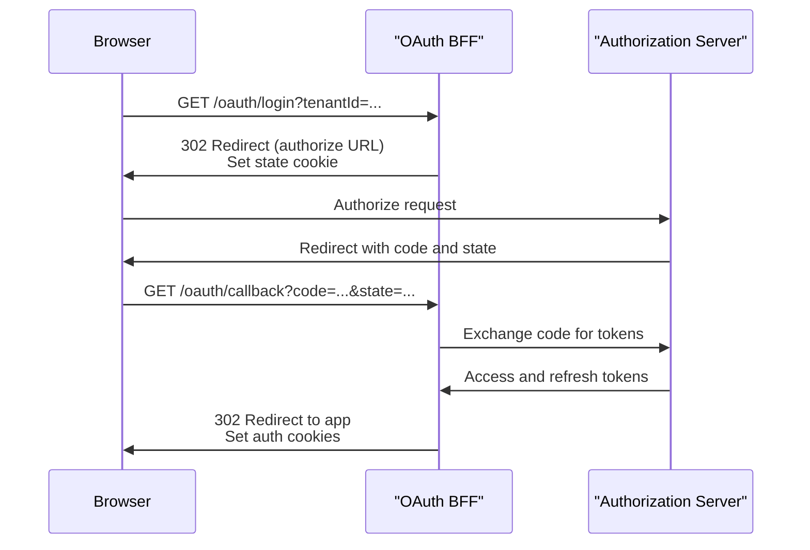

# security_oauth_support

This module provides OAuth 2.0 and OpenID Connect **Backend-for-Frontend (BFF)** support for OpenFrame services. It acts as the boundary between browsers/frontends and the underlying Authorization Server, handling redirects, PKCE/state management, token exchange, refresh, logout, and development-time conveniences.

The module is intentionally lightweight and reactive (Spring WebFlux), delegating most protocol-heavy logic to shared security-core and authorization-server modules while focusing on HTTP orchestration, cookies, and redirects.

---

## Responsibilities

- Expose OAuth-related HTTP endpoints under `/oauth`
- Coordinate OAuth authorization redirects and callbacks
- Manage OAuth state and PKCE via cookies and JWT state tokens
- Set and clear authentication cookies (access / refresh tokens)
- Support development workflows via temporary **dev tickets**
- Provide safe redirect resolution with sensible defaults
- Integrate cleanly with Gateway and Authorization Server layers

---

## High-Level Architecture

**Key idea:** the BFF never exposes raw OAuth complexity to the frontend. Instead, it owns redirects, cookies, and state validation, returning users to the UI with a clean, authenticated session.

---

## Core Components Overview

### OAuthBffController

**File:** `OAuthBffController.java`

The main HTTP entry point for OAuth flows. All endpoints are conditionally enabled via configuration (`openframe.gateway.oauth.enable=true`).

Exposed endpoints:

- `GET /oauth/login` – Starts OAuth login (clears auth cookies, sets state cookie, redirects to provider)
- `GET /oauth/continue` – Continues OAuth without clearing cookies (used after SSO finalization)
- `GET /oauth/callback` – Handles authorization code callback, exchanges tokens, sets auth cookies
- `POST /oauth/refresh` – Refreshes tokens using refresh cookie or header
- `GET /oauth/logout` – Revokes refresh token and clears auth cookies
- `GET /oauth/dev-exchange` – Development-only token exchange using a short-lived ticket

Key behaviors:

- Uses **HTTP 302 redirects** for browser flows
- Stores OAuth `state` in an HTTP-only cookie with configurable TTL
- Adds and clears auth cookies consistently via `CookieService`
- Gracefully handles OAuth errors by redirecting back with error parameters

---

### Redirect Target Resolution

**Default implementation:** `DefaultRedirectTargetResolver`

This component determines where users should be redirected after authentication.

Resolution order:

1. Explicit `redirectTo` request parameter
2. HTTP `Referer` header
3. Fallback to `/`

This ensures safe, predictable navigation without hard-coding frontend URLs.

---

### Development Ticket Support

**Implementation:** `InMemoryOAuthDevTicketStore`

For development and local debugging, the module can expose tokens via temporary **dev tickets**.

Flow:

1. After successful callback, tokens are stored with a random ticket ID
2. User is redirected with `?devTicket=...`
3. Frontend calls `/oauth/dev-exchange?ticket=...`
4. Tokens are returned via HTTP headers and the ticket is invalidated

Characteristics:

- In-memory and ephemeral
- Single-use tickets
- Disabled automatically if `dev-ticket-enabled=false`

This feature is never required in production and can be replaced by another `OAuthDevTicketStore` implementation.

---

### Forwarded Headers Handling

**Default:** `NoopForwardedHeadersContributor`

This is a safe default implementation that does nothing. It exists to allow environments (such as gateways or proxies) to inject custom forwarded headers logic without changing core OAuth code.

By design:

- Marked as `@Primary`
- Only active if no other `ForwardedHeadersContributor` bean is defined

---

## OAuth Flow Walkthrough

---

## Configuration Flags

Key properties affecting this module:

- `openframe.gateway.oauth.enable` – Enables or disables all OAuth endpoints
- `openframe.gateway.oauth.state-cookie-ttl-seconds` – TTL for OAuth state cookie
- `openframe.gateway.oauth.dev-ticket-enabled` – Enables development ticket support

---

## Integration Points

This module is tightly integrated with:

- **Gateway Service** – Routes `/oauth/**` traffic and applies security filters
- **Authorization Server** – Performs actual OAuth/OIDC protocol handling
- **Security Core** – Provides JWT, PKCE, and shared security constants
- **Frontend Applications** – Consume cookies and redirects, never raw tokens

The design keeps OAuth concerns centralized while remaining flexible for multi-tenant and multi-provider setups.

---

## Design Principles

- **BFF pattern first**: browsers never talk directly to OAuth providers
- **Stateless where possible**: cookies + JWT-backed state
- **Safe defaults**: fallback redirects, no-op headers, disabled dev features
- **Extensible**: replace ticket store, redirect resolver, or headers contributor via Spring beans

---

## Summary

The `security_oauth_support` module is the glue between frontend clients, the OpenFrame Gateway, and the Authorization Server. It focuses on correctness, safety, and developer experience, ensuring OAuth flows are robust, debuggable, and easy to evolve without leaking complexity to consumers.
