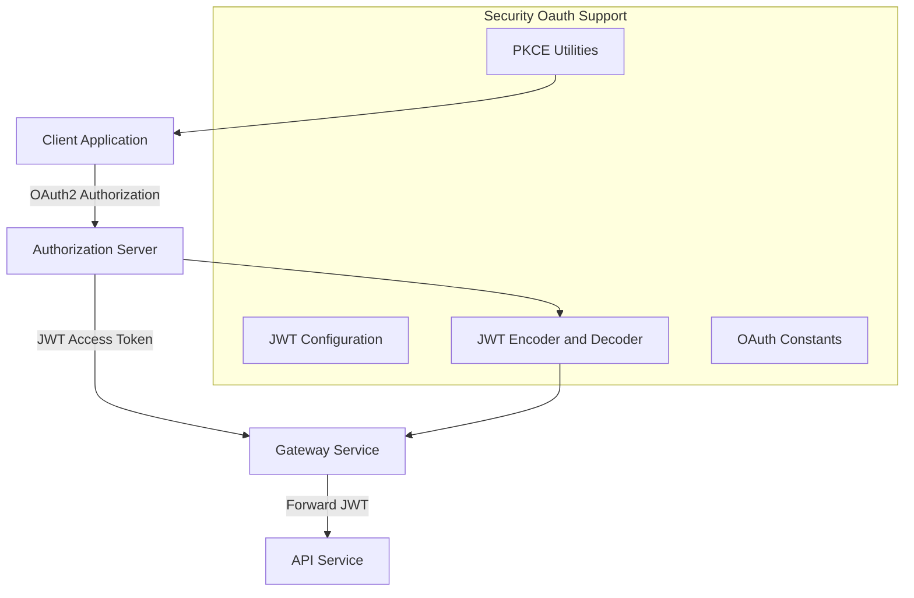
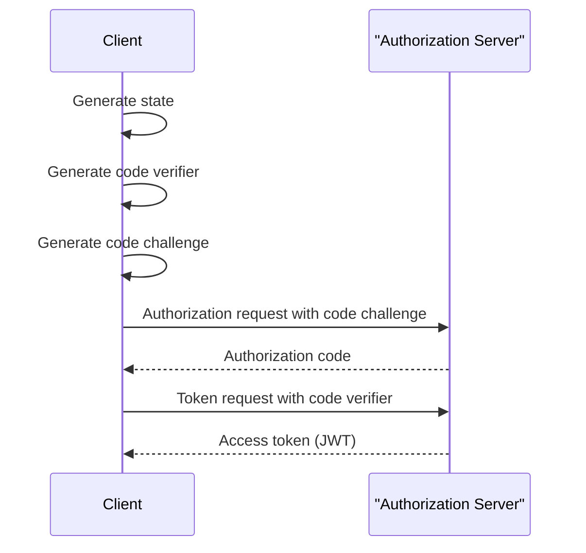

# Security Oauth Support

## Overview

The **Security Oauth Support** module provides the foundational building blocks for OAuth2 and JWT-based security across the OpenFrame platform. It is intentionally small and focused, offering shared configuration, constants, and cryptographic utilities that are reused by higher-level security modules such as authorization servers, gateways, backend-for-frontend layers, and API services.

This module does **not** implement full OAuth flows by itself. Instead, it supplies:

- JWT encoder and decoder configuration based on RSA keys
- Centralized JWT configuration properties (issuer, audience, keys)
- Shared OAuth and token-related constants
- PKCE (Proof Key for Code Exchange) utilities for secure OAuth2 authorization code flows

By keeping these concerns isolated, Security Oauth Support ensures consistency, correctness, and reusability of security primitives across the platform.

---

## Role in the Overall System

Security Oauth Support sits at the **core security layer** and is consumed by multiple services:

- Authorization services rely on it for JWT signing and verification
- Gateway and API services rely on it for JWT validation
- OAuth BFF and frontend-facing flows rely on it for PKCE helpers and constants
- Data persistence and token storage layers align with its token semantics

It acts as a shared contract between services that **issue**, **propagate**, and **validate** OAuth2 and JWT credentials.

---

## High-Level Architecture



---

## Core Components

### JWT Security Configuration

**Component:** Jwt Security Config

The JWT Security Config component defines Spring beans for JWT encoding and decoding. It uses RSA key material to ensure strong asymmetric cryptography.

Responsibilities:

- Create a JWT encoder backed by an RSA key pair
- Create a JWT decoder backed by the RSA public key
- Integrate with Spring Security OAuth2 infrastructure

Key characteristics:

- Uses industry-standard Nimbus JOSE + JWT implementation
- Ensures tokens can be validated independently by downstream services
- Separates signing (private key) from verification (public key)

This configuration is typically loaded by authorization servers and resource servers.

---

### JWT Configuration

**Component:** Jwt Config

The JWT Config component encapsulates all JWT-related configuration properties and key-loading logic.

Responsibilities:

- Load RSA public and private keys from configuration
- Expose issuer and audience values for token validation
- Convert PEM-encoded keys into Java RSA key objects

Configuration model:

```text
jwt:
  issuer: <issuer-identifier>
  audience: <audience-identifier>
  publicKey:
    value: <PEM encoded public key>
  privateKey:
    value: <PEM encoded private key>
```

This separation allows consistent JWT configuration across all services while keeping cryptographic logic centralized and auditable.

---

### OAuth and Token Constants

**Component:** Security Constants

Security Constants defines shared string constants used across OAuth2 and token-handling flows.

Examples of standardized values:

- Query parameters used during authorization
- Header names for access and refresh tokens
- Token field identifiers

Benefits:

- Eliminates magic strings scattered across services
- Ensures consistent naming between gateway, backend, and client layers
- Reduces risk of subtle integration bugs

---

### PKCE Utilities

**Component:** PKCE Utils

PKCE Utils provides cryptographic helpers required to implement OAuth2 Authorization Code flows with PKCE.

Responsibilities:

- Generate cryptographically secure `state` parameters to prevent CSRF
- Generate code verifiers and code challenges
- Perform SHA-256 based challenge derivation
- Produce Base64URL-safe encodings

Typical PKCE flow supported:



Security highlights:

- Uses strong randomness via a secure random source
- Avoids padding and unsafe characters in encodings
- Designed for stateless and distributed OAuth clients

---

## Security Considerations

- RSA private keys must be protected and never exposed to client-facing services
- Public keys can be safely distributed for token verification
- Issuer and audience values should be strictly validated by consumers
- PKCE state values must be stored and validated per authorization attempt

This module intentionally avoids persistence, HTTP endpoints, or business logic to minimize its attack surface.

---

## How Other Modules Use Security Oauth Support

- **Authorization services** use it to sign JWTs and implement secure OAuth2 flows
- **Gateway services** use it to validate incoming JWTs
- **API services** rely on decoded JWT claims for authorization decisions
- **OAuth BFF layers** use PKCE utilities and constants when interacting with browsers and SPAs

Security Oauth Support is therefore a foundational dependency that enables secure, standards-compliant authentication and authorization across the OpenFrame ecosystem.

---

## Summary

The **Security Oauth Support** module provides:

- Centralized JWT encoding and decoding configuration
- Strong RSA-based cryptographic primitives
- Shared OAuth2 and token constants
- Robust PKCE utilities for modern OAuth flows

By isolating these concerns, the platform achieves consistent security behavior, easier auditing, and safer evolution of authentication and authorization features.