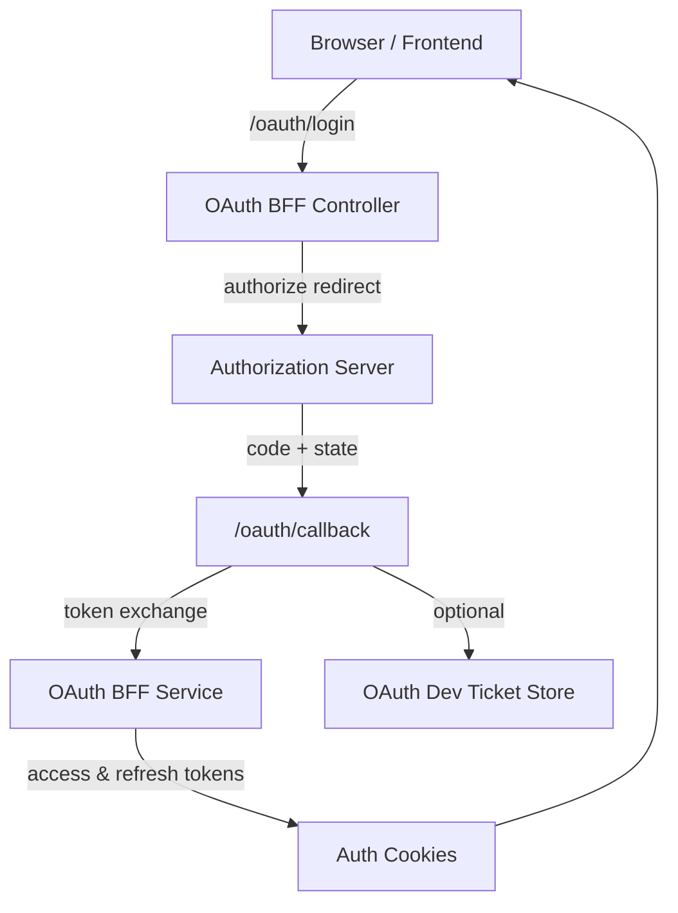
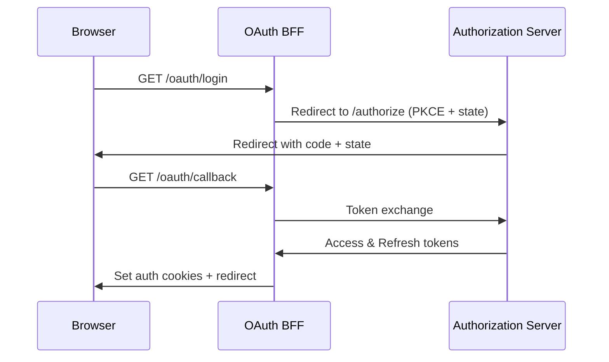

# security_oauth_web

## Overview
The **security_oauth_web** module implements the web-facing OAuth2/OIDC BFF (Backend-for-Frontend) layer used by OpenFrame and Flamingo. It is responsible for initiating OAuth login flows, handling callbacks, refreshing and revoking tokens, and managing browser-facing cookies in a secure and reactive way.

This module sits between frontend clients (browser-based apps, SPA) and the underlying authorization server and security core modules. It provides a clean, opinionated HTTP API optimized for browser redirects and cookie-based authentication.

Key responsibilities:
- Initiate OAuth authorization requests (with PKCE and state)
- Handle OAuth callbacks and token exchange
- Manage access/refresh tokens via HTTP-only cookies
- Support developer workflows via temporary dev tickets
- Resolve safe redirect targets after authentication

## Position in the Platform

- **Upstream**: Frontend clients (web UI, SPA)
- **Downstream**:
  - Authorization Server (OAuth/OIDC)
  - `security_oauth_bff_core` for JWT, PKCE, and constants
  - Cookie and security infrastructure shared across the platform

This module does **not** implement OAuth protocol logic itself; instead, it orchestrates flows using services provided by lower-level security modules.

## High-Level Architecture

## Core Components

The module is composed of three main components:

- **OAuthBffController** – HTTP entry point for OAuth-related browser flows
- **InMemoryOAuthDevTicketStore** – Temporary token handoff mechanism for development
- **DefaultRedirectTargetResolver** – Determines safe redirect destinations after login

Each component is documented in detail below.

## Sub-Modules

- [OAuthBffController](OAuthBffController.md)
- [InMemoryOAuthDevTicketStore](OAuthDevTicketStore.md)
- [DefaultRedirectTargetResolver](RedirectTargetResolver.md)

## OAuth Flow Summary

## Notes
- All endpoints are reactive and built on Spring WebFlux
- Cookies are the primary mechanism for token storage in browsers
- The module is conditionally enabled via configuration (`openframe.gateway.oauth.enable=true`)
