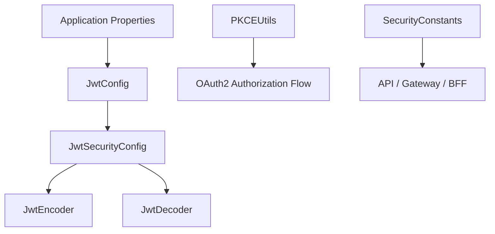
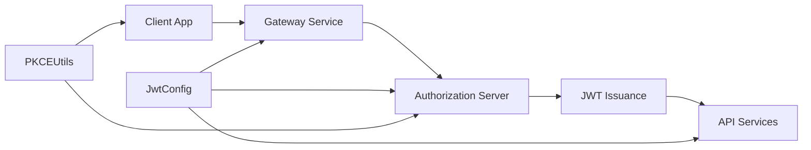

# security_shared_core

The **security_shared_core** module provides foundational, reusable security primitives used across the OpenFrame / Flamingo platform. It centralizes **JWT configuration**, **OAuth2 constants**, and **PKCE utilities** so that all services implement authentication and authorization consistently.

This module is intentionally small and dependency-light, making it safe to import into API services, gateways, authorization servers, and BFF layers without pulling in service-specific logic.

---

## Scope and Responsibilities

The module focuses on **shared security mechanics**, not business authorization rules:

- JWT encoding and decoding using RSA key pairs
- Centralized JWT configuration (issuer, audience, key loading)
- Shared OAuth2 token and header constants
- PKCE (Proof Key for Code Exchange) helpers for OAuth2 flows

It is consumed by higher-level modules such as:
- `authorization_server_core`
- `gateway_service_core`
- `oauth_bff_support`
- `api_service_core`

---

## High-Level Architecture

---

## Component Overview

| Component | Responsibility |
|---------|----------------|
| `JwtSecurityConfig` | Spring configuration that exposes `JwtEncoder` and `JwtDecoder` beans |
| `JwtConfig` | Loads RSA keys and JWT metadata from application properties |
| `SecurityConstants` | Shared constants for OAuth2 token names and headers |
| `PKCEUtils` | Stateless utility methods for PKCE and OAuth2 security |

Detailed documentation for each component is available below.

---

## Sub-Modules

- [JWT Configuration and Security](jwt_security.md)
- [OAuth Security Constants](oauth_security_constants.md)
- [PKCE Utilities](pkce_utils.md)

---

## How This Module Fits in the Platform

This shared module ensures that **token generation, validation, and OAuth2 flows behave identically across all services**, reducing security drift and configuration errors.

---

## Design Principles

- **Single source of truth** for JWT and OAuth2 primitives
- **Stateless utilities** wherever possible
- **Spring-native configuration** for seamless integration
- **No business logic** — only security mechanics

---

## When to Use This Module

Use `security_shared_core` when you need:

- JWT signing or verification
- Access to RSA key material configured via properties
- Consistent OAuth2 header and token naming
- Secure PKCE generation for OAuth2 or OIDC flows

Do **not** use this module for:
- Authorization rules
- Role or permission checks
- Tenant-specific security logic
