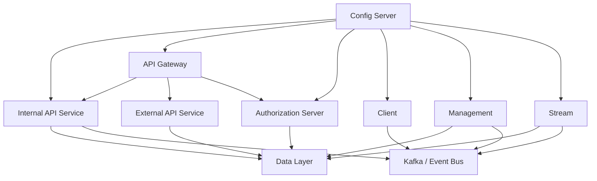
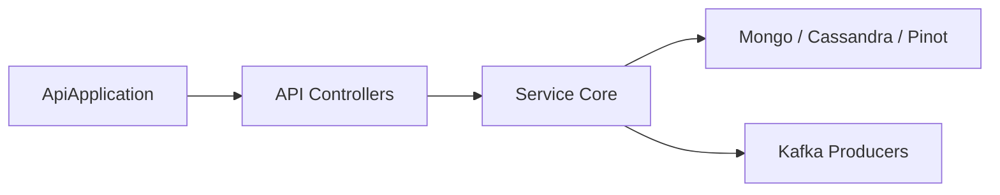
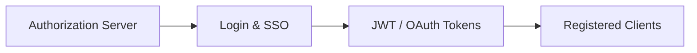
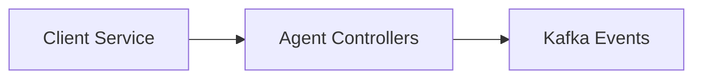
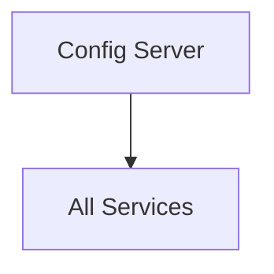
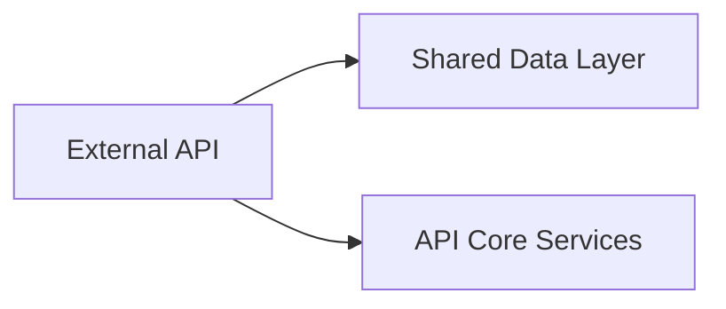
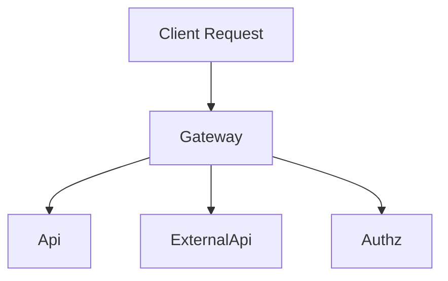
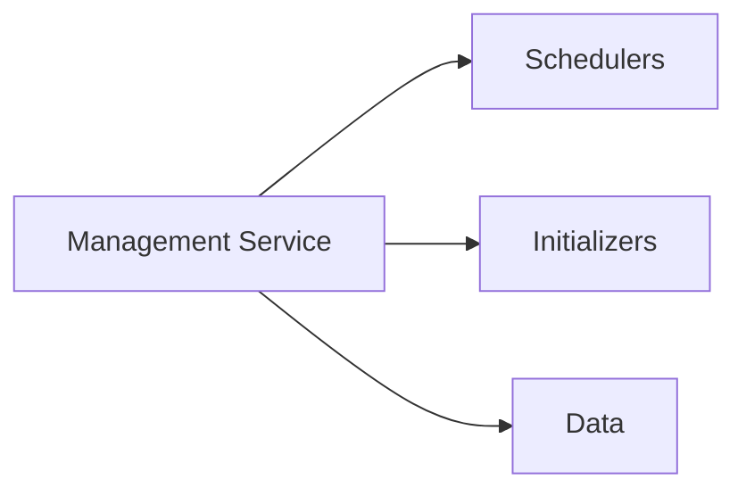
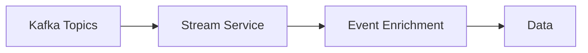

# Service Bootstrap Applications

## Overview

The **service_bootstrap_apps** module contains the entry-point Spring Boot applications that bootstrap and wire together the major OpenFrame backend services. Each application is responsible for starting a specific bounded context (API, Gateway, Authorization, Streaming, etc.) and assembling functionality from shared core libraries (data, security, messaging, and notifications).

These applications do **not** implement business logic themselves. Instead, they:

- Define service boundaries
- Configure component scanning and exclusions
- Enable required infrastructure features (Kafka, Discovery, Config Server)
- Act as the executable runtime for shared service-core libraries

Together, they form the runtime backbone of the OpenFrame platform.

---

## Architecture Overview

At a high level, OpenFrame is composed of multiple Spring Boot services, each started by a dedicated bootstrap application. These services communicate via HTTP, Kafka, WebSockets, and shared data stores.

**Key points:**
- Each box represents a separately deployed Spring Boot application
- Shared functionality lives in service-core and data libraries
- Configuration is centralized through the Config Server

---

## Bootstrap Applications

### 1. API Service (`ApiApplication`)

**Entry point:** `ApiApplication`

**Purpose:**
- Hosts the core internal OpenFrame API
- Exposes REST and GraphQL endpoints for tenant-facing functionality
- Aggregates data access, security, notifications, and Kafka integration

**Key characteristics:**
- Scans API, data, core, notification, and Kafka packages
- Acts as the primary backend for the OpenFrame frontend

---

### 2. Authorization Server (`OpenFrameAuthorizationServerApplication`)

**Entry point:** `OpenFrameAuthorizationServerApplication`

**Purpose:**
- OAuth2 / OIDC authorization server
- Handles login, SSO, tenant registration, and invitations
- Issues JWTs and manages registered OAuth clients

**Key characteristics:**
- Discovery-enabled for service registration
- Strong isolation of authentication and identity concerns

---

### 3. Client Service (`ClientApplication`)

**Entry point:** `ClientApplication`

**Purpose:**
- Handles agent and client-side interactions
- Processes agent registration, heartbeats, and tool connections

**Key characteristics:**
- Integrates with Kafka producers
- Excludes Cassandra health checks to reduce startup coupling

---

### 4. Config Server (`ConfigServerApplication`)

**Entry point:** `ConfigServerApplication`

**Purpose:**
- Centralized configuration management
- Supplies configuration to all other services at startup and runtime

**Key characteristics:**
- Minimal bootstrap logic
- Typically backed by Git or external configuration storage

---

### 5. External API Service (`ExternalApiApplication`)

**Entry point:** `ExternalApiApplication`

**Purpose:**
- Public-facing API for integrations and third-party consumers
- Exposes controlled access to devices, events, logs, tools, and organizations

**Key characteristics:**
- Reuses internal API and data layers
- Optimized for external contracts and stability

---

### 6. Gateway Service (`GatewayApplication`)

**Entry point:** `GatewayApplication`

**Purpose:**
- Single ingress point for frontend and external clients
- Handles routing, CORS, rate limiting, and authentication propagation

**Key characteristics:**
- JWT and API key authentication filters
- WebSocket proxy support for tools and agents

---

### 7. Management Service (`ManagementApplication`)

**Entry point:** `ManagementApplication`

**Purpose:**
- Platform administration and orchestration
- Manages release versions, integrated tools, schedulers, and initializers

**Key characteristics:**
- Runs background jobs and health checks
- Excludes Cassandra health indicator for decoupled startup

---

### 8. Stream Service (`StreamApplication`)

**Entry point:** `StreamApplication`

**Purpose:**
- Event-driven processing and enrichment
- Consumes Kafka topics and processes Debezium and tool events

**Key characteristics:**
- Kafka-enabled application
- Central to real-time and near-real-time data pipelines

---

## How This Module Fits Into OpenFrame

The **service_bootstrap_apps** module is the execution layer of OpenFrame:

- All domain logic lives in shared libraries
- All infrastructure wiring happens here
- Each application can be scaled, deployed, and upgraded independently

This design enables:
- Clear service boundaries
- Faster startup and simpler troubleshooting
- Reuse of business logic across multiple runtimes

---

## Summary

- This module defines **what runs**, not **what it does**
- Each class is a Spring Boot entry point for a major OpenFrame service
- Shared core libraries provide consistency across services

For deeper details on business logic, data models, or protocols, refer to the corresponding service-core and data modules in the platform documentation.
