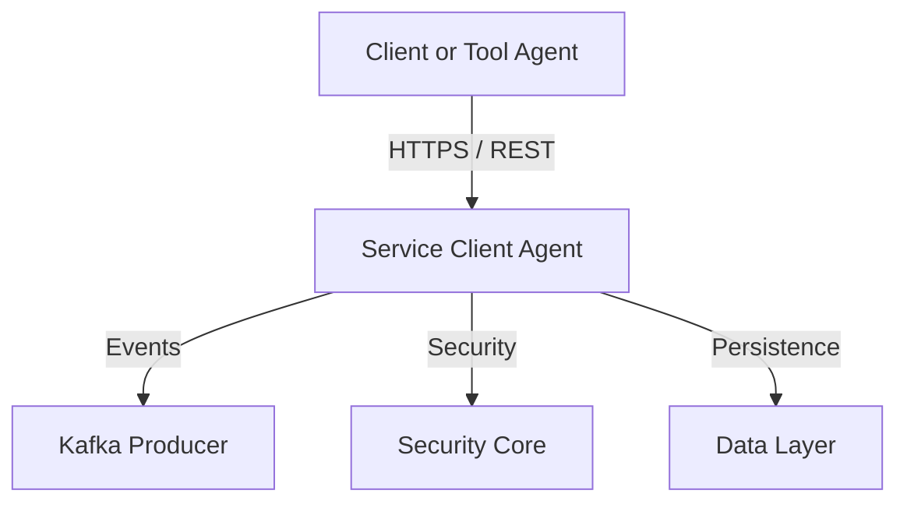
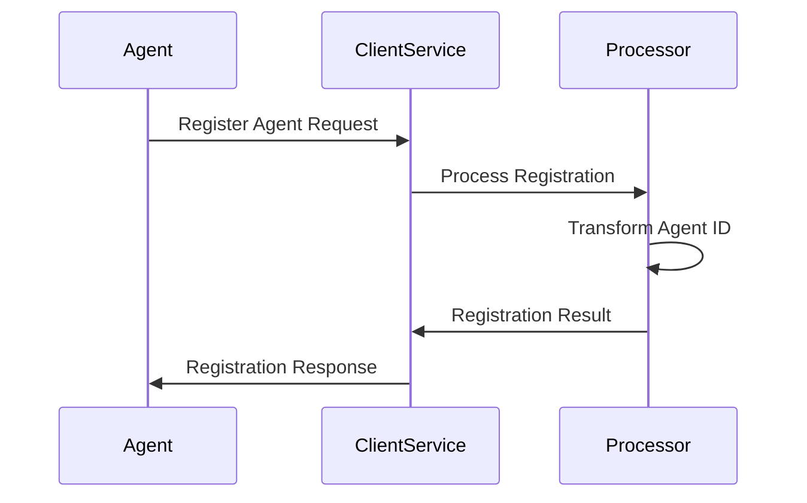

# Service Client Agent Module

## Overview

The **service_client_agent** module is responsible for hosting and exposing the OpenFrame **Client Agent service**. This service acts as the runtime entry point for machine and tool agents that connect to the OpenFrame platform. It provides authentication, registration, heartbeat handling, metrics ingestion, and file delivery for agents operating in managed environments.

At its core, this module bootstraps a Spring Boot application (`ClientApplication`) and wires together controllers, listeners, and processors from the `client_service_core` library. These components allow OpenFrame-managed agents to securely register, authenticate, and maintain lifecycle communication with the broader OpenFrame service ecosystem.

---

## Responsibilities

The service_client_agent module is responsible for:

- Bootstrapping the **Client Agent Spring Boot application**
- Exposing REST endpoints for agent authentication and management
- Handling agent registration and ID normalization
- Receiving agent heartbeats and connection events
- Processing metrics and operational signals from agents
- Coordinating with Kafka-based event streams and downstream services

---

## Entry Point

### ClientApplication

The `ClientApplication` class is the executable entry point for this module. It initializes Spring Boot with a curated component scan to include only the required subsystems for agent operations.

```java
@SpringBootApplication
@ComponentScan(
    basePackages = {
        "com.openframe.data",
        "com.openframe.client",
        "com.openframe.core",
        "com.openframe.security",
        "com.openframe.kafka.producer",
    },
    excludeFilters = {
        @ComponentScan.Filter(
            type = FilterType.ASSIGNABLE_TYPE,
            classes = CassandraHealthIndicator.class
        )
    }
)
public class ClientApplication {
    public static void main(String[] args) {
        SpringApplication.run(ClientApplication.class, args);
    }
}
```

### Key Characteristics

- Uses **Spring Boot auto-configuration**
- Explicitly excludes `CassandraHealthIndicator` to avoid unnecessary health checks
- Integrates data, security, Kafka, and client-core components

---

## Core Components (client_service_core)

The service_client_agent module depends heavily on the **client_service_core** library, which provides the functional building blocks of the agent service.

### Controllers

- **AgentAuthController** – Handles agent authentication and token exchange
- **AgentController** – Manages agent lifecycle operations
- **ToolAgentFileController** – Serves agent-related binaries or configuration files

### DTOs

- **AgentRegistrationRequest** – Payload for registering a new agent
- **CreateClientRequest** – Used when initializing a new client entity
- **MetricsMessage** – Encapsulates telemetry and metrics sent by agents

### Listeners

- **ClientConnectionListener** – Tracks agent connection events
- **InstalledAgentListener** – Reacts to installed agent state changes
- **MachineHeartbeatListener** – Processes periodic heartbeat signals
- **ToolConnectionListener** – Observes tool-to-agent connectivity

### Registration Pipeline

- **DefaultAgentRegistrationProcessor** – Orchestrates agent registration
- **FleetMdmAgentIdTransformer** – Normalizes Fleet MDM agent identifiers
- **MeshCentralAgentIdTransformer** – Normalizes MeshCentral agent identifiers

---

## High-Level Architecture



### Description

- Agents communicate directly with the **Service Client Agent**
- Security concerns (authentication, encoding) are delegated to the security core
- Events and metrics are published asynchronously via Kafka
- Persistent state is managed through shared data-layer libraries

---

## Agent Registration Flow



### Notes

- Registration processors abstract vendor-specific agent identifiers
- The service remains stateless beyond required persistence hooks

---

## Runtime Behavior

### Startup

1. Spring Boot initializes `ClientApplication`
2. Component scanning loads client, security, data, and Kafka beans
3. REST controllers and listeners are registered

### Steady State

- Agents authenticate and send heartbeats
- Metrics and events are streamed asynchronously
- Connection listeners emit lifecycle signals

---

## Integration with the OpenFrame Platform

The service_client_agent module is a **foundational edge-facing service** in the OpenFrame architecture. It bridges external agents with internal platform services, enabling:

- Secure onboarding of devices and tools
- Continuous operational visibility
- Event-driven processing across the platform

This module collaborates closely with:

- API services for downstream data access
- Authorization services for identity and trust
- Gateway services for routing and security enforcement
- Stream services for event ingestion

---

## Summary

The **service_client_agent** module provides the runtime and API surface required for OpenFrame-managed agents to operate securely and reliably. By combining Spring Boot orchestration with shared client-core libraries, it ensures consistent agent behavior while remaining loosely coupled to the rest of the platform.

This design allows OpenFrame to scale agent connectivity while maintaining strong separation of concerns across services.
