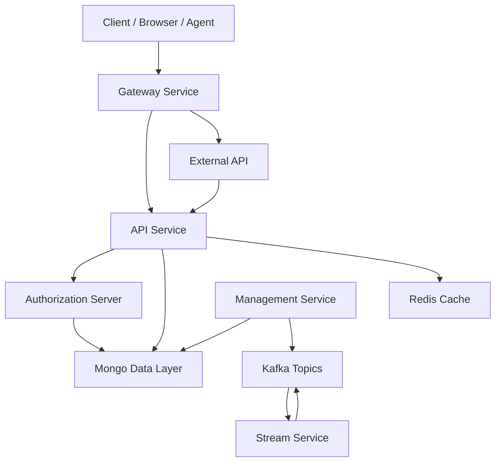

# Service Entrypoints Module

## Overview

The **service_entrypoints** module defines the executable entry points for all OpenFrame backend services. Each entry point is a dedicated Spring Boot application responsible for bootstrapping a specific runtime service (API, Gateway, Authorization Server, Stream Processing, etc.) with the correct component scanning boundaries and infrastructure integrations.

This module does **not** contain business logic itself. Instead, it wires together the underlying core modules (API core, authorization core, gateway core, data layers, stream processing, and shared security/configuration libraries) into deployable services.

In practice, this module represents the **runtime surface of the OpenFrame platform**.

---

## Services Provided

The module exposes the following independent Spring Boot applications:

| Service | Application Class | Responsibility |
|-------|-------------------|----------------|
| API Service | `ApiApplication` | Primary REST and GraphQL API for OpenFrame |
| Authorization Server | `OpenFrameAuthorizationServerApplication` | OAuth2/OIDC, SSO, tenant auth flows |
| Gateway | `GatewayApplication` | Edge gateway, auth enforcement, routing |
| Management Service | `ManagementApplication` | Internal management, provisioning, schedulers |
| Stream Service | `StreamApplication` | Kafka-based stream processing and enrichment |
| External API | `ExternalApiApplication` | External-facing API surface |
| Client Service | `ClientApplication` | Client-facing service integrations |
| Config Server | `ConfigServerApplication` | Centralized configuration service |

Each service is deployed independently and communicates with others through HTTP, Kafka, and shared data stores.

---

## High-Level Architecture

This diagram highlights that **service_entrypoints** is the execution boundary where:
- Requests enter through the Gateway
- Authentication is delegated to the Authorization Server
- Core data flows through MongoDB, Redis, and Kafka
- Stream processing enriches and reacts to event data

---

## Entrypoint Applications

### API Service

**Class:** `com.openframe.api.ApiApplication`

**Purpose:**
- Hosts the core OpenFrame API
- Exposes REST and GraphQL endpoints
- Integrates API controllers, GraphQL data fetchers, and domain services

**Key Characteristics:**
- Broad component scanning across API, data, Kafka, and notification modules
- Central integration point for user, device, organization, and tool APIs

---

### Authorization Server

**Class:** `com.openframe.authz.OpenFrameAuthorizationServerApplication`

**Purpose:**
- Acts as the OAuth2 / OIDC authorization server
- Handles login, SSO, tenant registration, and token issuance

**Key Characteristics:**
- Discovery-client enabled for service registration
- Strict separation of authentication and authorization concerns
- Integrates tenant-aware security context

---

### Gateway Service

**Class:** `com.openframe.gateway.GatewayApplication`

**Purpose:**
- Serves as the edge gateway for all inbound traffic
- Enforces authentication and authorization
- Routes requests to internal services

**Key Characteristics:**
- JWT validation and API key authentication
- CORS handling and origin sanitization
- WebSocket proxy support for tools and agents

---

### Management Service

**Class:** `com.openframe.management.ManagementApplication`

**Purpose:**
- Internal operational and administrative service
- Handles provisioning, initialization, schedulers, and system maintenance

**Key Characteristics:**
- Runs background jobs and health checks
- Initializes system-level configuration and integrations
- Excludes non-relevant health indicators for isolated runtime

---

### Stream Processing Service

**Class:** `com.openframe.stream.StreamApplication`

**Purpose:**
- Consumes and processes Kafka event streams
- Performs enrichment, transformation, and routing of events

**Key Characteristics:**
- Kafka-enabled Spring Boot application
- Handles Debezium, fleet, audit, and tool events
- Feeds enriched data back into storage and downstream consumers

---

### External API Service

**Class:** `com.openframe.external.ExternalApiApplication`

**Purpose:**
- Exposes APIs intended for third-party or external consumers

**Key Characteristics:**
- Reuses API-layer logic while enforcing stricter boundaries
- Integrates data, core services, and Kafka producers

---

### Client Service

**Class:** `com.openframe.client.ClientApplication`

**Purpose:**
- Supports client-facing integrations and workflows

**Key Characteristics:**
- Integrates security, Kafka producers, and core services
- Excludes Cassandra health checks for environment compatibility

---

### Config Server

**Class:** `com.openframe.config.ConfigServerApplication`

**Purpose:**
- Centralized configuration service for OpenFrame

**Key Characteristics:**
- Provides externalized configuration to all services
- Enables consistent environment-based configuration management

---

## How This Module Fits into OpenFrame

The **service_entrypoints** module represents the **deployment boundary** of OpenFrame:

- Core logic lives in reusable libraries (API core, authorization core, gateway core, data layers)
- This module wires those libraries into runnable services
- Each entry point defines *what runs*, *what is scanned*, and *what is excluded*

This separation allows:
- Independent scaling of services
- Clear ownership of runtime responsibilities
- Clean reuse of shared domain and infrastructure code

---

## Operational Notes

- Each application is a standalone Spring Boot service
- Services can be deployed independently or together
- Configuration is expected to be provided via the Config Server or environment variables
- Observability, logging, and security are enforced consistently through shared core modules

---

## Summary

The **service_entrypoints** module is the backbone of OpenFrame’s runtime architecture. It defines how all major platform capabilities are launched, isolated, and composed into a scalable, cloud-native system.

Understanding this module provides a clear mental model of **how OpenFrame runs in production**.