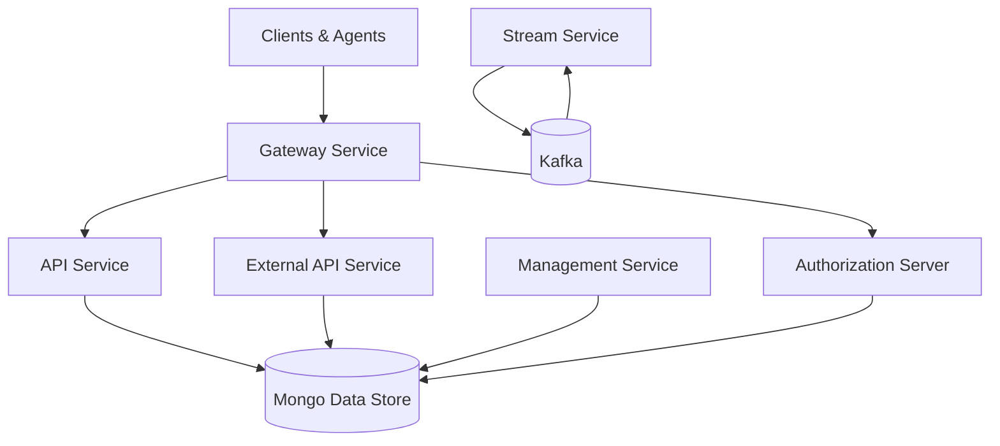
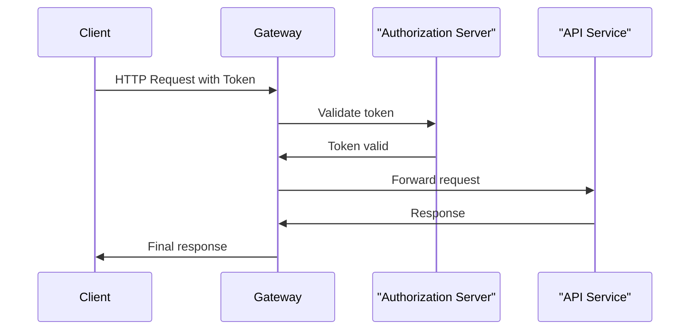

# Service Entrypoints

## Overview

The **Service Entrypoints** module defines the executable entry points for all major OpenFrame backend services. Each entry point is a dedicated Spring Boot application responsible for bootstrapping a specific domain of the platform (API, Gateway, Authorization, Streaming, Management, and more).

This module does **not** implement business logic itself. Instead, it:

- Wires together lower-level service cores via Spring component scanning
- Establishes service boundaries and runtime responsibilities
- Acts as the deployment and operational surface for the OpenFrame microservice architecture

In production, each entry point typically runs as an independent service (container, VM, or pod), scaling and evolving independently.

---

## Role in the Overall System

Service Entrypoints sit at the **top of the dependency graph**. They:

- Depend on multiple internal service-core libraries
- Expose HTTP, WebSocket, Kafka, or OAuth endpoints
- Coordinate security, configuration, and infrastructure integration

They are the bridge between:

- **Infrastructure** (config server, discovery, Kafka, MongoDB)
- **Service cores** (API logic, authorization, management, streaming)
- **External consumers** (frontend, agents, integrations, third-party APIs)

---

## High-Level Architecture



**Key idea:** each box represents a standalone Spring Boot application defined in this module.

---

## Entrypoint Applications

### API Application

**Class:** `ApiApplication`

**Purpose:**

- Primary internal API for OpenFrame
- Serves frontend requests routed through the Gateway
- Hosts core domain controllers and GraphQL data fetchers

**Key characteristics:**

- Aggregates API service core, data access, notifications, and Kafka integration
- Central read/write interface for platform state
- Logs startup lifecycle events for observability

**Startup behavior:**

```text
Starting OpenFrame API
→ Spring context initialization
→ Controller and service wiring
→ API endpoints exposed
```

---

### Authorization Server Application

**Class:** `OpenFrameAuthorizationServerApplication`

**Purpose:**

- OAuth2 / OIDC authorization server
- Handles login, SSO, invitations, tenant registration, and token issuance

**Key characteristics:**

- Discovery-enabled service
- Multi-tenant aware via tenant context filtering
- Integrates with user, tenant, and key management components

**Responsibilities:**

- Authentication flows (password, SSO)
- Authorization token lifecycle
- Secure redirect and callback handling

---

### Gateway Application

**Class:** `GatewayApplication`

**Purpose:**

- Single ingress point for clients and agents
- Routes requests to internal services
- Enforces cross-cutting security and rate limiting

**Key characteristics:**

- JWT and API key authentication
- CORS and origin sanitization
- WebSocket proxying for tool agents and APIs

**Why it matters:**

The Gateway decouples external access patterns from internal service topology, allowing services to evolve independently.

---

### Client Application

**Class:** `ClientApplication`

**Purpose:**

- Handles agent-facing APIs
- Manages agent registration, authentication, and lifecycle events

**Key characteristics:**

- Listens for agent heartbeats and connection events
- Integrates with Kafka producers
- Excludes non-relevant health indicators to reduce startup overhead

---

### External API Application

**Class:** `ExternalApiApplication`

**Purpose:**

- Public-facing API for third-party integrations
- Read-focused access to platform data

**Key characteristics:**

- OpenAPI-enabled endpoints
- Proxies requests to internal API services
- Enforces stricter security and filtering rules

---

### Management Application

**Class:** `ManagementApplication`

**Purpose:**

- Operational and administrative service
- Handles background jobs, initializers, and scheduled tasks

**Key characteristics:**

- Tool and agent initialization
- Release and configuration management
- Health checks and system synchronization jobs

---

### Stream Application

**Class:** `StreamApplication`

**Purpose:**

- Real-time data processing and enrichment
- Kafka consumer and stream processor

**Key characteristics:**

- Kafka-enabled Spring Boot service
- Event normalization and enrichment
- Bridges external event sources into internal data models

---

### Configuration Server Application

**Class:** `ConfigServerApplication`

**Purpose:**

- Centralized configuration bootstrap
- Supplies runtime configuration to all other services

**Key characteristics:**

- Lightweight Spring Boot application
- Typically started early in the system lifecycle
- Enables environment-specific configuration management

---

## Service Interaction Flow Example

The following sequence illustrates a typical authenticated API request:



---

## Design Principles

- **Single responsibility per service**: each entry point owns a clear domain
- **Loose coupling**: services interact via APIs and messaging, not shared state
- **Scalability**: independent scaling and deployment
- **Observability**: explicit startup logs and health indicators

---

## When to Modify This Module

You will typically touch the **Service Entrypoints** module when:

- Adding a new standalone service
- Changing component scan boundaries
- Adjusting startup behavior or infrastructure integration
- Introducing new runtime concerns (Kafka, security, discovery)

Business logic changes should usually be made in the corresponding service-core modules instead.

---

## Summary

The **Service Entrypoints** module defines how OpenFrame services come to life. It is the orchestration layer that binds together configuration, security, messaging, data access, and domain logic into deployable, production-ready services.

Understanding this module is essential for:

- Operating OpenFrame in production
- Debugging startup and wiring issues
- Designing new services that fit cleanly into the platform
