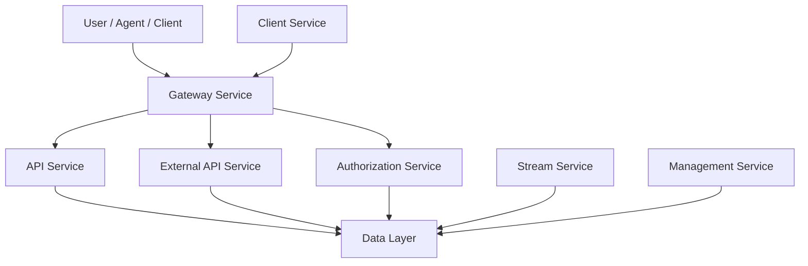
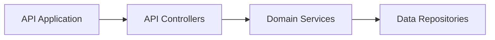
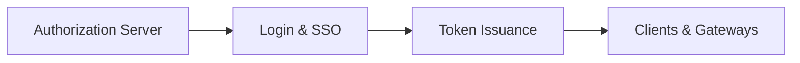
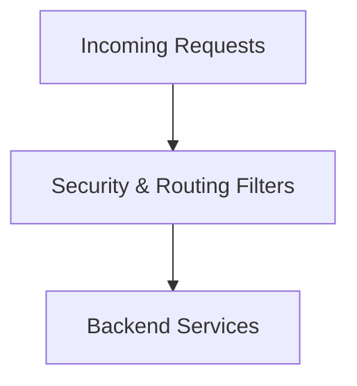
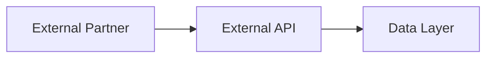
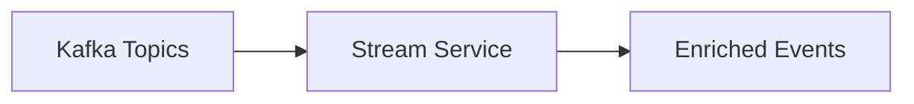
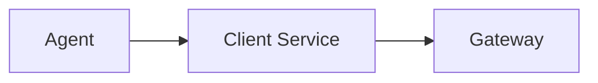
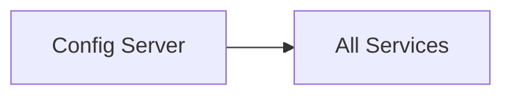

# Service Entrypoints

## Overview

Service Entrypoints is the top-level module that defines and boots all runtime services in the OpenFrame platform. Each entrypoint corresponds to a standalone Spring Boot application responsible for starting a specific service domain (API, Gateway, Authorization, Stream processing, and more).

This module does **not** implement business logic itself. Instead, it wires together lower-level *service core* modules by:

- Declaring Spring Boot applications
- Defining component scan boundaries
- Enabling infrastructure capabilities (Kafka, discovery, configuration)
- Acting as the executable boundary for deployment units

In practice, Service Entrypoints represents the **runtime topology** of OpenFrame.

---

## Architectural Role

At a high level, Service Entrypoints sits at the outermost layer of the system:

- Below it: service core modules (API, Gateway, Authorization, Stream, Management, Client)
- Beside it: frontend and client applications
- Above it: deployment, orchestration, and infrastructure

Each entrypoint starts exactly one Spring application context and exposes network interfaces (HTTP, WebSocket, Kafka consumers, etc.) as defined by the underlying core modules.

---

## Entrypoint Applications

Each of the following classes defines a runnable service. All are standard Spring Boot `main` classes with explicit component scanning to compose the required capabilities.

### API Application

**Class**: `ApiApplication`

**Purpose**:
- Core internal API for OpenFrame
- Serves authenticated platform clients
- Exposes GraphQL and REST controllers

**Key Characteristics**:
- Scans API, data, core, notification, and Kafka packages
- Acts as the primary backend for UI and internal services

---

### Authorization Server Application

**Class**: `OpenFrameAuthorizationServerApplication`

**Purpose**:
- OAuth2 and OIDC authorization server
- Handles login, SSO, tenant registration, and token issuance

**Key Characteristics**:
- Enabled for service discovery
- Isolated security domain
- Integrates deeply with tenant and user data

---

### Gateway Application

**Class**: `GatewayApplication`

**Purpose**:
- Single ingress point for HTTP and WebSocket traffic
- Routes requests to backend services
- Enforces authentication, CORS, and rate limits

**Key Characteristics**:
- Stateless edge service
- Applies API key and JWT based security
- Proxies both REST and WebSocket connections

---

### External API Application

**Class**: `ExternalApiApplication`

**Purpose**:
- Public-facing API for third-party integrations
- Exposes limited, stable endpoints

**Key Characteristics**:
- Reuses API and data layers
- Designed for automation and integrations
- OpenAPI documented

---

### Management Application

**Class**: `ManagementApplication`

**Purpose**:
- Operational and administrative backend
- Handles schedulers, initializers, and system maintenance

**Key Characteristics**:
- Runs background jobs
- Manages integrations and system configuration
- No direct end-user traffic

---

### Stream Application

**Class**: `StreamApplication`

**Purpose**:
- Event and stream processing service
- Consumes Kafka topics
- Enriches and transforms events

**Key Characteristics**:
- Kafka-enabled
- No HTTP interface
- High-throughput, asynchronous processing

---

### Client Application

**Class**: `ClientApplication`

**Purpose**:
- Backend service for agent and client connectivity
- Handles agent registration and heartbeats

**Key Characteristics**:
- Integrates with Kafka producers
- Excludes Cassandra health checks where not required
- Bridges agents with the platform

---

### Config Server Application

**Class**: `ConfigServerApplication`

**Purpose**:
- Centralized configuration service
- Supplies configuration to other services at startup

**Key Characteristics**:
- Lightweight Spring Boot application
- No domain logic
- Critical for environment consistency

---

## How Service Entrypoints Fit Together

Service Entrypoints defines **what runs** in an OpenFrame deployment:

- Each entrypoint maps to a container or JVM process
- Scaling is done per entrypoint
- Failures are isolated to a single service boundary

Business logic, persistence, and integrations live in the underlying service core modules. Service Entrypoints simply composes and launches them in a consistent, observable, and scalable way.

---

## Key Takeaways

- Service Entrypoints is the executable layer of OpenFrame
- Each class represents one deployable service
- Clear separation between runtime wiring and business logic
- Enables modular scaling, deployment, and operations

This module is foundational for understanding **how OpenFrame runs in production**.
