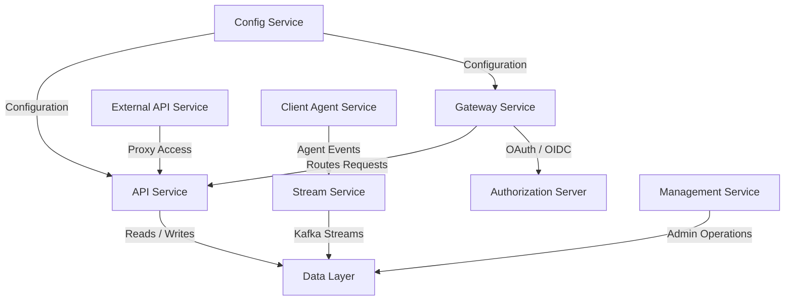
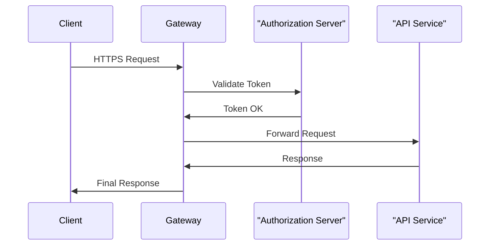

# Service Entrypoints

## Overview

The **Service Entrypoints** module defines the executable entry points for all core backend services in the OpenFrame platform. Each entrypoint is a standalone Spring Boot application responsible for bootstrapping a specific service domain, wiring configuration, enabling discovery or messaging features, and assembling the required internal modules (data, security, streaming, and core logic).

Together, these entrypoints form the runtime backbone of OpenFrame, enabling a distributed, service-oriented architecture that supports API access, authorization, gateway routing, streaming pipelines, management operations, and client/agent communication.

This documentation focuses on **how these services are started, how they relate to each other, and what responsibility each entrypoint has**, rather than duplicating the internal logic of the underlying modules.

---

## High-Level Architecture

At runtime, each Service Entrypoint launches a dedicated Spring Boot application. These applications communicate over HTTP, Kafka, WebSockets, and shared data layers.

**Key ideas:**
- Each box represents a **Service Entrypoint**.
- Services are independently deployable but share common libraries.
- The Gateway is the primary ingress point for client and UI traffic.

---

## Service Entrypoints Summary

The following sections describe each Service Entrypoint, its purpose, and the core components it initializes.

---

## API Service

**Entrypoint:** `ApiApplication`

### Purpose
The API Service is the primary internal API for OpenFrame. It exposes REST and GraphQL endpoints used by the frontend, gateway, and other services to manage users, organizations, devices, tools, events, and configuration.

### Responsibilities
- Bootstraps API controllers and GraphQL resolvers
- Integrates with the data layer (MongoDB, Cassandra, Pinot)
- Publishes and consumes Kafka events
- Acts as the system-of-record for operational data

### Bootstrapping Highlights
- Uses Spring Boot auto-configuration
- Component scanning includes API, data, core, notification, and Kafka packages
- Logs startup lifecycle events

---

## Authorization Server

**Entrypoint:** `OpenFrameAuthorizationServerApplication`

### Purpose
The Authorization Server provides OAuth 2.0 and OpenID Connect functionality for OpenFrame. It manages authentication, tenant discovery, SSO flows, and secure token issuance.

### Responsibilities
- OAuth and OIDC flows
- SSO provider integration
- Tenant-aware authentication
- Client and user registration

### Bootstrapping Highlights
- Enables service discovery
- Loads authorization, security, and tenant context components
- Operates independently from the API service for security isolation

---

## Gateway Service

**Entrypoint:** `GatewayApplication`

### Purpose
The Gateway Service acts as the unified ingress layer for OpenFrame. It routes requests to internal services, enforces security policies, applies rate limits, and handles WebSocket proxying.

### Responsibilities
- API routing and reverse proxying
- JWT and API key authentication
- CORS and origin sanitization
- WebSocket gateway for tool and agent communication

### Bootstrapping Highlights
- Centralizes security enforcement
- Integrates tightly with OAuth and JWT validation
- Minimal business logic by design

---

## External API Service

**Entrypoint:** `ExternalApiApplication`

### Purpose
The External API Service exposes a controlled, public-facing API for third-party integrations. It acts as a boundary layer over internal APIs.

### Responsibilities
- Public REST endpoints for devices, tools, events, and logs
- Input validation and response shaping
- Delegation to internal API services

### Bootstrapping Highlights
- Shares data and API contracts with the internal API
- Designed for partner and integration access

---

## Client Agent Service

**Entrypoint:** `ClientApplication`

### Purpose
The Client Agent Service handles communication with installed agents running on managed devices. It supports agent registration, authentication, and telemetry ingestion.

### Responsibilities
- Agent registration and authentication
- Handling agent-originated events
- Publishing agent activity to Kafka

### Bootstrapping Highlights
- Excludes Cassandra health checks for lightweight deployment
- Focused on high-throughput event handling

---

## Stream Service

**Entrypoint:** `StreamApplication`

### Purpose
The Stream Service processes real-time event streams using Kafka. It enriches, transforms, and routes events to downstream storage and analytics systems.

### Responsibilities
- Kafka consumers and stream processors
- Event enrichment and normalization
- Integration with Pinot and Cassandra

### Bootstrapping Highlights
- Kafka explicitly enabled
- Optimized for continuous processing workloads

---

## Management Service

**Entrypoint:** `ManagementApplication`

### Purpose
The Management Service supports administrative and operational workflows such as tool lifecycle management, versioning, and background synchronization jobs.

### Responsibilities
- Administrative APIs
- Scheduled background tasks
- Tool and agent lifecycle coordination

### Bootstrapping Highlights
- Runs schedulers and initializers
- Excludes unnecessary health checks for operational efficiency

---

## Configuration Service

**Entrypoint:** `ConfigServerApplication`

### Purpose
The Configuration Service provides centralized configuration management for OpenFrame services.

### Responsibilities
- Centralized service configuration
- Environment-specific settings
- Bootstrapping consistency across services

### Bootstrapping Highlights
- Minimal dependencies
- Focused solely on configuration delivery

---

## Service Interaction Flow

The following diagram illustrates a typical request lifecycle from a user-facing client:

---

## How This Module Fits Into OpenFrame

The **Service Entrypoints** module is the orchestration layer of OpenFrame:
- It defines **what runs**
- It defines **how services are composed**
- It defines **runtime boundaries** between concerns

All other modules (API core, authorization core, gateway core, data layer, streaming, and frontend) depend on these entrypoints to be correctly assembled and deployed.

---

## Key Takeaways

- Each Service Entrypoint is a standalone Spring Boot application
- Entrypoints assemble functionality from shared libraries
- Clear separation of concerns enables scalability and security
- The Gateway and Authorization Server form the primary security perimeter

---

**Service Entrypoints are the foundation that turns OpenFrame from a codebase into a running platform.**
