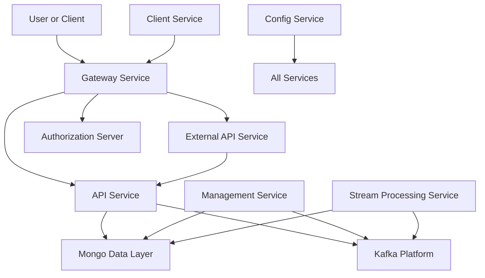
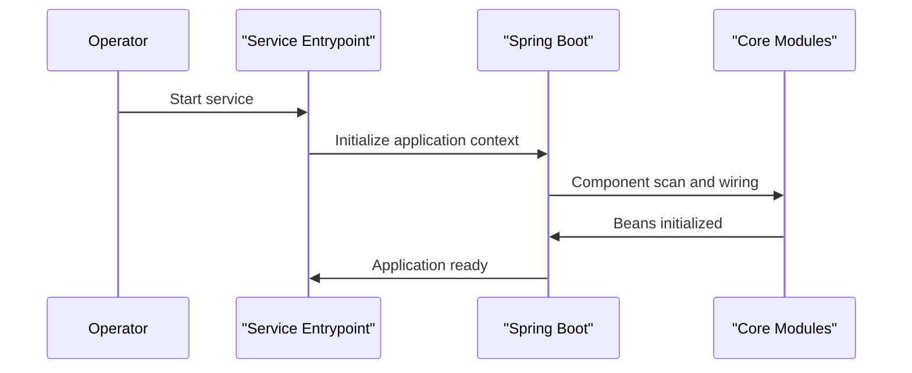

# Service Entrypoints

The **Service Entrypoints** module defines the executable entry points for all core backend services in the OpenFrame platform. Each entry point is implemented as a standalone Spring Boot application responsible for bootstrapping a specific domain service (API, Gateway, Authorization, Stream Processing, and more).

This module does not contain business logic itself. Instead, it wires together lower-level modules (API cores, data layers, security, messaging, and integrations) and exposes them as runnable services.

---

## Purpose and Responsibilities

Service Entrypoints are responsible for:

- Defining **service boundaries** within the OpenFrame architecture
- Bootstrapping Spring Boot applications with correct component scanning
- Enabling service-specific infrastructure (Kafka, discovery, security)
- Acting as the **deployment units** for the platform

Each service entry point corresponds to a separately deployable microservice.

---

## High-Level Architecture

The diagram below shows how Service Entrypoints sit at the top of the system and compose functionality from lower-level modules.

---

## Service Entry Points Overview

Each of the following applications represents a top-level service in the platform.

### API Service

**Class:** `ApiApplication`

The API Service is the primary internal API consumed by the platform frontend and other backend services.

**Key responsibilities:**
- Exposes REST and GraphQL endpoints for core domain data
- Integrates with MongoDB, Kafka, and notification systems
- Hosts controllers, data fetchers, and domain services

**Bootstrapping highlights:**
- Scans API, data, core, notification, and Kafka packages
- Acts as the central business API layer

---

### Authorization Server

**Class:** `OpenFrameAuthorizationServerApplication`

The Authorization Server handles authentication, authorization, and identity workflows.

**Key responsibilities:**
- OAuth2 and OpenID Connect flows
- Tenant discovery and registration
- SSO provider integration
- Token issuance and validation

**Bootstrapping highlights:**
- Enables service discovery
- Loads authorization, data, and notification components

---

### Gateway Service

**Class:** `GatewayApplication`

The Gateway Service is the unified entry point for clients accessing backend services.

**Key responsibilities:**
- Request routing to internal services
- JWT and API key authentication
- Rate limiting and CORS enforcement
- WebSocket proxying

**Bootstrapping highlights:**
- Centralized security configuration
- Cross-cutting concerns enforcement

---

### External API Service

**Class:** `ExternalApiApplication`

The External API Service exposes a controlled subset of APIs intended for third-party integrations.

**Key responsibilities:**
- Stable, versioned external endpoints
- Proxying requests to internal APIs
- OpenAPI documentation exposure

**Bootstrapping highlights:**
- Reuses internal API and data modules
- Adds external-facing controllers

---

### Client Service

**Class:** `ClientApplication`

The Client Service manages agent and tool connectivity.

**Key responsibilities:**
- Agent authentication and registration
- Tool agent file distribution
- Heartbeat and metrics ingestion

**Bootstrapping highlights:**
- Excludes Cassandra health checks when not required
- Integrates with Kafka producers

---

### Management Service

**Class:** `ManagementApplication`

The Management Service handles operational and administrative workflows.

**Key responsibilities:**
- Tool lifecycle management
- Version and release coordination
- Background schedulers and initializers

**Bootstrapping highlights:**
- Scheduler enablement
- Initialization of platform metadata

---

### Stream Processing Service

**Class:** `StreamApplication`

The Stream Processing Service consumes and processes event streams.

**Key responsibilities:**
- Kafka topic consumption
- Event enrichment and transformation
- Activity and audit stream handling

**Bootstrapping highlights:**
- Kafka enabled
- Dedicated stream processing configuration

---

### Configuration Service

**Class:** `ConfigServerApplication`

The Configuration Service provides centralized configuration management.

**Key responsibilities:**
- Externalized configuration for services
- Environment-specific overrides

**Bootstrapping highlights:**
- Lightweight Spring Boot application
- Acts as a shared dependency for all services

---

## Service Startup Flow

The following diagram illustrates a simplified startup sequence.

---

## How Service Entrypoints Fit Into the Platform

- Each Service Entrypoint maps directly to one deployable runtime
- Lower-level modules (API cores, data platforms, security) are reused across services
- This structure enables independent scaling, deployment, and fault isolation

Service Entrypoints form the **outermost layer** of the OpenFrame backend architecture, translating modular codebases into operational services.

---

## Key Takeaways

- Service Entrypoints contain **no domain logic**, only wiring and startup code
- They define **clear service boundaries** in a microservice architecture
- All infrastructure concerns are enabled at this layer

This module is essential for understanding how OpenFrame services are composed, started, and deployed.