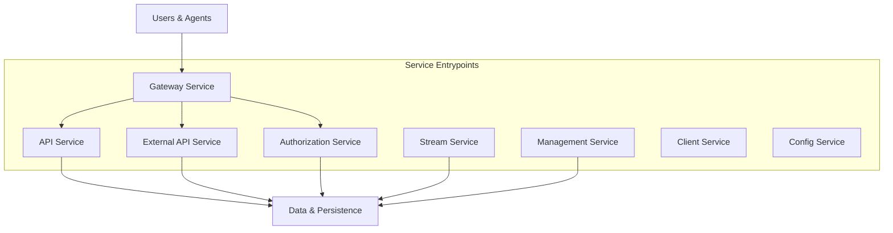
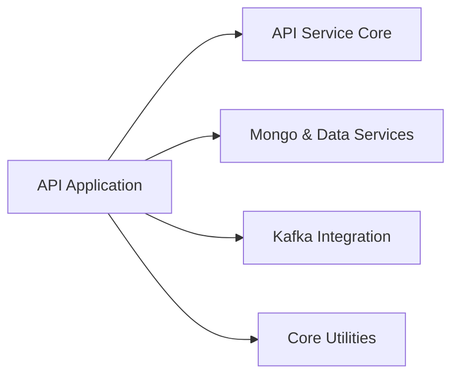
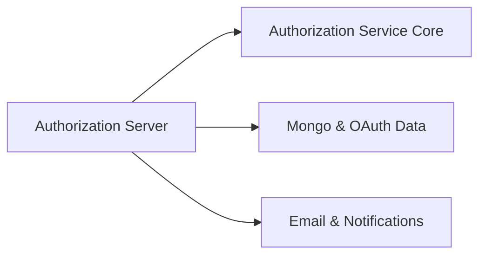
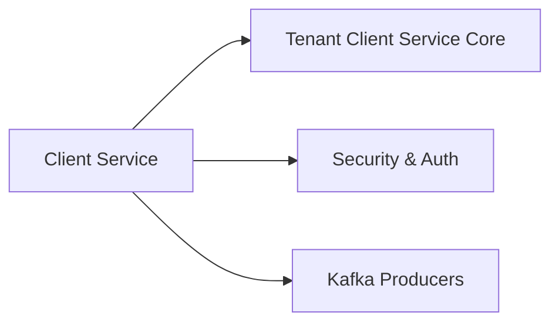
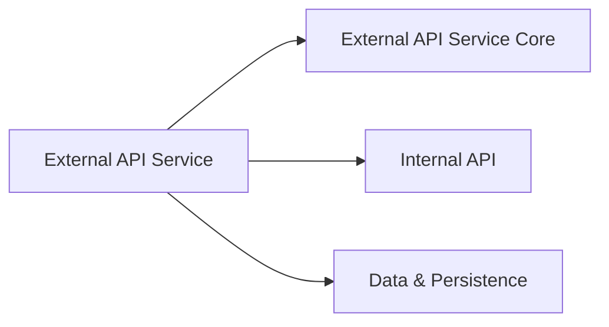
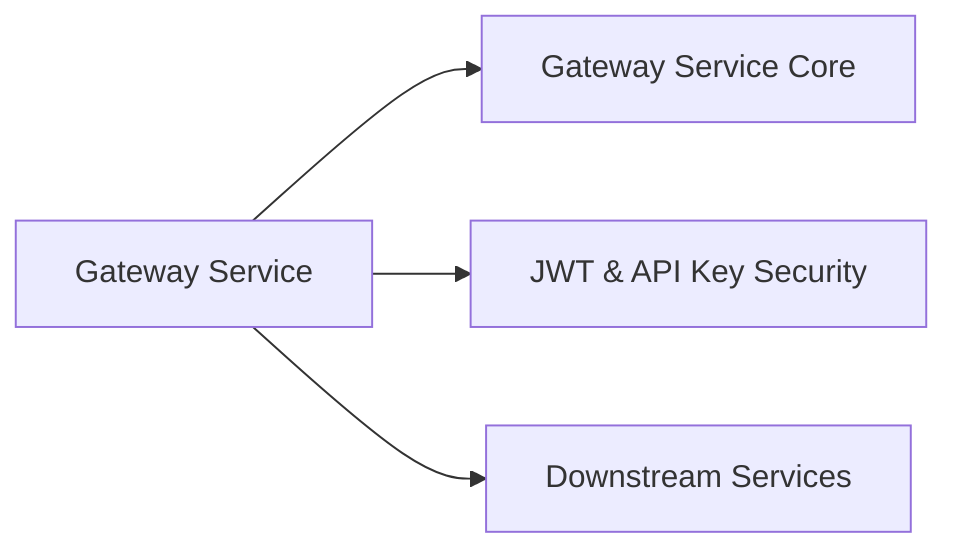
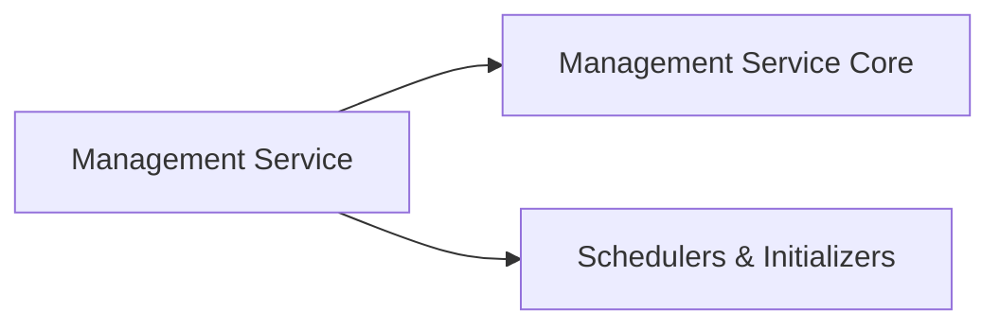
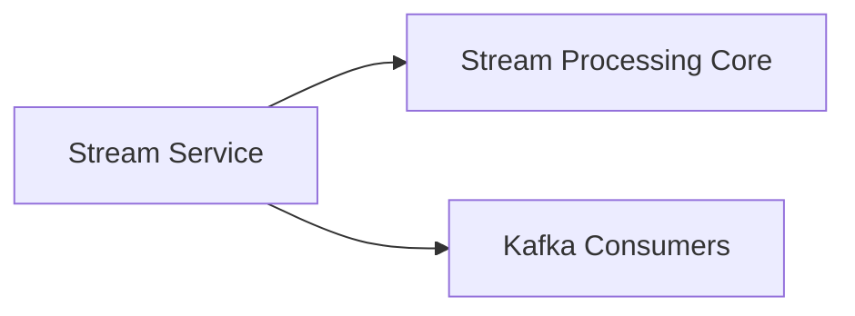

# Service Entrypoints

## Overview

The **Service Entrypoints** module defines the primary executable entry points for all OpenFrame backend services. Each entrypoint is a Spring Boot application responsible for bootstrapping a specific domain service (API, Gateway, Authorization, Stream Processing, etc.) with the correct component scanning, configuration, and runtime behavior.

This module does **not** implement business logic itself. Instead, it wires together lower-level core modules (API core, authorization core, gateway core, data, security, streaming, and management services) into runnable services that can be deployed independently or as part of a distributed system.

In practical terms, Service Entrypoints answer the question:

> *Which Spring Boot application starts which OpenFrame service, and how are the core modules composed at runtime?*

---

## Responsibilities

The Service Entrypoints module is responsible for:

- Defining **Spring Boot application boundaries** for each service
- Declaring **component scan roots** to assemble the correct modules
- Enabling required runtime features (Kafka, discovery, security)
- Acting as the **deployment units** for containerized or VM-based environments

All domain-specific logic lives in the referenced core modules, not here.

---

## High-Level Architecture

The diagram below shows how Service Entrypoints sit at the top of the OpenFrame service stack and compose lower-level modules.

---

## Entrypoint Applications

Each class below represents a standalone service executable. All are standard Spring Boot applications with explicit component scanning to control which modules are loaded.

### API Service Entrypoint

**Class:** `ApiApplication`

**Purpose:**
- Hosts the internal OpenFrame API used by the platform UI, gateway, and internal services
- Aggregates API controllers, GraphQL fetchers, and core data services

**Key Characteristics:**
- Scans API, data, core, notification, and Kafka modules
- Acts as the central backend for internal platform operations

---

### Authorization Service Entrypoint

**Class:** `OpenFrameAuthorizationServerApplication`

**Purpose:**
- Runs the OAuth2 / OIDC authorization server
- Handles login, SSO, tenant registration, invitations, and token issuance

**Key Characteristics:**
- Enables service discovery
- Scans authorization, core, data, and notification modules
- Serves as the identity provider for the platform

---

### Client Service Entrypoint

**Class:** `ClientApplication`

**Purpose:**
- Handles agent-facing APIs and client-specific workflows
- Manages agent registration, authentication, and telemetry ingestion

**Key Characteristics:**
- Excludes Cassandra health checks to reduce dependency surface
- Integrates with Kafka producers and security modules

---

### Config Service Entrypoint

**Class:** `ConfigServerApplication`

**Purpose:**
- Runs the centralized configuration service
- Provides runtime configuration to other services

**Key Characteristics:**
- Minimal bootstrap
- Focused purely on configuration delivery

---

### External API Service Entrypoint

**Class:** `ExternalApiApplication`

**Purpose:**
- Exposes customer-facing and partner-facing REST APIs
- Acts as a controlled facade over internal APIs and data

**Key Characteristics:**
- Reuses internal API and data modules
- Optimized for external consumers and integrations

---

### Gateway Service Entrypoint

**Class:** `GatewayApplication`

**Purpose:**
- Acts as the single entry point for UI, agents, and external traffic
- Handles routing, security, rate limiting, and WebSocket proxying

**Key Characteristics:**
- Central enforcement point for authentication and authorization
- Integrates gateway-specific security filters

---

### Management Service Entrypoint

**Class:** `ManagementApplication`

**Purpose:**
- Manages platform lifecycle tasks and administrative operations
- Handles tool integrations, versioning, and scheduled jobs

**Key Characteristics:**
- Excludes Cassandra health checks
- Focused on background and operational workflows

---

### Stream Processing Service Entrypoint

**Class:** `StreamApplication`

**Purpose:**
- Consumes and processes event streams from Kafka
- Performs enrichment, transformation, and routing of events

**Key Characteristics:**
- Kafka-enabled service
- No HTTP API surface

---

## How Service Entrypoints Fit Into the System

- **Service Entrypoints** define *what runs*
- **Core modules** define *what the service does*
- **Data, security, and infrastructure modules** define *how it operates*

This separation allows:
- Independent scaling and deployment of services
- Clear ownership boundaries
- Reuse of core functionality across multiple services

---

## Summary

The Service Entrypoints module is the top-level assembly layer of OpenFrame. It provides:

- Clear executable boundaries for each backend service
- Consistent Spring Boot startup patterns
- Controlled composition of shared core modules

If you are deploying, operating, or extending OpenFrame services, this module is your starting point for understanding **which service runs where and why**.