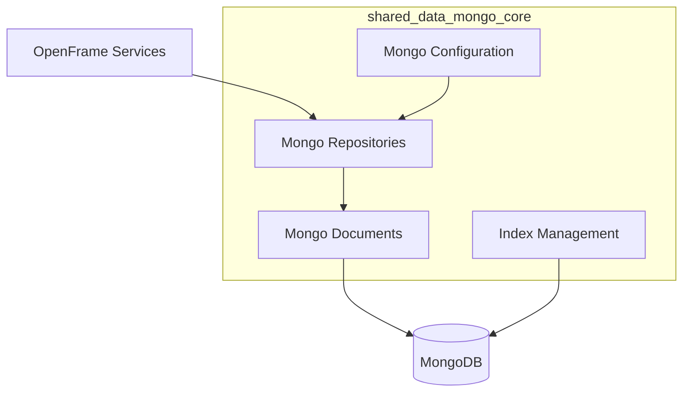
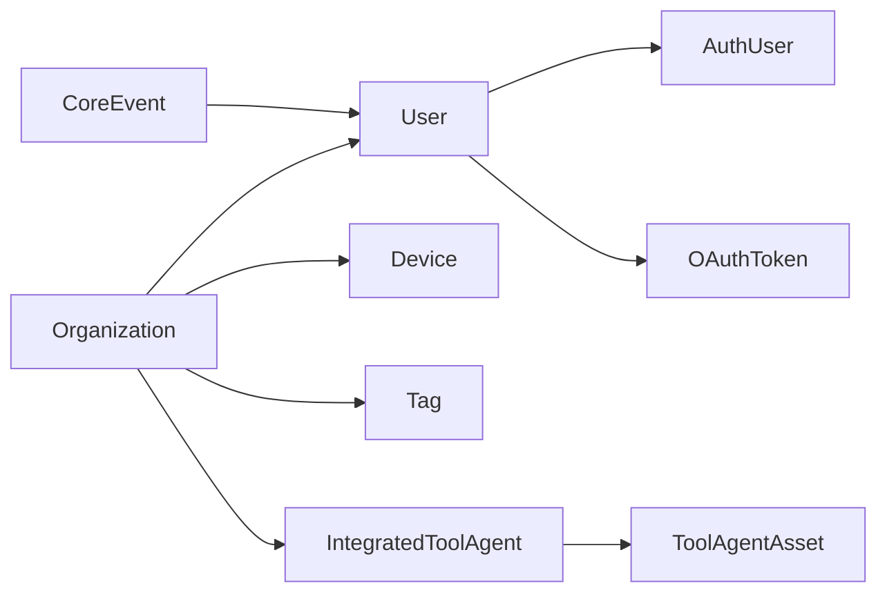
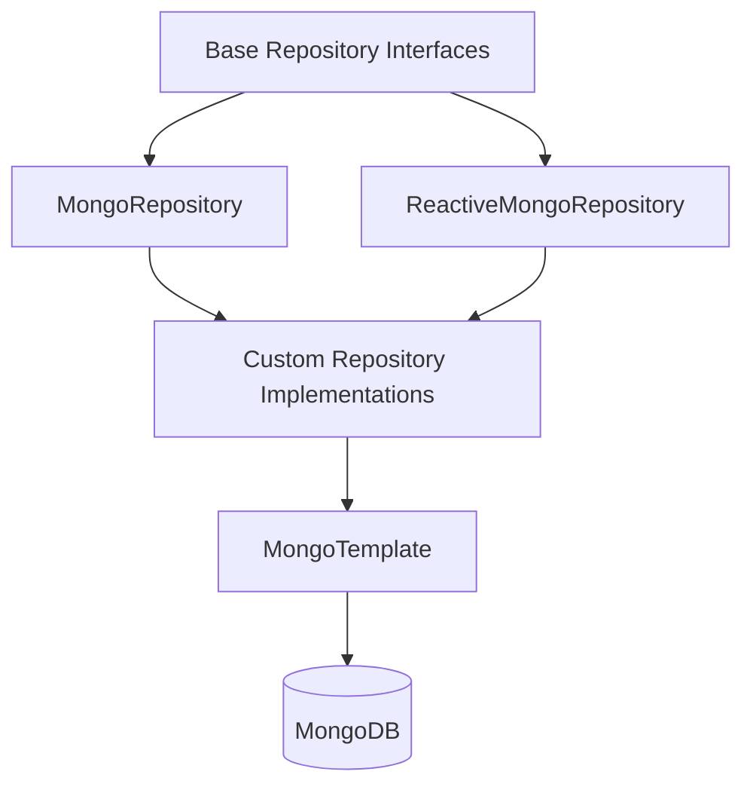

# shared_data_mongo_core

## Overview

The **shared_data_mongo_core** module provides the MongoDB persistence foundation for the OpenFrame / Flamingo platform. It defines:

- MongoDB configuration for blocking and reactive runtimes
- Index initialization for performance-critical collections
- Core MongoDB document models (users, organizations, devices, OAuth, tools, events)
- Repository abstractions and custom query implementations
- Technology-agnostic base repository contracts shared across services

This module is consumed by multiple services including:
- API Service (REST + GraphQL)
- Authorization Service (OAuth2 / OIDC)
- Management Service
- Stream and Client services (read/write access)

It acts as the **single source of truth** for MongoDB schema, query patterns, and repository contracts.

---

## Architectural Role

**Key responsibilities:**
- Consistent Mongo configuration across all services
- Centralized document definitions
- Shared repository interfaces for blocking and reactive stacks
- Optimized querying via custom repository implementations

---

## Configuration Layer

### MongoConfig

Provides conditional MongoDB configuration depending on runtime mode:

- **MongoConfiguration**
  - Enabled when `spring.data.mongodb.enabled=true`
  - Enables blocking Mongo repositories
  - Enables Mongo auditing
  - Customizes `MappingMongoConverter`

- **ReactiveMongoConfiguration**
  - Enabled for reactive web applications
  - Enables reactive Mongo repositories

**Key behaviors:**
- Replaces dots in map keys with `__dot__` for Mongo compatibility
- Supports both blocking and reactive repositories in the same codebase

---

### MongoIndexConfig

Initializes indexes at application startup:

- Compound index on application events:
  - `(userId ASC, timestamp DESC)`
  - `(type ASC, metadata.tags ASC)`

This ensures efficient filtering and sorting for audit and event workloads.

---

## Document Model Overview

The document layer models multi-tenant identity, devices, tools, OAuth state, and events.

---

## Core Documents

### User / AuthUser

- **User**: Base user profile
  - Email, roles, status, lifecycle timestamps
  - Email normalization enforced

- **AuthUser**: Authorization-server specific extension
  - Tenant-scoped identity
  - Password hash and external identity mapping
  - Compound index on `(tenantId, email)`

Used primarily by the **Authorization Service**.

---

### Organization

Represents a tenant-owned business entity:

- Soft-delete support
- Contract lifecycle tracking
- Indexed identifiers for fast lookup
- Business metadata (employees, revenue, category)

Consumed heavily by API and Management services.

---

### Device

Represents a managed machine or endpoint:

- Machine identity and hardware metadata
- Status and health tracking
- Last check-in timestamp

Queried via custom cursor-based pagination for large fleets.

---

### Events

- **CoreEvent**: Internal platform events
- **ExternalApplicationEvent** (via repository): External or tool-originated events

Features:
- Cursor-based pagination
- Full-text search support
- Time-range filtering
- Indexed for audit workloads

---

### OAuth Documents

- **MongoRegisteredClient**: OAuth2 client registrations
- **OAuthToken**: Access and refresh token storage

These documents are used by the **Authorization Service** and support:
- PKCE
- Token rotation
- Multi-client tenancy

---

### Tooling Documents

- **Tag**: Organization-scoped labeling
- **IntegratedToolAgent**: Tool agent configuration and lifecycle
- **ToolAgentAsset**: Downloadable binaries and metadata

Used by Client, Management, and API services.

---

### Tenant SSO Configuration

- **SSOPerTenantConfig**
  - Extends shared SSO configuration
  - Enforces one SSO config per tenant
  - Audited with creation and update timestamps

---

## Repository Architecture

### Base Repository Contracts

Technology-agnostic interfaces:

- `BaseUserRepository`
- `BaseTenantRepository`
- `BaseApiKeyRepository`
- `BaseIntegratedToolRepository`

These allow services to remain decoupled from blocking vs reactive persistence.

---

### Reactive Repositories

- **ReactiveUserRepository**
- **ReactiveOAuthClientRepository**

Used by reactive services such as Gateway and streaming-enabled components.

---

### Custom Repository Implementations

Custom Mongo queries implemented using `MongoTemplate`:

- **CustomMachineRepositoryImpl**
  - Cursor pagination
  - Search and filter composition

- **CustomEventRepositoryImpl**
  - Date-range filtering
  - Distinct aggregations

- **CustomOrganizationRepositoryImpl**
  - Soft-delete enforcement
  - Contract-aware filtering

- **CustomIntegratedToolRepositoryImpl**
  - Multi-criteria filtering
  - Distinct category discovery

These implementations ensure database-level filtering for performance.

---

## Cross-Module Usage

This module is consumed by:

- API Service (REST, GraphQL fetchers, DTO mapping)
- Authorization Service (OAuth clients, tokens, users)
- Management Service (tools, organizations, initialization)
- Client and Stream services (read/write operations)

It deliberately contains **no business logic**, only persistence concerns.

---

## Design Principles

- **Schema centralization**: One Mongo schema definition for all services
- **Reactive + blocking parity**: Same contracts for both paradigms
- **Performance first**: Indexed collections and cursor-based pagination
- **Multi-tenancy aware**: Tenant-safe indexes and constraints

---

## Summary

The **shared_data_mongo_core** module is the persistence backbone of OpenFrame. By centralizing MongoDB configuration, schema, and repository patterns, it enables consistent, scalable, and high-performance data access across the entire platform.
