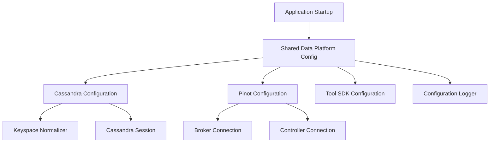
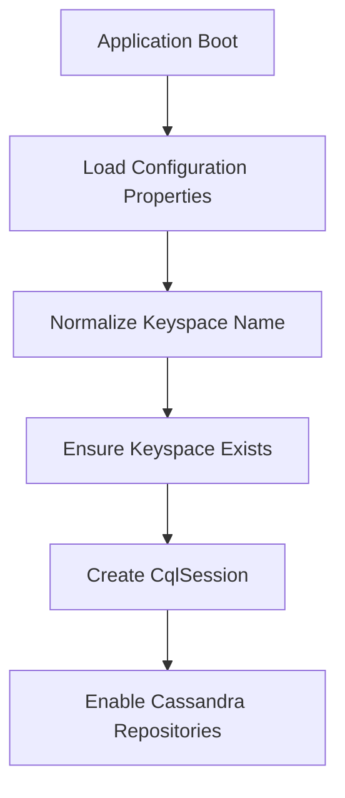
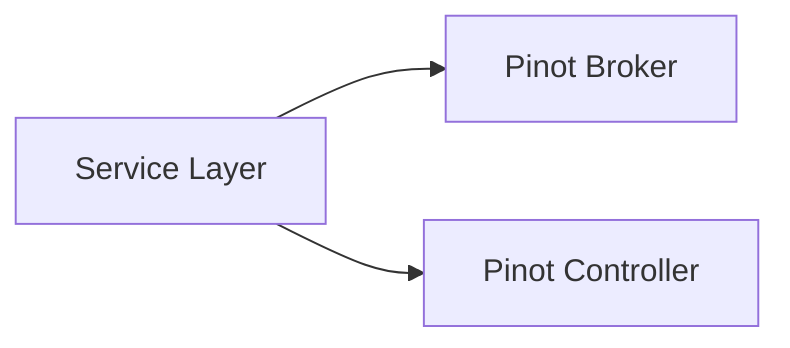
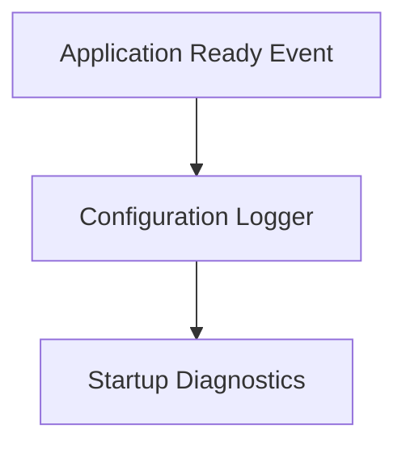

# Shared Data Platform Configuration

## Overview

The **shared_data_platform_config** module provides the foundational data-layer configuration used across the OpenFrame / Flamingo platform. It centralizes connectivity, initialization, and normalization logic for **Cassandra**, **Apache Pinot**, and external tool SDKs, and exposes lightweight diagnostics to ensure deployments are correctly wired at runtime.

This module is consumed by multiple services in the platform (API, Stream, Management, Authorization) to ensure consistent behavior for:

- Multi-tenant Cassandra keyspace management
- Conditional activation of data stores
- Analytics access via Pinot
- Tool SDK bootstrap (for integrated RMM tooling)
- Startup-time configuration visibility

The module is intentionally infrastructure-focused and does **not** contain business logic, repositories, or domain services.

---

## Responsibilities

- ✅ Configure Cassandra sessions and repositories when enabled
- ✅ Normalize tenant-specific Cassandra keyspaces
- ✅ Ensure Cassandra keyspaces exist before application startup
- ✅ Provide Pinot broker and controller connections
- ✅ Register SDK clients for downstream integrations
- ✅ Log effective runtime configuration for observability

---

## High-Level Architecture

---

## Core Configuration Areas

### 1. Cassandra Configuration

**Primary components:**
- `CassandraConfig`
- `DataConfiguration.CassandraConfiguration`
- `CassandraKeyspaceNormalizer`

This area is responsible for enabling and initializing Cassandra only when explicitly configured.

#### Key Features

- Conditional activation via `spring.data.cassandra.enabled`
- Automatic keyspace creation (`CREATE_IF_NOT_EXISTS`)
- Datacenter-aware load balancing
- Server-side timestamp generation
- Repository scanning under `com.openframe.data.repository.cassandra`

#### Startup Flow

#### Multi-Tenant Safety

Tenant identifiers may legally contain dashes, but Cassandra keyspaces may not. The **CassandraKeyspaceNormalizer** transparently rewrites:

- `tenant-abc-prod` → `tenant_abc_prod`

This occurs **after** Spring Cloud Config resolution and **before** repository initialization, ensuring compatibility without requiring upstream constraints.

---

### 2. Pinot Analytics Configuration

**Primary component:**
- `PinotConfig`

This configuration provides access to Apache Pinot for analytical and reporting workloads.

#### Provided Beans

- **Broker Connection** – used for query execution
- **Controller Connection** – used for metadata and administrative operations

The configuration is lightweight and intentionally does not enforce schema or table lifecycle management.

---

### 3. Tool SDK Configuration

**Primary component:**
- `ToolSdkConfig`

This configuration registers SDK clients required by downstream services to communicate with integrated tools.

Currently provided:

- **TacticalRmmClient** – used by client, management, and stream services

The SDK bean is stateless and safe to share across the application context.

---

### 4. Configuration Diagnostics

**Primary component:**
- `ConfigurationLogger`

At application readiness, the platform logs resolved infrastructure endpoints to aid debugging and deployment validation.

Logged values include:

- MongoDB URI
- Cassandra contact points
- Redis host
- Pinot controller URL
- Pinot broker URL

> This logger intentionally avoids secrets and focuses only on connectivity-level visibility.

---

## Conditional Activation Matrix

| Feature     | Property                               | Default |
|-------------|----------------------------------------|---------|
| Cassandra   | `spring.data.cassandra.enabled`        | false   |
| Cassandra RF| `spring.data.cassandra.replication-factor` | 1 |
| Pinot       | `pinot.broker.url` / `pinot.controller.url` | required |
| Tool SDK    | Always enabled                          | true    |

---

## How This Module Fits Into the Platform

- **API Service** uses this module for Cassandra-backed domain data and Pinot analytics
- **Stream Service** relies on Pinot connectivity for enriched event analytics
- **Management Service** depends on Cassandra and SDK initialization during bootstrap
- **Authorization Service** may consume shared data configuration indirectly through persistence layers

This module acts as a **shared infrastructure contract**, ensuring all services interact with data systems in a consistent and predictable manner.

---

## Design Principles

- Infrastructure-only (no domain logic)
- Explicit enablement via properties
- Safe multi-tenant defaults
- Fail-fast on misconfiguration
- Observable at startup

---

## Summary

The **shared_data_platform_config** module is the backbone of OpenFrame's data infrastructure setup. By isolating Cassandra, Pinot, and SDK initialization into a shared, reusable module, the platform achieves:

- Lower configuration drift
- Faster service bootstrap
- Safer multi-tenant behavior
- Clear operational visibility

This makes it a critical dependency for nearly every runtime service in the OpenFrame ecosystem.
