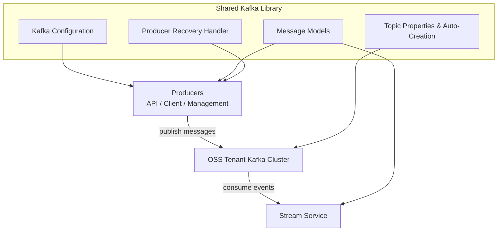
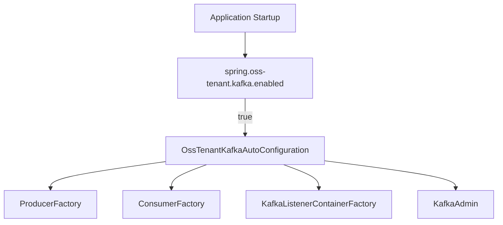
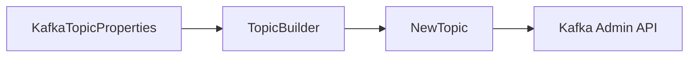
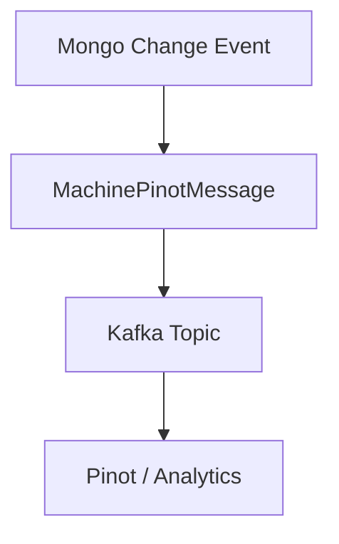
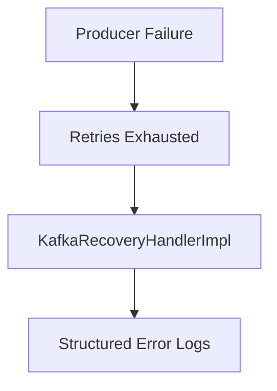

# Shared Kafka Library

## Overview

The **shared_kafka_library** module provides a standardized, multi-tenant–aware Kafka integration layer for the OpenFrame / Flamingo OSS stack. It centralizes Kafka configuration, topic management, message models, headers, and producer recovery handling so that all services (API, Stream, Management, Client, Gateway) can interact with Kafka in a consistent and observable way.

This module is designed to:
- Support **multi-tenant Kafka deployments** using a dedicated OSS tenant cluster
- Replace Spring Boot’s default Kafka auto-configuration with **explicit, controlled configuration**
- Provide **strongly typed message models** for cross-service communication
- Enable **safe retries and recovery logging** for Kafka producers

It is consumed primarily by the **stream_service_core_kafka_processing** module and indirectly by services producing or consuming Kafka events.

---

## Position in the Platform

Within the overall OpenFrame architecture, this library acts as the **Kafka foundation layer**:

- Upstream producers:
  - API Service
  - Client Service
  - Management Service
- Downstream consumers:
  - Stream Service (Kafka listeners, Debezium handlers, enrichment pipelines)

It complements:
- `shared_data_platform_config` for Cassandra/Pinot configuration
- `shared_data_mongo_core` for MongoDB persistence

---

## Architecture Overview

---

## Core Sub-Modules

### 1. Kafka Configuration

**Primary classes:**
- `KafkaTopicProperties`
- `OssKafkaConfig`
- `OssTenantKafkaAutoConfiguration`
- `OssTenantKafkaProperties`

This sub-module defines how Kafka is configured and bootstrapped across services.

#### Key Responsibilities
- Disable Spring Boot’s default `KafkaAutoConfiguration`
- Enable Kafka with explicit, tenant-aware configuration
- Expose producer, consumer, listener, and admin beans
- Bind Kafka settings from application properties

#### Auto-Configuration Flow

#### Configuration Properties

- `spring.oss-tenant.kafka.*`
  - Inherits from Spring’s `KafkaProperties`
- `openframe.oss-tenant.kafka.topics.*`
  - Defines inbound topics and auto-creation behavior

---

### 2. Topic Management

**Primary class:**
- `KafkaTopicProperties`

This component allows declarative definition of Kafka topics that should exist for a tenant.

#### Features
- Enable or disable auto-creation globally
- Define multiple inbound topics
- Control partitions and replication factor per topic

#### Topic Auto-Creation

When Kafka admin support is enabled, topics are registered automatically at startup:

This is especially useful for development and controlled OSS environments.

---

### 3. Kafka Headers

**Primary class:**
- `KafkaHeader`

Defines shared header keys used across Kafka messages.

Currently provided:
- `message-type` – used to distinguish logical message categories on shared topics

This ensures consistent header usage between producers and consumers.

---

### 4. Message Models

#### MachinePinotMessage

**Primary class:**
- `MachinePinotMessage`

A domain-specific Kafka message representing machine and device state changes.

**Typical use cases:**
- Device lifecycle updates
- Tag or status changes
- Feeding Pinot or analytics pipelines

---

#### DebeziumMessage

**Primary class:**
- `DebeziumMessage<T>`

A generic wrapper for Debezium CDC events.

**Structure highlights:**
- `before` / `after` payloads
- Operation type (`c`, `u`, `d`, `r`)
- Source metadata (connector, database, table/collection)
- Event timestamp

This model is heavily used by the **stream_service_core_kafka_processing** module to process CDC events coming from MongoDB or other sources.

---

### 5. Producer Recovery and Retry

**Primary class:**
- `KafkaRecoveryHandlerImpl`

Provides a fallback mechanism when Kafka producer retries are exhausted.

#### Behavior
- Captures:
  - Topic
  - Key
  - Exception type and message
  - Serialized payload snapshot
- Emits structured error logs for observability

This design favors **visibility and debuggability** over silent message loss.

---

## How Other Modules Use This Library

- **Stream Service**
  - Consumes Debezium and domain events
  - Uses shared message models and topic configuration

- **API / Client / Management Services**
  - Produce Kafka events using the shared producer configuration
  - Rely on consistent headers and serialization

Refer to the Stream Service documentation for details on Kafka consumers and processing pipelines.

---

## Design Principles

- **Convention over configuration** for Kafka setup
- **Explicit auto-configuration** instead of hidden defaults
- **Strong typing** for cross-service messages
- **Operational safety** through recovery logging

---

## Summary

The **shared_kafka_library** module is the backbone of Kafka-based communication in the OpenFrame platform. By centralizing configuration, topic management, message contracts, and recovery behavior, it ensures that all services interact with Kafka in a predictable, maintainable, and observable manner.
