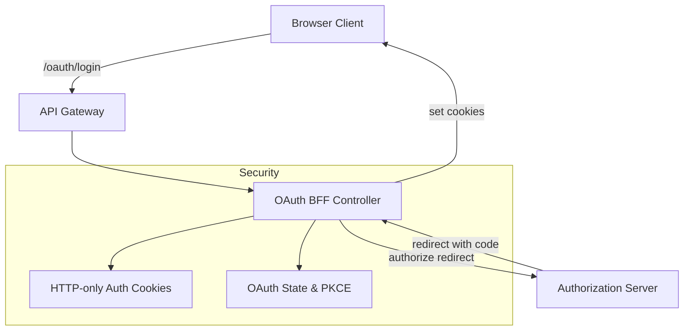
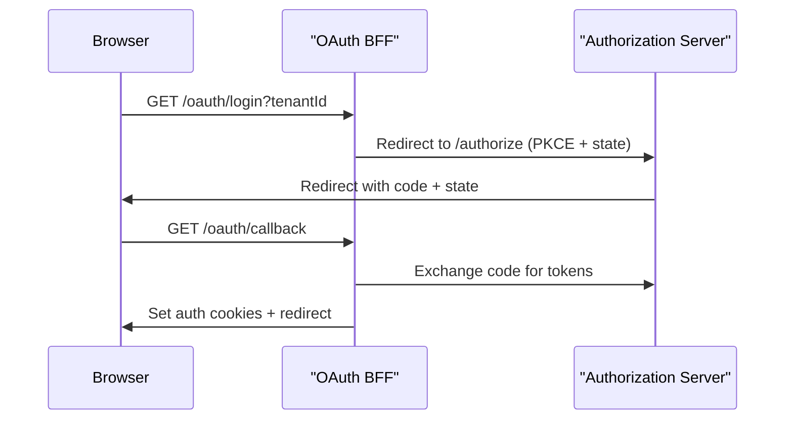

# shared_security_oauth_bff

## Overview

The **shared_security_oauth_bff** module implements the OAuth 2.0 / OpenID Connect **Backend-for-Frontend (BFF)** layer for OpenFrame. It acts as the secure edge between browser-based clients (Flamingo UI, OpenFrame Console) and the underlying authorization server, encapsulating OAuth complexity, enforcing cookie-based security, and supporting PKCE- and state-based flows.

This module is shared across services and is designed to be deployed behind the OpenFrame Gateway. It integrates tightly with:

- **Authorization Server** (authz_service_*) for OAuth/OIDC flows
- **Gateway Service** for request routing and header handling
- **shared_security_oauth_utilities** for JWT, PKCE, and constants

The BFF pattern ensures that:
- Tokens are never exposed to JavaScript by default
- OAuth state and redirects are centrally validated
- Multi-tenant OAuth flows remain consistent across providers

---

## Responsibilities

- Initiate OAuth login and continuation flows
- Handle OAuth callback and token exchange
- Manage access/refresh tokens via secure cookies
- Support refresh and logout flows
- Provide a developer-friendly token exchange mechanism (dev tickets)
- Resolve safe redirect targets post-authentication

---

## Core Components

| Component | Responsibility |
|---------|---------------|
| **OAuthBffController** | Exposes OAuth endpoints (`/login`, `/callback`, `/refresh`, `/logout`) and orchestrates flows |
| **InMemoryOAuthDevTicketStore** | Temporary token ticket store for development/debugging |
| **DefaultRedirectTargetResolver** | Determines safe redirect targets after OAuth completion |
| **NoopForwardedHeadersContributor** | Default no-op implementation for forwarded headers handling |

---

## High-Level Architecture

**Key points:**
- The browser only interacts with the BFF
- Tokens are stored in HTTP-only cookies
- The Authorization Server is never called directly by the browser

---

## OAuth Login Flow

---

## Component Details

### OAuthBffController

The main entry point for OAuth-related HTTP requests. Enabled only when the gateway OAuth feature flag is active.

**Endpoints:**

- `GET /oauth/login`
  - Initializes OAuth authorization
  - Clears existing auth cookies
  - Generates state + PKCE

- `GET /oauth/continue`
  - Continues an OAuth flow without clearing cookies
  - Used after SSO finalization

- `GET /oauth/callback`
  - Handles OAuth redirect from the authorization server
  - Exchanges authorization code for tokens
  - Sets access/refresh cookies

- `POST /oauth/refresh`
  - Refreshes tokens using refresh cookie or header

- `GET /oauth/logout`
  - Revokes refresh token
  - Clears authentication cookies

- `GET /oauth/dev-exchange`
  - Development-only endpoint
  - Exchanges a temporary dev ticket for tokens via headers

**Security characteristics:**
- Uses HTTP-only cookies for tokens
- Validates OAuth state on callback
- Safely computes redirect targets

---

### InMemoryOAuthDevTicketStore

A simple, in-memory implementation of `OAuthDevTicketStore`.

**Purpose:**
- Enable development and debugging workflows
- Allow tokens to be temporarily exchanged via headers instead of cookies

**Characteristics:**
- Non-persistent
- Single-use tickets
- Automatically replaced by custom implementations if provided

---

### DefaultRedirectTargetResolver

Determines where the user is redirected after successful or failed OAuth flows.

**Resolution order:**
1. Explicit `redirectTo` parameter
2. HTTP `Referer` header
3. Fallback to `/`

This component prevents open redirect issues by centralizing redirect logic.

---

### NoopForwardedHeadersContributor

Default no-op implementation of forwarded header contribution.

**Why it exists:**
- Allows downstream services or gateways to provide their own forwarded header logic
- Prevents accidental header manipulation when no contributor is configured

---

## Integration With Other Modules

- **authz_service_app**: Provides OAuth/OIDC authorization, token issuance, and SSO provider integration
- **gateway_service_core**: Routes OAuth endpoints and applies gateway-level security
- **shared_security_oauth_utilities**: Supplies JWT config, PKCE utilities, and shared constants

This module intentionally avoids duplicating authorization server logic and instead focuses on secure orchestration.

---

## Operational Notes

- Designed for **reactive (WebFlux)** applications
- Conditional beans allow easy customization
- Development features can be disabled via configuration

---

## Summary

The **shared_security_oauth_bff** module is a critical security component in the OpenFrame platform. By implementing the OAuth BFF pattern, it ensures secure, consistent, and tenant-aware authentication flows while simplifying frontend development and reducing attack surface.
