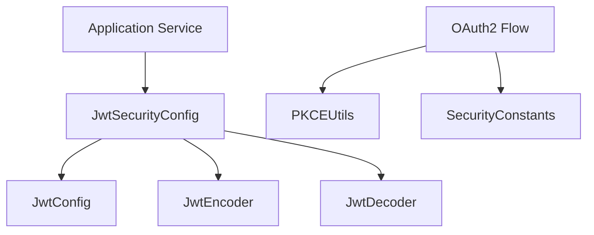
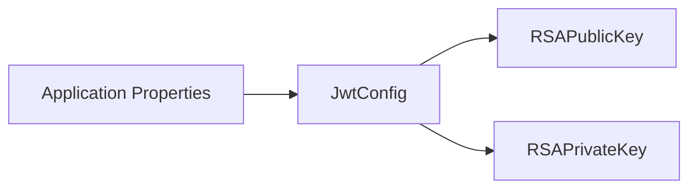
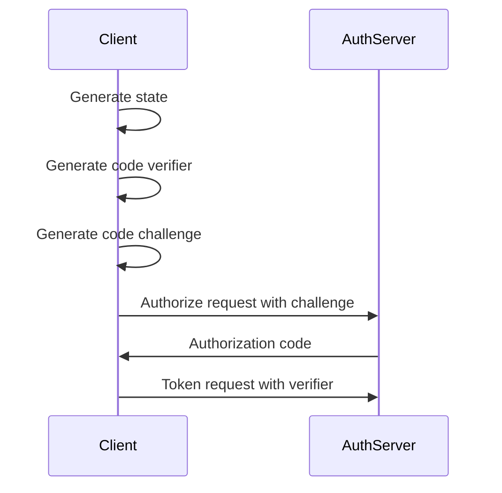

# Shared Security OAuth Utilities

## Overview

The **shared_security_oauth_utilities** module provides foundational, reusable building blocks for OAuth2, OpenID Connect (OIDC), and JWT-based security across the OpenFrame / Flamingo platform. It is designed as a **shared security core** that can be consumed by multiple services, including:

- Authorization Server
- API Services
- Gateway Service
- OAuth BFF
- Client-facing applications

This module intentionally contains **no business logic**. Instead, it focuses on cryptographic primitives, configuration, and constants required to implement secure OAuth2 flows consistently across the stack.

Core responsibilities include:

- JWT encoding and decoding using RSA keys
- Centralized JWT configuration loading
- Shared OAuth and token-related constants
- PKCE (Proof Key for Code Exchange) utilities for OAuth2 authorization code flows

---

## Core Components

The module consists of four primary components:

| Component | Responsibility |
|---------|----------------|
| `JwtSecurityConfig` | Spring configuration for JWT encoder/decoder beans |
| `JwtConfig` | Loads and manages JWT keys and metadata from configuration |
| `SecurityConstants` | Shared constants for OAuth and token handling |
| `PKCEUtils` | Utilities for PKCE state, verifier, and challenge generation |

---

## Architecture Overview

The module sits at the **lowest shared-security layer** and is imported by higher-level security modules and services.

---

## Component Details

### JwtSecurityConfig

`JwtSecurityConfig` is a Spring `@Configuration` class that exposes **JWT encoder and decoder beans**.

Responsibilities:

- Creates a `JwtEncoder` using RSA public/private keys
- Creates a `JwtDecoder` using the RSA public key
- Bridges Spring Security with Nimbus JOSE JWT implementation

Key characteristics:

- Uses `NimbusJwtEncoder` and `NimbusJwtDecoder`
- Wraps RSA keys in a JWK set for standards-compliant JWT handling
- Delegates all key loading to `JwtConfig`

This configuration is consumed by:

- Authorization server token issuance
- Resource server JWT validation
- Gateway JWT verification

---

### JwtConfig

`JwtConfig` is a configuration-backed service responsible for **loading and parsing JWT cryptographic material**.

Responsibilities:

- Load RSA public key for JWT verification
- Load RSA private key for JWT signing
- Expose JWT metadata such as issuer and audience

Key features:

- Uses Spring `@ConfigurationProperties` with the `jwt` prefix
- Supports PEM-formatted RSA private keys
- Converts Base64-encoded key material into Java `RSAPublicKey` and `RSAPrivateKey`

High-level flow:

This design ensures:

- Key material is externalized from code
- Consistent JWT configuration across all services

---

### SecurityConstants

`SecurityConstants` provides a centralized set of **OAuth2 and token-related constants** used across multiple services.

Defined constants include:

- Query parameters
- Token names
- HTTP header names for access and refresh tokens

Examples of usage:

- OAuth controllers
- Gateway authentication filters
- Client SDKs

Centralizing these constants prevents:

- Header name mismatches
- Inconsistent token handling across services

---

### PKCEUtils

`PKCEUtils` is a pure utility class implementing **PKCE (Proof Key for Code Exchange)** helpers required for secure OAuth2 authorization code flows.

Responsibilities:

- Generate cryptographically secure OAuth state values
- Generate PKCE code verifiers
- Generate PKCE code challenges using SHA-256
- URL-encode OAuth parameters safely

PKCE flow contribution:

Security characteristics:

- Uses `SecureRandom` for entropy
- Uses SHA-256 hashing
- Produces Base64URL-encoded output without padding

This utility is commonly used by:

- OAuth BFF layer
- Frontend-backed authorization flows
- SSO integrations

---

## How This Module Fits Into the Platform

The **shared_security_oauth_utilities** module is consumed by higher-level security and OAuth modules, including:

- Authorization server core (token issuance, client registration)
- OAuth BFF (browser-based OAuth flows)
- Gateway service (JWT validation and propagation)
- API services (resource server security)

It intentionally avoids:

- HTTP controllers
- Persistence
- Tenant or user-specific logic

This separation ensures:

- Clear security boundaries
- Easier auditing and review of cryptographic code
- Reuse across all OpenFrame services

---

## Design Principles

- **Single Responsibility**: Each class has one focused security concern
- **Configuration-Driven**: Keys and metadata come from external config
- **Stateless Utilities**: PKCE helpers are static and side-effect free
- **Shared by Default**: Designed to be imported across services

---

## Summary

The **shared_security_oauth_utilities** module forms the cryptographic and OAuth foundation of the OpenFrame platform. By centralizing JWT configuration, PKCE helpers, and shared constants, it enables secure, consistent, and maintainable authentication flows across all services without duplicating sensitive security logic.
