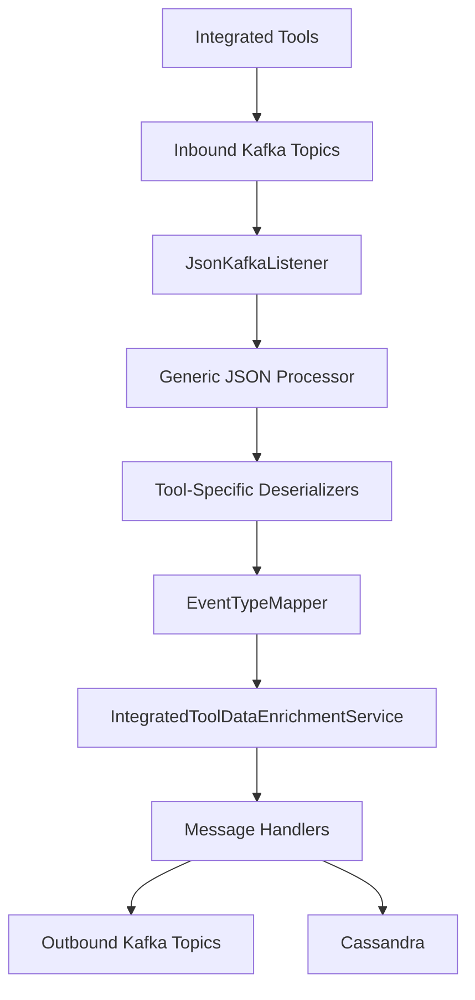
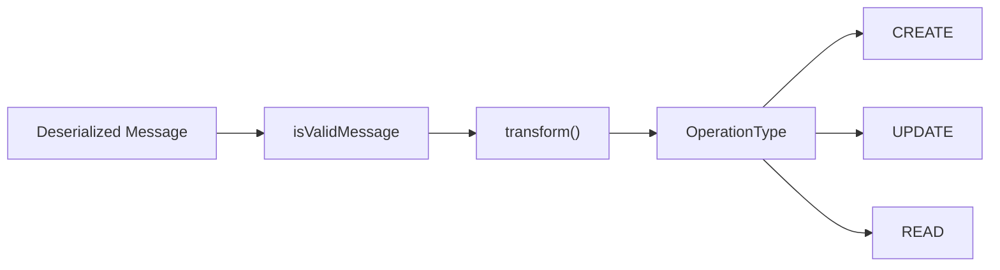
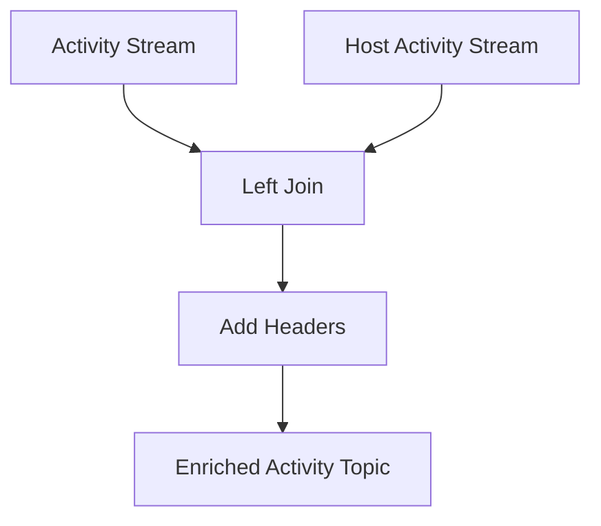

# Stream Service

## Overview
The **stream-service** is the real-time ingestion and processing backbone of the OpenFrame platform. It consumes change-data-capture (CDC) and activity events from integrated tools (Fleet MDM, Tactical RMM, MeshCentral) via Kafka, normalizes them into **unified event models**, enriches them with tenant and device context, and delivers them to downstream systems such as Kafka topics and Cassandra for analytics and auditing.

This service is a Spring Boot application with Kafka and Kafka Streams enabled. It is designed to be **multi-tenant aware**, horizontally scalable, and resilient to partial failures in upstream integrations.

## Responsibilities
- Consume inbound Kafka topics carrying Debezium and activity events
- Deserialize tool-specific payloads into a unified internal representation
- Map source event types to unified OpenFrame event types
- Enrich events with machine and organization metadata
- Fan out processed events to Kafka and Cassandra destinations

## Position in the Platform
The stream-service sits between:
- **Upstream producers**: Integrated tools (Fleet, Tactical RMM, MeshCentral) via Debezium + Kafka
- **Downstream consumers**: Analytics (Pinot), audit logs (Cassandra), and API consumers via Kafka

Other services (API, External API, Management) rely on the normalized events produced by this service rather than raw tool-specific data.

## High-Level Architecture



## Application Bootstrap

### `StreamApplication`
The entry point enables Kafka and component scanning across stream, data, and Kafka producer packages.

```java
@SpringBootApplication
@EnableKafka
@ComponentScan(basePackages = {
    "com.openframe.stream",
    "com.openframe.data",
    "com.openframe.kafka.producer"
})
public class StreamApplication {
    public static void main(String[] args) {
        SpringApplication.run(StreamApplication.class, args);
    }
}
```

## Kafka Configuration

### `KafkaConfig`
- Provides a custom header converter to map Kafka header bytes into `MessageType`
- Enables routing logic based on message type

### `KafkaStreamsConfig`
Configures Kafka Streams for enrichment pipelines:
- Tenant-aware `application.id`
- JSON serdes for Fleet activity messages
- At-least-once processing guarantees

Key properties:
- Bootstrap servers from tenant configuration
- State stored under `/tmp/kafka-streams`

## Inbound Consumption

### `JsonKafkaListener`
Listens to multiple inbound topics corresponding to integrated tools:
- MeshCentral events
- Tactical RMM events
- Fleet MDM activity and query result events

Each message is forwarded with its `MessageType` header to the generic processing pipeline.

## Processing Pipeline

### Generic Handler Model



#### `GenericMessageHandler`
- Abstract base for all handlers
- Normalizes CRUD-style operations (`c`, `u`, `r`, `d`) into `OperationType`
- Dispatches to destination-specific logic

#### `DebeziumMessageHandler`
- Specialization for Debezium CDC payloads
- Interprets Debezium operation codes

## Destinations

### Kafka Destination

#### `DebeziumKafkaMessageHandler`
- Produces `IntegratedToolEvent` messages
- Publishes to tenant-scoped outbound Kafka topics
- Uses deterministic message keys (deviceId/toolType or userId/toolType)

### Cassandra Destination

#### `DebeziumCassandraMessageHandler`
- Persists `UnifiedLogEvent` entities
- Supports idempotent CREATE/READ/UPDATE semantics
- Used for audit log storage and querying

## Event Mapping

### `EventTypeMapper`
Maps `(IntegratedToolType, sourceEventType)` pairs into `UnifiedEventType`.

- Central registry of mappings
- Defaults to `UNKNOWN` when no mapping exists
- Covers hundreds of event types across Fleet, Tactical, and MeshCentral

### `SourceEventTypes`
Defines constants for all known source event identifiers, grouped by tool.

### `FleetActivityTypeMapping`
Provides human-readable messages for Fleet MDM activity types, used during deserialization.

## Deserialization Layer

Each integrated tool has a dedicated deserializer responsible for:
- Extracting agent/device identifiers
- Resolving source event types
- Parsing timestamps into epoch milliseconds
- Building meaningful messages, results, and error payloads

Implemented deserializers include:
- Fleet events and query results
- MeshCentral events
- Tactical RMM audit events
- Tactical RMM agent history events

These components convert raw JSON into a common internal Debezium-style model.

## Enrichment

### `IntegratedToolDataEnrichmentService`
Adds contextual metadata to events:
- Machine ID
- Hostname
- Organization ID and name

Data is resolved via Redis-backed caches populated by other services.

### `ActivityEnrichmentService` (Kafka Streams)
Joins Fleet activity and host-activity streams:
- Correlates activity IDs with host IDs
- Injects Kafka headers required by downstream consumers
- Emits enriched activity events back to Kafka



## Utility Components

### `TimestampParser`
- Parses ISO-8601 timestamps produced by Debezium
- Returns epoch milliseconds
- Fails safely with warnings

## Related Modules
- **gateway-service**: Exposes APIs and WebSockets that rely on processed events
- **external-api-service**: Serves logs and events derived from stream outputs
- **data-layer-kafka-redis-cassandra-pinot**: Provides storage and analytics backends

## Summary
The stream-service is a critical normalization and enrichment layer in OpenFrame. By abstracting tool-specific event formats into a unified stream, it enables consistent auditing, analytics, and automation across the entire MSP platform.
