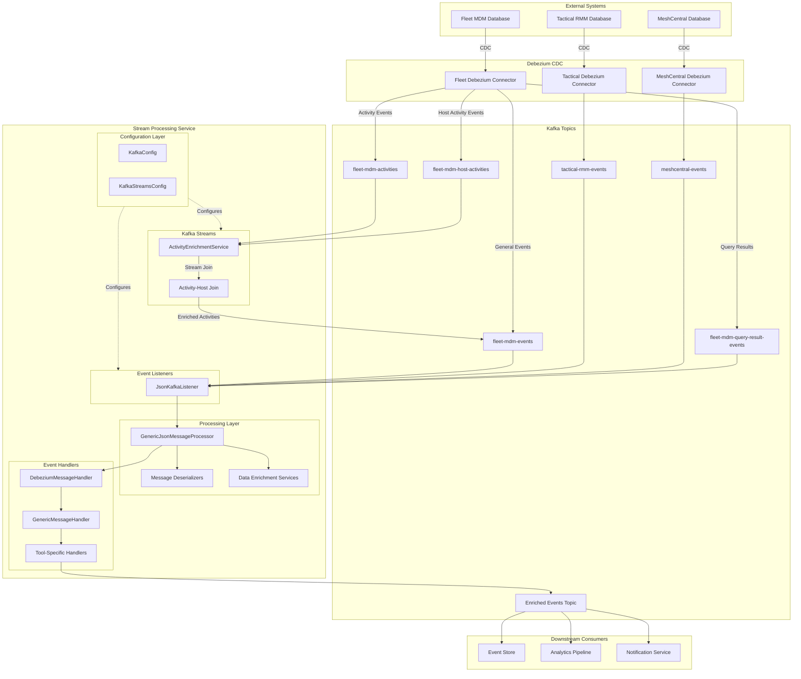
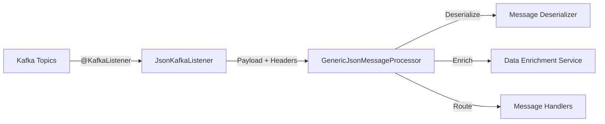
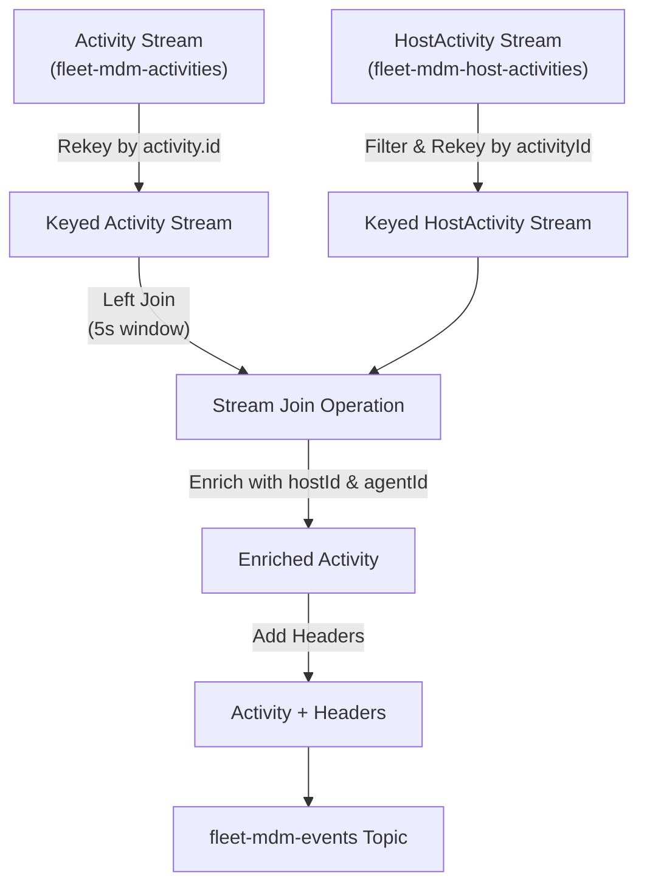
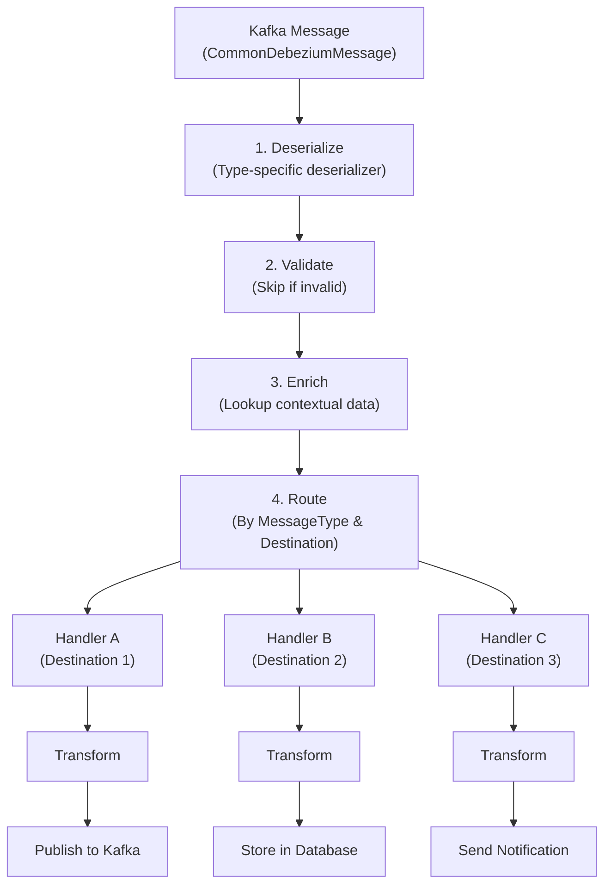
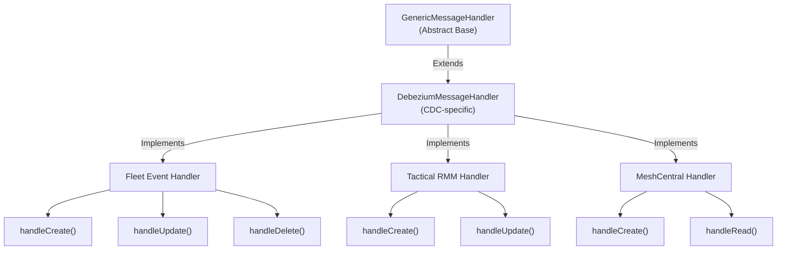
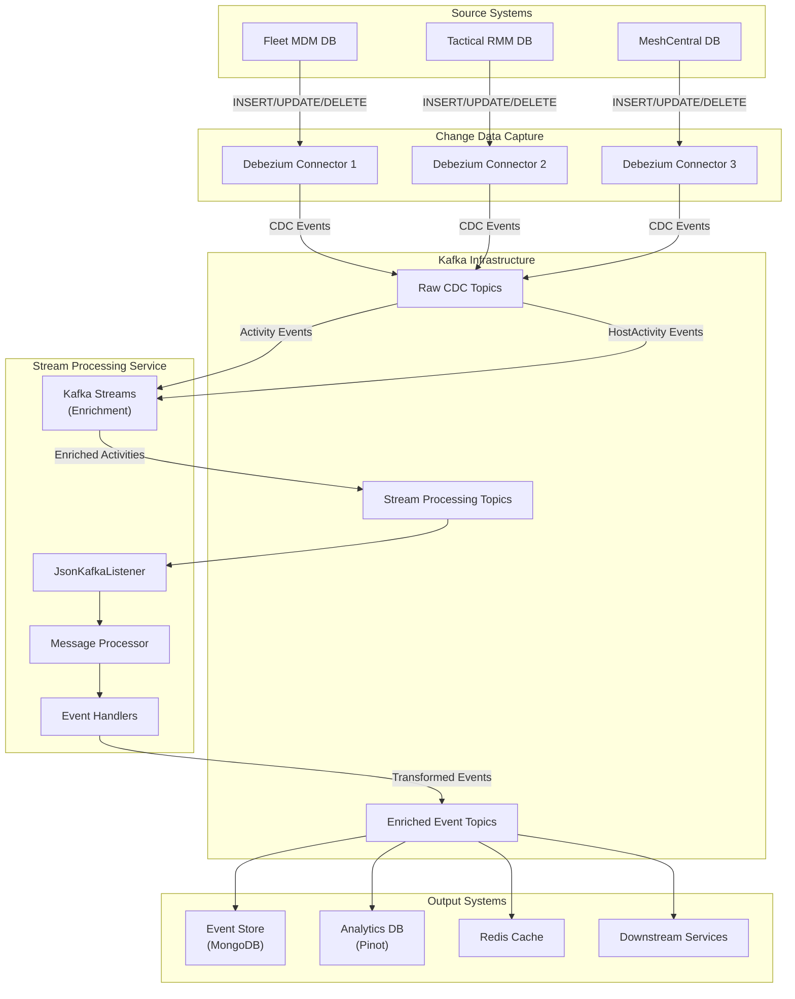
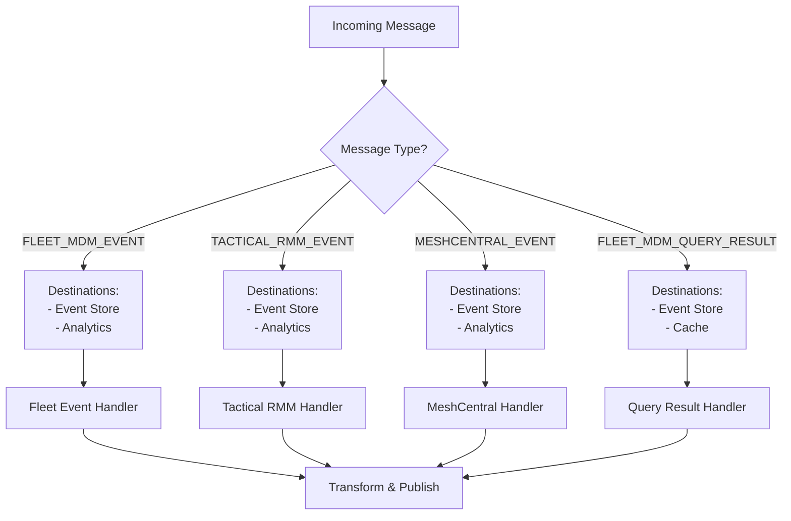
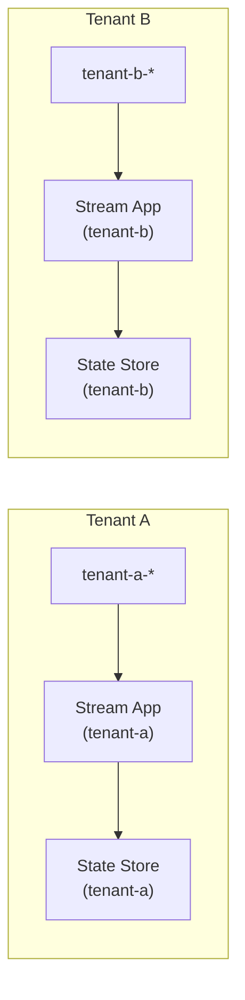

# Stream Processing Service

## Overview

The **Stream Processing Service** is a critical component of the OpenFrame platform that provides real-time event processing and data enrichment capabilities using Apache Kafka and Kafka Streams. This service acts as the central nervous system for processing change data capture (CDC) events from integrated tools (Fleet MDM, Tactical RMM, MeshCentral) and enriching them with contextual information before routing to downstream consumers.

**Key Responsibilities:**
- Real-time processing of Debezium CDC events from multiple integrated tools
- Stream-based data enrichment and transformation using Kafka Streams
- Event routing and distribution to appropriate handlers based on message type
- Activity enrichment with host and agent information through stream joins
- Multi-tenant event processing with cluster-aware configuration

**Technology Stack:**
- **Apache Kafka**: Message broker for event streaming
- **Kafka Streams**: Stream processing framework for real-time transformations
- **Spring Kafka**: Integration framework for Kafka consumers and producers
- **Debezium**: Change data capture for database events
- **Jackson**: JSON serialization/deserialization

---

## Architecture Overview

The Stream Processing Service follows a layered architecture with clear separation between configuration, message consumption, stream processing, and event handling:



---

## Core Components

### 1. Configuration Layer

The configuration layer sets up Kafka consumers, producers, and Kafka Streams processing infrastructure.

**Components:**
- **[KafkaConfig](./stream_processing_configuration.md#kafkaconfig)**: Base Kafka configuration including message type converters
- **[KafkaStreamsConfig](./stream_processing_configuration.md#kafkastreamsconfig)**: Kafka Streams topology configuration with serializers and application settings

**Key Features:**
- Multi-tenant support via cluster-aware application IDs
- Custom serializers/deserializers for domain models
- Stream processing guarantees (at-least-once delivery)
- Configurable consumer and producer settings

See [Stream Processing Configuration](./stream_processing_configuration.md) for detailed documentation.

---

### 2. Event Listeners

Event listeners consume messages from Kafka topics and route them to the processing layer.

**Components:**
- **[JsonKafkaListener](./stream_processing_listeners.md#jsonkafkalistener)**: Multi-topic Kafka listener for integrated tool events

**Supported Topics:**
- `meshcentral-events`: MeshCentral CDC events
- `tactical-rmm-events`: Tactical RMM CDC events
- `fleet-mdm-events`: Fleet MDM general events
- `fleet-mdm-query-result-events`: Fleet MDM query execution results

**Message Flow:**


See [Stream Processing Listeners](./stream_processing_listeners.md) for detailed documentation.

---

### 3. Stream Processing Layer

The stream processing layer uses Kafka Streams to perform real-time data transformations and enrichment.

**Components:**
- **[ActivityEnrichmentService](./stream_processing_streams.md#activityenrichmentservice)**: Enriches Fleet MDM activities with host and agent information

**Stream Processing Features:**
- **Stream Joins**: Left join between Activity and HostActivity streams
- **Windowed Joins**: 5-second time window for matching related events
- **Key Repartitioning**: Automatic rekeying for join operations
- **Header Injection**: Adds message type headers for downstream routing
- **Stateful Processing**: Maintains join state stores

**Enrichment Flow:**


See [Stream Processing Streams](./stream_processing_streams.md) for detailed documentation.

---

### 4. Message Processing Layer

The message processing layer deserializes, enriches, and routes events to appropriate handlers.

**Components:**
- **[GenericJsonMessageProcessor](./stream_processing_message_processing.md#genericjsonmessageprocessor)**: Central message routing and orchestration
- **Message Deserializers**: Type-specific deserialization logic
- **Data Enrichment Services**: Contextual data lookup and enrichment

**Processing Pipeline:**


See [Stream Processing Message Processing](./stream_processing_message_processing.md) for detailed documentation.

---

### 5. Event Handlers

Event handlers transform and persist processed events based on operation type (CREATE, READ, UPDATE, DELETE).

**Components:**
- **[DebeziumMessageHandler](./stream_processing_handlers.md#debeziummessagehandler)**: Base handler for Debezium CDC events
- **[GenericMessageHandler](./stream_processing_handlers.md#genericmessagehandler)**: Abstract handler with CRUD operation routing

**Handler Hierarchy:**


See [Stream Processing Handlers](./stream_processing_handlers.md) for detailed documentation.

---

### 6. Application Entry Point

**Component:**
- **[StreamApplication](./stream_processing_application.md)**: Spring Boot application entry point

**Configuration:**
- Enables Kafka and Kafka Streams
- Component scanning for stream, data, and Kafka producer packages
- Auto-configuration for Spring Kafka integration

See [Stream Processing Application](./stream_processing_application.md) for detailed documentation.

---

## Data Flow

### End-to-End Event Processing



---

## Message Types and Routing

The Stream Processing Service handles multiple message types, each with specific routing and handling logic:

| Message Type | Source | Handler Type | Destinations | Description |
|--------------|--------|--------------|--------------|-------------|
| `FLEET_MDM_EVENT` | Fleet MDM | Debezium | Event Store, Analytics | General Fleet MDM events |
| `FLEET_MDM_ACTIVITY` | Fleet MDM | Debezium | Event Store, Stream Processing | User activity events (enriched) |
| `FLEET_MDM_QUERY_RESULT` | Fleet MDM | Debezium | Event Store, Cache | Query execution results |
| `TACTICAL_RMM_EVENT` | Tactical RMM | Debezium | Event Store, Analytics | Tactical RMM agent events |
| `MESHCENTRAL_EVENT` | MeshCentral | Debezium | Event Store, Analytics | MeshCentral device events |

**Routing Logic:**


---

## Multi-Tenant Support

The Stream Processing Service supports multi-tenant deployments through cluster-aware configuration:

**Tenant Isolation:**
- **Application ID**: Kafka Streams application ID includes cluster/tenant ID
- **Topic Namespacing**: Topics are prefixed with tenant identifiers
- **Consumer Groups**: Separate consumer groups per tenant
- **State Stores**: Isolated state stores per tenant

**Configuration Example:**
```yaml
openframe:
  cluster-id: tenant-y0-1  # Tenant identifier

spring:
  application:
    name: openframe-stream

# Resulting Kafka Streams application.id: openframe-stream-tenant-y0-1
```

**Tenant-Aware Processing:**


---

## Performance Characteristics

### Throughput and Latency

**Kafka Streams Configuration:**
- **Processing Guarantee**: At-least-once delivery
- **Stream Threads**: 1 thread per instance (configurable)
- **Batch Size**: 16KB producer batches
- **Linger Time**: 10ms for batching optimization
- **Buffer Memory**: 32MB producer buffer

**Consumer Configuration:**
- **Max Poll Records**: 100 records per poll
- **Auto Offset Reset**: Earliest (process all historical events)
- **Group ID**: Tenant-specific consumer groups

**Expected Performance:**
- **Throughput**: 1,000-10,000 events/second per instance
- **Latency**: <100ms for stream enrichment (p95)
- **Join Window**: 5-second window for activity-host joins

### Scalability

**Horizontal Scaling:**
- Multiple instances can run in parallel
- Kafka partition-based load distribution
- Stateless message processing (except Kafka Streams state stores)

**Vertical Scaling:**
- Increase `NUM_STREAM_THREADS_CONFIG` for more parallelism
- Adjust heap size for larger state stores
- Tune batch sizes and buffer memory

---

## Error Handling and Resilience

### Retry Mechanisms

**Kafka Consumer Retries:**
- Automatic retry on transient failures
- Dead letter queue (DLQ) for failed messages
- Configurable retry policies via `KafkaRecoveryHandlerImpl`

**Stream Processing Errors:**
- Skip invalid messages (null checks)
- Log errors for monitoring and debugging
- Continue processing subsequent messages

### Monitoring and Observability

**Key Metrics:**
- Kafka consumer lag (messages behind)
- Stream processing throughput (records/second)
- Join success rate (enrichment effectiveness)
- Handler execution time (latency)
- Error rates by message type

**Logging:**
- Structured logging with SLF4J
- Debug-level logs for enrichment operations
- Error-level logs for processing failures

---

## Integration Points

### Upstream Dependencies

| Dependency | Purpose | Reference |
|------------|---------|-----------|
| **Debezium Connectors** | CDC event generation | External (Kafka Connect) |
| **Kafka Broker** | Message transport | [Data Layer Kafka](./data_layer_kafka.md) |
| **Fleet MDM Database** | Source data for CDC | [Fleet MDM SDK](./fleet_mdm_sdk.md) |
| **Tactical RMM Database** | Source data for CDC | [Tactical RMM SDK](./tactical_rmm_sdk.md) |
| **MeshCentral Database** | Source data for CDC | External |

### Downstream Consumers

| Consumer | Purpose | Reference |
|----------|---------|-----------|
| **Event Store (MongoDB)** | Persistent event storage | [Data Layer Mongo](./data_layer_mongo.md) |
| **Analytics Pipeline (Pinot)** | Real-time analytics | [Data Layer Core](./data_layer_core.md) |
| **Redis Cache** | Fast lookup for enrichment | [Data Layer Core](./data_layer_core.md) |
| **API Service** | Event queries and subscriptions | [API Service](./api_service.md) |
| **Management Service** | Tool health monitoring | [Management Service](./management_service.md) |

---

## Configuration Reference

### Application Properties

```yaml
# Kafka Configuration
spring:
  oss-tenant:
    kafka:
      bootstrap-servers: localhost:9092
      consumer:
        group-id: openframe-stream-consumer

# Kafka Topics
openframe:
  cluster-id: ${CLUSTER_ID:}
  oss-tenant:
    kafka:
      topics:
        inbound:
          fleet-mdm-activities:
            name: fleet-mdm-activities
          fleet-mdm-host-activities:
            name: fleet-mdm-host-activities
          fleet-mdm-events:
            name: fleet-mdm-events
          fleet-mdm-query-result-events:
            name: fleet-mdm-query-result-events
          tactical-rmm-events:
            name: tactical-rmm-events
          meshcentral-events:
            name: meshcentral-events

# Kafka Streams
kafka:
  streams:
    state-dir: /tmp/kafka-streams
    num-threads: 1
    processing-guarantee: at_least_once
```

### Environment Variables

| Variable | Description | Default | Required |
|----------|-------------|---------|----------|
| `CLUSTER_ID` | Tenant/cluster identifier | (empty) | No |
| `KAFKA_BOOTSTRAP_SERVERS` | Kafka broker addresses | localhost:9092 | Yes |
| `KAFKA_CONSUMER_GROUP_ID` | Consumer group ID | openframe-stream-consumer | Yes |

---

## Deployment Considerations

### Resource Requirements

**Minimum Requirements:**
- **CPU**: 2 cores
- **Memory**: 2GB heap + 1GB off-heap (state stores)
- **Disk**: 10GB for state stores (SSD recommended)
- **Network**: 100Mbps

**Recommended Production:**
- **CPU**: 4-8 cores
- **Memory**: 4-8GB heap + 2-4GB off-heap
- **Disk**: 50GB SSD for state stores
- **Network**: 1Gbps

### High Availability

**Deployment Strategy:**
- Run multiple instances (3+ recommended)
- Use Kafka partition replication (RF=3)
- Enable Kafka Streams standby replicas
- Monitor consumer lag and rebalancing

**Failure Scenarios:**
- **Instance Failure**: Kafka rebalances partitions to healthy instances
- **Kafka Broker Failure**: Clients reconnect to available brokers
- **State Store Corruption**: Rebuild from changelog topics

---

## Development Guide

### Adding a New Message Type

1. **Define Message Type Enum:**
   ```java
   public enum MessageType {
       NEW_TOOL_EVENT(
           EventHandlerType.DEBEZIUM,
           DataEnrichmentServiceType.NEW_TOOL,
           List.of(Destination.EVENT_STORE, Destination.ANALYTICS)
       );
   }
   ```

2. **Create Deserializer:**
   ```java
   @Component
   public class NewToolDeserializer implements KafkaMessageDeserializer {
       @Override
       public MessageType getType() {
           return MessageType.NEW_TOOL_EVENT;
       }
       
       @Override
       public DeserializedDebeziumMessage deserialize(CommonDebeziumMessage message, MessageType type) {
           // Deserialization logic
       }
   }
   ```

3. **Create Handler:**
   ```java
   @Component
   public class NewToolHandler extends DebeziumMessageHandler<NewToolEvent, NewToolDebeziumMessage> {
       @Override
       protected NewToolEvent transform(NewToolDebeziumMessage message, IntegratedToolEnrichedData extraParams) {
           // Transformation logic
       }
       
       @Override
       protected void handleCreate(NewToolEvent data) {
           // CREATE operation logic
       }
   }
   ```

4. **Add Topic Configuration:**
   ```yaml
   openframe:
     oss-tenant:
       kafka:
         topics:
           inbound:
             new-tool-events:
               name: new-tool-events
   ```

5. **Update Listener:**
   ```java
   @KafkaListener(
       topics = {"${openframe.oss-tenant.kafka.topics.inbound.new-tool-events.name}"},
       groupId = "${spring.oss-tenant.kafka.consumer.group-id}"
   )
   public void listenNewToolEvents(@Payload CommonDebeziumMessage message, @Header(KafkaHeader.MESSAGE_TYPE_HEADER) MessageType type) {
       messageProcessor.process(message, type);
   }
   ```

### Testing Stream Processing

**Unit Testing:**
```java
@Test
public void testActivityEnrichment() {
    ActivityMessage activity = createTestActivity();
    HostActivityMessage hostActivity = createTestHostActivity();
    
    ActivityMessage enriched = enrichmentService.enrichActivityWithHostInfo(activity, hostActivity);
    
    assertNotNull(enriched.getPayload().getAfter().getHostId());
    assertNotNull(enriched.getPayload().getAfter().getAgentId());
}
```

**Integration Testing:**
```java
@SpringBootTest
@EmbeddedKafka
public class StreamProcessingIntegrationTest {
    @Test
    public void testEndToEndProcessing() {
        // Send test message to input topic
        kafkaTemplate.send("fleet-mdm-activities", testMessage);
        
        // Verify enriched message in output topic
        ConsumerRecord<String, ActivityMessage> result = consumer.poll(Duration.ofSeconds(10));
        assertNotNull(result.value().getPayload().getAfter().getHostId());
    }
}
```

---

## Troubleshooting

### Common Issues

**Issue: Consumer Lag Increasing**
- **Cause**: Processing slower than message production rate
- **Solution**: Scale horizontally (add instances) or increase `NUM_STREAM_THREADS_CONFIG`

**Issue: Stream Join Not Enriching**
- **Cause**: Events arriving outside 5-second join window
- **Solution**: Increase `JOIN_WINDOW_DURATION` or investigate event timing

**Issue: State Store Corruption**
- **Cause**: Unclean shutdown or disk failure
- **Solution**: Delete state directory and restart (rebuilds from changelog)

**Issue: Duplicate Event Processing**
- **Cause**: At-least-once delivery guarantee
- **Solution**: Implement idempotent handlers or use exactly-once semantics

### Debug Logging

Enable debug logging for troubleshooting:

```yaml
logging:
  level:
    com.openframe.stream: DEBUG
    org.apache.kafka.streams: DEBUG
    org.springframework.kafka: DEBUG
```

---

## Related Documentation

- [Data Layer Kafka](./data_layer_kafka.md) - Kafka infrastructure and configuration
- [Data Layer Mongo](./data_layer_mongo.md) - Event storage and persistence
- [Data Layer Core](./data_layer_core.md) - Analytics and caching
- [API Service](./api_service.md) - Event query APIs
- [Management Service](./management_service.md) - Tool health monitoring
- [Fleet MDM SDK](./fleet_mdm_sdk.md) - Fleet MDM integration
- [Tactical RMM SDK](./tactical_rmm_sdk.md) - Tactical RMM integration

---

## Additional Resources

### Apache Kafka Streams
- [Kafka Streams Documentation](https://kafka.apache.org/documentation/streams/)
- [Kafka Streams Architecture](https://kafka.apache.org/documentation/streams/architecture)
- [Stream Processing Patterns](https://kafka.apache.org/documentation/streams/developer-guide/)

### Debezium CDC
- [Debezium Documentation](https://debezium.io/documentation/)
- [Debezium Message Format](https://debezium.io/documentation/reference/stable/connectors/index.html)

### Spring Kafka
- [Spring Kafka Reference](https://docs.spring.io/spring-kafka/reference/)
- [Spring Kafka Streams](https://docs.spring.io/spring-kafka/reference/kafka/streams.html)

---

**Questions or Issues?**  
Join the OpenMSP Slack community for support and discussions:
- **Slack**: [OpenMSP Community](https://join.slack.com/t/openmsp/shared_invite/zt-36bl7mx0h-3~U2nFH6nqHqoTPXMaHEHA)
- **Website**: [OpenMSP](https://www.openmsp.ai/)
