# Stream Processing Configuration Module

## Overview

The **Stream Processing Configuration** module provides the foundational Kafka and Kafka Streams configuration for OpenFrame's real-time event processing infrastructure. This module establishes the core streaming capabilities that enable Change Data Capture (CDC) processing, activity enrichment, and event-driven architecture across the platform.

**Key Responsibilities:**
- Configure Kafka consumers and producers for stream processing
- Set up Kafka Streams topology with serialization/deserialization
- Provide custom converters for message type handling
- Configure multi-tenant stream processing with cluster-aware application IDs
- Define serdes for Debezium CDC messages and domain-specific events

**Related Modules:**
- [stream_processing_listeners](stream_processing_listeners.md) - Kafka message listeners
- [stream_processing_streams](stream_processing_streams.md) - Stream processing topologies
- [stream_processing_handlers](stream_processing_handlers.md) - Message handlers
- [data_layer_kafka](data_layer_kafka.md) - Kafka data layer foundation

---

## Architecture Overview

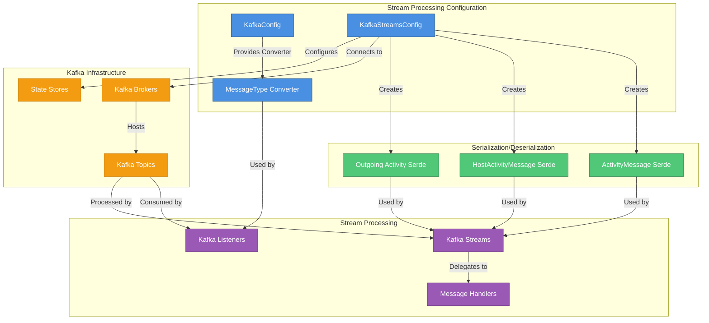

---

## Core Components

### 1. KafkaConfig

**Purpose:** Provides base Kafka configuration and custom converters for message processing.

**Location:** `com.openframe.stream.config.KafkaConfig`

**Key Features:**
- Custom `MessageType` converter for Kafka headers
- Byte array to enum conversion with error handling
- UTF-8 string decoding for message type headers

**Configuration:**

```java
@Configuration
public class KafkaConfig {
    
    @Bean
    public Converter<byte[], MessageType> messageTypeConverter() {
        return new Converter<byte[], MessageType>() {
            @Override
            public MessageType convert(byte[] source) {
                try {
                    String stringValue = new String(source, StandardCharsets.UTF_8);
                    return MessageType.valueOf(stringValue.toUpperCase());
                } catch (IllegalArgumentException e) {
                    return null;
                }
            }
        };
    }
}
```

**Usage Pattern:**

```java
// Kafka listener using MessageType converter
@KafkaListener(topics = "events-topic")
public void handleMessage(
    @Payload String message,
    @Header(MESSAGE_TYPE_HEADER) MessageType messageType
) {
    // messageType is automatically converted from byte[] header
    switch (messageType) {
        case FLEET_MDM_EVENT:
            // Handle Fleet MDM event
            break;
        case TACTICAL_RMM_EVENT:
            // Handle Tactical RMM event
            break;
    }
}
```

---

### 2. KafkaStreamsConfig

**Purpose:** Configures Kafka Streams processing infrastructure with serialization, state management, and multi-tenant support.

**Location:** `com.openframe.stream.config.KafkaStreamsConfig`

**Key Configuration Properties:**

| Property | Description | Default/Example |
|----------|-------------|-----------------|
| `spring.oss-tenant.kafka.bootstrap-servers` | Kafka broker addresses | `localhost:9092` |
| `spring.application.name` | Base application name | `openframe-stream` |
| `openframe.cluster-id` | Tenant/cluster identifier | `tenant-y0-1` |

**Multi-Tenant Application ID Strategy:**

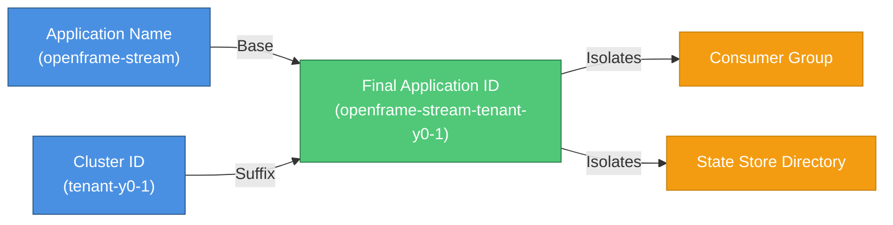

**Serialization Configuration:**

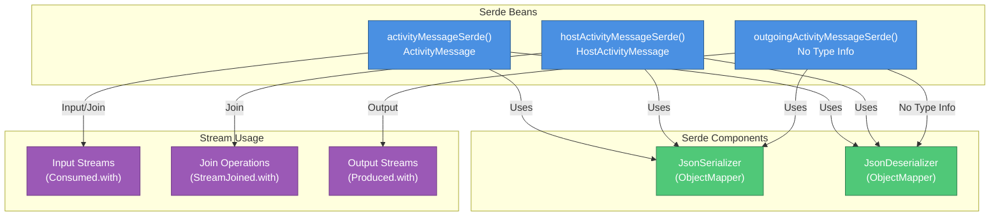

**Serde Bean Definitions:**

```java
// ActivityMessage Serde (with type info for deserialization)
@Bean
public Serde<ActivityMessage> activityMessageSerde() {
    return Serdes.serdeFrom(
        new JsonSerializer<>(objectMapper),
        new JsonDeserializer<>(ActivityMessage.class, objectMapper)
    );
}

// HostActivityMessage Serde (with type info for deserialization)
@Bean
public Serde<HostActivityMessage> hostActivityMessageSerde() {
    return Serdes.serdeFrom(
        new JsonSerializer<>(objectMapper),
        new JsonDeserializer<>(HostActivityMessage.class, objectMapper)
    );
}

// Outgoing ActivityMessage Serde (no type info in JSON)
@Bean
public Serde<ActivityMessage> outgoingActivityMessageSerde() {
    JsonSerde<ActivityMessage> serde = new JsonSerde<>(ActivityMessage.class);
    serde.serializer().setAddTypeInfo(false); // Clean JSON output
    return serde;
}
```

**Kafka Streams Properties:**

```java
@Bean(name = KafkaStreamsDefaultConfiguration.DEFAULT_STREAMS_CONFIG_BEAN_NAME)
public KafkaStreamsConfiguration kStreamsConfig() {
    Map<String, Object> props = new HashMap<>();
    
    // Application identity
    props.put(StreamsConfig.APPLICATION_ID_CONFIG, buildStreamsApplicationId());
    props.put(StreamsConfig.BOOTSTRAP_SERVERS_CONFIG, bootstrapServers);
    
    // Serialization
    props.put(StreamsConfig.DEFAULT_KEY_SERDE_CLASS_CONFIG, 
              Serdes.String().getClass().getName());
    
    // Processing guarantees
    props.put(StreamsConfig.PROCESSING_GUARANTEE_CONFIG, 
              StreamsConfig.AT_LEAST_ONCE);
    props.put(StreamsConfig.NUM_STREAM_THREADS_CONFIG, 1);
    
    // State management
    props.put(StreamsConfig.STATE_DIR_CONFIG, "/tmp/kafka-streams");
    
    // Consumer settings
    props.put(StreamsConfig.consumerPrefix(
        ConsumerConfig.AUTO_OFFSET_RESET_CONFIG), "earliest");
    props.put(StreamsConfig.consumerPrefix(
        ConsumerConfig.MAX_POLL_RECORDS_CONFIG), 100);
    
    // Producer settings
    props.put(StreamsConfig.producerPrefix(
        ProducerConfig.BATCH_SIZE_CONFIG), 16384);
    props.put(StreamsConfig.producerPrefix(
        ProducerConfig.LINGER_MS_CONFIG), 10);
    props.put(StreamsConfig.producerPrefix(
        ProducerConfig.BUFFER_MEMORY_CONFIG), 33554432);
    
    return new KafkaStreamsConfiguration(props);
}
```

---

## Configuration Properties

### Kafka Streams Settings

```yaml
# Kafka Connection
spring:
  oss-tenant:
    kafka:
      bootstrap-servers: ${KAFKA_BOOTSTRAP_SERVERS:localhost:9092}

# Application Identity
spring:
  application:
    name: openframe-stream

# Multi-Tenant Configuration
openframe:
  cluster-id: ${CLUSTER_ID:}  # e.g., tenant-y0-1

# Topic Configuration
openframe:
  oss-tenant:
    kafka:
      topics:
        inbound:
          fleet-mdm-activities:
            name: fleet.mdm.activities
          fleet-mdm-host-activities:
            name: fleet.mdm.host_activities
          fleet-mdm-events:
            name: fleet.mdm.events
```

### Processing Guarantees

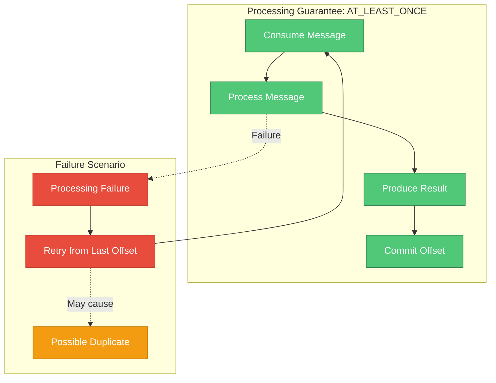

**Why AT_LEAST_ONCE?**
- **Reliability:** Ensures no messages are lost during processing failures
- **Idempotency:** Downstream handlers must be idempotent to handle duplicates
- **Performance:** Better throughput than EXACTLY_ONCE for most use cases
- **State Management:** Simpler state store management

---

## Data Flow

### Message Type Conversion Flow

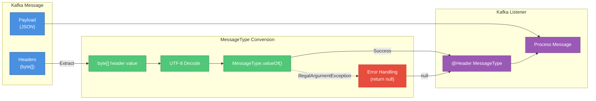

### Kafka Streams Serialization Flow

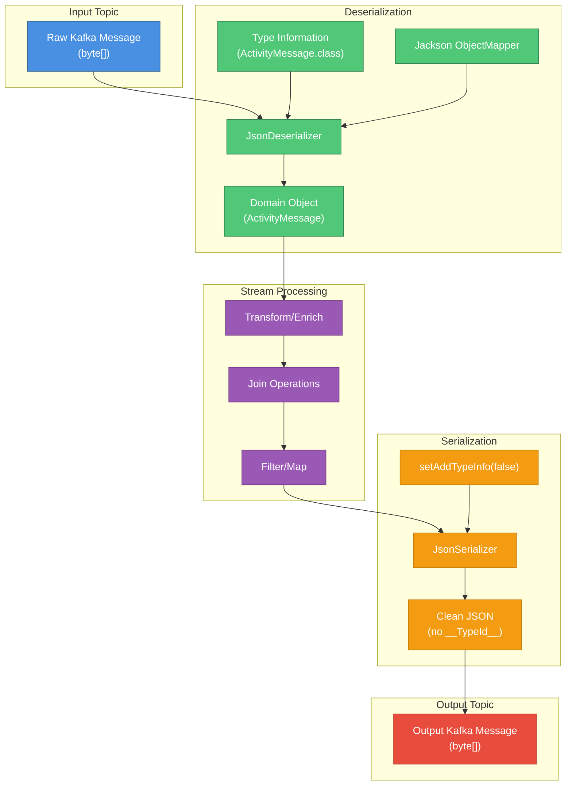

---

## Multi-Tenant Architecture

### Application ID Generation Strategy

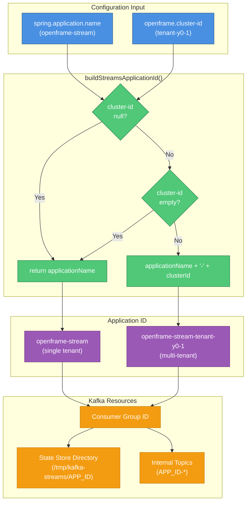

### Tenant Isolation

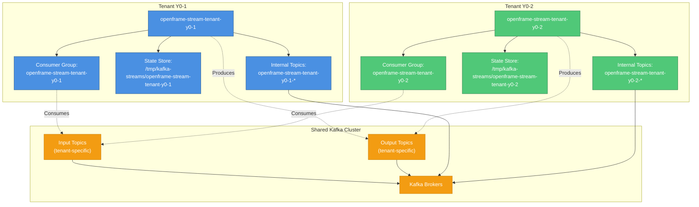

---

## Integration Points

### Dependency on Data Layer Kafka

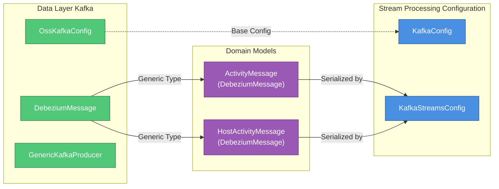

### Usage by Stream Processing Components

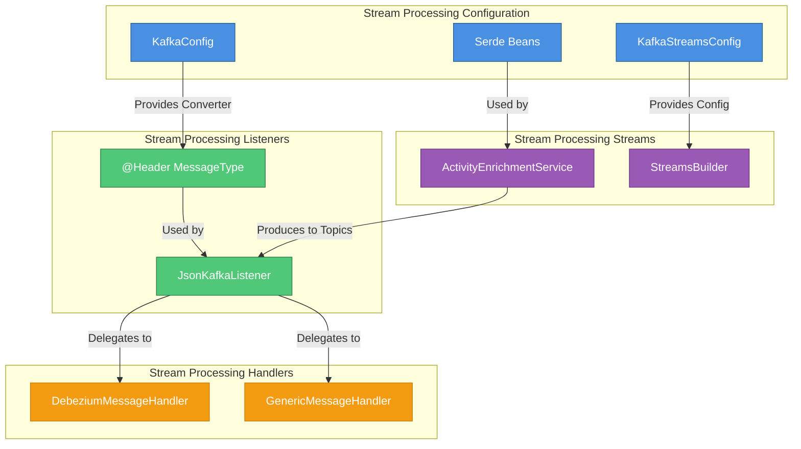

---

## Configuration Examples

### Development Environment

```yaml
# application-dev.yml
spring:
  application:
    name: openframe-stream
  oss-tenant:
    kafka:
      bootstrap-servers: localhost:9092

openframe:
  cluster-id: ""  # Single tenant mode

# Kafka Streams will use application ID: "openframe-stream"
```

### Production Multi-Tenant Environment

```yaml
# application-prod.yml
spring:
  application:
    name: openframe-stream
  oss-tenant:
    kafka:
      bootstrap-servers: kafka-broker-1:9092,kafka-broker-2:9092,kafka-broker-3:9092

openframe:
  cluster-id: ${TENANT_ID}  # e.g., tenant-y0-1

# Kafka Streams will use application ID: "openframe-stream-tenant-y0-1"
```

### Topic Configuration

```yaml
# Topic naming convention
openframe:
  oss-tenant:
    kafka:
      topics:
        inbound:
          # Fleet MDM CDC topics
          fleet-mdm-activities:
            name: ${TENANT_ID:}.fleet.mdm.activities
            partitions: 3
            replication-factor: 3
          
          fleet-mdm-host-activities:
            name: ${TENANT_ID:}.fleet.mdm.host_activities
            partitions: 3
            replication-factor: 3
          
          # Enriched events output
          fleet-mdm-events:
            name: ${TENANT_ID:}.fleet.mdm.events
            partitions: 3
            replication-factor: 3
```

---

## Performance Tuning

### Consumer Configuration

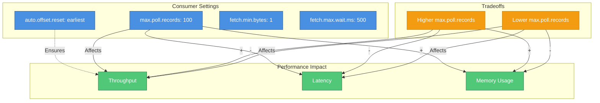

### Producer Configuration

```yaml
# Producer optimization settings
spring:
  kafka:
    producer:
      # Batching for throughput
      batch-size: 16384  # 16 KB batches
      linger-ms: 10      # Wait up to 10ms to fill batch
      
      # Memory allocation
      buffer-memory: 33554432  # 32 MB buffer
      
      # Compression
      compression-type: snappy  # Fast compression
      
      # Reliability
      acks: 1  # Leader acknowledgment (balance reliability/performance)
      retries: 3
      max-in-flight-requests-per-connection: 5
```

### State Store Configuration

```yaml
# State store settings
spring:
  kafka:
    streams:
      # State directory (should be on fast disk)
      state-dir: /var/lib/kafka-streams
      
      # Commit interval
      commit-interval-ms: 1000  # Commit every 1 second
      
      # Cache size
      cache-max-bytes-buffering: 10485760  # 10 MB cache
      
      # Cleanup policy
      state:
        cleanup:
          delay-ms: 600000  # 10 minutes
```

---

## Monitoring and Observability

### Key Metrics to Monitor

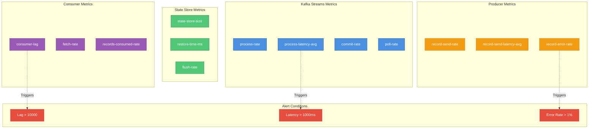

### Logging Configuration

```yaml
# logback-spring.xml
logging:
  level:
    com.openframe.stream.config: INFO
    org.apache.kafka.streams: INFO
    org.apache.kafka.clients: WARN
    
    # Enable for debugging
    # org.apache.kafka.streams.processor: DEBUG
    # org.apache.kafka.streams.state: DEBUG
```

---

## Troubleshooting

### Common Issues

#### 1. Application ID Conflicts

**Symptom:** Multiple stream instances competing for same consumer group

**Diagnosis:**
```bash
# Check consumer groups
kafka-consumer-groups.sh --bootstrap-server localhost:9092 --list

# Check group details
kafka-consumer-groups.sh --bootstrap-server localhost:9092 \
  --group openframe-stream-tenant-y0-1 --describe
```

**Solution:**
- Ensure `openframe.cluster-id` is set correctly for each tenant
- Verify no duplicate deployments with same cluster ID
- Check state store directory for conflicts

#### 2. Serialization Errors

**Symptom:** `SerializationException` or `ClassCastException`

**Diagnosis:**
```text
org.apache.kafka.common.errors.SerializationException: 
  Error deserializing key/value for partition topic-0 at offset 123
```

**Solution:**
```java
// Ensure correct serde is used
KStream<String, ActivityMessage> stream = builder
    .stream(topic, Consumed.with(
        Serdes.String(),           // Key serde
        activityMessageSerde       // Value serde - must match message type
    ));
```

#### 3. State Store Recovery Slow

**Symptom:** Long startup times due to state restoration

**Diagnosis:**
```bash
# Check state store size
du -sh /tmp/kafka-streams/openframe-stream-tenant-y0-1

# Check changelog topic lag
kafka-consumer-groups.sh --bootstrap-server localhost:9092 \
  --group openframe-stream-tenant-y0-1 --describe
```

**Solution:**
- Use faster disk for state directory
- Increase `num.standby.replicas` for faster failover
- Consider compaction for changelog topics
- Reduce state store size through windowing

#### 4. High Consumer Lag

**Symptom:** Processing falling behind message production

**Diagnosis:**
```bash
# Monitor lag
kafka-consumer-groups.sh --bootstrap-server localhost:9092 \
  --group openframe-stream-tenant-y0-1 --describe

# Check processing rate
# Look for process-rate metric in JMX/Prometheus
```

**Solution:**
- Increase `num.stream.threads` (currently 1)
- Increase topic partitions for parallelism
- Optimize processing logic
- Scale horizontally (add more instances)

---

## Best Practices

### 1. Serde Configuration

✅ **DO:**
```java
// Use specific serdes for type safety
@Bean
public Serde<ActivityMessage> activityMessageSerde() {
    return Serdes.serdeFrom(
        new JsonSerializer<>(objectMapper),
        new JsonDeserializer<>(ActivityMessage.class, objectMapper)
    );
}

// Disable type info for clean output
@Bean
public Serde<ActivityMessage> outgoingActivityMessageSerde() {
    JsonSerde<ActivityMessage> serde = new JsonSerde<>(ActivityMessage.class);
    serde.serializer().setAddTypeInfo(false);
    return serde;
}
```

❌ **DON'T:**
```java
// Don't use generic Object serde
Serde<Object> genericSerde = new JsonSerde<>();  // Type unsafe

// Don't mix serdes with different type info settings
stream.to(topic, Produced.with(Serdes.String(), activityMessageSerde));
// If consuming side expects no type info, this will fail
```

### 2. Multi-Tenant Configuration

✅ **DO:**
```yaml
# Use environment variable for cluster ID
openframe:
  cluster-id: ${TENANT_ID:}

# Namespace topics by tenant
topics:
  activities: ${TENANT_ID:}.fleet.mdm.activities
```

❌ **DON'T:**
```yaml
# Don't hardcode tenant IDs
openframe:
  cluster-id: tenant-y0-1  # Hardcoded - bad for multi-tenant

# Don't share topics across tenants
topics:
  activities: fleet.mdm.activities  # No tenant isolation
```

### 3. Error Handling

✅ **DO:**
```java
@Bean
public Converter<byte[], MessageType> messageTypeConverter() {
    return source -> {
        try {
            String stringValue = new String(source, StandardCharsets.UTF_8);
            return MessageType.valueOf(stringValue.toUpperCase());
        } catch (IllegalArgumentException e) {
            log.warn("Invalid message type: {}", new String(source, StandardCharsets.UTF_8));
            return null;  // Graceful degradation
        }
    };
}
```

❌ **DON'T:**
```java
// Don't let exceptions propagate
@Bean
public Converter<byte[], MessageType> messageTypeConverter() {
    return source -> {
        String stringValue = new String(source, StandardCharsets.UTF_8);
        return MessageType.valueOf(stringValue);  // Throws exception on invalid input
    };
}
```

### 4. State Management

✅ **DO:**
```yaml
# Use persistent volume for state stores in production
spring:
  kafka:
    streams:
      state-dir: /var/lib/kafka-streams  # Persistent volume

# Configure cleanup policy
state:
  cleanup:
    delay-ms: 600000  # 10 minutes
```

❌ **DON'T:**
```yaml
# Don't use /tmp in production
spring:
  kafka:
    streams:
      state-dir: /tmp/kafka-streams  # Lost on pod restart
```

---

## Security Considerations

### SSL/TLS Configuration

```yaml
spring:
  kafka:
    ssl:
      enabled: true
      key-store-location: classpath:kafka.keystore.jks
      key-store-password: ${KEYSTORE_PASSWORD}
      trust-store-location: classpath:kafka.truststore.jks
      trust-store-password: ${TRUSTSTORE_PASSWORD}
    
    properties:
      security.protocol: SSL
      ssl.endpoint.identification.algorithm: https
```

### SASL Authentication

```yaml
spring:
  kafka:
    properties:
      security.protocol: SASL_SSL
      sasl.mechanism: PLAIN
      sasl.jaas.config: |
        org.apache.kafka.common.security.plain.PlainLoginModule required
        username="${KAFKA_USERNAME}"
        password="${KAFKA_PASSWORD}";
```

---

## Related Documentation

- **[Stream Processing Listeners](stream_processing_listeners.md)** - Kafka message listeners and consumer configuration
- **[Stream Processing Streams](stream_processing_streams.md)** - Kafka Streams topologies and processing logic
- **[Stream Processing Handlers](stream_processing_handlers.md)** - Message handlers and processing strategies
- **[Data Layer Kafka](data_layer_kafka.md)** - Kafka data layer foundation and models
- **[Stream Processing Application](stream_processing_application.md)** - Main application and service orchestration

---

## Additional Resources

### Kafka Streams Documentation
- [Kafka Streams Developer Guide](https://kafka.apache.org/documentation/streams/)
- [Spring Kafka Documentation](https://docs.spring.io/spring-kafka/reference/html/)
- [Kafka Streams Architecture](https://kafka.apache.org/documentation/streams/architecture)

### OpenFrame Resources
- **Community:** [OpenMSP Slack](https://www.openmsp.ai/)
- **Platform:** [OpenFrame Documentation](https://www.flamingo.run/openframe)
- **Company:** [Flamingo AI](https://flamingo.run)

---

**Last Updated:** 2024  
**Module Version:** 1.0  
**Maintained By:** OpenFrame Engineering Team
