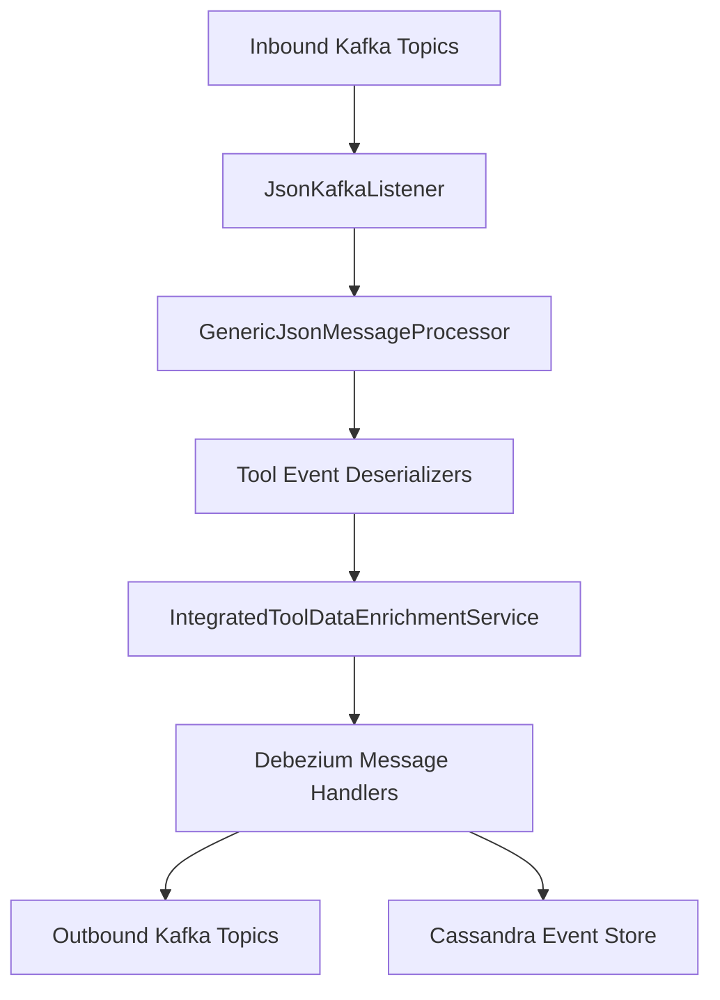
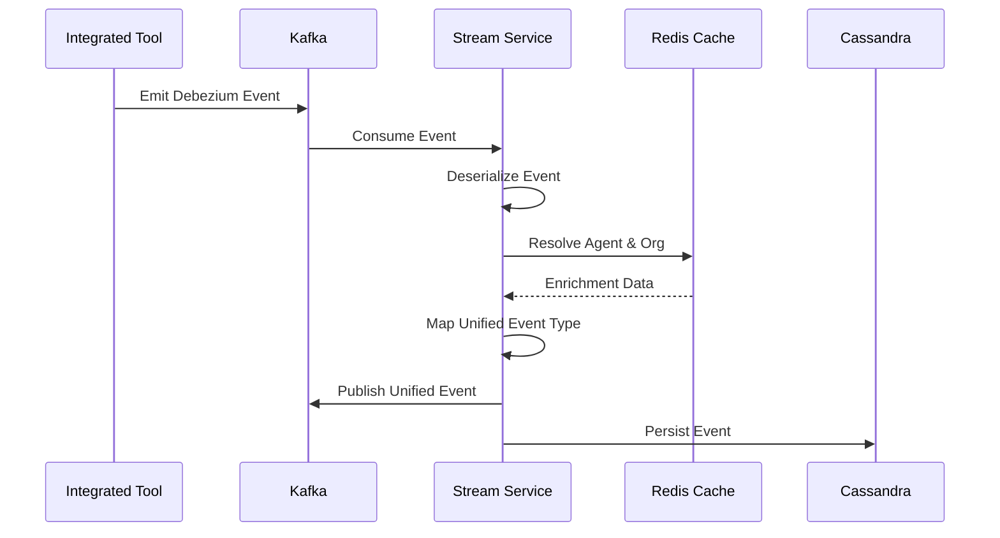

# Stream Processing Core

## Overview
The **stream_processing_core** module is responsible for real-time ingestion, normalization, enrichment, and routing of events produced by integrated tools (Fleet MDM, MeshCentral, Tactical RMM) into unified OpenFrame event streams.

It consumes Debezium CDC events and native tool events from Kafka, converts them into **unified event models**, enriches them with tenant, organization, and device context, and forwards them to downstream destinations such as Kafka topics and Cassandra-backed analytics stores.

This module is deployed as the **OpenFrame Stream Service** and is a foundational part of the OpenFrame event pipeline.

---

## Responsibilities

- Kafka and Kafka Streams configuration
- Listening to inbound tool event topics
- Tool-specific event deserialization
- Mapping source-specific events to unified event types
- Enriching events with machine and organization metadata
- Routing processed events to Kafka and Cassandra

---

## High-Level Architecture

---

## Module Components

### Configuration
- **KafkaConfig** – Registers converters for Kafka headers (for example, `MessageType`).
- **KafkaStreamsConfig** – Configures Kafka Streams runtime, SerDes, application IDs, and processing guarantees.

### Ingestion
- **JsonKafkaListener** – Subscribes to inbound Kafka topics and forwards messages for processing based on message type.

### Deserialization
Tool-specific deserializers convert raw Debezium or JSON payloads into normalized internal representations:

- Fleet MDM
- MeshCentral
- Tactical RMM

These components extract:
- Agent identifiers
- Source event types
- Timestamps
- Messages, results, and errors

### Mapping
- **EventTypeMapper** – Maps `(IntegratedToolType + SourceEventType)` into a `UnifiedEventType`.
- **SourceEventTypes** – Canonical constants for all supported source systems.
- **FleetActivityTypeMapping** – Converts Fleet activity types into human-readable messages.

### Enrichment
- **IntegratedToolDataEnrichmentService** – Resolves agent IDs to machines and organizations using Redis-backed caches.
- **ActivityEnrichmentService** – Kafka Streams join between Fleet activities and host activities to attach host context.

### Handling & Routing
- **DebeziumMessageHandler** – Base abstraction for CDC-based message processing.
- **DebeziumKafkaMessageHandler** – Publishes unified events to Kafka.
- **DebeziumCassandraMessageHandler** – Persists unified events into Cassandra.

---

## Data Flow Overview

---

## Related Modules

This module collaborates closely with:

- **kafka_shared_config_and_models** – Shared Kafka configuration and Debezium models
- **data_redis_cache_layer** – Device and organization enrichment
- **data_mongo_layer** – Source systems for CDC
- **management_service_core** – Initializes Kafka streams and Debezium connectors

Refer to their respective documentation for details.

---

## Extensibility Guidelines

To add a new integrated tool:

1. Define source event constants in `SourceEventTypes`
2. Implement a custom event deserializer
3. Register mappings in `EventTypeMapper`
4. (Optional) Add enrichment logic
5. Route to Kafka or Cassandra using a handler

---

## Operational Notes

- Kafka Streams state is stored under `/tmp/kafka-streams`
- Processing guarantee: **at-least-once**
- Enrichment failures do not block event forwarding
- Unsupported event types default to `UnifiedEventType.UNKNOWN`

---

## Summary

The **stream_processing_core** module provides a scalable, extensible, and unified streaming backbone for OpenFrame. It transforms heterogeneous tool events into a consistent event model, enabling real-time monitoring, analytics, and automation across the MSP stack.
