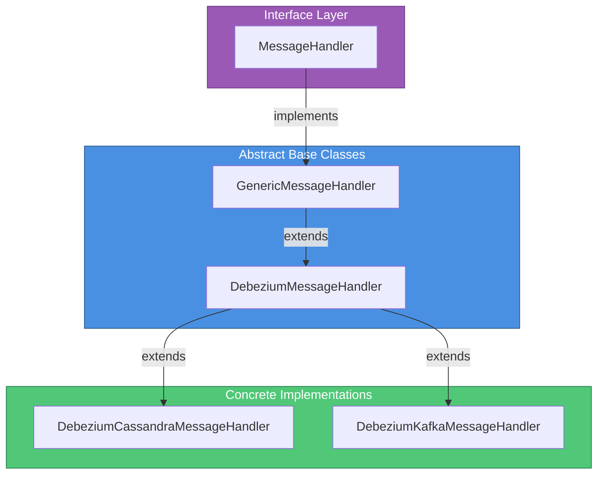
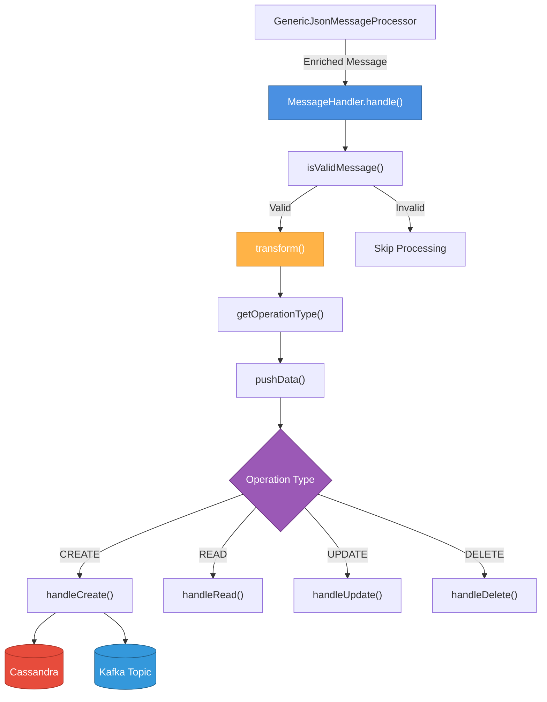
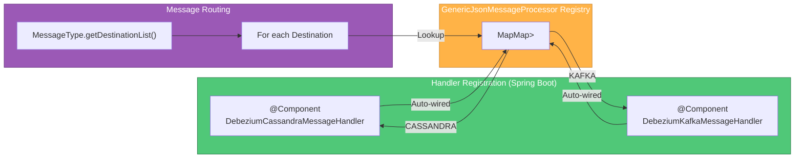
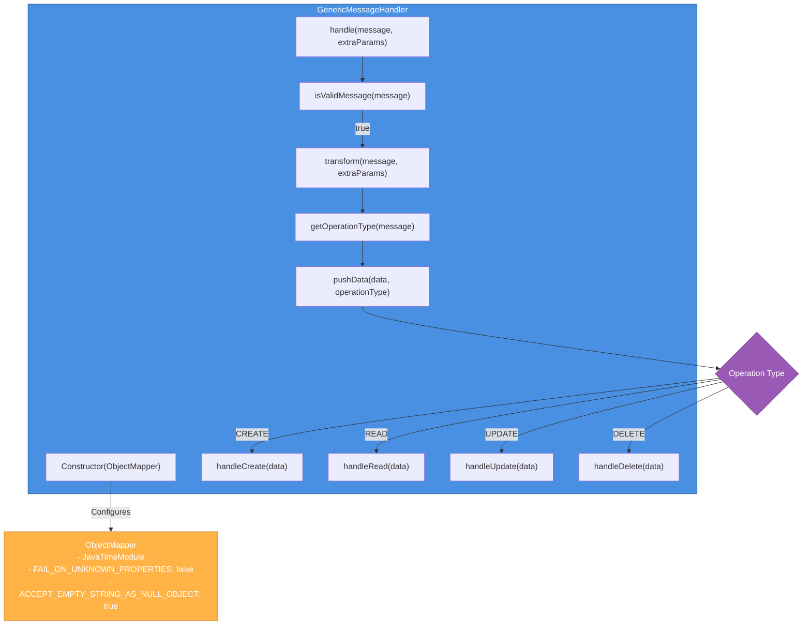
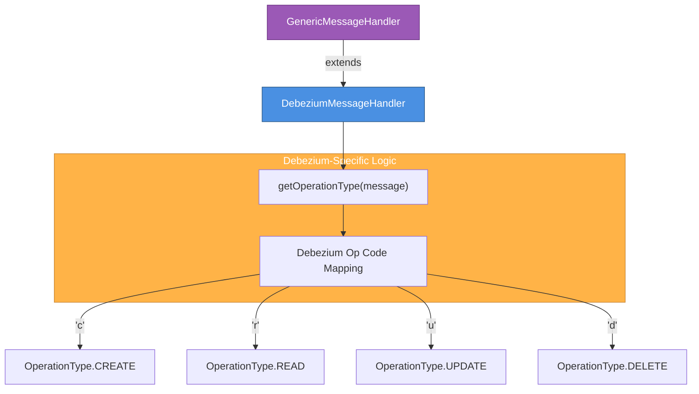
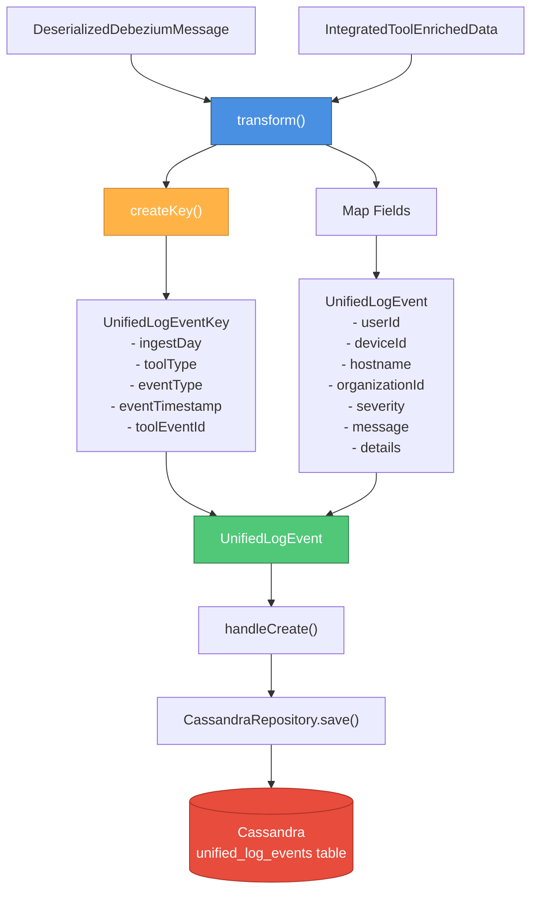
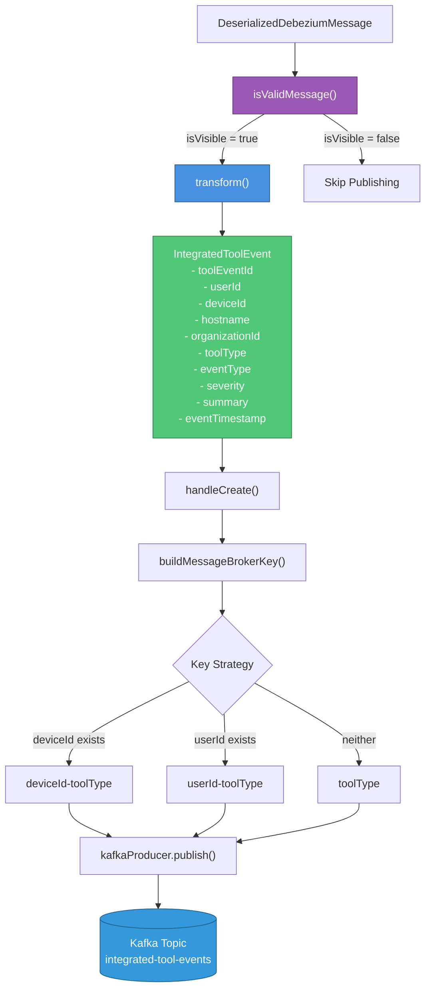
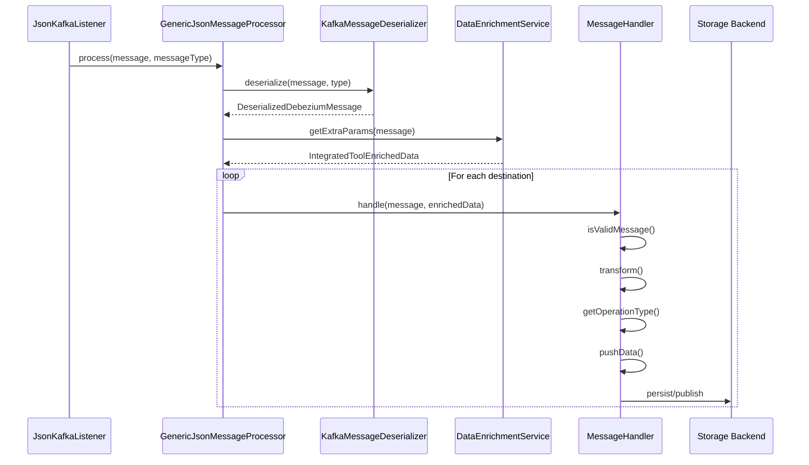

# Stream Processing - Message Handlers Module

## Overview

The **Message Handlers Module** provides the extensible handler framework for processing Change Data Capture (CDC) events from integrated MSP tools (Fleet MDM, Tactical RMM, MeshCentral) in OpenFrame's stream processing pipeline. This module implements a **Template Method pattern** with specialized handlers for different storage destinations (Cassandra, Kafka, MongoDB, Pinot), enabling consistent message transformation and persistence across heterogeneous data stores.

This module serves as the **final stage** in the stream processing pipeline, receiving deserialized and enriched Debezium messages and transforming them into domain-specific models before persisting to target destinations. The handler architecture provides a clean separation between generic message processing logic and destination-specific persistence strategies.

**Key Responsibilities:**
- **Message Transformation**: Converts Debezium CDC messages into domain-specific models (UnifiedLogEvent, IntegratedToolEvent)
- **Operation Type Detection**: Interprets Debezium operation codes (c/r/u/d) into CRUD operations
- **Multi-Destination Routing**: Supports parallel writes to multiple storage backends (Cassandra for logs, Kafka for event streaming)
- **Enrichment Integration**: Incorporates organizational and device metadata from enrichment services
- **Extensibility**: Provides abstract base classes for implementing custom handlers for new integrated tools

---

## Architecture

### Handler Hierarchy



### Message Processing Flow



### Handler Registration and Routing



---

## Core Components

### MessageHandler Interface

**Location**: `deps-openframe-oss-lib/openframe-stream-service-core/src/main/java/com/openframe/stream/handler/MessageHandler.java`

The root interface defining the contract for all message handlers in the stream processing pipeline.

#### Interface Definition

```java
public interface MessageHandler<U extends DeserializedDebeziumMessage, V extends IntegratedToolEnrichedData> {
    
    EventHandlerType getType();
    
    Destination getDestination();
    
    void handle(U message, V extraParams);
}
```

#### Type Parameters

| Parameter | Constraint | Description |
|-----------|------------|-------------|
| `U` | `extends DeserializedDebeziumMessage` | The deserialized message type containing CDC event data |
| `V` | `extends IntegratedToolEnrichedData` | Enrichment data containing organizational/device metadata |

#### Methods

| Method | Return Type | Description |
|--------|-------------|-------------|
| `getType()` | `EventHandlerType` | Returns the handler type for registry lookup (e.g., `COMMON_TYPE`, `FLEET_TYPE`) |
| `getDestination()` | `Destination` | Returns the target destination (e.g., `CASSANDRA`, `KAFKA`, `MONGO`, `PINOT`) |
| `handle(message, extraParams)` | `void` | Main processing method that transforms and persists the message |

#### Handler Registration Strategy

Handlers are registered in `GenericJsonMessageProcessor` using a **nested map structure**:

```java
Map<EventHandlerType, Map<Destination, MessageHandler>> handlers;
```

**Registration Flow:**
1. Spring Boot auto-wires all `MessageHandler` beans
2. Handlers are grouped by `EventHandlerType` (outer map key)
3. Within each type, handlers are indexed by `Destination` (inner map key)
4. Message routing uses `MessageType.getDestinationList()` to determine which handlers to invoke

---

### GenericMessageHandler (Abstract Base Class)

**Location**: `deps-openframe-oss-lib/openframe-stream-service-core/src/main/java/com/openframe/stream/handler/GenericMessageHandler.java`

The foundational abstract class implementing the **Template Method pattern** for message processing. Provides the core processing workflow while allowing subclasses to customize transformation and persistence logic.

#### Class Structure



#### Type Parameters

| Parameter | Constraint | Description |
|-----------|------------|-------------|
| `T` | None | The transformed domain model type (e.g., `UnifiedLogEvent`, `IntegratedToolEvent`) |
| `U` | `extends DeserializedDebeziumMessage` | The input message type from Kafka |
| `V` | `extends IntegratedToolEnrichedData` | The enrichment data type |

#### Template Method Implementation

```java
@Override
public void handle(U message, V extraParams) {
    if (isValidMessage(message)) {
        T transformedData = transform(message, extraParams);
        OperationType operationType = getOperationType(message);
        if (operationType != null) {
            pushData(transformedData, operationType);
        }
    }
}
```

**Processing Steps:**
1. **Validation**: Check if message should be processed (default: always true)
2. **Transformation**: Convert Debezium message to domain model
3. **Operation Detection**: Determine CRUD operation type
4. **Routing**: Dispatch to appropriate CRUD handler

#### ObjectMapper Configuration

The constructor configures Jackson `ObjectMapper` for robust deserialization:

```java
protected GenericMessageHandler(ObjectMapper mapper) {
    mapper.registerModule(new JavaTimeModule());  // Java 8 date/time support
    mapper.configure(DeserializationFeature.FAIL_ON_UNKNOWN_PROPERTIES, false);  // Ignore unknown fields
    mapper.configure(DeserializationFeature.ACCEPT_EMPTY_STRING_AS_NULL_OBJECT, true);  // Handle empty strings
    this.mapper = mapper;
}
```

#### Abstract Methods (Subclass Responsibilities)

| Method | Return Type | Description |
|--------|-------------|-------------|
| `transform(message, extraParams)` | `T` | Convert Debezium message to domain model |
| `getOperationType(message)` | `OperationType` | Extract operation type from message |
| `handleCreate(data)` | `void` | Persist new entity |
| `handleRead(data)` | `void` | Handle read/snapshot operation |
| `handleUpdate(data)` | `void` | Update existing entity |
| `handleDelete(data)` | `void` | Delete entity |

#### Extensibility Hooks

| Method | Default Behavior | Override Purpose |
|--------|------------------|------------------|
| `isValidMessage(message)` | Always returns `true` | Filter messages before processing (e.g., visibility checks) |
| `pushData(data, operationType)` | Routes to CRUD handlers | Customize routing logic or add pre-persistence hooks |

---

### DebeziumMessageHandler (Abstract Specialization)

**Location**: `deps-openframe-oss-lib/openframe-stream-service-core/src/main/java/com/openframe/stream/handler/DebeziumMessageHandler.java`

Specialized abstract handler for processing **Debezium Change Data Capture (CDC)** messages. Provides Debezium-specific operation type detection while maintaining the generic handler workflow.

#### Class Structure



#### Type Parameters

| Parameter | Constraint | Description |
|-----------|------------|-------------|
| `T` | None | The transformed domain model type |
| `U` | `extends DeserializedDebeziumMessage` | The Debezium message type |

**Note**: The enrichment type `V` is fixed to `IntegratedToolEnrichedData` for all Debezium handlers.

#### Debezium Operation Code Mapping

```java
protected OperationType getOperationType(DeserializedDebeziumMessage message) {
    if (message != null && message.getPayload().getOperation() != null) {
        try {
            String operation = message.getPayload().getOperation();
            
            return switch (operation) {
                case "c" -> OperationType.CREATE;   // Insert
                case "r" -> OperationType.READ;     // Snapshot read
                case "u" -> OperationType.UPDATE;   // Update
                case "d" -> OperationType.DELETE;   // Delete
                default -> null;
            };
        } catch (Exception e) {
            log.error("Failed to process tag message", e);
        }
    }
    return null;
}
```

#### Debezium CDC Operation Types

| Debezium Code | OperationType | Description | Typical Use Case |
|---------------|---------------|-------------|------------------|
| `c` | `CREATE` | New row inserted | New device registered, new event created |
| `r` | `READ` | Snapshot read during initial sync | Database snapshot on connector startup |
| `u` | `UPDATE` | Existing row updated | Device status changed, event metadata updated |
| `d` | `DELETE` | Row deleted | Device decommissioned, event archived |

#### Error Handling

- **Null Safety**: Returns `null` if message or operation is null
- **Exception Handling**: Logs errors and returns `null` (prevents pipeline failure)
- **Unknown Operations**: Returns `null` for unrecognized operation codes

---

## Concrete Handler Implementations

### DebeziumCassandraMessageHandler

**Location**: `deps-openframe-oss-lib/openframe-stream-service-core/src/main/java/com/openframe/stream/handler/DebeziumCassandraMessageHandler.java`

Handles persistence of **unified log events** to Cassandra for long-term storage and time-series querying. Transforms Debezium CDC messages into `UnifiedLogEvent` models optimized for Cassandra's wide-column storage.

#### Component Architecture



#### Configuration

```java
@Component
public class DebeziumCassandraMessageHandler extends DebeziumMessageHandler<UnifiedLogEvent, DeserializedDebeziumMessage> {
    
    private final CassandraRepository repository;
    
    @Override
    public EventHandlerType getType() {
        return EventHandlerType.COMMON_TYPE;
    }
    
    @Override
    public Destination getDestination() {
        return Destination.CASSANDRA;
    }
}
```

#### Transformation Logic

**Composite Key Creation:**

```java
protected UnifiedLogEvent.UnifiedLogEventKey createKey(DeserializedDebeziumMessage message) {
    UnifiedLogEvent.UnifiedLogEventKey key = new UnifiedLogEvent.UnifiedLogEventKey();
    Instant timestamp = Instant.ofEpochMilli(message.getEventTimestamp());
    
    key.setIngestDay(message.getIngestDay());              // Partition key (YYYYMMDD)
    key.setToolType(message.getIntegratedToolType().name()); // Clustering key
    key.setEventType(message.getUnifiedEventType().name());  // Clustering key
    key.setEventTimestamp(timestamp);                        // Clustering key
    key.setToolEventId(message.getToolEventId());            // Unique identifier
    
    return key;
}
```

**Field Mapping:**

| Source | Target Field | Description |
|--------|--------------|-------------|
| `enrichedData.getUserId()` | `userId` | User associated with event |
| `enrichedData.getMachineId()` | `deviceId` | Device/machine identifier |
| `enrichedData.getHostname()` | `hostname` | Device hostname |
| `enrichedData.getOrganizationId()` | `organizationId` | Tenant organization ID |
| `enrichedData.getOrganizationName()` | `organizationName` | Tenant organization name |
| `message.getUnifiedEventType().getSeverity()` | `severity` | Event severity (INFO, WARNING, ERROR) |
| `message.getDebeziumMessage()` | `debeziumMessage` | Raw Debezium JSON payload |
| `message.getMessage()` or `getUnifiedEventType().getSummary()` | `message` | Human-readable message |
| `message.getDetails()` | `details` | Additional event details |

#### CRUD Operation Handling

```java
protected void handleCreate(UnifiedLogEvent data) {
    repository.save(data);
}

protected void handleRead(UnifiedLogEvent message) {
    handleCreate(message);  // Treat snapshots as inserts
}

protected void handleUpdate(UnifiedLogEvent message) {
    handleCreate(message);  // Cassandra upserts by default
}

protected void handleDelete(UnifiedLogEvent data) {
    // No-op: Cassandra uses TTL for data expiration
}
```

**Design Rationale:**
- **Upsert Semantics**: Cassandra's primary key uniqueness ensures idempotent writes
- **No Deletes**: Log events are immutable; TTL handles expiration
- **Snapshot Handling**: Initial database snapshots (`READ` operations) are treated as new events

#### Cassandra Schema Optimization

**Partition Key**: `ingestDay` (YYYYMMDD format)
- Distributes data across nodes by day
- Enables efficient time-range queries
- Prevents hot partitions

**Clustering Keys**: `toolType`, `eventType`, `eventTimestamp`, `toolEventId`
- Sorts events within partition
- Enables efficient filtering by tool and event type
- Timestamp ordering for chronological queries

---

### DebeziumKafkaMessageHandler

**Location**: `deps-openframe-oss-lib/openframe-stream-service-core/src/main/java/com/openframe/stream/handler/DebeziumKafkaMessageHandler.java`

Publishes **integrated tool events** to Kafka topics for real-time event streaming and downstream consumption by analytics services, notification systems, and the frontend WebSocket gateway.

#### Component Architecture



#### Configuration

```java
@Component
public class DebeziumKafkaMessageHandler extends DebeziumMessageHandler<IntegratedToolEvent, DeserializedDebeziumMessage> {
    
    @Value("${openframe.oss-tenant.kafka.topics.outbound.integrated-tool-events}")
    private String topic;
    
    protected final OssTenantRetryingKafkaProducer kafkaProducer;
    
    @Override
    public EventHandlerType getType() {
        return EventHandlerType.COMMON_TYPE;
    }
    
    @Override
    public Destination getDestination() {
        return Destination.KAFKA;
    }
}
```

#### Visibility Filtering

```java
@Override
protected boolean isValidMessage(DeserializedDebeziumMessage message) {
    return message.getIsVisible();
}
```

**Purpose**: Prevents internal/system events from being published to Kafka topics consumed by frontend applications.

#### Transformation Logic

```java
protected IntegratedToolEvent transform(DeserializedDebeziumMessage message, IntegratedToolEnrichedData enrichedData) {
    IntegratedToolEvent event = new IntegratedToolEvent();
    
    event.setToolEventId(message.getToolEventId());
    event.setUserId(enrichedData.getUserId());
    event.setDeviceId(enrichedData.getMachineId());
    event.setHostname(enrichedData.getHostname());
    event.setOrganizationId(enrichedData.getOrganizationId());
    event.setOrganizationName(enrichedData.getOrganizationName());
    event.setIngestDay(message.getIngestDay());
    event.setToolType(message.getIntegratedToolType().name());
    event.setEventType(message.getUnifiedEventType().name());
    event.setSeverity(message.getUnifiedEventType().getSeverity().name());
    event.setSummary(message.getMessage() == null || message.getMessage().isBlank()
            ? message.getUnifiedEventType().getSummary()
            : message.getMessage());
    event.setEventTimestamp(message.getEventTimestamp());
    
    return event;
}
```

**Field Mapping:**

| Source | Target Field | Description |
|--------|--------------|-------------|
| `message.getToolEventId()` | `toolEventId` | Unique event identifier from source tool |
| `enrichedData.getUserId()` | `userId` | User associated with event |
| `enrichedData.getMachineId()` | `deviceId` | Device identifier |
| `enrichedData.getHostname()` | `hostname` | Device hostname |
| `enrichedData.getOrganizationId()` | `organizationId` | Tenant organization ID |
| `message.getIntegratedToolType()` | `toolType` | Source tool (FLEET_MDM, TACTICAL_RMM, MESHCENTRAL) |
| `message.getUnifiedEventType()` | `eventType` | Normalized event type |
| `message.getUnifiedEventType().getSeverity()` | `severity` | Event severity level |
| `message.getMessage()` or `getUnifiedEventType().getSummary()` | `summary` | Event summary (fallback to default) |
| `message.getEventTimestamp()` | `eventTimestamp` | Event occurrence timestamp |

#### Kafka Partitioning Strategy

```java
private String buildMessageBrokerKey(IntegratedToolEvent message) {
    if (message.getDeviceId() != null) {
        return "%s-%s".formatted(message.getDeviceId(), message.getToolType());
    } else if (message.getUserId() != null) {
        return "%s-%s".formatted(message.getUserId(), message.getToolType());
    } else {
        return message.getToolType();
    }
}
```

**Partitioning Logic:**

| Condition | Key Format | Purpose |
|-----------|------------|---------|
| Device event | `{deviceId}-{toolType}` | Ensures all events for a device go to same partition (ordering guarantee) |
| User event | `{userId}-{toolType}` | Groups user-specific events together |
| System event | `{toolType}` | Distributes system events by tool type |

**Benefits:**
- **Ordering Guarantee**: Events for the same device/user are processed in order
- **Load Distribution**: Different devices/users distribute across partitions
- **Consumer Affinity**: Consumers can maintain state per device/user

#### CRUD Operation Handling

```java
protected void handleCreate(IntegratedToolEvent message) {
    kafkaProducer.publish(topic, buildMessageBrokerKey(message), message);
}

protected void handleRead(IntegratedToolEvent message) {
    handleCreate(message);  // Publish snapshots as events
}

protected void handleUpdate(IntegratedToolEvent message) {
    handleCreate(message);  // Publish updates as new events
}

protected void handleDelete(IntegratedToolEvent data) {
    // No-op: Deletes not published to event stream
}
```

**Design Rationale:**
- **Event Sourcing**: All state changes (CREATE, READ, UPDATE) are published as events
- **No Delete Events**: Deletion events are not published to avoid consumer confusion
- **Idempotency**: Consumers must handle duplicate events (Kafka at-least-once delivery)

---

## Data Models

### DeserializedDebeziumMessage

**Location**: `deps-openframe-oss-lib/openframe-stream-service-core/src/main/java/com/openframe/stream/model/fleet/debezium/DeserializedDebeziumMessage.java`

The input message type containing deserialized Debezium CDC data with OpenFrame-specific enrichments.

#### Structure

```java
@Data
@SuperBuilder
@NoArgsConstructor
public class DeserializedDebeziumMessage extends CommonDebeziumMessage {
    
    private UnifiedEventType unifiedEventType;      // Normalized event type
    private String ingestDay;                       // Partition key (YYYYMMDD)
    private String toolEventId;                     // Source tool event ID
    private String agentId;                         // Agent identifier
    private String sourceEventType;                 // Original event type from tool
    private String message;                         // Human-readable message
    private IntegratedToolType integratedToolType;  // Source tool type
    private String debeziumMessage;                 // Raw Debezium JSON
    private String details;                         // Additional event details
    private Long eventTimestamp;                    // Event occurrence timestamp
    private Boolean skipProcessing;                 // Skip flag for invalid events
    private Boolean isVisible;                      // Visibility flag for frontend
}
```

#### Key Fields

| Field | Type | Description |
|-------|------|-------------|
| `unifiedEventType` | `UnifiedEventType` | OpenFrame's normalized event taxonomy (e.g., `DEVICE_ONLINE`, `SCRIPT_EXECUTED`) |
| `integratedToolType` | `IntegratedToolType` | Source tool identifier (`FLEET_MDM`, `TACTICAL_RMM`, `MESHCENTRAL`) |
| `toolEventId` | `String` | Unique identifier from source tool (e.g., Fleet host ID, Tactical agent ID) |
| `ingestDay` | `String` | Date partition key in YYYYMMDD format for time-series storage |
| `eventTimestamp` | `Long` | Unix epoch milliseconds of event occurrence |
| `isVisible` | `Boolean` | Controls whether event is published to Kafka (frontend visibility) |
| `skipProcessing` | `Boolean` | Flag to skip processing (e.g., invalid/malformed events) |
| `debeziumMessage` | `String` | Raw Debezium JSON payload for debugging/auditing |

---

### IntegratedToolEnrichedData

**Location**: `deps-openframe-oss-lib/openframe-stream-service-core/src/main/java/com/openframe/stream/model/fleet/debezium/IntegratedToolEnrichedData.java`

Enrichment data added by `DataEnrichmentService` containing organizational and device metadata.

#### Structure

```java
@Data
public class IntegratedToolEnrichedData {
    
    private String machineId;         // OpenFrame device ID
    private String hostname;          // Device hostname
    private String organizationId;    // Tenant organization ID
    private String organizationName;  // Tenant organization name
    private String userId;            // Associated user ID
}
```

#### Enrichment Sources

| Field | Source | Description |
|-------|--------|-------------|
| `machineId` | MongoDB `devices` collection | OpenFrame's internal device identifier |
| `hostname` | Integrated tool API | Device hostname from Fleet/Tactical/MeshCentral |
| `organizationId` | MongoDB `organizations` collection | Tenant organization identifier |
| `organizationName` | MongoDB `organizations` collection | Tenant organization display name |
| `userId` | MongoDB `users` collection | User associated with device/event |

**Enrichment Process**: See [Stream Processing - Streams Module](stream_processing_streams.md) for `ActivityEnrichmentService` implementation.

---

### OperationType Enumeration

**Location**: `deps-openframe-oss-lib/openframe-stream-service-core/src/main/java/com/openframe/stream/enumeration/OperationType.java`

Represents CRUD operations derived from Debezium CDC events.

```java
public enum OperationType {
    READ,      // Snapshot read during initial sync
    CREATE,    // New row inserted
    UPDATE,    // Existing row updated
    DELETE;    // Row deleted
}
```

#### Debezium Mapping

| Debezium Op | OperationType | Typical Scenario |
|-------------|---------------|------------------|
| `c` | `CREATE` | New device registered in Fleet MDM |
| `r` | `READ` | Initial database snapshot on connector startup |
| `u` | `UPDATE` | Device status changed in Tactical RMM |
| `d` | `DELETE` | Device removed from MeshCentral |

---

## Integration with Stream Processing Pipeline

### Pipeline Context

```mermaid
flowchart LR
    subgraph KafkaSource["Kafka Source"]
        Topics["Kafka Topics<br/>- fleet-mdm-events<br/>- tactical-rmm-events<br/>- meshcentral-events"]
    end
    
    subgraph Listener["Listener Layer"]
        JsonKafkaListener["JsonKafkaListener"]
    end
    
    subgraph Processor["Processing Layer"]
        GenericJsonMessageProcessor["GenericJsonMessageProcessor"]
        Deserializers["Deserializers"]
        Enrichment["Enrichment Services"]
    end
    
    subgraph Handlers["Handler Layer (This Module)"]
        MessageHandlers["MessageHandler Implementations"]
        CassandraHandler["DebeziumCassandraMessageHandler"]
        KafkaHandler["DebeziumKafkaMessageHandler"]
    end
    
    subgraph Destinations["Storage Destinations"]
        Cassandra[("Cassandra")]
        KafkaOut[("Kafka Topics")]
    end
    
    Topics --> JsonKafkaListener
    JsonKafkaListener --> GenericJsonMessageProcessor
    GenericJsonMessageProcessor --> Deserializers
    Deserializers --> Enrichment
    Enrichment --> MessageHandlers
    MessageHandlers --> CassandraHandler
    MessageHandlers --> KafkaHandler
    CassandraHandler --> Cassandra
    KafkaHandler --> KafkaOut
    
    style Handlers fill:#4A90E2,stroke:#2E5C8A,color:#fff
    style Processor fill:#FFB347,stroke:#CC8A38,color:#fff
    style Destinations fill:#50C878,stroke:#2E7D4E,color:#fff
```



### Module Dependencies

| Module | Relationship | Description |
|--------|--------------|-------------|
| [Stream Processing - Listeners](stream_processing_listeners.md) | **Upstream** | `JsonKafkaListener` receives Kafka messages and passes to processor |
| [Stream Processing - Message Processing](stream_processing_message_processing.md) | **Upstream** | `GenericJsonMessageProcessor` orchestrates deserialization, enrichment, and handler routing |
| [Stream Processing - Streams](stream_processing_streams.md) | **Upstream** | `ActivityEnrichmentService` provides organizational/device metadata |
| [Data Layer - Kafka](data_layer_kafka.md) | **Dependency** | `OssTenantRetryingKafkaProducer` for publishing events |
| [Data Layer - Core](data_layer_core.md) | **Dependency** | Cassandra repositories for log persistence |

### Handler Invocation Flow



---

## Extension Guide

### Creating a Custom Handler

To add a new handler for a different storage backend (e.g., MongoDB, Pinot):

#### Step 1: Define Domain Model

```java
@Data
public class CustomDomainModel {
    private String id;
    private String organizationId;
    private String eventType;
    private Instant timestamp;
    // ... additional fields
}
```

#### Step 2: Implement Handler

```java
@Component
public class DebeziumCustomHandler extends DebeziumMessageHandler<CustomDomainModel, DeserializedDebeziumMessage> {
    
    private final CustomRepository repository;
    
    public DebeziumCustomHandler(CustomRepository repository, ObjectMapper objectMapper) {
        super(objectMapper);
        this.repository = repository;
    }
    
    @Override
    public EventHandlerType getType() {
        return EventHandlerType.COMMON_TYPE;  // Or custom type
    }
    
    @Override
    public Destination getDestination() {
        return Destination.CUSTOM;  // Add to Destination enum
    }
    
    @Override
    protected CustomDomainModel transform(DeserializedDebeziumMessage message, IntegratedToolEnrichedData enrichedData) {
        CustomDomainModel model = new CustomDomainModel();
        model.setId(message.getToolEventId());
        model.setOrganizationId(enrichedData.getOrganizationId());
        model.setEventType(message.getUnifiedEventType().name());
        model.setTimestamp(Instant.ofEpochMilli(message.getEventTimestamp()));
        // ... map additional fields
        return model;
    }
    
    @Override
    protected void handleCreate(CustomDomainModel data) {
        repository.save(data);
    }
    
    @Override
    protected void handleRead(CustomDomainModel data) {
        handleCreate(data);
    }
    
    @Override
    protected void handleUpdate(CustomDomainModel data) {
        repository.update(data);
    }
    
    @Override
    protected void handleDelete(CustomDomainModel data) {
        repository.delete(data.getId());
    }
}
```

#### Step 3: Register Destination

Add to `Destination` enum in `openframe-data`:

```java
public enum Destination {
    CASSANDRA,
    KAFKA,
    MONGO,
    PINOT,
    CUSTOM;  // New destination
}
```

#### Step 4: Configure Message Type

Update `MessageType` to include new destination:

```java
FLEET_HOST_ACTIVITY(
    EventHandlerType.COMMON_TYPE,
    DataEnrichmentServiceType.FLEET_ENRICHMENT,
    List.of(Destination.CASSANDRA, Destination.KAFKA, Destination.CUSTOM)  // Add CUSTOM
)
```

#### Step 5: Auto-Registration

Spring Boot automatically registers the handler via `@Component` annotation. The `GenericJsonMessageProcessor` constructor will wire it into the handler registry.

---

### Creating a Tool-Specific Handler

For handlers specific to a particular integrated tool (e.g., Fleet MDM query results):

```java
@Component
public class FleetQueryResultHandler extends DebeziumMessageHandler<FleetQueryResult, FleetQueryResultMessage> {
    
    @Override
    public EventHandlerType getType() {
        return EventHandlerType.FLEET_QUERY_TYPE;  // Tool-specific type
    }
    
    @Override
    public Destination getDestination() {
        return Destination.MONGO;
    }
    
    @Override
    protected FleetQueryResult transform(FleetQueryResultMessage message, IntegratedToolEnrichedData enrichedData) {
        // Tool-specific transformation logic
    }
    
    // ... implement CRUD methods
}
```

**Key Differences:**
- Custom `EventHandlerType` for tool-specific routing
- Custom message type extending `DeserializedDebeziumMessage`
- Tool-specific transformation logic

---

## Configuration

### Application Properties

```yaml
# Kafka topic for outbound events
openframe:
  oss-tenant:
    kafka:
      topics:
        outbound:
          integrated-tool-events: "integrated-tool-events"
```

### Handler Registration

Handlers are auto-registered via Spring Boot component scanning:

```java
@ComponentScan(basePackages = "com.openframe.stream.handler")
public class StreamConfiguration {
    // Handlers automatically discovered and wired
}
```

### Cassandra Repository Configuration

See [Data Layer - Core](data_layer_core.md) for Cassandra repository configuration.

### Kafka Producer Configuration

See [Data Layer - Kafka](data_layer_kafka.md) for `OssTenantRetryingKafkaProducer` configuration.

---

## Error Handling

### Validation Errors

```java
@Override
protected boolean isValidMessage(DeserializedDebeziumMessage message) {
    if (message.getIsVisible() == null || !message.getIsVisible()) {
        log.debug("Skipping non-visible message: {}", message.getToolEventId());
        return false;
    }
    return true;
}
```

**Strategy**: Invalid messages are filtered early in the pipeline to prevent unnecessary processing.

### Transformation Errors

```java
protected UnifiedLogEvent transform(DeserializedDebeziumMessage message, IntegratedToolEnrichedData enrichedData) {
    try {
        // Transformation logic
    } catch (Exception e) {
        log.error("Error processing Kafka message", e);
        throw e;  // Propagate to trigger Kafka retry
    }
}
```

**Strategy**: Transformation errors are logged and re-thrown to trigger Kafka consumer retry logic.

### Persistence Errors

Persistence errors are handled by the underlying storage clients:
- **Cassandra**: Retries with exponential backoff (configured in `CassandraConfig`)
- **Kafka**: Retries via `OssTenantRetryingKafkaProducer` with dead-letter queue

### Operation Type Errors

```java
protected OperationType getOperationType(DeserializedDebeziumMessage message) {
    try {
        // Operation detection logic
    } catch (Exception e) {
        log.error("Failed to process tag message", e);
        return null;  // Null operation type skips processing
    }
}
```

**Strategy**: Operation detection errors return `null`, which causes the message to be skipped (prevents pipeline failure).

---

## Performance Considerations

### Batch Processing

Handlers process messages individually. For high-throughput scenarios, consider:

```java
@Component
public class BatchingCassandraHandler extends DebeziumMessageHandler<UnifiedLogEvent, DeserializedDebeziumMessage> {
    
    private final List<UnifiedLogEvent> batch = new ArrayList<>();
    private final int BATCH_SIZE = 100;
    
    @Override
    protected void handleCreate(UnifiedLogEvent data) {
        synchronized (batch) {
            batch.add(data);
            if (batch.size() >= BATCH_SIZE) {
                repository.saveAll(batch);
                batch.clear();
            }
        }
    }
}
```

**Trade-offs:**
- **Pros**: Reduced database round-trips, higher throughput
- **Cons**: Increased latency, potential data loss on failure

### Async Processing

For non-blocking persistence:

```java
@Component
public class AsyncKafkaHandler extends DebeziumKafkaMessageHandler {
    
    @Async
    @Override
    protected void handleCreate(IntegratedToolEvent message) {
        super.handleCreate(message);
    }
}
```

**Configuration:**

```java
@Configuration
@EnableAsync
public class AsyncConfig {
    
    @Bean
    public Executor taskExecutor() {
        ThreadPoolTaskExecutor executor = new ThreadPoolTaskExecutor();
        executor.setCorePoolSize(10);
        executor.setMaxPoolSize(50);
        executor.setQueueCapacity(500);
        executor.setThreadNamePrefix("handler-async-");
        executor.initialize();
        return executor;
    }
}
```

### Partitioning Strategy

Kafka partitioning ensures parallel processing:

```text
Partition 0: device-123-FLEET_MDM, device-456-FLEET_MDM
Partition 1: device-789-TACTICAL_RMM, device-012-TACTICAL_RMM
Partition 2: user-abc-MESHCENTRAL, user-def-MESHCENTRAL
```

**Benefits:**
- Multiple handler instances process different partitions concurrently
- Ordering guaranteed within partition (same device/user)
- Load distribution across consumer group

---

## Monitoring and Observability

### Logging

Handlers use SLF4J for structured logging:

```java
@Slf4j
public class DebeziumCassandraMessageHandler {
    
    @Override
    protected UnifiedLogEvent transform(DeserializedDebeziumMessage message, IntegratedToolEnrichedData enrichedData) {
        log.debug("Transforming message: toolEventId={}, eventType={}", 
                  message.getToolEventId(), message.getUnifiedEventType());
        try {
            // Transformation logic
        } catch (Exception e) {
            log.error("Error processing Kafka message: toolEventId={}, error={}", 
                      message.getToolEventId(), e.getMessage(), e);
            throw e;
        }
    }
}
```

### Metrics

Add Micrometer metrics for handler performance:

```java
@Component
public class MetricsEnabledHandler extends DebeziumCassandraMessageHandler {
    
    private final MeterRegistry meterRegistry;
    
    @Override
    protected void handleCreate(UnifiedLogEvent data) {
        Timer.Sample sample = Timer.start(meterRegistry);
        try {
            super.handleCreate(data);
            sample.stop(meterRegistry.timer("handler.cassandra.create.duration"));
            meterRegistry.counter("handler.cassandra.create.success").increment();
        } catch (Exception e) {
            meterRegistry.counter("handler.cassandra.create.failure").increment();
            throw e;
        }
    }
}
```

**Key Metrics:**
- `handler.{destination}.{operation}.duration`: Processing time per operation
- `handler.{destination}.{operation}.success`: Successful operations count
- `handler.{destination}.{operation}.failure`: Failed operations count

---

## Testing

### Unit Testing

```java
@ExtendWith(MockitoExtension.class)
class DebeziumCassandraMessageHandlerTest {
    
    @Mock
    private CassandraRepository repository;
    
    @Mock
    private ObjectMapper objectMapper;
    
    @InjectMocks
    private DebeziumCassandraMessageHandler handler;
    
    @Test
    void testTransform() {
        // Given
        DeserializedDebeziumMessage message = DeserializedDebeziumMessage.builder()
            .toolEventId("test-123")
            .unifiedEventType(UnifiedEventType.DEVICE_ONLINE)
            .integratedToolType(IntegratedToolType.FLEET_MDM)
            .eventTimestamp(System.currentTimeMillis())
            .ingestDay("20240101")
            .build();
        
        IntegratedToolEnrichedData enrichedData = new IntegratedToolEnrichedData();
        enrichedData.setMachineId("device-456");
        enrichedData.setOrganizationId("org-789");
        
        // When
        UnifiedLogEvent result = handler.transform(message, enrichedData);
        
        // Then
        assertNotNull(result);
        assertEquals("device-456", result.getDeviceId());
        assertEquals("org-789", result.getOrganizationId());
        assertEquals("DEVICE_ONLINE", result.getKey().getEventType());
    }
    
    @Test
    void testHandleCreate() {
        // Given
        UnifiedLogEvent event = new UnifiedLogEvent();
        
        // When
        handler.handleCreate(event);
        
        // Then
        verify(repository).save(event);
    }
}
```

### Integration Testing

```java
@SpringBootTest
@TestPropertySource(properties = {
    "openframe.oss-tenant.kafka.topics.outbound.integrated-tool-events=test-topic"
})
class DebeziumKafkaMessageHandlerIntegrationTest {
    
    @Autowired
    private DebeziumKafkaMessageHandler handler;
    
    @Autowired
    private KafkaTemplate<String, IntegratedToolEvent> kafkaTemplate;
    
    @Test
    void testEndToEndProcessing() {
        // Given
        DeserializedDebeziumMessage message = createTestMessage();
        IntegratedToolEnrichedData enrichedData = createTestEnrichedData();
        
        // When
        handler.handle(message, enrichedData);
        
        // Then
        // Verify Kafka message published (use embedded Kafka or test containers)
    }
}
```

---

## Related Documentation

- **[Stream Processing - Message Processing](stream_processing_message_processing.md)**: Upstream processor orchestrating handler invocation
- **[Stream Processing - Listeners](stream_processing_listeners.md)**: Kafka listeners feeding messages to processors
- **[Stream Processing - Streams](stream_processing_streams.md)**: Enrichment services providing organizational metadata
- **[Data Layer - Kafka](data_layer_kafka.md)**: Kafka producer configuration and retry logic
- **[Data Layer - Core](data_layer_core.md)**: Cassandra repository configuration

---

## Summary

The **Stream Processing Handlers Module** provides a robust, extensible framework for transforming and persisting CDC events from integrated MSP tools. Key architectural patterns include:

1. **Template Method Pattern**: `GenericMessageHandler` defines the processing workflow while allowing subclasses to customize transformation and persistence
2. **Strategy Pattern**: Handlers are registered in a multi-level map for dynamic routing based on event type and destination
3. **Separation of Concerns**: Clear boundaries between message validation, transformation, operation detection, and persistence
4. **Multi-Destination Support**: Single message can be routed to multiple storage backends (Cassandra for logs, Kafka for events)
5. **Extensibility**: New handlers can be added by extending base classes and implementing transformation logic

This design enables OpenFrame to efficiently process high-volume CDC streams from diverse integrated tools while maintaining data consistency, observability, and operational flexibility.
