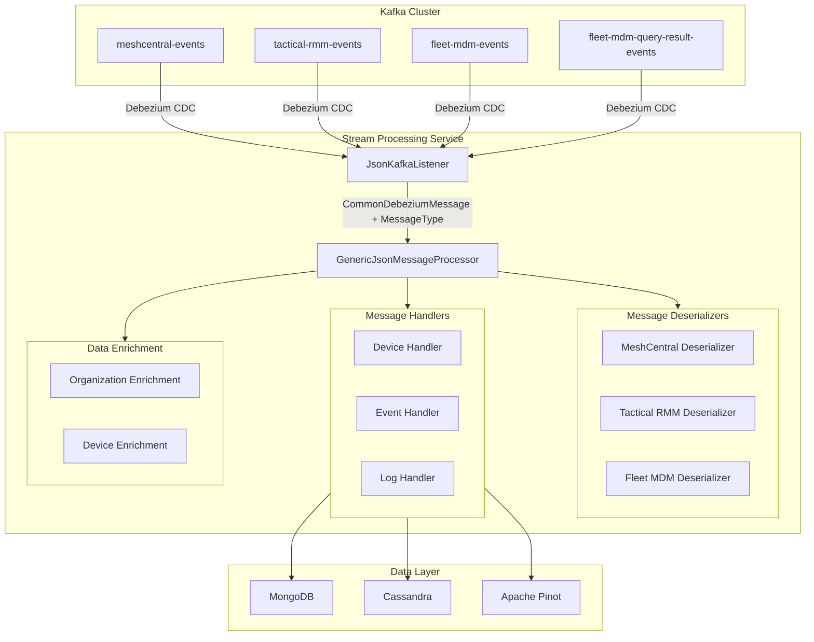
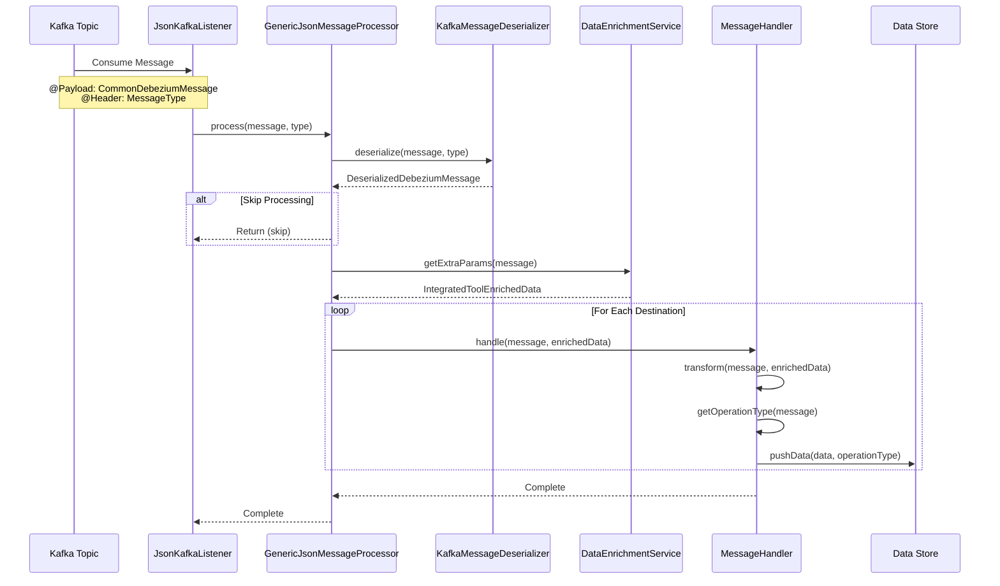
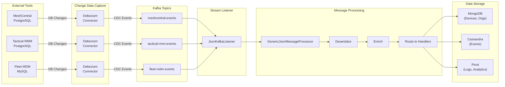
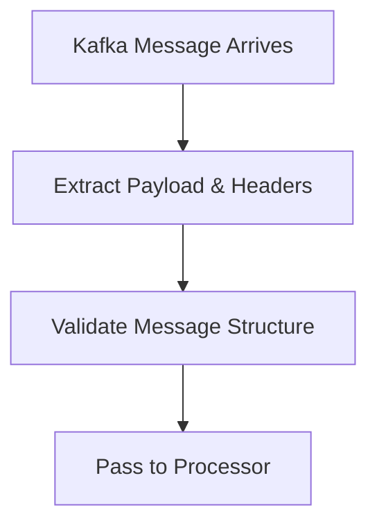
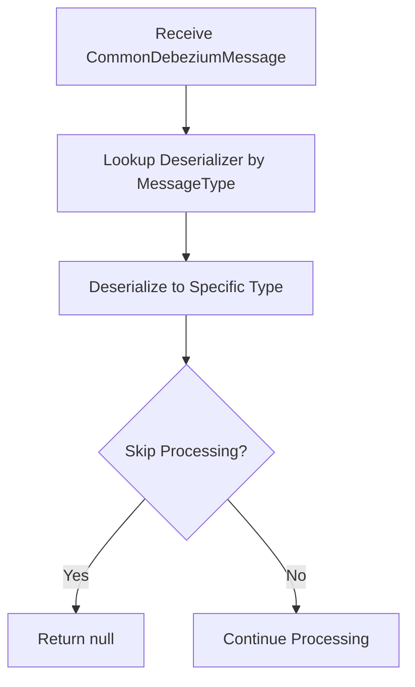
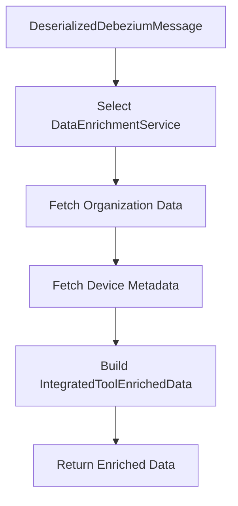
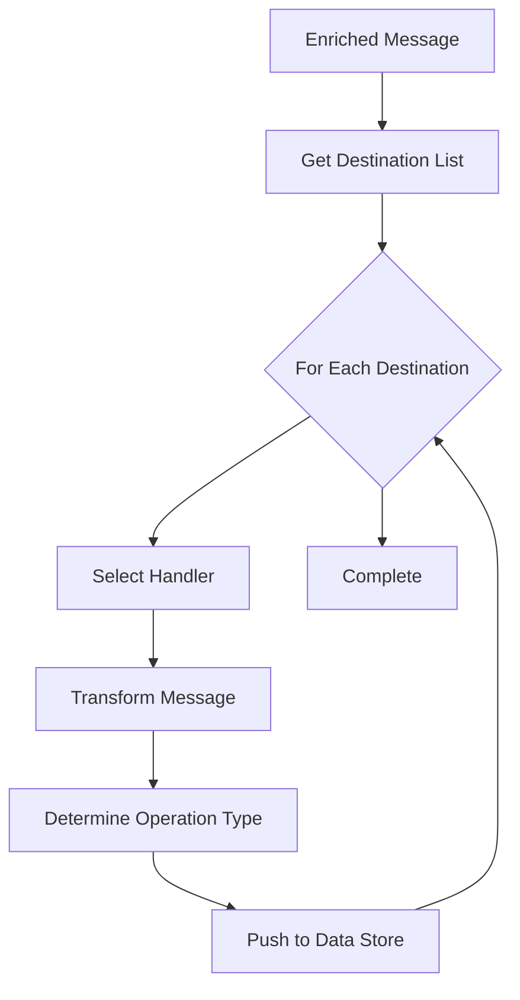
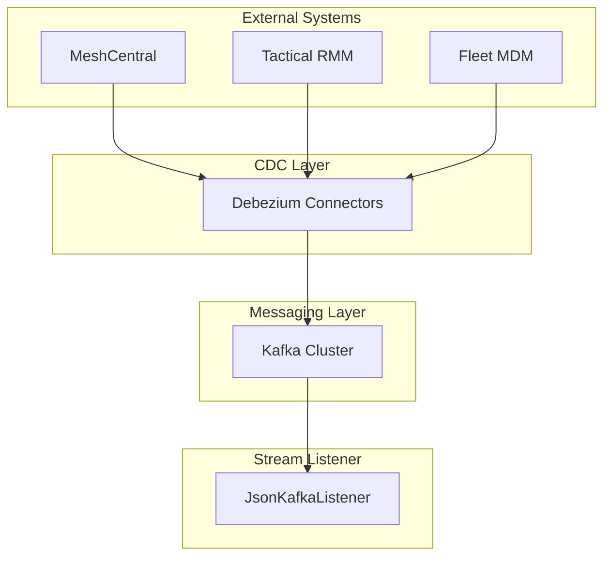
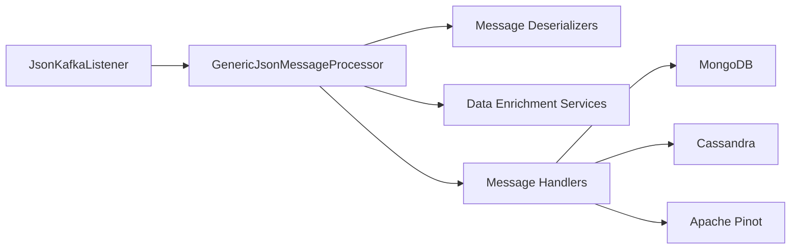
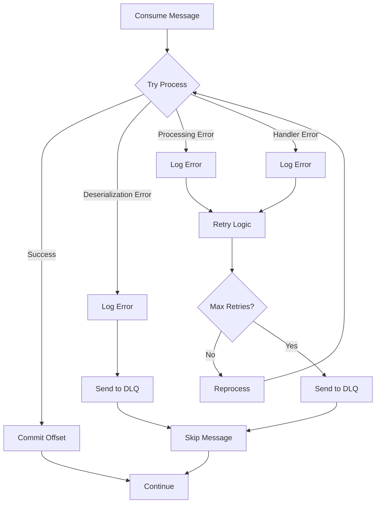

# Stream Processing Listeners Module

The **Stream Processing Listeners** module provides Kafka event consumption capabilities for the OpenFrame stream processing service. It acts as the entry point for all integrated tool events (MeshCentral, Tactical RMM, Fleet MDM) flowing through the Kafka messaging infrastructure, routing them to appropriate message processors for transformation and enrichment.

---

## Table of Contents

1. [Overview](#overview)
2. [Architecture](#architecture)
3. [Core Components](#core-components)
4. [Message Flow](#message-flow)
5. [Kafka Topics](#kafka-topics)
6. [Integration Points](#integration-points)
7. [Configuration](#configuration)
8. [Error Handling](#error-handling)
9. [Related Modules](#related-modules)

---

## Overview

### Purpose

The Stream Processing Listeners module serves as the **Kafka consumer layer** for the OpenFrame platform, responsible for:

- **Event Ingestion**: Consuming events from multiple integrated tool topics
- **Message Routing**: Directing messages to appropriate processors based on message type
- **Type Safety**: Enforcing message type contracts through header-based routing
- **Scalability**: Supporting consumer group-based horizontal scaling

### Key Capabilities

| Capability | Description |
|------------|-------------|
| **Multi-Topic Consumption** | Listens to 4+ integrated tool event topics simultaneously |
| **Type-Based Routing** | Uses Kafka headers to determine message processing strategy |
| **Debezium Integration** | Processes CDC (Change Data Capture) events from external databases |
| **Consumer Group Management** | Supports distributed consumption with automatic partition rebalancing |
| **Async Processing** | Non-blocking event consumption with Spring Kafka |

---

## Architecture

### High-Level Architecture



### Component Interaction



---

## Core Components

### JsonKafkaListener

**Location**: `com.openframe.stream.listener.JsonKafkaListener`

The primary Kafka consumer component that listens to multiple integrated tool event topics.

#### Class Structure

```java
@Service
public class JsonKafkaListener {
    private final GenericJsonMessageProcessor messageProcessor;
    
    @KafkaListener(
        topics = {
            "${openframe.oss-tenant.kafka.topics.inbound.meshcentral-events.name}",
            "${openframe.oss-tenant.kafka.topics.inbound.tactical-rmm-events.name}",
            "${openframe.oss-tenant.kafka.topics.inbound.fleet-mdm-events.name}",
            "${openframe.oss-tenant.kafka.topics.inbound.fleet-mdm-query-result-events.name}"
        },
        groupId = "${spring.oss-tenant.kafka.consumer.group-id}"
    )
    public void listenIntegratedToolsEvents(
        @Payload CommonDebeziumMessage debeziumMessage,
        @Header(KafkaHeader.MESSAGE_TYPE_HEADER) MessageType messageType
    );
}
```

#### Key Features

| Feature | Description |
|---------|-------------|
| **Multi-Topic Subscription** | Consumes from 4 different integrated tool topics |
| **Consumer Group** | Participates in consumer group for load balancing |
| **Header Extraction** | Extracts `MESSAGE_TYPE_HEADER` for routing decisions |
| **Dependency Injection** | Uses Spring's `@Service` for automatic bean registration |

#### Method: `listenIntegratedToolsEvents`

**Purpose**: Consumes Kafka messages from integrated tool topics and delegates processing.

**Parameters**:
- `@Payload CommonDebeziumMessage debeziumMessage`: The Debezium CDC message payload
- `@Header(KafkaHeader.MESSAGE_TYPE_HEADER) MessageType messageType`: Message type from Kafka header

**Processing Flow**:
1. Kafka delivers message to listener method
2. Spring Kafka extracts payload and headers
3. Message and type are passed to `GenericJsonMessageProcessor`
4. Processor handles deserialization, enrichment, and routing

**Example Message Types**:
- `MESHCENTRAL_DEVICE_EVENT`
- `TACTICAL_RMM_AGENT_EVENT`
- `FLEET_MDM_HOST_EVENT`
- `FLEET_MDM_QUERY_RESULT_EVENT`

---

## Message Flow

### End-to-End Processing Pipeline



### Message Processing Stages

#### Stage 1: Consumption



**Details**:
- Kafka consumer polls for messages
- Spring Kafka deserializes JSON payload
- Headers extracted (MESSAGE_TYPE, TENANT_ID, etc.)
- Message passed to `GenericJsonMessageProcessor`

#### Stage 2: Deserialization



**Details**:
- `GenericJsonMessageProcessor` selects appropriate deserializer
- Converts generic `CommonDebeziumMessage` to typed message
- Checks `skipProcessing` flag
- Returns `DeserializedDebeziumMessage` or null

#### Stage 3: Enrichment



**Details**:
- Enrichment service selected by `MessageType.getDataEnrichmentServiceType()`
- Fetches organization, device, and tool metadata
- Builds `IntegratedToolEnrichedData` object
- Provides context for downstream handlers

#### Stage 4: Routing & Handling



**Details**:
- Each `MessageType` defines destination list (MongoDB, Cassandra, Pinot)
- Handler selected by `EventHandlerType` and `Destination`
- Message transformed to target data model
- Operation type (CREATE, UPDATE, DELETE) determines storage action

---

## Kafka Topics

### Subscribed Topics

The `JsonKafkaListener` subscribes to the following topics:

| Topic Property | Description | Source System | Event Types |
|----------------|-------------|---------------|-------------|
| `openframe.oss-tenant.kafka.topics.inbound.meshcentral-events.name` | MeshCentral device and session events | MeshCentral PostgreSQL | Device connections, sessions, user actions |
| `openframe.oss-tenant.kafka.topics.inbound.tactical-rmm-events.name` | Tactical RMM agent events | Tactical RMM PostgreSQL | Agent status, checks, scripts, alerts |
| `openframe.oss-tenant.kafka.topics.inbound.fleet-mdm-events.name` | Fleet MDM host events | Fleet MDM MySQL | Host enrollment, queries, policies |
| `openframe.oss-tenant.kafka.topics.inbound.fleet-mdm-query-result-events.name` | Fleet MDM query results | Fleet MDM MySQL | Query execution results, host data |

### Topic Configuration

**Consumer Group**: Configured via `spring.oss-tenant.kafka.consumer.group-id`

**Example Configuration**:

```yaml
openframe:
  oss-tenant:
    kafka:
      topics:
        inbound:
          meshcentral-events:
            name: "tenant-${TENANT_ID}-meshcentral-events"
          tactical-rmm-events:
            name: "tenant-${TENANT_ID}-tactical-rmm-events"
          fleet-mdm-events:
            name: "tenant-${TENANT_ID}-fleet-mdm-events"
          fleet-mdm-query-result-events:
            name: "tenant-${TENANT_ID}-fleet-mdm-query-results"

spring:
  oss-tenant:
    kafka:
      consumer:
        group-id: "openframe-stream-processor"
```

### Message Format

All topics use **Debezium CDC format**:

```json
{
  "payload": {
    "before": { /* Previous state (null for INSERT) */ },
    "after": { /* Current state (null for DELETE) */ },
    "source": {
      "version": "2.1.0.Final",
      "connector": "postgresql",
      "name": "meshcentral-connector",
      "ts_ms": 1704067200000,
      "snapshot": "false",
      "db": "meshcentral",
      "schema": "public",
      "table": "devices"
    },
    "op": "c",  // c=create, r=read, u=update, d=delete
    "ts_ms": 1704067200000
  }
}
```

**Kafka Headers**:
- `MESSAGE_TYPE`: Enum value (e.g., `MESHCENTRAL_DEVICE_EVENT`)
- `TENANT_ID`: Multi-tenant identifier
- `CORRELATION_ID`: Request tracing ID

---

## Integration Points

### Upstream Dependencies



**Dependencies**:
- **Debezium**: Provides CDC events from external tool databases
- **Kafka**: Message broker for event streaming
- **External Tools**: MeshCentral, Tactical RMM, Fleet MDM

### Downstream Dependencies



**Dependencies**:
- **GenericJsonMessageProcessor**: Core message processing orchestrator
- **KafkaMessageDeserializer**: Type-specific message deserializers
- **DataEnrichmentService**: Organization and device metadata enrichment
- **MessageHandler**: Destination-specific data handlers

### Related Modules

| Module | Relationship | Description |
|--------|--------------|-------------|
| [stream_processing_configuration](stream_processing_configuration.md) | Configuration | Kafka consumer and streams configuration |
| [stream_processing_message_processing](stream_processing_message_processing.md) | Processing | Message deserialization and processing logic |
| [stream_processing_handlers](stream_processing_handlers.md) | Handling | Destination-specific message handlers |
| [stream_processing_streams](stream_processing_streams.md) | Enrichment | Data enrichment and transformation services |
| [data_layer_kafka](data_layer_kafka.md) | Data Model | Kafka message models and Debezium structures |
| [data_layer_mongo](data_layer_mongo.md) | Storage | MongoDB repositories for device and organization data |

---

## Configuration

### Application Properties

**Required Configuration**:

```yaml
# Kafka Consumer Configuration
spring:
  oss-tenant:
    kafka:
      consumer:
        group-id: "openframe-stream-processor"
        auto-offset-reset: "earliest"
        enable-auto-commit: false
        max-poll-records: 500
        
# Topic Configuration
openframe:
  oss-tenant:
    kafka:
      topics:
        inbound:
          meshcentral-events:
            name: "meshcentral-events"
            partitions: 3
            replication-factor: 2
          tactical-rmm-events:
            name: "tactical-rmm-events"
            partitions: 3
            replication-factor: 2
          fleet-mdm-events:
            name: "fleet-mdm-events"
            partitions: 3
            replication-factor: 2
          fleet-mdm-query-result-events:
            name: "fleet-mdm-query-results"
            partitions: 3
            replication-factor: 2
```

### Consumer Group Configuration

**Consumer Group Strategy**:
- **Group ID**: `openframe-stream-processor`
- **Partition Assignment**: Automatic via Kafka coordinator
- **Rebalancing**: Cooperative sticky assignor
- **Offset Management**: Manual commit after successful processing

**Scaling Considerations**:
- Number of consumers ≤ Number of partitions
- Each partition assigned to exactly one consumer in group
- Adding consumers enables horizontal scaling up to partition count

### Message Type Converter

The module uses a custom converter for `MessageType` header extraction:

```java
@Bean
public Converter<byte[], MessageType> messageTypeConverter() {
    return source -> {
        try {
            String stringValue = new String(source, StandardCharsets.UTF_8);
            return MessageType.valueOf(stringValue.toUpperCase());
        } catch (IllegalArgumentException e) {
            return null;
        }
    };
}
```

**Behavior**:
- Converts byte array header to `MessageType` enum
- Case-insensitive conversion (converts to uppercase)
- Returns `null` for invalid message types
- Registered automatically by Spring Kafka

---

## Error Handling

### Error Handling Strategy



### Error Categories

#### 1. Deserialization Errors

**Cause**: Invalid message format, missing fields, type mismatches

**Handling**:
- Log error with full message payload
- Send to Dead Letter Queue (DLQ)
- Skip message and continue processing
- Alert monitoring system

**Example**:

```java
try {
    DeserializedDebeziumMessage message = deserializer.deserialize(rawMessage, type);
} catch (JsonProcessingException e) {
    log.error("Failed to deserialize message: {}", rawMessage, e);
    dlqProducer.send(rawMessage, "DESERIALIZATION_ERROR");
    return null; // Skip processing
}
```

#### 2. Enrichment Errors

**Cause**: Missing organization data, device not found, external service unavailable

**Handling**:
- Log warning with context
- Use default/empty enrichment data
- Continue processing with partial data
- Track enrichment failures for monitoring

**Example**:

```java
try {
    IntegratedToolEnrichedData enrichedData = enrichmentService.getExtraParams(message);
} catch (DataNotFoundException e) {
    log.warn("Enrichment data not found for message: {}", message.getId(), e);
    enrichedData = IntegratedToolEnrichedData.empty();
}
```

#### 3. Handler Errors

**Cause**: Database connection failure, constraint violations, transformation errors

**Handling**:
- Retry with exponential backoff (3 attempts)
- Log error with stack trace
- Send to DLQ after max retries
- Trigger circuit breaker if persistent

**Example**:

```java
@Retryable(
    value = {DataAccessException.class},
    maxAttempts = 3,
    backoff = @Backoff(delay = 1000, multiplier = 2)
)
public void handleCreate(Device device) {
    deviceRepository.save(device);
}
```

#### 4. Kafka Consumer Errors

**Cause**: Network issues, broker unavailability, rebalancing

**Handling**:
- Spring Kafka automatic retry
- Consumer group rebalancing
- Offset reset to last committed position
- Health check monitoring

### Dead Letter Queue (DLQ)

**DLQ Topic Naming**: `{original-topic}.dlq`

**DLQ Message Format**:

```json
{
  "originalTopic": "meshcentral-events",
  "originalPartition": 2,
  "originalOffset": 12345,
  "errorType": "DESERIALIZATION_ERROR",
  "errorMessage": "Cannot deserialize field 'timestamp'",
  "timestamp": 1704067200000,
  "payload": "{ /* original message */ }"
}
```

**DLQ Processing**:
- Manual review and reprocessing
- Automated retry after fix deployment
- Metrics and alerting on DLQ depth

### Monitoring & Alerting

**Key Metrics**:
- Consumer lag per partition
- Message processing rate
- Error rate by error type
- DLQ message count
- Processing latency (p50, p95, p99)

**Alerts**:
- Consumer lag > 10,000 messages
- Error rate > 5%
- DLQ depth > 100 messages
- Processing latency > 5 seconds

---

## Related Modules

### Stream Processing Modules

| Module | Purpose | Link |
|--------|---------|------|
| **Configuration** | Kafka consumer and streams configuration | [stream_processing_configuration](stream_processing_configuration.md) |
| **Message Processing** | Message deserialization and routing | [stream_processing_message_processing](stream_processing_message_processing.md) |
| **Handlers** | Destination-specific message handlers | [stream_processing_handlers](stream_processing_handlers.md) |
| **Streams** | Data enrichment and transformation | [stream_processing_streams](stream_processing_streams.md) |
| **Application** | Main application entry point | [stream_processing_application](stream_processing_application.md) |

### Data Layer Modules

| Module | Purpose | Link |
|--------|---------|------|
| **Kafka Data Layer** | Kafka message models and Debezium structures | [data_layer_kafka](data_layer_kafka.md) |
| **MongoDB Data Layer** | Device and organization repositories | [data_layer_mongo](data_layer_mongo.md) |
| **Core Data Layer** | Cassandra and Pinot repositories | [data_layer_core](data_layer_core.md) |

### Integration Modules

| Module | Purpose | Link |
|--------|---------|------|
| **Client Service** | Agent registration and heartbeat processing | [client_service](client_service.md) |
| **Management Service** | Integrated tool management | [management_service](management_service.md) |

---

## Best Practices

### 1. Consumer Configuration

**DO**:
- Set appropriate `max-poll-records` based on processing time
- Use manual offset commit for exactly-once semantics
- Configure consumer group for horizontal scaling
- Set `auto-offset-reset` to `earliest` for new consumer groups

**DON'T**:
- Enable auto-commit without idempotent processing
- Set `max-poll-records` too high (causes rebalancing)
- Use single consumer for high-volume topics
- Ignore consumer lag metrics

### 2. Message Processing

**DO**:
- Validate message structure before processing
- Use typed deserializers for type safety
- Implement idempotent handlers (handle duplicates)
- Log processing errors with full context

**DON'T**:
- Block consumer thread with synchronous I/O
- Throw exceptions without proper error handling
- Process messages out of order within partition
- Skip offset commit after successful processing

### 3. Error Handling

**DO**:
- Implement retry logic with exponential backoff
- Send unprocessable messages to DLQ
- Monitor DLQ depth and alert on growth
- Log errors with correlation IDs for tracing

**DON'T**:
- Retry indefinitely without max attempts
- Discard messages without logging
- Ignore deserialization errors
- Block consumer on transient errors

### 4. Monitoring

**DO**:
- Track consumer lag per partition
- Monitor message processing rate
- Alert on error rate thresholds
- Measure end-to-end latency

**DON'T**:
- Ignore consumer lag warnings
- Deploy without monitoring setup
- Overlook DLQ message accumulation
- Skip performance testing under load

---

## Troubleshooting

### Common Issues

#### Issue 1: High Consumer Lag

**Symptoms**:
- Consumer lag increasing over time
- Messages not processed in real-time
- Rebalancing events in logs

**Causes**:
- Insufficient consumer instances
- Slow message processing
- Network issues
- Database bottlenecks

**Solutions**:
1. Scale consumer instances (up to partition count)
2. Optimize message processing logic
3. Increase `max-poll-records` if processing is fast
4. Add database indexes for faster writes
5. Use batch processing for bulk operations

#### Issue 2: Deserialization Errors

**Symptoms**:
- Messages sent to DLQ
- `JsonProcessingException` in logs
- Missing or null fields in messages

**Causes**:
- Schema changes in source system
- Debezium configuration mismatch
- Invalid JSON in Kafka topic

**Solutions**:
1. Review Debezium connector configuration
2. Update message deserializers for schema changes
3. Add backward compatibility to deserializers
4. Validate source database schema
5. Check Debezium transform configurations

#### Issue 3: Consumer Rebalancing

**Symptoms**:
- Frequent rebalancing in logs
- Processing interruptions
- Duplicate message processing

**Causes**:
- Consumer processing time > `max.poll.interval.ms`
- Consumer instance crashes
- Network instability

**Solutions**:
1. Increase `max.poll.interval.ms` configuration
2. Reduce `max-poll-records` for faster polling
3. Optimize message processing time
4. Implement health checks for consumer instances
5. Use cooperative sticky assignor

#### Issue 4: Message Handler Failures

**Symptoms**:
- Database constraint violations
- Null pointer exceptions
- Data not appearing in target stores

**Causes**:
- Missing enrichment data
- Invalid message transformations
- Database connection issues

**Solutions**:
1. Add null checks in handlers
2. Validate enrichment data availability
3. Implement circuit breakers for database calls
4. Add retry logic with exponential backoff
5. Log full message context on errors

---

## Performance Considerations

### Throughput Optimization

**Configuration Tuning**:

```yaml
spring:
  kafka:
    consumer:
      max-poll-records: 500  # Batch size per poll
      fetch-min-size: 1048576  # 1MB minimum fetch
      fetch-max-wait: 500  # Max wait time in ms
    listener:
      concurrency: 3  # Concurrent listener threads
```

**Expected Throughput**:
- Single consumer: 1,000-5,000 messages/second
- 3 consumers (3 partitions): 3,000-15,000 messages/second
- Depends on message size and processing complexity

### Latency Optimization

**End-to-End Latency Breakdown**:
1. Kafka consumption: 10-50ms
2. Deserialization: 5-20ms
3. Enrichment: 20-100ms (depends on cache hits)
4. Handler processing: 50-200ms (depends on database)
5. **Total**: 85-370ms (p95)

**Optimization Strategies**:
- Cache organization and device metadata
- Use batch writes to databases
- Implement async processing for non-critical paths
- Optimize database indexes
- Use connection pooling

### Resource Requirements

**Per Consumer Instance**:
- **CPU**: 1-2 cores
- **Memory**: 512MB-1GB heap
- **Network**: 10-50 Mbps
- **Disk**: Minimal (logs only)

**Scaling Guidelines**:
- Start with 1 consumer per partition
- Monitor CPU and memory usage
- Scale horizontally for increased throughput
- Use Kubernetes HPA for auto-scaling

---

## Summary

The **Stream Processing Listeners** module is the critical entry point for all integrated tool events in the OpenFrame platform. It provides:

✅ **Multi-topic Kafka consumption** from MeshCentral, Tactical RMM, and Fleet MDM  
✅ **Type-safe message routing** using Kafka headers  
✅ **Scalable consumer group** architecture for horizontal scaling  
✅ **Robust error handling** with DLQ and retry mechanisms  
✅ **Integration with message processing pipeline** for transformation and enrichment  

By consuming Debezium CDC events and routing them to appropriate processors, this module enables real-time synchronization of external tool data into the OpenFrame unified platform.

---

**Related Documentation**:
- [Stream Processing Configuration](stream_processing_configuration.md)
- [Stream Processing Message Processing](stream_processing_message_processing.md)
- [Stream Processing Handlers](stream_processing_handlers.md)
- [Data Layer Kafka](data_layer_kafka.md)

**External Resources**:
- [Apache Kafka Documentation](https://kafka.apache.org/documentation/)
- [Spring Kafka Reference](https://docs.spring.io/spring-kafka/reference/)
- [Debezium Documentation](https://debezium.io/documentation/)
