# Stream Processing - Message Processing Module

## Overview

The **Message Processing Module** is the core orchestration layer of OpenFrame's stream processing pipeline. It provides a flexible, extensible framework for processing Kafka messages from Change Data Capture (CDC) sources, deserializing them, enriching them with contextual data, and routing them to appropriate handlers based on message type and destination.

This module implements a **strategy pattern** with dynamic handler resolution, enabling the system to process diverse message types (Fleet MDM events, Tactical RMM events, custom integrations) through a unified processing pipeline while maintaining type safety and extensibility.

**Key Responsibilities:**
- **Message Orchestration**: Coordinates the flow from raw Kafka messages to processed domain events
- **Dynamic Deserialization**: Routes messages to appropriate deserializers based on message type
- **Data Enrichment**: Integrates with enrichment services to add contextual metadata (organization, tool configuration)
- **Handler Routing**: Dispatches enriched messages to destination-specific handlers (MongoDB, Cassandra, Pinot)
- **Type Safety**: Maintains strong typing throughout the processing pipeline

---

## Architecture

### High-Level Processing Flow

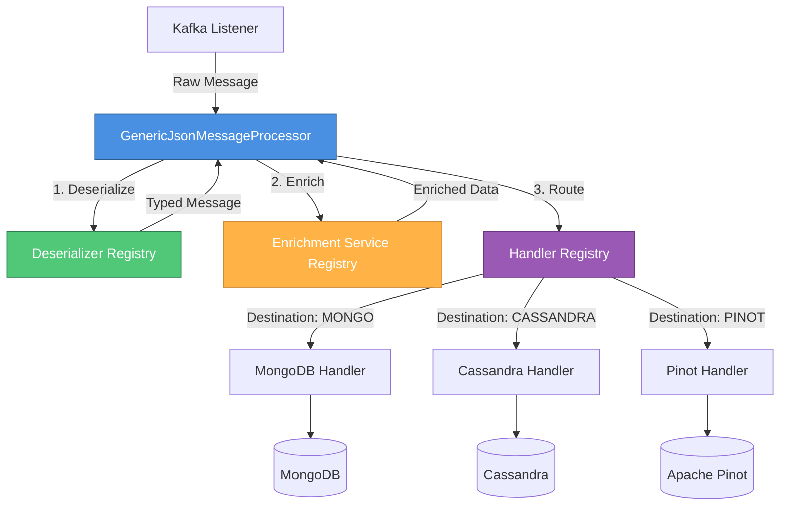

### Component Architecture

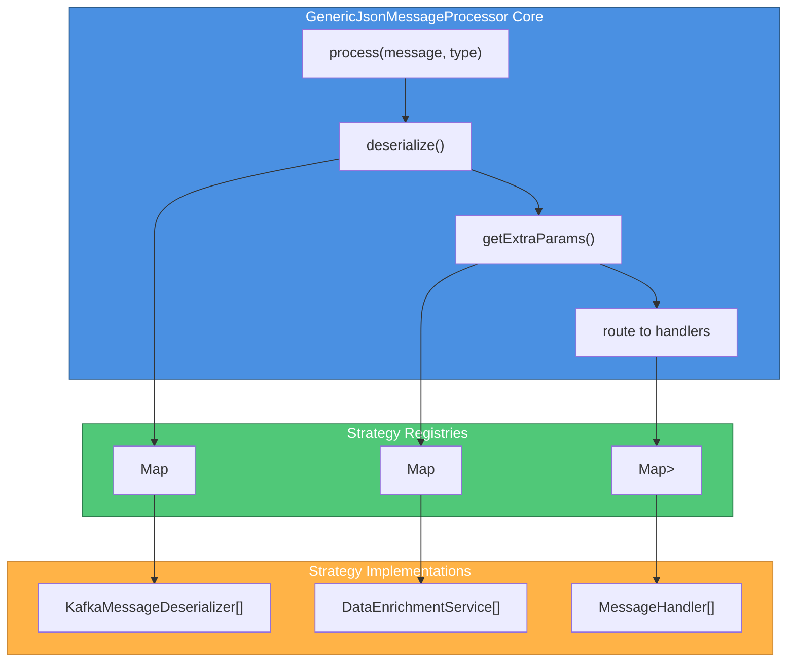

---

## Core Components

### GenericJsonMessageProcessor

**Location**: `deps-openframe-oss-lib/openframe-stream-service-core/src/main/java/com/openframe/stream/processor/GenericJsonMessageProcessor.java`

The central orchestrator that processes Kafka messages through a three-stage pipeline: deserialization, enrichment, and handler routing.

#### Component Structure

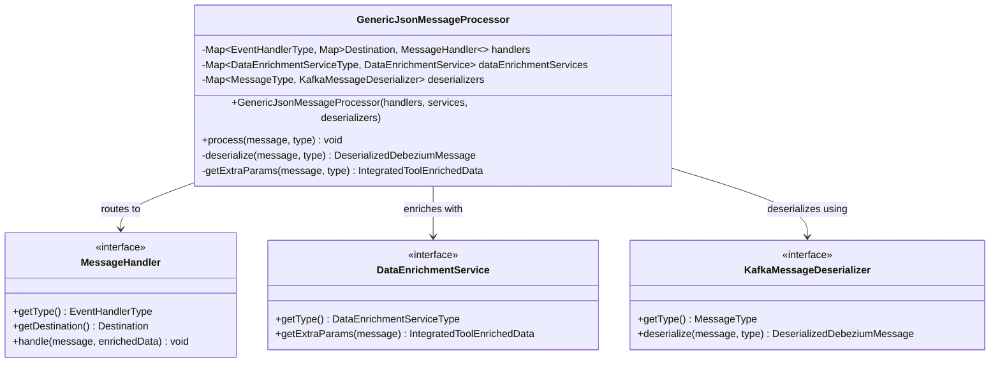

#### Key Methods

##### `process(CommonDebeziumMessage message, MessageType type)`

Main entry point for message processing. Orchestrates the complete pipeline.

**Processing Flow:**

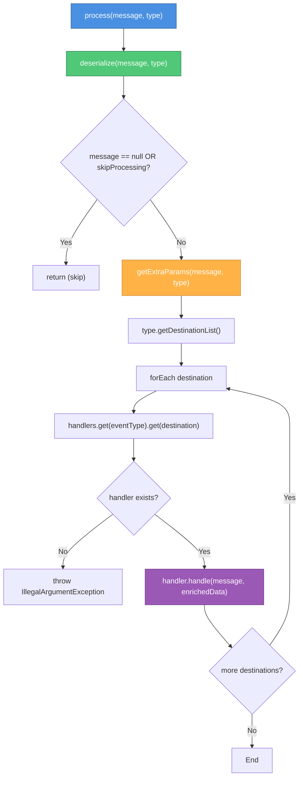

**Parameters:**
- `message`: Raw Debezium CDC message from Kafka
- `type`: Enum defining message type (FLEET_HOST, TACTICAL_AGENT, etc.)

**Behavior:**
1. Deserializes raw message to typed domain object
2. Checks if processing should be skipped (null or `skipProcessing` flag)
3. Enriches message with contextual data (organization, tool config)
4. Iterates through all configured destinations for the message type
5. Routes to appropriate handler for each destination
6. Throws exception if no handler found for a destination

##### `deserialize(CommonDebeziumMessage message, MessageType type)`

Converts raw Kafka message to typed domain object using registered deserializers.

**Parameters:**
- `message`: Raw Debezium message
- `type`: Message type enum

**Returns**: `DeserializedDebeziumMessage` - Typed message with payload

**Throws**: `IllegalArgumentException` if no deserializer registered for type

**Example Flow:**

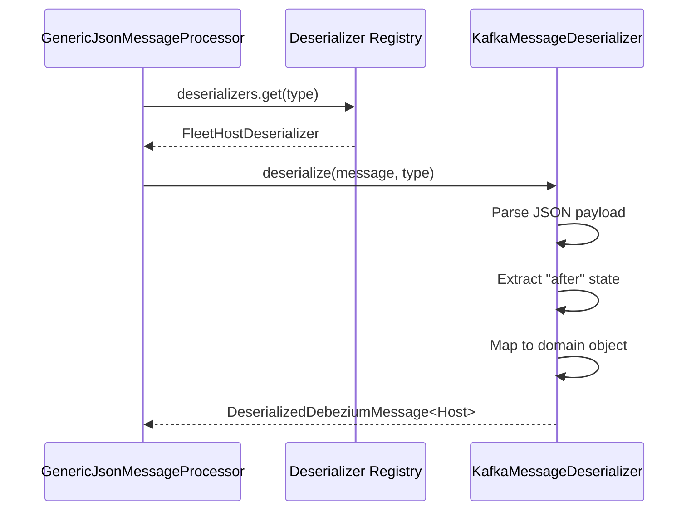

##### `getExtraParams(DeserializedDebeziumMessage message, MessageType type)`

Enriches message with contextual metadata from external services.

**Parameters:**
- `message`: Deserialized message
- `type`: Message type enum

**Returns**: `IntegratedToolEnrichedData` - Enriched metadata (organization ID, tool config, etc.)

**Enrichment Sources:**
- Organization lookup from MongoDB
- Integrated tool configuration
- Tenant-specific settings
- Custom metadata based on message type

---

## Strategy Pattern Implementation

### Handler Registry Structure

The processor uses a **nested map structure** for O(1) handler lookup:

```java
Map<EventHandlerType, Map<Destination, MessageHandler>> handlers
```

**Lookup Flow:**

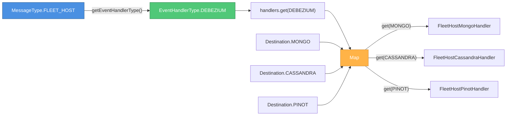

### Registry Initialization

Registries are built via **constructor injection** using Spring's dependency injection:

```java
public GenericJsonMessageProcessor(
    List<MessageHandler> handlers,
    List<DataEnrichmentService> dataEnrichmentServices,
    List<KafkaMessageDeserializer> deserializers
) {
    // Build nested handler map
    this.handlers = handlers.stream()
        .collect(Collectors.groupingBy(
            MessageHandler::getType,
            Collectors.toMap(
                MessageHandler::getDestination,
                Function.identity()
            )
        ));
    
    // Build enrichment service map
    this.dataEnrichmentServices = dataEnrichmentServices.stream()
        .collect(Collectors.toMap(
            DataEnrichmentService::getType,
            Function.identity()
        ));
    
    // Build deserializer map
    this.deserializers = deserializers.stream()
        .collect(Collectors.toMap(
            KafkaMessageDeserializer::getType,
            Function.identity()
        ));
}
```

**Spring Auto-Discovery:**
- All `@Service` beans implementing `MessageHandler` are auto-injected
- All `@Service` beans implementing `DataEnrichmentService` are auto-injected
- All `@Service` beans implementing `KafkaMessageDeserializer` are auto-injected

---

## Message Processing Pipeline

### End-to-End Flow

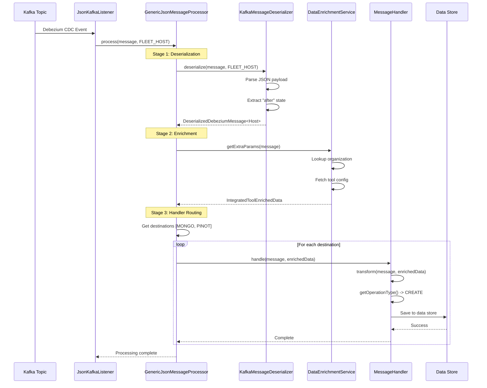

### Stage Details

#### Stage 1: Deserialization

**Purpose**: Convert raw Debezium JSON to typed domain objects

**Input**: `CommonDebeziumMessage` (generic JSON structure)

**Output**: `DeserializedDebeziumMessage<T>` (typed domain object)

**Example Transformation:**

```json
// Input: Raw Debezium Message
{
  "payload": {
    "before": null,
    "after": {
      "id": "host-123",
      "hostname": "server-01",
      "platform": "ubuntu",
      "osVersion": "22.04"
    },
    "source": {
      "connector": "mongodb",
      "collection": "hosts",
      "db": "fleet"
    },
    "op": "c",
    "ts_ms": 1704067200000
  }
}
```

```java
// Output: Typed Domain Object
DeserializedDebeziumMessage<Host> {
    payload: {
        before: null,
        after: Host {
            id: "host-123",
            hostname: "server-01",
            platform: Platform.UBUNTU,
            osVersion: "22.04"
        },
        operation: "c",
        timestamp: 1704067200000
    },
    skipProcessing: false
}
```

#### Stage 2: Enrichment

**Purpose**: Add contextual metadata from external sources

**Input**: `DeserializedDebeziumMessage<T>`

**Output**: `IntegratedToolEnrichedData`

**Enrichment Data:**

```java
IntegratedToolEnrichedData {
    organizationId: "org-456",
    toolId: "tool-789",
    toolType: IntegratedToolType.FLEET_MDM,
    toolConfig: {
        apiUrl: "https://fleet.example.com",
        syncInterval: 300
    },
    customMetadata: {
        "region": "us-east-1",
        "environment": "production"
    }
}
```

#### Stage 3: Handler Routing

**Purpose**: Dispatch to destination-specific handlers

**Routing Logic:**

```java
// MessageType defines destinations
MessageType.FLEET_HOST.getDestinationList() 
    -> [Destination.MONGO, Destination.PINOT]

// Processor routes to each destination
for (Destination destination : destinations) {
    MessageHandler handler = handlers
        .get(EventHandlerType.DEBEZIUM)
        .get(destination);
    
    handler.handle(deserializedMessage, enrichedData);
}
```

---

## Integration Points

### Upstream Dependencies

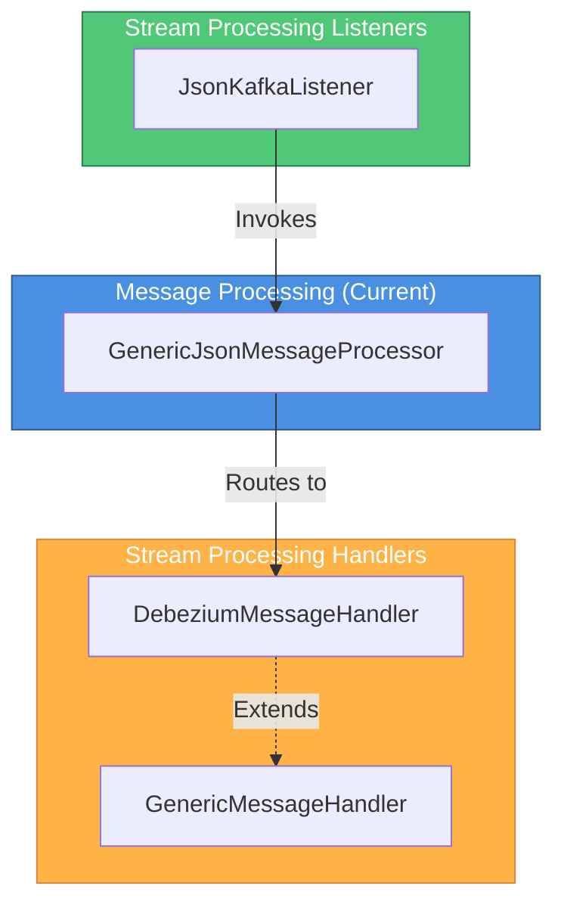

**Related Modules:**
- [stream_processing_listeners.md](stream_processing_listeners.md) - Kafka message consumption
- [stream_processing_handlers.md](stream_processing_handlers.md) - Destination-specific processing
- [stream_processing_streams.md](stream_processing_streams.md) - Kafka Streams enrichment

### Downstream Dependencies

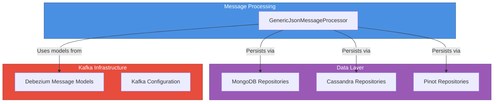

**Related Modules:**
- [data_layer_mongo.md](data_layer_mongo.md) - MongoDB persistence
- [data_layer_core.md](data_layer_core.md) - Cassandra and Pinot repositories
- [data_layer_kafka.md](data_layer_kafka.md) - Kafka message models

---

## Message Types and Routing

### Supported Message Types

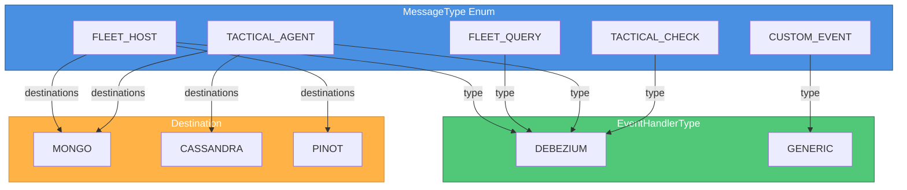

### Routing Configuration

Each `MessageType` defines:
1. **EventHandlerType**: Which handler family to use (Debezium vs Generic)
2. **DestinationList**: Which data stores to persist to
3. **DataEnrichmentServiceType**: Which enrichment service to use

**Example Configuration:**

```java
public enum MessageType {
    FLEET_HOST(
        EventHandlerType.DEBEZIUM,
        List.of(Destination.MONGO, Destination.PINOT),
        DataEnrichmentServiceType.INTEGRATED_TOOL
    ),
    
    TACTICAL_AGENT(
        EventHandlerType.DEBEZIUM,
        List.of(Destination.MONGO, Destination.CASSANDRA),
        DataEnrichmentServiceType.INTEGRATED_TOOL
    ),
    
    CUSTOM_EVENT(
        EventHandlerType.GENERIC,
        List.of(Destination.MONGO),
        DataEnrichmentServiceType.NONE
    );
    
    private final EventHandlerType eventHandlerType;
    private final List<Destination> destinationList;
    private final DataEnrichmentServiceType dataEnrichmentServiceType;
}
```

---

## Error Handling

### Exception Scenarios

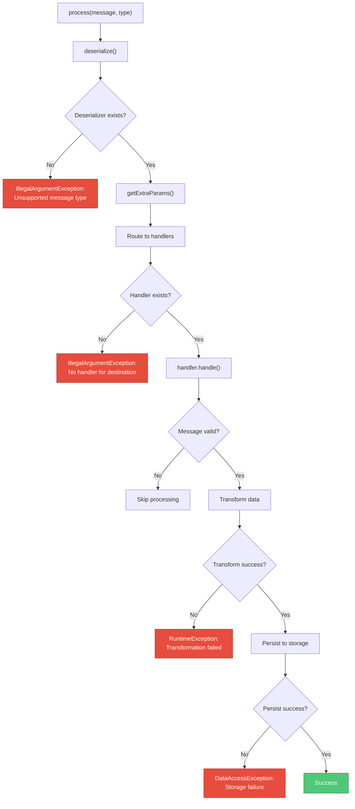

### Error Handling Strategy

#### 1. Missing Deserializer

```java
private DeserializedDebeziumMessage deserialize(
    CommonDebeziumMessage message, 
    MessageType type
) {
    KafkaMessageDeserializer deserializer = deserializers.get(type);
    if (deserializer == null) {
        throw new IllegalArgumentException(
            "The message type '%s' is not supported".formatted(type)
        );
    }
    return deserializer.deserialize(message, type);
}
```

**Impact**: Processing stops immediately, message is not acknowledged

**Resolution**: Register deserializer bean for the message type

#### 2. Missing Handler

```java
MessageHandler handler = handlers
    .get(type.getEventHandlerType())
    .get(destination);

if (handler == null) {
    throw new IllegalArgumentException(
        "No handler found for type: " + type
    );
}
```

**Impact**: Processing stops, message is not acknowledged

**Resolution**: Implement and register handler for the destination

#### 3. Skip Processing Flag

```java
if (deserializedKafkaMessage == null || 
    deserializedKafkaMessage.getSkipProcessing()) {
    return; // Silent skip
}
```

**Impact**: Message is acknowledged but not processed

**Use Cases:**
- Tombstone records (delete operations with null payload)
- Messages failing validation rules
- Duplicate detection

---

## Performance Considerations

### Registry Lookup Optimization

**O(1) Lookup Complexity:**

```java
// Nested map structure enables constant-time lookups
Map<EventHandlerType, Map<Destination, MessageHandler>> handlers

// Lookup: O(1) + O(1) = O(1)
MessageHandler handler = handlers
    .get(eventHandlerType)  // O(1)
    .get(destination);       // O(1)
```

### Parallel Processing

**Multi-Destination Routing:**

```java
// Sequential processing (current implementation)
type.getDestinationList().forEach(destination -> {
    MessageHandler handler = handlers
        .get(type.getEventHandlerType())
        .get(destination);
    handler.handle(deserializedKafkaMessage, enrichedData);
});
```

**Potential Optimization** (not currently implemented):

```java
// Parallel processing for independent destinations
type.getDestinationList().parallelStream().forEach(destination -> {
    MessageHandler handler = handlers
        .get(type.getEventHandlerType())
        .get(destination);
    handler.handle(deserializedKafkaMessage, enrichedData);
});
```

### Memory Management

**Immutable Message Objects:**
- Deserialized messages are immutable
- Enriched data is created once and shared across handlers
- No defensive copying required

**Registry Initialization:**
- Registries built once at startup
- No runtime map modifications
- Thread-safe read-only access

---

## Extension Points

### Adding New Message Types

**Step 1: Define Message Type**

```java
public enum MessageType {
    NEW_INTEGRATION(
        EventHandlerType.DEBEZIUM,
        List.of(Destination.MONGO, Destination.PINOT),
        DataEnrichmentServiceType.INTEGRATED_TOOL
    );
}
```

**Step 2: Implement Deserializer**

```java
@Service
public class NewIntegrationDeserializer 
    implements KafkaMessageDeserializer {
    
    @Override
    public MessageType getType() {
        return MessageType.NEW_INTEGRATION;
    }
    
    @Override
    public DeserializedDebeziumMessage deserialize(
        CommonDebeziumMessage message, 
        MessageType type
    ) {
        // Deserialization logic
    }
}
```

**Step 3: Implement Handlers**

```java
@Service
public class NewIntegrationMongoHandler 
    extends DebeziumMessageHandler<NewIntegrationEntity, DeserializedDebeziumMessage> {
    
    @Override
    public EventHandlerType getType() {
        return EventHandlerType.DEBEZIUM;
    }
    
    @Override
    public Destination getDestination() {
        return Destination.MONGO;
    }
    
    @Override
    protected NewIntegrationEntity transform(
        DeserializedDebeziumMessage message,
        IntegratedToolEnrichedData enrichedData
    ) {
        // Transformation logic
    }
    
    // Implement CRUD methods...
}
```

**Step 4: Auto-Registration**

Spring automatically discovers and injects the new beans into `GenericJsonMessageProcessor` registries.

### Adding New Destinations

**Step 1: Define Destination**

```java
public enum Destination {
    ELASTICSEARCH,  // New destination
    MONGO,
    CASSANDRA,
    PINOT
}
```

**Step 2: Implement Handler**

```java
@Service
public class FleetHostElasticsearchHandler 
    extends DebeziumMessageHandler<ElasticsearchDocument, DeserializedDebeziumMessage> {
    
    @Override
    public Destination getDestination() {
        return Destination.ELASTICSEARCH;
    }
    
    // Implement handler logic...
}
```

**Step 3: Update Message Type**

```java
FLEET_HOST(
    EventHandlerType.DEBEZIUM,
    List.of(
        Destination.MONGO, 
        Destination.PINOT,
        Destination.ELASTICSEARCH  // Add new destination
    ),
    DataEnrichmentServiceType.INTEGRATED_TOOL
)
```

---

## Configuration

### Application Properties

```yaml
# Kafka Consumer Configuration
spring:
  kafka:
    consumer:
      group-id: openframe-stream-processor
      auto-offset-reset: earliest
      enable-auto-commit: false
      max-poll-records: 500
      
# Message Processing Configuration
openframe:
  stream:
    processing:
      # Enable parallel destination processing
      parallel-destinations: false
      
      # Skip invalid messages instead of failing
      skip-invalid-messages: true
      
      # Retry configuration
      retry:
        max-attempts: 3
        backoff-ms: 1000
```

### Environment Variables

```bash
# Kafka Configuration
export KAFKA_BOOTSTRAP_SERVERS=localhost:9092
export KAFKA_CONSUMER_GROUP=openframe-stream-processor

# MongoDB Configuration (for enrichment)
export MONGODB_URI=mongodb://localhost:27017/openframe

# Logging
export LOG_LEVEL_STREAM_PROCESSOR=DEBUG
```

---

## Monitoring and Observability

### Key Metrics

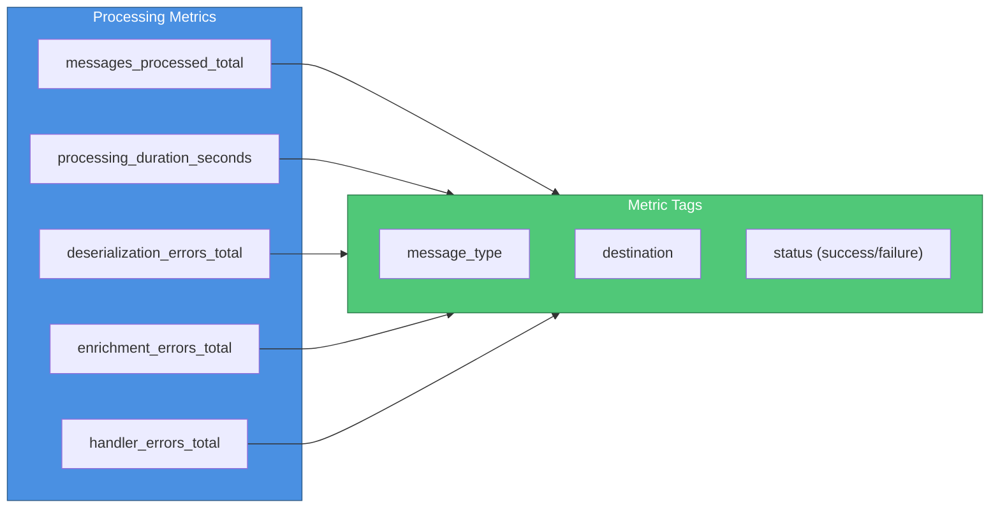

### Logging Strategy

**Log Levels:**

```java
// INFO: Successful processing
log.info("Processed message type={} destinations={}", 
    type, type.getDestinationList());

// WARN: Skipped processing
log.warn("Skipping message type={} reason=skipProcessing", type);

// ERROR: Processing failures
log.error("Failed to process message type={} error={}", 
    type, e.getMessage(), e);
```

**Structured Logging:**

```json
{
  "timestamp": "2024-01-01T12:00:00Z",
  "level": "INFO",
  "logger": "GenericJsonMessageProcessor",
  "message": "Message processed successfully",
  "context": {
    "messageType": "FLEET_HOST",
    "destinations": ["MONGO", "PINOT"],
    "processingTimeMs": 45,
    "organizationId": "org-456"
  }
}
```

---

## Testing

### Unit Testing Strategy

**Test Structure:**

```java
@ExtendWith(MockitoExtension.class)
class GenericJsonMessageProcessorTest {
    
    @Mock
    private MessageHandler mockHandler;
    
    @Mock
    private DataEnrichmentService mockEnrichmentService;
    
    @Mock
    private KafkaMessageDeserializer mockDeserializer;
    
    @InjectMocks
    private GenericJsonMessageProcessor processor;
    
    @Test
    void shouldProcessMessageSuccessfully() {
        // Given
        CommonDebeziumMessage message = createTestMessage();
        DeserializedDebeziumMessage deserializedMessage = createDeserializedMessage();
        IntegratedToolEnrichedData enrichedData = createEnrichedData();
        
        when(mockDeserializer.getType()).thenReturn(MessageType.FLEET_HOST);
        when(mockDeserializer.deserialize(message, MessageType.FLEET_HOST))
            .thenReturn(deserializedMessage);
        when(mockEnrichmentService.getType())
            .thenReturn(DataEnrichmentServiceType.INTEGRATED_TOOL);
        when(mockEnrichmentService.getExtraParams(deserializedMessage))
            .thenReturn(enrichedData);
        when(mockHandler.getType()).thenReturn(EventHandlerType.DEBEZIUM);
        when(mockHandler.getDestination()).thenReturn(Destination.MONGO);
        
        // When
        processor.process(message, MessageType.FLEET_HOST);
        
        // Then
        verify(mockHandler).handle(deserializedMessage, enrichedData);
    }
    
    @Test
    void shouldSkipProcessingWhenSkipFlagSet() {
        // Given
        CommonDebeziumMessage message = createTestMessage();
        DeserializedDebeziumMessage deserializedMessage = createDeserializedMessage();
        deserializedMessage.setSkipProcessing(true);
        
        when(mockDeserializer.deserialize(message, MessageType.FLEET_HOST))
            .thenReturn(deserializedMessage);
        
        // When
        processor.process(message, MessageType.FLEET_HOST);
        
        // Then
        verify(mockHandler, never()).handle(any(), any());
    }
    
    @Test
    void shouldThrowExceptionWhenDeserializerNotFound() {
        // Given
        CommonDebeziumMessage message = createTestMessage();
        
        // When/Then
        assertThrows(IllegalArgumentException.class, () -> {
            processor.process(message, MessageType.UNKNOWN_TYPE);
        });
    }
}
```

### Integration Testing

**Test Scenario: End-to-End Processing**

```java
@SpringBootTest
@EmbeddedKafka(partitions = 1, topics = {"fleet.hosts"})
class MessageProcessingIntegrationTest {
    
    @Autowired
    private KafkaTemplate<String, String> kafkaTemplate;
    
    @Autowired
    private MongoTemplate mongoTemplate;
    
    @Test
    void shouldProcessFleetHostMessageEndToEnd() throws Exception {
        // Given
        String debeziumMessage = """
            {
              "payload": {
                "after": {
                  "id": "host-123",
                  "hostname": "server-01",
                  "platform": "ubuntu"
                },
                "op": "c"
              }
            }
            """;
        
        // When
        kafkaTemplate.send("fleet.hosts", debeziumMessage);
        
        // Then
        await().atMost(5, TimeUnit.SECONDS).untilAsserted(() -> {
            Host savedHost = mongoTemplate.findById("host-123", Host.class);
            assertNotNull(savedHost);
            assertEquals("server-01", savedHost.getHostname());
        });
    }
}
```

---

## Best Practices

### 1. Handler Idempotency

Ensure handlers can safely process the same message multiple times:

```java
@Override
protected void handleCreate(Host host) {
    // Use upsert instead of insert
    mongoTemplate.save(host);  // ✅ Idempotent
    // mongoTemplate.insert(host);  // ❌ Fails on duplicate
}
```

### 2. Enrichment Caching

Cache frequently accessed enrichment data:

```java
@Service
public class CachedEnrichmentService implements DataEnrichmentService {
    
    @Cacheable(value = "organizationCache", key = "#message.organizationId")
    @Override
    public IntegratedToolEnrichedData getExtraParams(
        DeserializedDebeziumMessage message
    ) {
        // Expensive lookup cached
        return organizationRepository.findById(message.getOrganizationId());
    }
}
```

### 3. Graceful Degradation

Handle missing enrichment data gracefully:

```java
@Override
protected Host transform(
    DeserializedDebeziumMessage message,
    IntegratedToolEnrichedData enrichedData
) {
    Host host = message.getPayload().getAfter();
    
    // Use enriched data if available, fallback to defaults
    host.setOrganizationId(
        enrichedData != null 
            ? enrichedData.getOrganizationId() 
            : "default-org"
    );
    
    return host;
}
```

### 4. Structured Logging

Include context in all log statements:

```java
log.info("Processing message type={} destinations={} organizationId={}", 
    type, 
    type.getDestinationList(),
    enrichedData.getOrganizationId()
);
```

---

## Troubleshooting

### Common Issues

#### Issue 1: Messages Not Processing

**Symptoms:**
- Kafka consumer lag increasing
- No logs from `GenericJsonMessageProcessor`

**Diagnosis:**

```bash
# Check consumer lag
kafka-consumer-groups.sh --bootstrap-server localhost:9092 \
  --group openframe-stream-processor --describe

# Check application logs
kubectl logs -f deployment/openframe-stream -n openframe | grep GenericJsonMessageProcessor
```

**Solutions:**
1. Verify Kafka connectivity: `telnet kafka-broker 9092`
2. Check consumer group configuration
3. Verify listener is enabled: `@KafkaListener` annotation present
4. Check for exceptions in startup logs

#### Issue 2: Deserialization Failures

**Symptoms:**
- `IllegalArgumentException: The message type 'X' is not supported`

**Diagnosis:**

```bash
# Check registered deserializers
curl http://localhost:8080/actuator/beans | jq '.contexts.application.beans | 
  to_entries | 
  map(select(.value.type | contains("Deserializer"))) | 
  .[].key'
```

**Solutions:**
1. Verify deserializer bean is annotated with `@Service`
2. Check `getType()` returns correct `MessageType`
3. Verify Spring component scanning includes deserializer package

#### Issue 3: Handler Not Found

**Symptoms:**
- `IllegalArgumentException: No handler found for type: X`

**Diagnosis:**

```java
// Add debug logging to constructor
public GenericJsonMessageProcessor(...) {
    this.handlers = handlers.stream()...;
    
    log.debug("Registered handlers: {}", 
        this.handlers.entrySet().stream()
            .flatMap(e -> e.getValue().entrySet().stream()
                .map(d -> e.getKey() + ":" + d.getKey()))
            .collect(Collectors.toList())
    );
}
```

**Solutions:**
1. Verify handler implements correct `getType()` and `getDestination()`
2. Check handler is registered as Spring bean
3. Verify message type's destination list includes the destination

---

## Related Documentation

### Stream Processing Modules
- [stream_processing_configuration.md](stream_processing_configuration.md) - Kafka and Kafka Streams configuration
- [stream_processing_listeners.md](stream_processing_listeners.md) - Kafka message consumption
- [stream_processing_handlers.md](stream_processing_handlers.md) - Destination-specific message handlers
- [stream_processing_streams.md](stream_processing_streams.md) - Kafka Streams enrichment pipelines
- [stream_processing_application.md](stream_processing_application.md) - Application entry point

### Data Layer Modules
- [data_layer_kafka.md](data_layer_kafka.md) - Kafka message models and configuration
- [data_layer_mongo.md](data_layer_mongo.md) - MongoDB repositories and documents
- [data_layer_core.md](data_layer_core.md) - Cassandra and Pinot repositories

### Integration Modules
- [fleet_mdm_sdk.md](fleet_mdm_sdk.md) - Fleet MDM integration models
- [tactical_rmm_sdk.md](tactical_rmm_sdk.md) - Tactical RMM integration models

---

## Additional Resources

### Debezium Documentation
- **Debezium Overview**: https://debezium.io/documentation/reference/stable/
- **MongoDB Connector**: https://debezium.io/documentation/reference/stable/connectors/mongodb.html
- **Message Structure**: https://debezium.io/documentation/reference/stable/connectors/mongodb.html#mongodb-events

### Spring Kafka
- **Spring Kafka Reference**: https://docs.spring.io/spring-kafka/reference/html/
- **Kafka Listener**: https://docs.spring.io/spring-kafka/reference/html/#kafka-listener-annotation

### Design Patterns
- **Strategy Pattern**: https://refactoring.guru/design-patterns/strategy
- **Registry Pattern**: https://martinfowler.com/eaaCatalog/registry.html

---

## Glossary

| Term | Definition |
|------|------------|
| **CDC (Change Data Capture)** | Pattern for tracking and capturing database changes in real-time |
| **Debezium** | Open-source CDC platform that streams database changes to Kafka |
| **Message Type** | Enum defining the type of message being processed (FLEET_HOST, TACTICAL_AGENT, etc.) |
| **Event Handler Type** | Category of handler (DEBEZIUM for CDC events, GENERIC for custom events) |
| **Destination** | Target data store for processed messages (MONGO, CASSANDRA, PINOT) |
| **Enrichment** | Process of adding contextual metadata to messages (organization, tool config) |
| **Strategy Pattern** | Design pattern enabling algorithm selection at runtime |
| **Registry** | Map-based lookup structure for dynamic component resolution |
| **Idempotency** | Property where processing the same message multiple times produces the same result |

---

**Document Version**: 1.0  
**Last Updated**: 2024-01-01  
**Maintained By**: OpenFrame Stream Processing Team

For questions or contributions, join the [OpenMSP Slack Community](https://join.slack.com/t/openmsp/shared_invite/zt-36bl7mx0h-3~U2nFH6nqHqoTPXMaHEHA).
