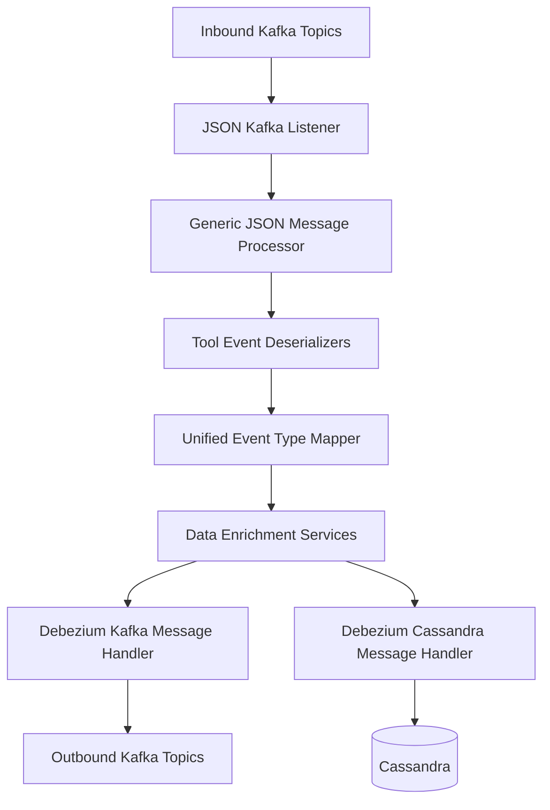
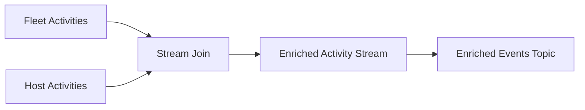
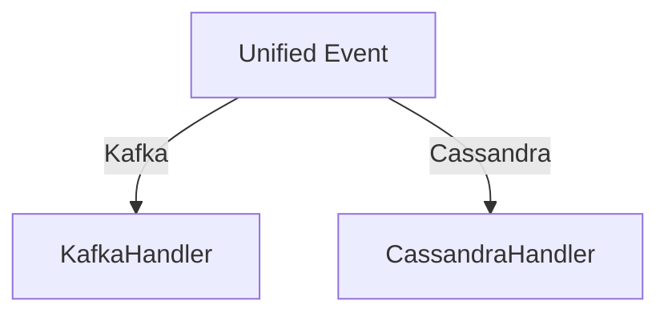
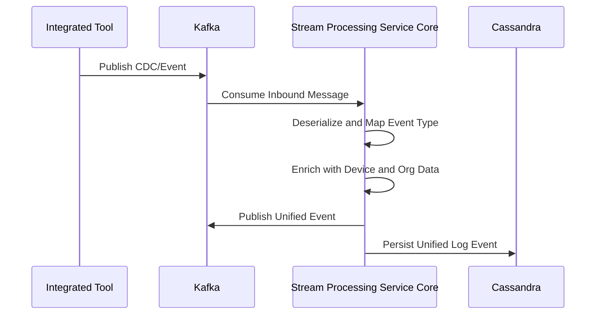

# Stream Processing Service Core

## Overview

The **Stream Processing Service Core** is the real-time event ingestion and processing backbone of the OpenFrame platform. It consumes change data capture (CDC) and event streams from integrated tools (Fleet MDM, Tactical RMM, MeshCentral), normalizes them into unified event models, enriches them with tenant, device, and organization context, and routes the resulting events to downstream systems such as Kafka topics and Cassandra for analytics, auditing, and automation.

This module is designed for **high-throughput, low-latency** processing using Apache Kafka, Kafka Streams, and Debezium-based CDC patterns, while remaining tenant-aware and horizontally scalable.

At a high level, the Stream Processing Service Core is responsible for:
- Consuming inbound Kafka topics carrying Debezium and tool-specific events
- Deserializing heterogeneous payloads into typed domain events
- Mapping tool-specific event types to unified OpenFrame event semantics
- Enriching events with cached device and organization metadata
- Persisting normalized events to Cassandra and publishing them to outbound Kafka topics

---

## Position in the Platform Architecture

The Stream Processing Service Core sits between **data ingestion** and **data consumption** layers:

- **Upstream producers**: Integrated tools, Debezium connectors, and management services publish raw or CDC-style events into Kafka
- **This module**: Normalizes, enriches, and routes events
- **Downstream consumers**: Data persistence, analytics (Pinot), APIs, and automation services consume the processed events

It closely collaborates with:
- Data infrastructure (Kafka topics and headers)
- Redis-based caches for enrichment
- Cassandra for durable event storage

---

## High-Level Architecture

---

## Core Responsibilities by Layer

### 1. Kafka Configuration and Streams Setup

**Purpose:** Establish Kafka consumers, producers, and Kafka Streams topologies required by the service.

Key components:
- **KafkaConfig**
  - Provides custom converters, including conversion of Kafka headers into strongly typed message enums
- **KafkaStreamsConfig**
  - Configures Kafka Streams application ID, bootstrap servers, serialization, and processing guarantees
  - Supports tenant-aware namespacing via a cluster identifier

This configuration ensures deterministic processing, safe deserialization, and predictable scaling behavior.

---

### 2. Event Ingestion and Listening

**Purpose:** Consume raw events from Kafka topics and hand them off for processing.

Key components:
- **Json Kafka Listener**
  - Subscribes to inbound Kafka topics for Fleet, Tactical RMM, MeshCentral, and query result events
  - Extracts the message payload and message type header
  - Delegates processing to a generic message processor

This listener layer is intentionally thin, focusing only on transport concerns and deferring business logic downstream.

---

### 3. Event Deserialization

**Purpose:** Convert tool-specific JSON payloads into normalized internal representations.

The Stream Processing Service Core contains multiple specialized deserializers, each tailored to a specific tool and event type:

- **Fleet Event Deserializer**
  - Extracts agent identifiers, activity types, timestamps, and human-readable messages from Fleet MDM events
  - Uses predefined mappings to translate activity types into readable summaries

- **Fleet Query Result Event Deserializer**
  - Handles scheduled and live query execution results
  - Enriches messages with query metadata retrieved from cache
  - Separates successful results from error payloads

- **MeshCentral Event Deserializer**
  - Parses nested JSON payloads embedded as strings
  - Derives composite event types from MeshCentral etype and action fields

- **Tactical RMM Agent History and Audit Deserializers**
  - Distinguish between command execution, script execution, and audit log events
  - Extract execution results, errors, and timestamps

All deserializers expose a common contract, producing a unified intermediate representation suitable for downstream processing.

---

### 4. Unified Event Type Mapping

**Purpose:** Normalize heterogeneous tool event types into a single, platform-wide event taxonomy.

Key components:
- **Event Type Mapper**
  - Maintains a registry mapping `(Integrated Tool Type + Source Event Type)` to a unified event type
  - Provides a deterministic fallback to an `UNKNOWN` event type when no mapping exists

- **Source Event Types**
  - Defines authoritative constants for all supported event types per tool

This mapping layer is critical for analytics, alerting, and cross-tool correlation, as it allows downstream systems to reason about events consistently.

---

### 5. Data Enrichment

**Purpose:** Attach tenant, device, and organization context to raw events.

Key components:
- **Integrated Tool Data Enrichment Service**
  - Uses Redis-backed caches to resolve agent identifiers into machine and organization metadata
  - Populates enriched data structures with device IDs, hostnames, and organization details

- **Activity Enrichment Service (Kafka Streams)**
  - Joins Fleet activity streams with host activity streams
  - Resolves host identifiers and agent identifiers across topics
  - Adds required Kafka headers and republishes enriched events

This enrichment stage ensures that all downstream consumers receive events that are context-complete.

---

### 6. Message Handling and Routing

**Purpose:** Persist and publish processed events according to their destination.

The handler hierarchy is built around a generic message handling abstraction:

- **Generic Message Handler**
  - Defines the lifecycle for handling create, read, update, and delete operations

- **Debezium Message Handler**
  - Interprets Debezium operation codes
  - Delegates transformation and persistence based on operation type

Concrete implementations:
- **Debezium Kafka Message Handler**
  - Publishes unified events to outbound Kafka topics
  - Uses tenant-aware retrying Kafka producers

- **Debezium Cassandra Message Handler**
  - Transforms events into Cassandra-compatible entities
  - Persists normalized log events for long-term storage and analytics

---

## Event Flow Summary

---

## Key Design Principles

- **Tool Agnostic**: Supports multiple integrated tools through pluggable deserializers and mappings
- **Tenant Aware**: All processing is scoped by tenant and cluster identifiers
- **Extensible**: New tools and event types can be added without disrupting existing flows
- **Resilient**: Uses retrying producers and safe defaults to handle malformed or unknown events
- **Streaming First**: Leverages Kafka Streams for joins and real-time enrichment

---

## When to Modify This Module

You will typically extend or modify the Stream Processing Service Core when:
- Adding support for a new integrated tool
- Introducing new event types or mappings
- Changing enrichment requirements or metadata sources
- Adjusting routing logic to new destinations

For deployment, scaling, and operational concerns, refer to the platform-level service and infrastructure documentation.
