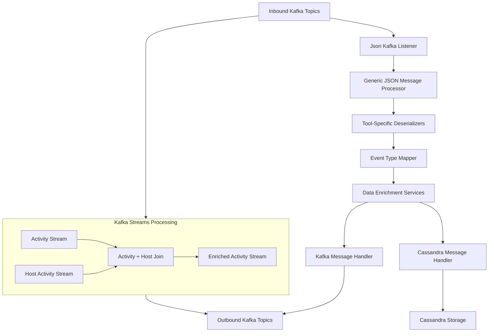
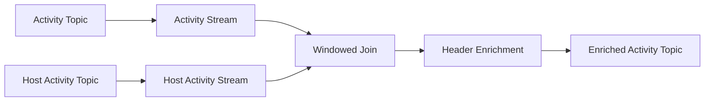

# Stream Processing Service Core

The **Stream Processing Service Core** module is responsible for real-time ingestion, normalization, enrichment, and routing of event streams originating from integrated tools across the OpenFrame platform. It acts as the central streaming backbone that converts heterogeneous change data capture (CDC) and event feeds into unified events consumable by downstream services such as APIs, persistence layers, analytics, and notifications.

This module is primarily built on **Apache Kafka**, **Kafka Streams**, and **Debezium-style CDC messages**, and is designed to operate in a multi-tenant, horizontally scalable SaaS environment.

---

## Responsibilities

The Stream Processing Service Core provides the following core capabilities:

- Ingest inbound Kafka topics from integrated tools (MeshCentral, Tactical RMM, Fleet MDM)
- Deserialize raw CDC and event payloads into typed domain messages
- Normalize tool-specific events into unified event types
- Enrich events with organization, device, and user context
- Route processed events to multiple destinations (Kafka topics, Cassandra)
- Perform stateful stream joins and transformations using Kafka Streams

---

## High-Level Architecture

---

## Core Processing Flow

1. **Ingestion**  
   Kafka topics containing CDC or event messages are consumed using Spring Kafka listeners.

2. **Message Type Resolution**  
   Kafka headers are used to determine the logical `MessageType`, enabling polymorphic processing.

3. **Deserialization**  
   Tool-specific deserializers convert raw JSON payloads into structured domain objects.

4. **Event Normalization**  
   Source-specific event identifiers are mapped to unified event types shared across the platform.

5. **Data Enrichment**  
   Events are enriched with organization, device, and user metadata using Redis-backed caches.

6. **Routing and Persistence**  
   Enriched events are dispatched to Kafka topics and/or persisted to Cassandra depending on handler configuration.

7. **Stream Enrichment (Kafka Streams)**  
   Certain event types undergo additional stream-based joins and transformations before publication.

---

## Kafka Configuration

### Kafka Consumer and Header Conversion

The module defines a custom converter to translate Kafka header values into strongly typed message categories used throughout the pipeline.

Key characteristics:
- Converts raw byte headers into enumerated message types
- Gracefully handles invalid or unknown values

### Kafka Streams Configuration

Kafka Streams is used for stateful processing and enrichment.

Key configuration aspects:
- Application ID scoped by application name and optional cluster identifier
- At-least-once processing guarantee
- JSON serialization with Jackson
- Local state stores for joins and windowed operations

---

## Event Deserialization Layer

The deserialization layer is responsible for interpreting raw CDC payloads from different integrated tools.

Supported sources include:

- **MeshCentral**: Parses nested JSON payloads and extracts device, user, and event metadata
- **Tactical RMM**: Handles audit events, agent history, and command/script execution results
- **Fleet MDM**: Processes activity logs, query results, and host-related events

Each deserializer:
- Extracts agent identifiers
- Resolves source event types
- Derives timestamps and messages
- Optionally extracts structured results and errors

---

## Event Type Mapping

The Stream Processing Service Core maintains a comprehensive mapping between tool-specific event identifiers and unified platform-wide event types.

This mapping:
- Normalizes hundreds of distinct source events
- Enables consistent filtering, querying, and alerting
- Provides a fallback to `UNKNOWN` when no mapping exists

The mapping is organized by:
- Integrated tool type
- Event category (authentication, device, automation, policy, etc.)

---

## Message Handling Framework

### Generic Message Handler

At the heart of the processing pipeline is a generic handler abstraction that:

- Validates incoming messages
- Transforms them into destination-specific payloads
- Determines the operation type (create, read, update, delete)
- Dispatches handling logic based on the operation

This design enables:
- Strong separation of concerns
- Easy extension to new destinations
- Consistent lifecycle handling across event types

### Destination-Specific Handlers

Two primary handler implementations are provided:

- **Kafka Handler**  
  Publishes unified events to outbound Kafka topics with retry support and tenant awareness.

- **Cassandra Handler**  
  Persists unified log events into Cassandra for long-term storage and querying.

---

## Data Enrichment Services

### Integrated Tool Data Enrichment

This service enriches incoming events with contextual metadata:

- Resolves agent identifiers to internal machine IDs
- Attaches hostname and organization information
- Uses Redis-backed caches for low-latency lookups

If enrichment data is missing, events continue processing with partial context to avoid data loss.

---

## Activity Stream Enrichment (Kafka Streams)

The module includes a Kafka Streams topology dedicated to Fleet MDM activity enrichment.

Key characteristics:
- Joins activity records with host metadata using a short time window
- Ensures events are emitted even if host data is missing
- Adds required Kafka headers for downstream compatibility

---

## Utility Components

### Timestamp Parsing

A shared utility parses ISO 8601 timestamps into epoch milliseconds, providing:

- Consistent time handling across all deserializers
- Graceful fallback for invalid timestamps

---

## How This Module Fits Into the Platform

The Stream Processing Service Core sits between:

- **Upstream**: Data Platform Kafka, Debezium CDC, integrated tools
- **Downstream**: API services, persistence layers, analytics, notifications

It enables the OpenFrame platform to:

- React to changes in near real-time
- Maintain a unified event model across tools
- Scale independently from request-driven services

---

## Summary

The **Stream Processing Service Core** is a foundational component of the OpenFrame architecture. By combining Kafka, Kafka Streams, and a rich set of deserializers and handlers, it provides a robust, extensible, and scalable event processing pipeline that powers real-time visibility and automation across the platform.
