# Stream Processing Streams Module

## Overview

The **Stream Processing Streams** module is the core stream processing engine within OpenFrame's [Stream Processing Service](stream_processing.md). It implements real-time data enrichment pipelines using **Apache Kafka Streams** to transform, join, and enrich event data from integrated MSP tools (Fleet MDM, Tactical RMM, MeshCentral) before persisting to the data layer.

**Primary Responsibility:** Real-time stream processing and data enrichment using Kafka Streams topology.

**Key Capabilities:**
- **Activity Enrichment Pipeline**: Joins Fleet MDM activities with host information in real-time
- **Stream-Table Joins**: Correlates activity events with host metadata using windowed joins
- **Header Injection**: Adds message type metadata for downstream routing
- **Stateful Processing**: Maintains join windows and state stores for correlation
- **Multi-Tenant Support**: Namespaced Kafka Streams applications per tenant/cluster

---

## Architecture Overview

### High-Level Stream Processing Architecture

```mermaid
flowchart TD
    subgraph InputTopics["Input Topics"]
        AT["fleet-mdm-activities<br/>(Activity Events)"]
        HAT["fleet-mdm-host-activities<br/>(Host-Activity Mappings)"]
    end
    
    subgraph StreamsTopology["Kafka Streams Topology"]
        AS["Activity Stream<br/>(KStream)"]
        HAS["Host Activity Stream<br/>(KStream)"]
        
        RK["Re-key by Activity ID"]
        FLT["Filter Valid Host Activities"]
        
        JOIN["Left Join<br/>(5s Window)"]
        ENR["Enrichment Logic<br/>(Add Host ID & Agent ID)"]
        HDR["Header Injection<br/>(MESSAGE_TYPE_HEADER)"]
    end
    
    subgraph OutputTopic["Output Topic"]
        ET["fleet-mdm-events<br/>(Enriched Activities)"]
    end
    
    subgraph Downstream["Downstream Consumers"]
        JKL["JsonKafkaListener"]
        PROC["Message Processors"]
    end
    
    AT --> AS
    HAT --> HAS
    
    AS --> RK
    HAS --> FLT
    
    RK --> JOIN
    FLT --> JOIN
    
    JOIN --> ENR
    ENR --> HDR
    HDR --> ET
    
    ET --> JKL
    JKL --> PROC
    
    style StreamsTopology fill:#1a1a2e,stroke:#16213e,stroke-width:2px
    style JOIN fill:#0f3460,stroke:#16213e,stroke-width:2px
    style ENR fill:#0f3460,stroke:#16213e,stroke-width:2px
```



### Component Interaction Flow

```mermaid
flowchart LR
    subgraph Configuration["Configuration Layer"]
        KSC["KafkaStreamsConfig<br/>(Serdes & Streams Config)"]
    end
    
    subgraph StreamService["Stream Service Layer"]
        AES["ActivityEnrichmentService<br/>(Topology Builder)"]
    end
    
    subgraph KafkaStreams["Kafka Streams Runtime"]
        TOPO["Stream Topology"]
        STATE["State Stores<br/>(Join Windows)"]
    end
    
    subgraph Topics["Kafka Topics"]
        IN1["Input: Activities"]
        IN2["Input: Host Activities"]
        OUT["Output: Enriched Events"]
    end
    
    KSC -->|"Provides Serdes"| AES
    AES -->|"Builds Topology"| TOPO
    TOPO -->|"Maintains State"| STATE
    
    IN1 --> TOPO
    IN2 --> TOPO
    TOPO --> OUT
    
    style AES fill:#0f3460,stroke:#16213e,stroke-width:3px
    style TOPO fill:#1a1a2e,stroke:#16213e,stroke-width:2px
```



---

## Core Components

### ActivityEnrichmentService

**Location:** `com.openframe.stream.service.ActivityEnrichmentService`

**Purpose:** Builds and manages the Kafka Streams topology for enriching Fleet MDM activity events with host information.

**Key Responsibilities:**
1. **Topology Construction**: Defines the stream processing DAG (Directed Acyclic Graph)
2. **Stream Joining**: Performs windowed left joins between activities and host activities
3. **Data Enrichment**: Adds `hostId` and `agentId` fields to activity records
4. **Header Management**: Injects message type headers for downstream routing
5. **Error Handling**: Gracefully handles null/missing data scenarios

#### Configuration Properties

```java
@Value("${openframe.oss-tenant.kafka.topics.inbound.fleet-mdm-activities.name}")
private String activitiesTopic;

@Value("${openframe.oss-tenant.kafka.topics.inbound.fleet-mdm-host-activities.name}")
private String hostActivitiesTopic;

@Value("${openframe.oss-tenant.kafka.topics.inbound.fleet-mdm-events.name}")
private String enrichedActivitiesTopic;
```

**Topic Configuration:**
- **Input 1**: `fleet-mdm-activities` - Raw activity events from Fleet MDM
- **Input 2**: `fleet-mdm-host-activities` - Host-to-activity mapping events
- **Output**: `fleet-mdm-events` - Enriched activities with host metadata

#### Stream Topology Details

##### 1. Activity Stream Processing

```java
KStream<String, ActivityMessage> activityStream = builder
    .stream(activitiesTopic, Consumed.with(Serdes.String(), activityMessageSerde))
    .selectKey((key, value) -> {
        if (value == null || value.getPayload() == null || 
            value.getPayload().getAfter() == null) {
            return null;
        }
        return value.getPayload().getAfter().getId().toString();
    });
```

**Operations:**
- **Source**: Reads from `fleet-mdm-activities` topic
- **Re-keying**: Changes key from original to `activity.id` for join correlation
- **Null Safety**: Filters out malformed messages

##### 2. Host Activity Stream Processing

```java
KStream<String, HostActivityMessage> hostActivityStream = builder
    .stream(hostActivitiesTopic, Consumed.with(Serdes.String(), hostActivityMessageSerde))
    .filter((key, value) -> {
        if (value == null || value.getPayload() == null || 
            value.getPayload().getAfter() == null) {
            return false;
        }
        HostActivity hostActivity = value.getPayload().getAfter();
        return hostActivity.getActivityId() != null;
    })
    .map((key, value) -> {
        HostActivity hostActivity = value.getPayload().getAfter();
        return new KeyValue<>(hostActivity.getActivityId().toString(), value);
    });
```

**Operations:**
- **Source**: Reads from `fleet-mdm-host-activities` topic
- **Filtering**: Removes records without valid `activityId`
- **Re-keying**: Maps key to `activityId` for join correlation

##### 3. Stream Join Operation

```java
KStream<String, ActivityMessage> enrichedStream = activityStream
    .leftJoin(
        hostActivityStream,
        this::enrichActivityWithHostInfo,
        JoinWindows.ofTimeDifferenceWithNoGrace(JOIN_WINDOW_DURATION),
        StreamJoined.with(Serdes.String(), activityMessageSerde, hostActivityMessageSerde)
    );
```

**Join Configuration:**
- **Type**: Left Join (preserves all activities, even without host info)
- **Window**: 5-second time difference window (`JOIN_WINDOW_DURATION`)
- **Grace Period**: None (no late-arriving data tolerance)
- **Key**: `activityId` (must match on both streams)

**Join Semantics:**
```text
Activity Event (t=0s)  ──┐
                          ├──> Enriched Activity (if host found within 5s)
Host Activity (t=0-5s) ──┘

Activity Event (t=0s)  ──> Enriched Activity (no host info if not found)
```

##### 4. Enrichment Logic

```java
private ActivityMessage enrichActivityWithHostInfo(
    ActivityMessage activity, 
    HostActivityMessage hostActivity
) {
    if (activity == null || activity.getPayload() == null || 
        activity.getPayload().getAfter() == null) {
        log.warn("Activity or its data is null, skipping enrichment");
        return activity;
    }
    Activity activityData = activity.getPayload().getAfter();

    if (hostActivity == null || hostActivity.getPayload() == null || 
        hostActivity.getPayload().getAfter() == null) {
        log.debug("No HostActivity data found for activity {}", activityData.getId());
        return activity;
    }
    
    Integer hostId = hostActivity.getPayload().getAfter().getHostId();
    if (hostId == null) {
        log.debug("HostActivity for activity {} has null hostId", activityData.getId());
        return activity;
    }
    
    activityData.setHostId(hostId);
    activityData.setAgentId(hostId.toString());
    
    log.debug("Set hostId {} for activity {}", hostId, activityData.getId());
    return activity;
}
```

**Enrichment Steps:**
1. **Null Checks**: Validates both activity and host activity data
2. **Host ID Extraction**: Retrieves `hostId` from host activity
3. **Field Population**: Sets `hostId` (Integer) and `agentId` (String) on activity
4. **Logging**: Tracks enrichment success/failure for debugging

##### 5. Header Injection

```java
private static final class HeaderAdderFixedKey 
    implements FixedKeyProcessor<String, ActivityMessage, ActivityMessage> {

    private FixedKeyProcessorContext<String, ActivityMessage> context;

    public void init(FixedKeyProcessorContext<String, ActivityMessage> context) {
        this.context = context;
    }

    @Override
    public void process(FixedKeyRecord<String, ActivityMessage> record) {
        record.headers().add(MESSAGE_TYPE_HEADER, 
            MessageType.FLEET_MDM_EVENT.name().getBytes(StandardCharsets.UTF_8));
        record.headers().add("__TypeId__", 
            "com.openframe.kafka.model.debezium.CommonDebeziumMessage"
                .getBytes(StandardCharsets.UTF_8));
        context.forward(record);
    }

    @Override
    public void close() { /* no-op */ }
}
```

**Headers Added:**
- **`MESSAGE_TYPE_HEADER`**: `FLEET_MDM_EVENT` (for downstream routing)
- **`__TypeId__`**: `com.openframe.kafka.model.debezium.CommonDebeziumMessage` (for deserialization)

**Purpose:** Enables [JsonKafkaListener](stream_processing_listeners.md) to route messages to appropriate processors.

---

## Data Flow

### End-to-End Processing Pipeline

```mermaid
flowchart TD
    subgraph FleetMDM["Fleet MDM (External)"]
        FDB["Fleet Database<br/>(PostgreSQL)"]
    end
    
    subgraph Debezium["Debezium CDC"]
        CDC1["Activities CDC Connector"]
        CDC2["Host Activities CDC Connector"]
    end
    
    subgraph KafkaTopics["Kafka Topics"]
        T1["fleet-mdm-activities"]
        T2["fleet-mdm-host-activities"]
        T3["fleet-mdm-events"]
    end
    
    subgraph StreamsApp["Kafka Streams Application"]
        READ1["Read Activity Stream"]
        READ2["Read Host Activity Stream"]
        REKEY1["Re-key by Activity ID"]
        REKEY2["Re-key by Activity ID"]
        JOIN["Left Join<br/>(5s Window)"]
        ENRICH["Enrich with Host Info"]
        HEADER["Add Headers"]
        WRITE["Write to Output"]
    end
    
    subgraph Consumers["Downstream Consumers"]
        LISTENER["JsonKafkaListener"]
        HANDLER["Message Handlers"]
    end
    
    FDB -->|"CDC Events"| CDC1
    FDB -->|"CDC Events"| CDC2
    
    CDC1 --> T1
    CDC2 --> T2
    
    T1 --> READ1
    T2 --> READ2
    
    READ1 --> REKEY1
    READ2 --> REKEY2
    
    REKEY1 --> JOIN
    REKEY2 --> JOIN
    
    JOIN --> ENRICH
    ENRICH --> HEADER
    HEADER --> WRITE
    
    WRITE --> T3
    T3 --> LISTENER
    LISTENER --> HANDLER
    
    style StreamsApp fill:#1a1a2e,stroke:#16213e,stroke-width:2px
    style JOIN fill:#0f3460,stroke:#16213e,stroke-width:2px
```



### Message Transformation Example

**Input: Activity Message**
```json
{
  "payload": {
    "after": {
      "id": 12345,
      "type": "live_query",
      "details": "{\"query_id\": 42}",
      "created_at": "2024-01-15T10:30:00Z",
      "hostId": null,
      "agentId": null
    },
    "op": "c",
    "ts_ms": 1705315800000
  }
}
```

**Input: Host Activity Message**
```json
{
  "payload": {
    "after": {
      "id": 67890,
      "activityId": 12345,
      "hostId": 999,
      "created_at": "2024-01-15T10:30:01Z"
    },
    "op": "c",
    "ts_ms": 1705315801000
  }
}
```

**Output: Enriched Activity Message**
```json
{
  "payload": {
    "after": {
      "id": 12345,
      "type": "live_query",
      "details": "{\"query_id\": 42}",
      "created_at": "2024-01-15T10:30:00Z",
      "hostId": 999,
      "agentId": "999"
    },
    "op": "c",
    "ts_ms": 1705315800000
  }
}
```

**Headers Added:**
```text
MESSAGE_TYPE_HEADER: FLEET_MDM_EVENT
__TypeId__: com.openframe.kafka.model.debezium.CommonDebeziumMessage
```

---

## Integration Points

### Upstream Dependencies

```mermaid
flowchart TD
    subgraph ExternalSystems["External Systems"]
        FLEET["Fleet MDM<br/>(PostgreSQL)"]
    end
    
    subgraph CDC["Change Data Capture"]
        DEB["Debezium Connectors"]
    end
    
    subgraph KafkaInfra["Kafka Infrastructure"]
        BROKER["Kafka Brokers"]
        T1["fleet-mdm-activities"]
        T2["fleet-mdm-host-activities"]
    end
    
    subgraph StreamsModule["Stream Processing Streams"]
        AES["ActivityEnrichmentService"]
    end
    
    FLEET -->|"Database Changes"| DEB
    DEB -->|"CDC Events"| BROKER
    BROKER --> T1
    BROKER --> T2
    T1 --> AES
    T2 --> AES
    
    style AES fill:#0f3460,stroke:#16213e,stroke-width:3px
```



**Dependencies:**
1. **Fleet MDM Database**: Source of activity and host activity data
2. **Debezium CDC**: Captures database changes and publishes to Kafka
3. **Kafka Brokers**: Message transport layer
4. **[Stream Processing Configuration](stream_processing_configuration.md)**: Provides Kafka Streams config and Serdes

### Downstream Consumers

```mermaid
flowchart LR
    subgraph StreamsModule["Stream Processing Streams"]
        AES["ActivityEnrichmentService"]
    end
    
    subgraph KafkaTopic["Kafka Topic"]
        OUT["fleet-mdm-events"]
    end
    
    subgraph Listeners["Stream Processing Listeners"]
        JKL["JsonKafkaListener"]
    end
    
    subgraph Processors["Message Processors"]
        GMP["GenericJsonMessageProcessor"]
    end
    
    subgraph Handlers["Message Handlers"]
        GMH["GenericMessageHandler"]
        DBH["DebeziumMessageHandler"]
    end
    
    subgraph DataLayer["Data Layer"]
        MONGO["MongoDB<br/>(CoreEvent)"]
        PINOT["Apache Pinot<br/>(Analytics)"]
    end
    
    AES --> OUT
    OUT --> JKL
    JKL --> GMP
    GMP --> GMH
    GMP --> DBH
    GMH --> MONGO
    DBH --> PINOT
    
    style AES fill:#0f3460,stroke:#16213e,stroke-width:3px
```



**Downstream Flow:**
1. **[JsonKafkaListener](stream_processing_listeners.md)**: Consumes enriched events from `fleet-mdm-events` topic
2. **[GenericJsonMessageProcessor](stream_processing_message_processing.md)**: Routes messages based on `MESSAGE_TYPE_HEADER`
3. **[Message Handlers](stream_processing_handlers.md)**: Persists events to MongoDB and Pinot
4. **[Data Layer](data_layer_mongo.md)**: Stores events for querying via [API Service](api_service.md)

---

## Configuration

### Application Properties

**Kafka Streams Configuration** (from [KafkaStreamsConfig](stream_processing_configuration.md)):

```yaml
spring:
  application:
    name: openframe-stream
  oss-tenant:
    kafka:
      bootstrap-servers: ${KAFKA_BOOTSTRAP_SERVERS:localhost:9092}

openframe:
  cluster-id: ${CLUSTER_ID:}  # Tenant/cluster identifier for namespacing
  oss-tenant:
    kafka:
      topics:
        inbound:
          fleet-mdm-activities:
            name: ${TENANT_ID}.fleet-mdm.activities
          fleet-mdm-host-activities:
            name: ${TENANT_ID}.fleet-mdm.host_activities
          fleet-mdm-events:
            name: ${TENANT_ID}.fleet-mdm.events
```

### Kafka Streams Properties

**Key Configuration Parameters:**

| Property | Value | Description |
|----------|-------|-------------|
| `application.id` | `openframe-stream-{clusterId}` | Unique Streams app ID (namespaced per tenant) |
| `bootstrap.servers` | `${KAFKA_BOOTSTRAP_SERVERS}` | Kafka broker addresses |
| `default.key.serde` | `Serdes.String()` | Key serialization (activity ID as string) |
| `processing.guarantee` | `AT_LEAST_ONCE` | Delivery semantics (idempotent processing required) |
| `num.stream.threads` | `1` | Single-threaded processing |
| `state.dir` | `/tmp/kafka-streams` | Local state store directory |
| `auto.offset.reset` | `earliest` | Start from beginning on first run |

**Consumer Configuration:**
- `max.poll.records`: 100 (batch size for processing)

**Producer Configuration:**
- `batch.size`: 16384 bytes (16 KB batches)
- `linger.ms`: 10 ms (wait time for batching)
- `buffer.memory`: 33554432 bytes (32 MB buffer)

---

## Serialization

### Custom Serdes

The module uses custom JSON Serdes for Debezium message types:

```java
@Bean
public Serde<ActivityMessage> activityMessageSerde() {
    return Serdes.serdeFrom(
        new JsonSerializer<>(objectMapper),
        new JsonDeserializer<>(ActivityMessage.class, objectMapper)
    );
}

@Bean
public Serde<HostActivityMessage> hostActivityMessageSerde() {
    return Serdes.serdeFrom(
        new JsonSerializer<>(objectMapper),
        new JsonDeserializer<>(HostActivityMessage.class, objectMapper)
    );
}

@Bean
public Serde<ActivityMessage> outgoingActivityMessageSerde() {
    JsonSerde<ActivityMessage> serde = new JsonSerde<>(ActivityMessage.class);
    serde.serializer().setAddTypeInfo(false);  // Disable type metadata
    return serde;
}
```

**Serde Types:**
- **`activityMessageSerde`**: For reading `fleet-mdm-activities` topic
- **`hostActivityMessageSerde`**: For reading `fleet-mdm-host-activities` topic
- **`outgoingActivityMessageSerde`**: For writing to `fleet-mdm-events` topic (no type info)

**Type Definitions:**
```java
// ActivityMessage = DebeziumMessage<Activity>
// HostActivityMessage = DebeziumMessage<HostActivity>
```

See [Data Layer Kafka](data_layer_kafka.md) for `DebeziumMessage` structure.

---

## State Management

### Join State Stores

Kafka Streams automatically creates state stores for the join operation:

```mermaid
flowchart TD
    subgraph StateStores["State Stores (RocksDB)"]
        AS_STORE["Activity Stream Store<br/>(5s retention)"]
        HA_STORE["Host Activity Stream Store<br/>(5s retention)"]
    end
    
    subgraph JoinProcessor["Join Processor"]
        JOIN["Left Join Logic"]
    end
    
    subgraph Streams["Input Streams"]
        AS["Activity Stream"]
        HA["Host Activity Stream"]
    end
    
    AS -->|"Buffer"| AS_STORE
    HA -->|"Buffer"| HA_STORE
    
    AS_STORE --> JOIN
    HA_STORE --> JOIN
    
    JOIN -->|"Enriched Output"| OUT["Output Stream"]
    
    style StateStores fill:#1a1a2e,stroke:#16213e,stroke-width:2px
```



**State Store Characteristics:**
- **Backend**: RocksDB (embedded key-value store)
- **Retention**: 5 seconds (window duration)
- **Location**: `/tmp/kafka-streams/{application.id}/`
- **Persistence**: Local disk (survives restarts)
- **Changelog**: Backed up to Kafka changelog topics

**State Store Topics** (auto-created):
```text
openframe-stream-{clusterId}-KSTREAM-JOINTHIS-0000000004-store-changelog
openframe-stream-{clusterId}-KSTREAM-JOINOTHER-0000000005-store-changelog
```

---

## Error Handling

### Null Safety

The service implements defensive null checks at multiple levels:

```java
// 1. Stream-level filtering
.selectKey((key, value) -> {
    if (value == null || value.getPayload() == null || 
        value.getPayload().getAfter() == null) {
        return null;  // Filtered out by Kafka Streams
    }
    return value.getPayload().getAfter().getId().toString();
})

// 2. Enrichment-level validation
if (activity == null || activity.getPayload() == null || 
    activity.getPayload().getAfter() == null) {
    log.warn("Activity or its data is null, skipping enrichment");
    return activity;  // Pass through unchanged
}

// 3. Host activity validation
if (hostActivity == null || hostActivity.getPayload() == null || 
    hostActivity.getPayload().getAfter() == null) {
    log.debug("No HostActivity data found for activity {}", activityData.getId());
    return activity;  // Pass through without enrichment
}
```

### Failure Scenarios

| Scenario | Behavior | Impact |
|----------|----------|--------|
| **Null Activity** | Filtered out during re-keying | Record dropped, logged as warning |
| **Null Host Activity** | Activity passed through unenriched | `hostId` and `agentId` remain null |
| **Missing Activity ID** | Filtered out during re-keying | Record dropped silently |
| **Missing Host ID** | Activity passed through unenriched | Logged as debug message |
| **Join Window Expired** | Activity passed through unenriched | No host info available (left join) |
| **Deserialization Error** | Kafka Streams default handler | Record skipped, error logged |

### Monitoring & Logging

**Log Levels:**
- **WARN**: Null/malformed activity messages
- **DEBUG**: Missing host activity data, successful enrichments
- **INFO**: Topology build events

**Key Metrics to Monitor:**
- Join hit rate (activities with host info vs. without)
- State store size (should stay small with 5s window)
- Processing lag (consumer lag on input topics)
- Throughput (records/sec processed)

---

## Performance Considerations

### Throughput Optimization

**Current Configuration:**
- **Single Thread**: `num.stream.threads = 1`
- **Batch Size**: 100 records per poll
- **Join Window**: 5 seconds (small state footprint)

**Scaling Options:**
1. **Increase Stream Threads**: Set `num.stream.threads` to match CPU cores
2. **Partition Input Topics**: Increase partitions for parallel processing
3. **Tune Batch Sizes**: Increase `max.poll.records` for higher throughput
4. **Optimize Join Window**: Reduce window if data arrives quickly

### Memory Management

**State Store Sizing:**
```text
Estimated State Size = (Avg Message Size) × (Messages/sec) × (Window Duration)

Example:
- Avg Message Size: 1 KB
- Throughput: 100 msg/sec
- Window: 5 seconds
- State Size: 1 KB × 100 × 5 = 500 KB per stream (1 MB total)
```

**RocksDB Configuration** (defaults):
- Block cache: 50 MB
- Write buffer: 16 MB
- Max open files: 1000

### Latency Characteristics

**End-to-End Latency:**
```text
Total Latency = Kafka Produce + Stream Processing + Kafka Consume

Typical Values:
- Kafka Produce: 5-10 ms
- Stream Processing: 10-50 ms (includes join lookup)
- Kafka Consume: 5-10 ms
- Total: 20-70 ms (p99)
```

**Join Window Impact:**
- Activities arriving within 5s window: Enriched immediately
- Activities arriving after 5s: Passed through unenriched (left join)

---

## Multi-Tenancy

### Tenant Isolation

The module supports multi-tenant deployments through namespacing:

```mermaid
flowchart TD
    subgraph Tenant1["Tenant: acme-corp"]
        T1_TOPICS["Topics:<br/>acme-corp.fleet-mdm.activities<br/>acme-corp.fleet-mdm.host_activities<br/>acme-corp.fleet-mdm.events"]
        T1_APP["Streams App:<br/>openframe-stream-acme-corp"]
        T1_STATE["State Store:<br/>/tmp/kafka-streams/openframe-stream-acme-corp/"]
    end
    
    subgraph Tenant2["Tenant: globex-inc"]
        T2_TOPICS["Topics:<br/>globex-inc.fleet-mdm.activities<br/>globex-inc.fleet-mdm.host_activities<br/>globex-inc.fleet-mdm.events"]
        T2_APP["Streams App:<br/>openframe-stream-globex-inc"]
        T2_STATE["State Store:<br/>/tmp/kafka-streams/openframe-stream-globex-inc/"]
    end
    
    T1_TOPICS --> T1_APP
    T1_APP --> T1_STATE
    
    T2_TOPICS --> T2_APP
    T2_APP --> T2_STATE
    
    style Tenant1 fill:#1a1a2e,stroke:#16213e,stroke-width:2px
    style Tenant2 fill:#1a1a2e,stroke:#16213e,stroke-width:2px
```



**Isolation Mechanisms:**
1. **Topic Namespacing**: `${TENANT_ID}.fleet-mdm.*` topic naming
2. **Application ID**: `openframe-stream-${CLUSTER_ID}` unique per tenant
3. **Consumer Groups**: Separate consumer groups per tenant
4. **State Stores**: Isolated RocksDB directories per tenant

**Configuration:**
```yaml
openframe:
  cluster-id: ${CLUSTER_ID:acme-corp}  # Set per tenant deployment
```

---

## Testing

### Unit Testing Strategy

**Test Topology with TopologyTestDriver:**

```java
@Test
public void testActivityEnrichment() {
    // 1. Build topology
    StreamsBuilder builder = new StreamsBuilder();
    activityEnrichmentService.buildActivityEnrichmentStream(builder);
    Topology topology = builder.build();
    
    // 2. Create test driver
    TopologyTestDriver testDriver = new TopologyTestDriver(
        topology, 
        streamsConfig
    );
    
    // 3. Create input topics
    TestInputTopic<String, ActivityMessage> activityTopic = 
        testDriver.createInputTopic(
            "fleet-mdm-activities",
            Serdes.String().serializer(),
            activityMessageSerde.serializer()
        );
    
    TestInputTopic<String, HostActivityMessage> hostActivityTopic = 
        testDriver.createInputTopic(
            "fleet-mdm-host-activities",
            Serdes.String().serializer(),
            hostActivityMessageSerde.serializer()
        );
    
    // 4. Create output topic
    TestOutputTopic<String, ActivityMessage> outputTopic = 
        testDriver.createOutputTopic(
            "fleet-mdm-events",
            Serdes.String().deserializer(),
            activityMessageSerde.deserializer()
        );
    
    // 5. Send test data
    ActivityMessage activity = createTestActivity(12345);
    HostActivityMessage hostActivity = createTestHostActivity(12345, 999);
    
    activityTopic.pipeInput("key1", activity);
    hostActivityTopic.pipeInput("key2", hostActivity);
    
    // 6. Verify output
    ActivityMessage enriched = outputTopic.readValue();
    assertEquals(999, enriched.getPayload().getAfter().getHostId());
    assertEquals("999", enriched.getPayload().getAfter().getAgentId());
    
    testDriver.close();
}
```

### Integration Testing

**Test with Embedded Kafka:**

```java
@SpringBootTest
@EmbeddedKafka(
    topics = {
        "fleet-mdm-activities",
        "fleet-mdm-host-activities",
        "fleet-mdm-events"
    }
)
public class ActivityEnrichmentIntegrationTest {
    
    @Autowired
    private KafkaTemplate<String, ActivityMessage> activityProducer;
    
    @Autowired
    private KafkaTemplate<String, HostActivityMessage> hostActivityProducer;
    
    @Test
    public void testEndToEndEnrichment() throws Exception {
        // Send activity
        ActivityMessage activity = createTestActivity(12345);
        activityProducer.send("fleet-mdm-activities", activity).get();
        
        // Send host activity
        HostActivityMessage hostActivity = createTestHostActivity(12345, 999);
        hostActivityProducer.send("fleet-mdm-host-activities", hostActivity).get();
        
        // Verify enriched output
        ConsumerRecord<String, ActivityMessage> record = 
            consumeFromTopic("fleet-mdm-events", 5000);
        
        assertEquals(999, record.value().getPayload().getAfter().getHostId());
    }
}
```

---

## Deployment

### Kubernetes Deployment

**StatefulSet Configuration** (for state store persistence):

```yaml
apiVersion: apps/v1
kind: StatefulSet
metadata:
  name: openframe-stream
  namespace: openframe
spec:
  serviceName: openframe-stream
  replicas: 1  # Single instance for simplicity
  selector:
    matchLabels:
      app: openframe-stream
  template:
    metadata:
      labels:
        app: openframe-stream
    spec:
      containers:
      - name: openframe-stream
        image: openframe/openframe-stream:latest
        env:
        - name: KAFKA_BOOTSTRAP_SERVERS
          value: "kafka:9092"
        - name: CLUSTER_ID
          value: "tenant-acme-corp"
        - name: TENANT_ID
          value: "acme-corp"
        volumeMounts:
        - name: state-store
          mountPath: /tmp/kafka-streams
        resources:
          requests:
            memory: "512Mi"
            cpu: "500m"
          limits:
            memory: "1Gi"
            cpu: "1000m"
  volumeClaimTemplates:
  - metadata:
      name: state-store
    spec:
      accessModes: [ "ReadWriteOnce" ]
      resources:
        requests:
          storage: 10Gi
```

**Key Deployment Considerations:**
- **StatefulSet**: Required for persistent state store volumes
- **Single Replica**: Simplifies state management (can scale with standby replicas)
- **Persistent Volume**: Preserves RocksDB state across restarts
- **Resource Limits**: Adjust based on throughput requirements

### Health Checks

**Liveness Probe:**
```yaml
livenessProbe:
  httpGet:
    path: /actuator/health/liveness
    port: 8080
  initialDelaySeconds: 60
  periodSeconds: 10
```

**Readiness Probe:**
```yaml
readinessProbe:
  httpGet:
    path: /actuator/health/readiness
    port: 8080
  initialDelaySeconds: 30
  periodSeconds: 5
```

---

## Troubleshooting

### Common Issues

#### 1. Join Not Producing Enriched Records

**Symptoms:**
- Activities pass through without `hostId`/`agentId`
- Debug logs show "No HostActivity data found"

**Possible Causes:**
- Host activities arriving outside 5s join window
- Key mismatch between activity ID and host activity's `activityId`
- Host activities filtered out due to null `activityId`

**Resolution:**
```bash
# Check topic data
kafka-console-consumer --bootstrap-server localhost:9092 \
  --topic fleet-mdm-activities --from-beginning

kafka-console-consumer --bootstrap-server localhost:9092 \
  --topic fleet-mdm-host-activities --from-beginning

# Verify keys match
# Activity key should equal HostActivity.activityId
```

#### 2. State Store Disk Space Issues

**Symptoms:**
- Application crashes with "No space left on device"
- RocksDB errors in logs

**Resolution:**
```bash
# Check state store size
du -sh /tmp/kafka-streams/openframe-stream-*/

# Clean up old state (if safe to reset)
rm -rf /tmp/kafka-streams/openframe-stream-*/

# Increase volume size in Kubernetes
kubectl edit pvc state-store-openframe-stream-0
```

#### 3. Rebalancing Issues

**Symptoms:**
- Frequent "Rebalancing" messages in logs
- Processing lag increases

**Possible Causes:**
- Multiple instances with same `application.id`
- Network issues between Kafka and Streams app

**Resolution:**
```bash
# Check consumer group
kafka-consumer-groups --bootstrap-server localhost:9092 \
  --group openframe-stream-{clusterId} --describe

# Verify application.id uniqueness
kubectl get pods -n openframe -l app=openframe-stream \
  -o jsonpath='{.items[*].spec.containers[0].env[?(@.name=="CLUSTER_ID")].value}'
```

#### 4. Deserialization Errors

**Symptoms:**
- "Failed to deserialize" errors in logs
- Records skipped

**Possible Causes:**
- Schema mismatch between producer and consumer
- Corrupted messages in topic

**Resolution:**
```bash
# Check message format
kafka-console-consumer --bootstrap-server localhost:9092 \
  --topic fleet-mdm-activities \
  --property print.key=true \
  --property print.headers=true \
  --max-messages 1

# Verify Serde configuration matches producer
```

### Debug Logging

Enable detailed Kafka Streams logging:

```yaml
logging:
  level:
    org.apache.kafka.streams: DEBUG
    com.openframe.stream: DEBUG
```

**Key Log Patterns:**
```text
# Topology built successfully
INFO  c.o.s.s.ActivityEnrichmentService - Building activity enrichment stream
INFO  c.o.s.s.ActivityEnrichmentService - Activity enrichment stream built successfully

# Enrichment success
DEBUG c.o.s.s.ActivityEnrichmentService - Set hostId 999 for activity 12345

# Enrichment skipped
DEBUG c.o.s.s.ActivityEnrichmentService - No HostActivity data found for activity 12345
```

---

## Related Documentation

### Stream Processing Service
- **[Stream Processing Overview](stream_processing.md)**: Parent module architecture
- **[Stream Processing Configuration](stream_processing_configuration.md)**: Kafka Streams and Kafka config
- **[Stream Processing Listeners](stream_processing_listeners.md)**: Kafka consumer listeners
- **[Stream Processing Message Processing](stream_processing_message_processing.md)**: Message routing logic
- **[Stream Processing Handlers](stream_processing_handlers.md)**: Message persistence handlers

### Data Layer
- **[Data Layer Kafka](data_layer_kafka.md)**: Kafka models and Debezium message structure
- **[Data Layer MongoDB](data_layer_mongo.md)**: Event persistence layer

### Downstream Services
- **[API Service](api_service.md)**: Exposes enriched events via REST/GraphQL

---

## Best Practices

### 1. Join Window Sizing

**Guideline:** Set join window based on expected time difference between correlated events.

```java
// Too small: Misses late-arriving host activities
JoinWindows.ofTimeDifferenceWithNoGrace(Duration.ofSeconds(1))

// Too large: Increases state store size and memory usage
JoinWindows.ofTimeDifferenceWithNoGrace(Duration.ofMinutes(5))

// Optimal: Matches typical CDC latency
JoinWindows.ofTimeDifferenceWithNoGrace(Duration.ofSeconds(5))
```

### 2. Null Safety

**Always validate nested Debezium message structure:**

```java
if (message == null || 
    message.getPayload() == null || 
    message.getPayload().getAfter() == null) {
    // Handle gracefully
}
```

### 3. Idempotent Processing

**With `AT_LEAST_ONCE` semantics, ensure downstream handlers are idempotent:**

```java
// Use upsert operations in MongoDB
mongoTemplate.save(event);  // Overwrites if exists

// Use deduplication in Pinot
// (handled by primary key constraints)
```

### 4. Monitoring

**Track key metrics:**
- Join hit rate: `enriched_activities / total_activities`
- Processing lag: Consumer lag on input topics
- State store size: Disk usage of RocksDB
- Throughput: Records/sec processed

### 5. State Store Backup

**Ensure changelog topics are retained:**

```yaml
# Kafka topic configuration
retention.ms: 604800000  # 7 days
cleanup.policy: compact  # Keep latest state
```

---

## Future Enhancements

### Planned Improvements

1. **Multi-Stream Joins**: Enrich with additional data sources (e.g., device metadata)
2. **Windowed Aggregations**: Calculate activity statistics per host/time window
3. **Dead Letter Queue**: Route failed enrichments to DLQ for manual review
4. **Metrics Emission**: Expose Kafka Streams metrics to Prometheus
5. **Dynamic Window Sizing**: Adjust join window based on observed latency
6. **Exactly-Once Semantics**: Upgrade to `EXACTLY_ONCE_V2` processing guarantee

### Extensibility Points

**Adding New Enrichment Streams:**

```java
@Bean
public KStream<String, NewEventMessage> buildNewEnrichmentStream(StreamsBuilder builder) {
    KStream<String, NewEventMessage> stream = builder
        .stream("new-input-topic", Consumed.with(Serdes.String(), newEventSerde))
        .mapValues(this::enrichNewEvent);
    
    stream.to("new-output-topic", Produced.with(Serdes.String(), newEventSerde));
    return stream;
}
```

**Custom Processors:**

```java
public class CustomEnrichmentProcessor 
    implements FixedKeyProcessor<String, ActivityMessage, ActivityMessage> {
    
    @Override
    public void process(FixedKeyRecord<String, ActivityMessage> record) {
        // Custom enrichment logic
        ActivityMessage enriched = customEnrich(record.value());
        context.forward(record.withValue(enriched));
    }
}
```

---

## Additional Resources

### Apache Kafka Streams
- **Official Documentation**: https://kafka.apache.org/documentation/streams/
- **Kafka Streams DSL**: https://kafka.apache.org/documentation/streams/developer-guide/dsl-api.html
- **Processor API**: https://kafka.apache.org/documentation/streams/developer-guide/processor-api.html

### Spring Kafka Streams
- **Spring Kafka Streams**: https://docs.spring.io/spring-kafka/reference/streams.html
- **Configuration**: https://docs.spring.io/spring-kafka/reference/kafka/streams.html

### Debezium CDC
- **Debezium Documentation**: https://debezium.io/documentation/
- **PostgreSQL Connector**: https://debezium.io/documentation/reference/connectors/postgresql.html

---

**Questions or Issues?**  
Join the OpenMSP Slack community for support: https://www.openmsp.ai/

**Slack Invite**: https://join.slack.com/t/openmsp/shared_invite/zt-36bl7mx0h-3~U2nFH6nqHqoTPXMaHEHA
