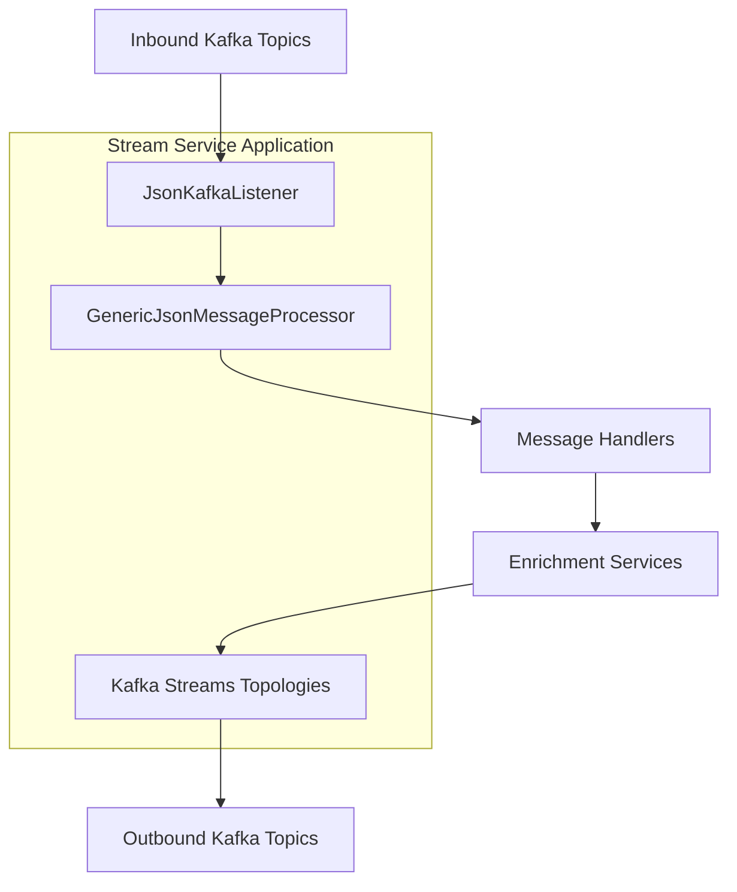
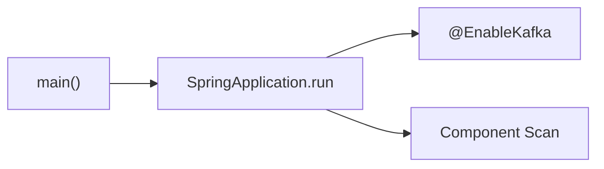
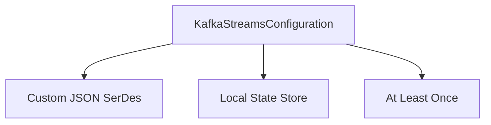
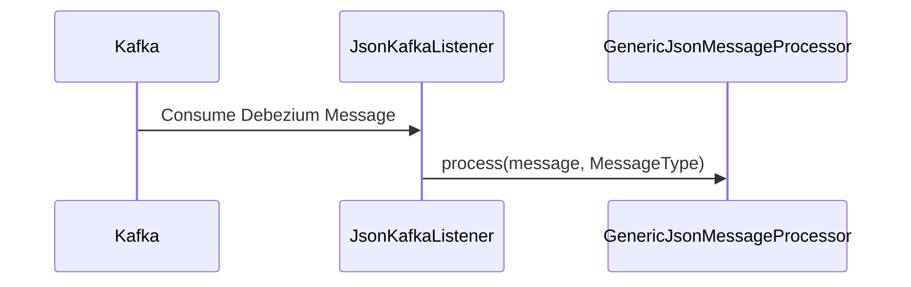
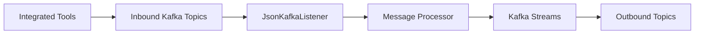

# Stream Service – Application and Kafka Processing

## Overview
The **Stream Service** is responsible for ingesting, processing, enriching, and routing real-time events from multiple integrated tools (FleetDM, Tactical RMM, MeshCentral, etc.) using **Kafka** and **Kafka Streams**. It acts as the real-time backbone of OpenFrame, transforming raw change-data-capture (CDC) and tool events into normalized activity streams consumed by downstream services (API, data stores, analytics).

This module focuses on:
- Bootstrapping the Stream Service application
- Configuring Kafka consumers and Kafka Streams
- Listening to inbound JSON/Debezium events
- Delegating processing to typed handlers and enrichment services

The Stream Service integrates tightly with:
- Shared Kafka configuration (`data_layer_kafka_shared`)
- Stream deserializers and handlers
- Event mapping and enrichment services

---

## High-Level Architecture



---

## Module Responsibilities

| Area | Responsibility |
|-----|----------------|
| Application Bootstrap | Start Spring Boot app with Kafka enabled |
| Kafka Consumer | Listen to inbound Debezium and tool events |
| Message Routing | Route messages by `MessageType` |
| Stream Processing | Stateful and stateless Kafka Streams processing |
| Enrichment | Add tenant, tool, and activity metadata |

---

## Core Components

### StreamApplication
**Component:** `StreamApplication`

The entry point of the Stream Service.

**Responsibilities:**
- Bootstraps Spring Boot
- Enables Kafka support
- Scans stream, data, and Kafka producer packages



---

### KafkaConfig
**Component:** `KafkaConfig`

Provides Kafka-related bean configuration for consumers.

**Key Features:**
- Defines a custom `Converter<byte[], MessageType>`
- Converts Kafka header values into strongly typed `MessageType` enums
- Ensures invalid or unknown message types do not crash consumers

**Why this matters:**
Message routing in the Stream Service depends on the `MessageType` header. This converter ensures consistent interpretation across all inbound topics.

---

### KafkaStreamsConfig
**Component:** `KafkaStreamsConfig`

Central configuration for Kafka Streams processing.

**Responsibilities:**
- Enable Kafka Streams (`@EnableKafkaStreams`)
- Configure application ID with optional tenant or cluster scoping
- Define SerDes for domain stream models
- Tune consumer and producer behavior

#### Application ID Strategy

```text
application.id = spring.application.name[-cluster-id]
```

This allows:
- Multi-tenant isolation
- Multiple stream processors per cluster

#### Defined SerDes

| Model | Purpose |
|------|--------|
| ActivityMessage | Normalized activity events |
| HostActivityMessage | Host-level activity events |

#### Processing Guarantees
- **At-least-once** delivery
- Single-threaded stream processing (configurable)



---

### JsonKafkaListener
**Component:** `JsonKafkaListener`

Primary Kafka consumer entry point for inbound events.

**Subscribed Topics:**
- MeshCentral events
- Tactical RMM events
- FleetDM events
- FleetDM query result events

**Behavior:**
- Receives raw `CommonDebeziumMessage`
- Extracts `MessageType` from Kafka headers
- Delegates processing to `GenericJsonMessageProcessor`



---

## Related Sub-Modules

The Stream Service relies on several specialized sub-modules for full functionality:

- **Deserializers and Handlers** – message parsing and Debezium handling logic
- **Event Mapping and Models** – normalization of source-specific events
- **Enrichment Services** – augmentation with tenant and tool metadata

Each of these modules is documented separately to avoid duplication and to keep responsibilities clear.

---

## Data Flow Summary



---

## Operational Notes

- The Stream Service is **stateless** except for Kafka Streams local state stores
- Safe to horizontally scale by tenant or cluster ID
- Offset management is handled by Kafka consumer groups
- Failure recovery relies on Kafka replay and at-least-once semantics

---

## When to Modify This Module

Change this module when:
- Adding new inbound Kafka topics
- Introducing new stream processing topologies
- Modifying Kafka Streams performance characteristics
- Extending message type routing logic

For new event formats or enrichments, prefer extending the related sub-modules instead of modifying core listeners.

---

**End of Stream Service – Application and Kafka Processing Documentation**