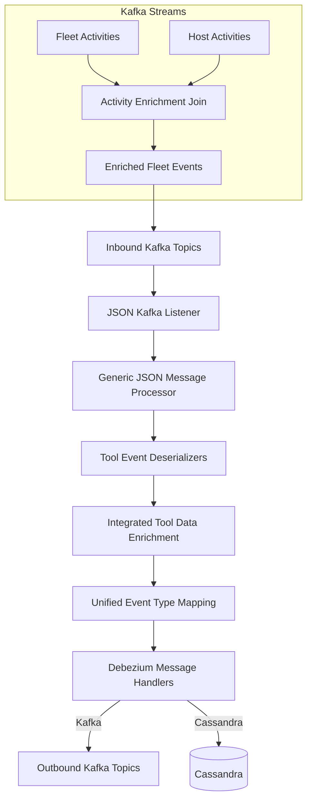
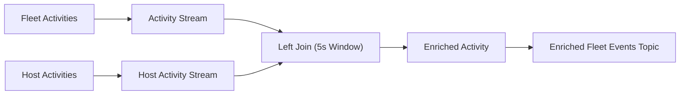

# Stream Service Core

## Overview

**Stream Service Core** is the event ingestion, normalization, and distribution engine of the OpenFrame platform. It consumes change data capture (CDC) and activity events from multiple integrated tools (Fleet MDM, Tactical RMM, MeshCentral), enriches them with tenant and device context, normalizes them into unified event types, and routes the resulting events to downstream systems such as Kafka topics and Cassandra-backed analytics stores.

This module is a Spring Boot service built around **Kafka**, **Kafka Streams**, and **Debezium-style CDC messages**. It is designed to be:

- **Multi-tenant aware** (tenant-scoped Kafka topics, cache-based enrichment)
- **Tool-agnostic** (pluggable deserializers per integrated tool)
- **Extensible** (new tools and event types can be added via mappings and handlers)
- **Fault-tolerant** (at-least-once processing semantics)

The Stream Service Core runs as the `StreamApplication` service and forms the backbone of OpenFrame’s real-time event pipeline.

---

## Responsibilities

Stream Service Core is responsible for:

- Listening to inbound Kafka topics containing Debezium and activity events
- Deserializing tool-specific payloads into a common internal representation
- Enriching events with device, user, and organization context
- Mapping source-specific event types into unified event types
- Persisting events to Cassandra and publishing normalized events back to Kafka
- Performing real-time stream joins and transformations using Kafka Streams

---

## High-Level Architecture

---

## Application Entry Point

### StreamApplication

The service is bootstrapped by `StreamApplication`, which:

- Enables Spring Boot auto-configuration
- Enables Kafka and Kafka Streams support
- Scans Stream, Data, and Kafka Producer packages

This establishes Stream Service Core as a standalone, scalable stream-processing service.

---

## Kafka Configuration

### KafkaConfig

`KafkaConfig` provides shared Kafka-related infrastructure, most notably:

- A custom `Converter<byte[], MessageType>`
- Conversion of Kafka headers into strongly typed `MessageType` enums

This converter allows the listener layer to reliably route messages based on their declared message type.

### KafkaStreamsConfig

`KafkaStreamsConfig` configures Kafka Streams processing:

- Builds a tenant- and cluster-aware `application.id`
- Configures serializers and deserializers for stream payloads
- Sets processing guarantees to **at-least-once**
- Defines state directory and consumer/producer tuning

It also defines custom SerDes for:

- `ActivityMessage`
- `HostActivityMessage`

These SerDes enable strongly typed stream joins and transformations.

---

## Inbound Event Listening

### JsonKafkaListener

`JsonKafkaListener` subscribes to multiple inbound Kafka topics, including:

- MeshCentral events
- Tactical RMM events
- Fleet MDM events
- Fleet MDM query result events

Each incoming message is accompanied by a `MessageType` Kafka header and forwarded to the generic processing pipeline.

---

## Deserialization Layer

Stream Service Core uses **tool-specific deserializers** to extract meaningful fields from raw Debezium payloads.

### Common Responsibilities

All deserializers:

- Extract agent identifiers
- Determine source event types
- Extract tool-specific event IDs
- Build human-readable messages
- Parse timestamps into epoch milliseconds

### Fleet Deserializers

- **FleetEventDeserializer**: Handles standard Fleet MDM activity events
- **FleetQueryResultEventDeserializer**: Handles scheduled and live query results, including structured error and result payloads

These deserializers leverage:

- `FleetActivityTypeMapping` for human-readable messages
- Cache services for query metadata

### MeshCentralEventDeserializer

Handles MeshCentral audit and activity events by:

- Parsing nested JSON payloads
- Combining `etype` and `action` fields
- Extracting event identifiers from Mongo-style IDs

### Tactical RMM Deserializers

- **TrmmAgentHistoryEventDeserializer**: Processes command and script execution history
- **TrmmAuditEventDeserializer**: Processes Tactical RMM audit log events

These components integrate with Tactical RMM cache services to resolve agent and script metadata.

---

## Unified Event Type Mapping

### SourceEventTypes

`SourceEventTypes` defines canonical string constants for all supported source event types, grouped by:

- MeshCentral
- Tactical RMM
- Fleet MDM

This ensures consistent identifiers across the pipeline.

### EventTypeMapper

`EventTypeMapper` maps:

- `(IntegratedToolType, sourceEventType)` → `UnifiedEventType`

This mapping normalizes hundreds of tool-specific events into a single unified taxonomy used across OpenFrame.

If no mapping is found, events are safely categorized as `UNKNOWN`.

---

## Data Enrichment

### IntegratedToolDataEnrichmentService

This service enriches deserialized events with contextual data:

- Machine ID
- Hostname
- Organization ID
- Organization name

It uses Redis-backed cache services to resolve agent identifiers into tenant-aware entities. Enrichment is optional and gracefully degrades if data is missing.

---

## Message Handling and Routing

### GenericMessageHandler

`GenericMessageHandler` defines the core processing contract:

- Validate incoming messages
- Transform messages into destination-specific models
- Determine operation type (CREATE, READ, UPDATE, DELETE)
- Route messages to the appropriate handler method

This abstraction ensures consistent handling across all destinations.

### DebeziumMessageHandler

`DebeziumMessageHandler` specializes the generic handler for Debezium CDC events by:

- Translating Debezium operation codes (`c`, `r`, `u`, `d`)
- Delegating transformation logic to concrete implementations

### Cassandra Handler

**DebeziumCassandraMessageHandler**:

- Transforms events into `UnifiedLogEvent`
- Builds composite Cassandra keys
- Persists events into Cassandra for analytics and querying

### Kafka Handler

**DebeziumKafkaMessageHandler**:

- Transforms events into `IntegratedToolEvent`
- Publishes normalized events to outbound Kafka topics
- Uses retrying, tenant-aware Kafka producers
- Filters out non-visible events

---

## Kafka Streams Processing

### ActivityEnrichmentService

This service uses Kafka Streams to enrich Fleet MDM activities by joining:

- Activity events
- Host activity events

within a bounded time window.

During enrichment:

- Host IDs are injected into activity records
- Agent IDs are normalized
- Kafka headers are added to ensure downstream compatibility

---

## Utility Components

### TimestampParser

`TimestampParser` converts ISO 8601 timestamps into epoch milliseconds, providing:

- Centralized parsing logic
- Graceful handling of malformed timestamps

---

## How Stream Service Core Fits Into the Platform

Stream Service Core sits between:

- **Upstream systems**: Integrated tools emitting CDC and activity events
- **Downstream systems**: Analytics stores, external APIs, real-time UI consumers

It acts as the normalization and distribution layer that allows OpenFrame to present a unified, real-time view of events across all managed tools.

---

## Extensibility Guidelines

To add support for a new integrated tool:

1. Define source event constants in `SourceEventTypes`
2. Implement a new tool-specific deserializer
3. Register unified mappings in `EventTypeMapper`
4. Ensure enrichment services can resolve agent identifiers

This design allows Stream Service Core to evolve without impacting existing integrations.

---

## Summary

**Stream Service Core** is the central event-processing engine of OpenFrame. By combining Kafka, Kafka Streams, Debezium, and a rich enrichment and mapping layer, it enables scalable, real-time, multi-tenant event processing across the entire platform.
