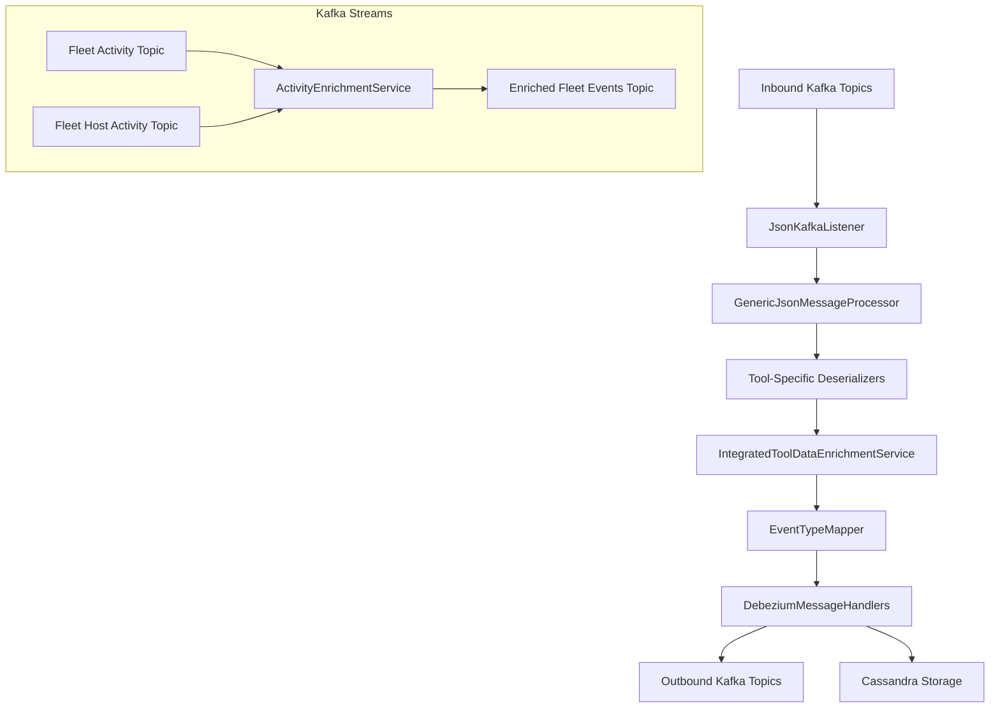
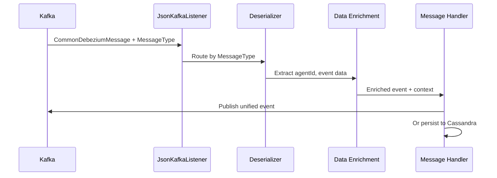

# Stream Service Core

## Overview
The **stream_service_core** module is responsible for real-time event ingestion, normalization, enrichment, and distribution within the OpenFrame platform. It consumes change data capture (CDC) and activity streams from integrated tools (Fleet MDM, Tactical RMM, MeshCentral), processes them through Kafka and Kafka Streams, enriches them with contextual metadata, maps them to unified event types, and routes them to downstream systems such as Kafka topics and Cassandra storage.

This module is a critical part of the event-driven architecture that powers auditing, activity timelines, automation triggers, and analytics across OpenFrame.

---

## Responsibilities

- Consume inbound Kafka topics carrying Debezium and activity events
- Deserialize tool-specific payloads into a normalized internal representation
- Enrich events with machine, organization, and user context
- Map source-specific event types to unified OpenFrame event types
- Persist events to Cassandra and/or publish them to outbound Kafka topics
- Perform stream-to-stream enrichment for Fleet MDM activities using Kafka Streams

---

## High-Level Architecture

---

## Core Processing Flow

---

## Key Components

### Configuration

- **KafkaConfig**  
  Provides Spring converters for Kafka headers, notably converting raw byte headers into `MessageType` enums.

- **KafkaStreamsConfig**  
  Configures Kafka Streams applications, including:
  - Application ID namespacing per tenant/cluster
  - SerDes for Fleet activity messages
  - Stream processing guarantees and performance tuning

---

### Kafka Listener

- **JsonKafkaListener**  
  Subscribes to inbound Kafka topics for integrated tools and delegates processing based on the `MessageType` header.

---

### Deserializers

Tool-specific deserializers convert raw Debezium payloads into a normalized internal representation:

- **FleetEventDeserializer** – Fleet MDM activity events
- **FleetQueryResultEventDeserializer** – Fleet query execution results
- **MeshCentralEventDeserializer** – MeshCentral audit and activity events
- **TrmmAgentHistoryEventDeserializer** – Tactical RMM agent execution history
- **TrmmAuditEventDeserializer** – Tactical RMM audit logs

Each deserializer is responsible for:
- Extracting agent identifiers
- Determining source event type
- Producing human-readable messages
- Parsing timestamps and details

---

### Mapping

- **EventTypeMapper**  
  Maps `(IntegratedToolType + SourceEventType)` pairs to `UnifiedEventType` enums used consistently across the platform.

- **FleetActivityTypeMapping**  
  Provides human-readable messages for Fleet MDM `activity_type` values.

- **SourceEventTypes**  
  Central registry of all known source event type constants, grouped by tool.

---

### Enrichment Services

- **IntegratedToolDataEnrichmentService**  
  Enriches events with machine and organization context using Redis-backed caches.

- **ActivityEnrichmentService**  
  Kafka Streams topology that joins Fleet activities with host activities to attach host and agent context before re-publishing enriched events.

---

### Message Handlers

Message handlers determine how normalized events are delivered:

- **GenericMessageHandler**  
  Base abstraction implementing CRUD-style handling based on Debezium operation type.

- **DebeziumMessageHandler**  
  Specialization for Debezium CDC messages.

- **DebeziumKafkaMessageHandler**  
  Publishes unified events to outbound Kafka topics.

- **DebeziumCassandraMessageHandler**  
  Persists unified log events into Cassandra for long-term storage and analytics.

---

## Integration with Other Modules

- **data_layer_kafka** – Provides Kafka configuration, headers, and retrying producers
- **data_layer_redis** – Supplies cached machine and organization metadata
- **data_layer_cassandra_pinot** – Stores unified log events for querying and analytics
- **api_service_core_graphql_rest** – Consumes unified events for APIs and dashboards

Refer to the respective module documentation for details on storage schemas and API exposure.

---

## Operational Characteristics

- **At-least-once delivery** semantics for Kafka Streams
- **Tenant-aware processing** via namespaced application IDs and topics
- **Extensible design** for adding new integrated tools or event types
- **Fault-tolerant** handling with retrying Kafka producers and defensive parsing

---

## Summary

The `stream_service_core` module is the backbone of OpenFrame’s real-time event pipeline. By combining Kafka, Debezium, enrichment services, and unified event mapping, it enables consistent, scalable, and tenant-aware processing of activity data across all integrated tools.
