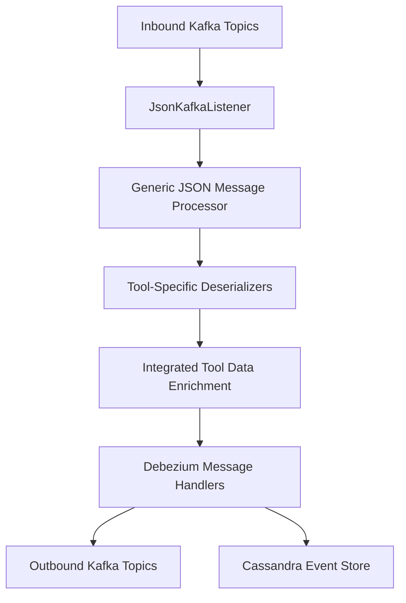
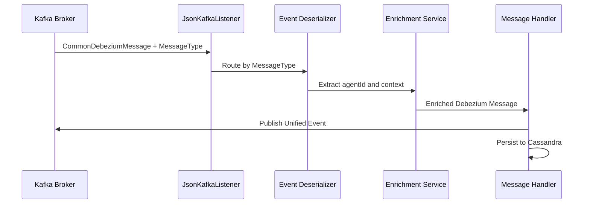

# stream_service_core

## Overview
The **stream_service_core** module is the event streaming and processing backbone of OpenFrame. It ingests change data capture (CDC) events from integrated tools (Fleet MDM, Tactical RMM, MeshCentral) via Kafka, enriches them with tenant and device context, normalizes them into unified event types, and routes them to downstream destinations such as Kafka topics and Cassandra for analytics and auditing.

This module is primarily used by the **openframe-stream** service bootstrap application and integrates closely with:
- Kafka transport and topic configuration
- Redis-based enrichment caches
- Cassandra and Kafka sinks
- Unified event models consumed by API, analytics, and frontend layers

## Responsibilities
- Consume inbound Kafka topics carrying Debezium-style events
- Deserialize tool-specific payloads into normalized domain events
- Enrich events with machine, organization, and user context
- Map source-specific event types into unified event types
- Persist or forward processed events to downstream systems

---

## High-Level Architecture

---

## Core Subsystems

### 1. Kafka Configuration
Handles Kafka consumer, producer, and Kafka Streams setup.

- **KafkaConfig**: Provides converters for Kafka headers (e.g., message type headers).
- **KafkaStreamsConfig**: Configures Kafka Streams applications, serdes, state directories, and tenant-aware application IDs.

📄 See: [Kafka Configuration](submodules/kafka_configuration.md)

---

### 2. Kafka Streams – Activity Enrichment
Fleet MDM emits activities and host-activity mappings on separate topics. This module joins and enriches them.

- Joins activity and host-activity streams
- Injects agent and host identifiers
- Emits enriched events to downstream topics

📄 See: [Activity Enrichment Streams](submodules/activity_enrichment.md)

---

### 3. Event Deserialization Layer
Each integrated tool has a dedicated deserializer that understands its schema and semantics.

Supported tools:
- Fleet MDM (events and query results)
- Tactical RMM (audit and agent history)
- MeshCentral (server, user, and device events)

📄 See: [Event Deserializers](submodules/deserializers.md)

---

### 4. Event Type Mapping
Source-specific event identifiers are mapped into a unified taxonomy.

- **EventTypeMapper**: Maps `(tool, sourceEventType)` → `UnifiedEventType`
- **SourceEventTypes**: Central registry of all known source event constants
- **FleetActivityTypeMapping**: Human-readable messages for Fleet activities

📄 See: [Event Type Mapping](submodules/event_mapping.md)

---

### 5. Message Handling & Routing
After deserialization and enrichment, messages are routed based on destination and operation type.

- **GenericMessageHandler**: Base template for operation-based handling
- **DebeziumMessageHandler**: CDC-aware handler resolving CREATE/UPDATE/DELETE semantics
- **DebeziumKafkaMessageHandler**: Publishes unified events to Kafka
- **DebeziumCassandraMessageHandler**: Persists unified events into Cassandra

📄 See: [Message Handlers](submodules/message_handlers.md)

---

### 6. Data Enrichment Services
Adds contextual metadata required by downstream consumers.

- **IntegratedToolDataEnrichmentService**: Resolves agent → machine → organization using Redis caches

📄 See: [Data Enrichment](submodules/data_enrichment.md)

---

### 7. Utility Components
Shared helpers used across the stream pipeline.

- **TimestampParser**: Robust ISO-8601 timestamp parsing for CDC events

---

## Runtime Flow

---

## Integration Points

- **Kafka Topics**: Defined and managed by the data_kafka_transport module
- **Redis Cache**: Provided by data_redis_cache for machine and organization lookups
- **Cassandra**: Configured via data_core_and_pinot for long-term event storage
- **API & External Services**: Consume unified events downstream via Kafka

---

## Summary
The **stream_service_core** module provides a scalable, extensible, and tenant-aware event processing pipeline. By separating deserialization, enrichment, mapping, and handling concerns, it enables OpenFrame to integrate multiple external tools while maintaining a consistent internal event model.
