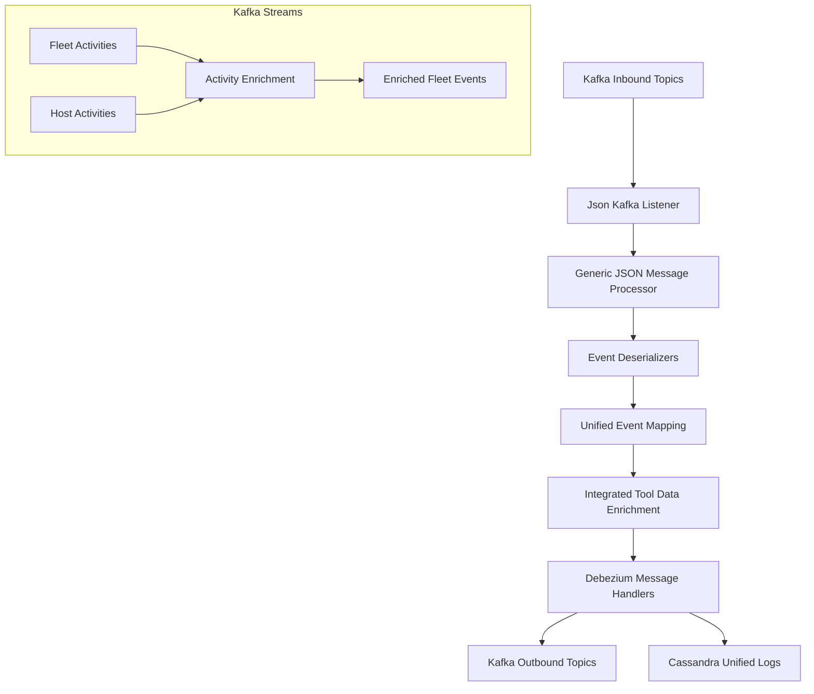
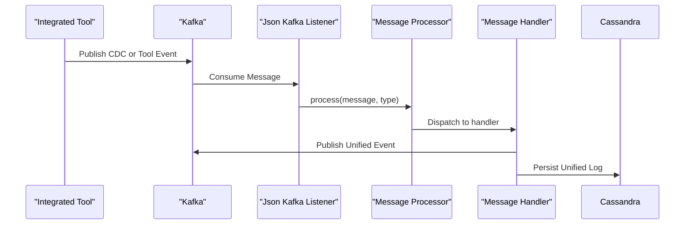
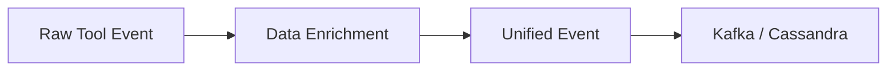

# Stream Service Core

## Overview

The **Stream Service Core** module is responsible for real-time event ingestion, enrichment, normalization, and distribution across the OpenFrame platform. It consumes change data capture (CDC) events and tool-generated events from Kafka, normalizes them into unified event models, enriches them with contextual metadata, and forwards them to downstream systems such as Kafka topics and Cassandra for analytics and auditing.

At a high level, Stream Service Core sits between:
- **Integrated tools** (Fleet MDM, Tactical RMM, MeshCentral)
- **The data layer** (Kafka, Redis, Cassandra)
- **Downstream consumers** (API services, analytics, audit logs)

It is a critical backbone for observability, compliance logging, automation triggers, and near-real-time insights in the OpenFrame ecosystem.

---

## Responsibilities

The Stream Service Core module provides the following core capabilities:

- **Kafka ingestion** of Debezium CDC events and tool-specific events
- **Typed deserialization** of heterogeneous event formats
- **Event normalization** into unified event types
- **Contextual enrichment** using cached machine and organization metadata
- **Stream processing** and joins using Kafka Streams
- **Fan-out delivery** to Kafka topics and Cassandra storage

---

## High-Level Architecture

---

## Inbound Event Flow

---

## Core Components

### Kafka Configuration

- **KafkaConfig**
  - Registers a `Converter<byte[], MessageType>` to extract message type headers from Kafka records.

- **KafkaStreamsConfig**
  - Configures Kafka Streams runtime properties.
  - Defines application ID namespacing via cluster or tenant ID.
  - Provides JSON SerDes for stream processing models such as `ActivityMessage` and `HostActivityMessage`.

---

### Kafka Listener

- **Json Kafka Listener**
  - Subscribes to inbound Kafka topics for Fleet, Tactical RMM, and MeshCentral.
  - Delegates processing to a generic message processor based on message type headers.

This component acts as the single ingress point for all streaming events.

---

### Event Deserializers

Each integrated tool has a dedicated deserializer that:
- Extracts agent identifiers
- Resolves source event types
- Builds human-readable messages
- Parses timestamps and optional details

Key deserializers include:

- **Fleet Event Deserializer**
  - Handles Fleet MDM activity events.
  - Maps `activity_type` to readable messages.

- **Fleet Query Result Event Deserializer**
  - Processes scheduled and live query results.
  - Enriches output with cached query metadata.

- **MeshCentral Event Deserializer**
  - Parses embedded JSON payloads.
  - Extracts compound event types (`etype.action`).

- **Tactical RMM Agent History and Audit Deserializers**
  - Convert agent execution history and audit logs into normalized events.

---

### Event Type Mapping

- **Event Type Mapper**
  - Translates tool-specific event types into `UnifiedEventType` values.
  - Provides a single semantic event taxonomy across all tools.

- **Source Event Types**
  - Centralized constants defining all supported source event identifiers.

- **Fleet Activity Type Mapping**
  - Maps Fleet activity identifiers to human-readable descriptions.

---

### Stream Processing and Enrichment

- **Activity Enrichment Service**
  - Uses Kafka Streams to join Fleet activity events with host activity data.
  - Resolves host and agent identifiers.
  - Adds required Kafka headers for downstream compatibility.

- **Integrated Tool Data Enrichment Service**
  - Enriches events with machine and organization metadata.
  - Fetches cached data from Redis-backed services.

---

### Message Handlers

Handlers encapsulate destination-specific logic:

- **Generic Message Handler**
  - Defines the lifecycle for create, update, read, and delete operations.

- **Debezium Message Handler**
  - Interprets Debezium operation codes (`c`, `u`, `r`, `d`).

- **Debezium Kafka Message Handler**
  - Publishes unified events to outbound Kafka topics.

- **Debezium Cassandra Message Handler**
  - Persists unified log events into Cassandra for analytics and audit queries.

---

## Data Models

- **Activity Message / Host Activity Message**
  - Typed wrappers around Debezium messages for Kafka Streams processing.

- **Unified Log Event**
  - Canonical representation of an event across all integrated tools.

These models allow downstream services to consume a consistent, tool-agnostic event stream.

---

## How Stream Service Core Fits Into the Platform

The Stream Service Core acts as the real-time nervous system of OpenFrame:

- It bridges **integrated tools** with the **data layer**.
- It enables **auditing, compliance, and monitoring** features.
- It supplies **normalized event streams** to API services and analytics engines.

Without this module, higher-level services would need to handle tool-specific logic, breaking separation of concerns and increasing complexity.

---

## Summary

The **Stream Service Core** module:

- Centralizes streaming ingestion and processing
- Normalizes diverse tool events into unified semantics
- Enriches events with tenant, machine, and organization context
- Reliably distributes events to Kafka and Cassandra

It is a foundational component for scalable, observable, and automation-ready MSP operations in the OpenFrame platform.
