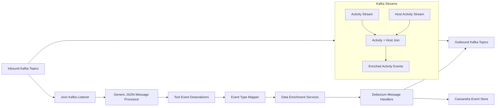
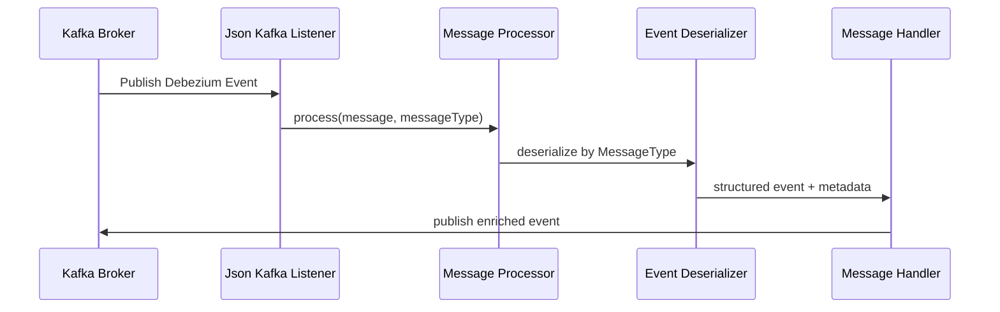
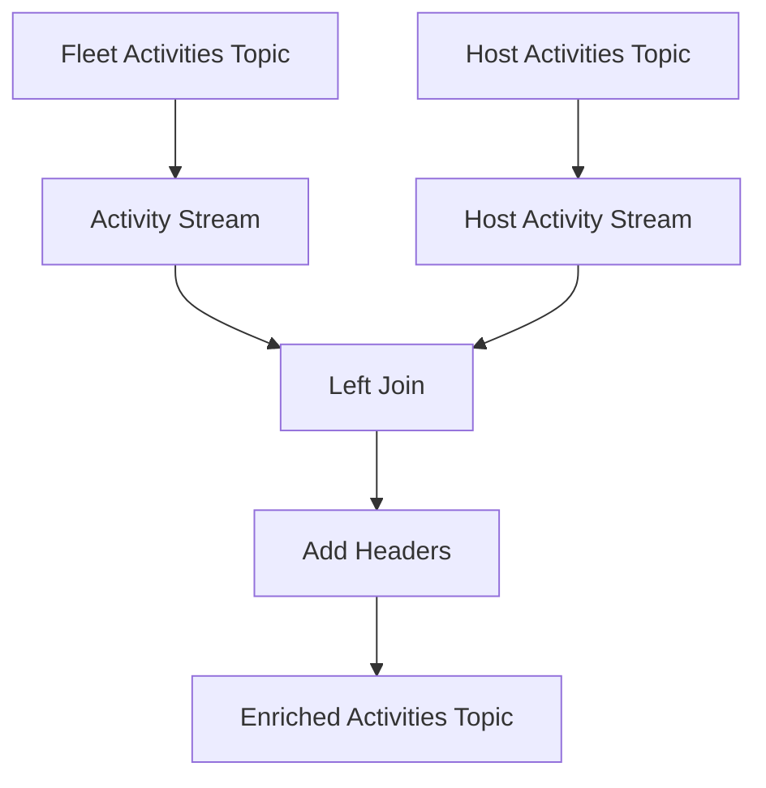

# Stream Service Core

## Overview

The **Stream Service Core** module is the real-time event processing backbone of the OpenFrame platform. It consumes change data capture (CDC) and event streams from integrated tools (Fleet MDM, Tactical RMM, MeshCentral), normalizes them into unified event models, enriches them with tenant, device, and organization context, and routes the results to downstream systems such as Kafka topics and Cassandra for analytics and audit workloads.

This module is deployed as the **Stream Application** and is designed around:

- **Kafka consumers and Kafka Streams** for scalable stream processing
- **Debezium CDC messages** as the primary event source
- **Pluggable deserializers and handlers** per integrated tool
- **Unified event taxonomy** for cross-tool observability

---

## Responsibilities

Stream Service Core is responsible for:

- Consuming inbound Kafka topics containing Debezium and tool-generated events
- Deserializing raw JSON payloads into structured domain messages
- Mapping tool-specific event types to **Unified Event Types**
- Enriching events with device, user, and organization metadata
- Producing enriched events to Kafka and persisting selected events to Cassandra
- Running Kafka Streams topologies for event correlation and enrichment

---

## High-Level Architecture

---

## Kafka Integration

### Kafka Configuration

- **KafkaConfig**
  - Registers a custom converter to resolve `MessageType` from Kafka headers
  - Enables routing of messages to the correct deserializer pipeline

- **KafkaStreamsConfig**
  - Configures Kafka Streams runtime
  - Sets application ID with optional cluster or tenant suffix
  - Defines SerDes for activity-related messages

Key characteristics:

- At-least-once processing semantics
- Single stream thread per instance (configurable)
- Tenant-aware application identifiers

---

## Event Ingestion Flow

---

## Deserialization Layer

Each integrated tool has a dedicated **Event Deserializer** responsible for:

- Extracting agent or device identifiers
- Resolving tool-specific event types
- Producing human-readable messages
- Parsing timestamps and details

### Supported Deserializers

- **Fleet Event Deserializer**
  - Handles Fleet MDM activity events
  - Maps activity types to readable messages

- **Fleet Query Result Event Deserializer**
  - Processes scheduled and live query results
  - Enriches messages using cached query metadata

- **MeshCentral Event Deserializer**
  - Parses embedded JSON payloads
  - Extracts composite event types such as `etype.action`

- **Tactical RMM Agent History Deserializer**
  - Handles command and script execution lifecycle events

- **Tactical RMM Audit Deserializer**
  - Processes audit log entries

All deserializers emit a normalized **Deserialized Debezium Message** with consistent fields.

---

## Event Type Normalization

The **Event Type Mapper** translates tool-specific source event types into a common taxonomy.

Benefits:

- Enables cross-tool analytics
- Simplifies downstream consumers
- Provides consistent severity and categorization

If no mapping exists, events are safely classified as **UNKNOWN**.

---

## Data Enrichment

### Integrated Tool Data Enrichment Service

Before routing events, Stream Service Core enriches them using cached metadata:

- Agent ID → Machine ID
- Machine ID → Organization context
- Hostname and tenant identifiers

This enrichment relies on Redis-backed cache services and ensures that downstream consumers do not need to perform additional lookups.

---

## Message Handling and Routing

### Generic Message Handler

All handlers inherit from a shared processing model:

1. Validate message
2. Transform payload
3. Determine operation type (create, update, delete)
4. Route to destination

### Debezium Message Handlers

- **Kafka Handler**
  - Publishes unified events to outbound Kafka topics
  - Uses tenant-aware retrying producers

- **Cassandra Handler**
  - Persists unified log events for analytics and auditing
  - Uses composite keys optimized for time-series access

---

## Kafka Streams Processing

### Activity Enrichment Stream

The **Activity Enrichment Service** runs a Kafka Streams topology that:

- Consumes Fleet activity and host activity topics
- Joins activities with host metadata within a time window
- Injects required Kafka headers
- Publishes enriched activity events

---

## Utility Components

- **Timestamp Parser**
  - Safely parses ISO 8601 timestamps emitted by Debezium
  - Converts to epoch milliseconds

- **Fleet Activity Type Mapping**
  - Maps Fleet MDM activity codes to readable messages

- **Source Event Types**
  - Central registry of tool-specific event identifiers

---

## Position in the Platform

Stream Service Core acts as the **event normalization and routing layer** between:

- Upstream systems producing CDC and operational events
- Downstream consumers such as analytics, alerting, and UI services

It integrates closely with:

- Kafka-based data infrastructure
- Redis-based cache services
- Cassandra for long-term event storage

---

## Summary

The **Stream Service Core** module enables OpenFrame to process high-volume, multi-tool event streams in real time. By combining Kafka, Debezium, enrichment services, and unified event mapping, it provides a scalable and consistent foundation for observability, automation, and analytics across the platform.
