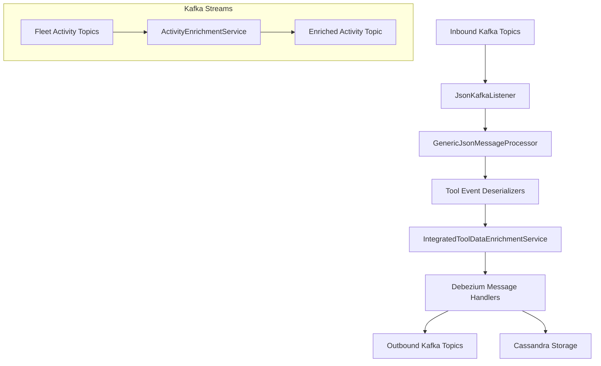

# Stream Service – Core Kafka Processing

## Overview

The **stream_service_core_kafka_processing** module is the heart of OpenFrame's real-time event ingestion and processing pipeline. It consumes change data capture (CDC) events and activity streams from multiple integrated tools (Fleet MDM, MeshCentral, Tactical RMM) via Kafka, normalizes them into unified event models, enriches them with tenant and device context, and routes them to downstream destinations such as Kafka topics and Cassandra for long-term storage and analytics.

This module is used by the **Stream Service Application** and depends heavily on shared Kafka, data, and enrichment libraries. It is designed to be **multi-tenant aware**, **idempotent**, and **extensible** for new integrated tools and event types.

---

## Responsibilities

At a high level, this module is responsible for:

- Consuming Debezium-based CDC events from Kafka
- Deserializing tool-specific event payloads
- Mapping tool-native event types to unified OpenFrame event types
- Enriching events with machine, organization, and user context
- Processing events using Kafka Streams where correlation is required
- Dispatching processed events to Kafka and Cassandra destinations

---

## High-Level Architecture

---

## Module Composition

The module is composed of the following functional areas:

- **Kafka Configuration** – Core Kafka and Kafka Streams setup
- **Kafka Listeners** – Entry point for inbound events
- **Deserializers** – Tool-specific event parsing
- **Event Mapping** – Mapping source events to unified types
- **Enrichment Services** – Adding machine and organization context
- **Message Handlers** – Routing events to destinations
- **Kafka Streams Processing** – Stateful stream enrichment
- **Utilities and Models** – Shared helpers and typed models

Each area is documented in its own sub-module file.

---

## Sub-Module Documentation

- [Kafka Configuration](stream_service_kafka_configuration.md)
- [Kafka Listeners and Processing Flow](stream_service_kafka_listeners.md)
- [Event Deserializers](stream_service_event_deserializers.md)
- [Event Mapping](stream_service_event_mapping.md)
- [Enrichment Services](stream_service_enrichment_services.md)
- [Message Handlers](stream_service_message_handlers.md)
- [Kafka Streams – Activity Enrichment](stream_service_kafka_streams_activity_enrichment.md)
- [Models and Utilities](stream_service_models_and_utilities.md)

---

## How This Module Fits Into the Platform

- **Upstream producers**: Integrated tools emit CDC events via Debezium into Kafka
- **This module**: Normalizes, enriches, and routes those events
- **Downstream consumers**:
  - API services (via Kafka topics)
  - Analytics and observability layers (via Cassandra and Pinot)

This design allows OpenFrame to scale event ingestion independently from API and UI workloads.

---

## Key Design Principles

- **Tool-agnostic core** with pluggable deserializers
- **Unified event model** for consistent downstream processing
- **At-least-once processing** guarantees
- **Tenant isolation** through Kafka topic naming and headers
- **Extensibility** for new tools and event types

---

## Summary

The **stream_service_core_kafka_processing** module is the backbone of OpenFrame’s event-driven architecture. It bridges the gap between raw, tool-specific change events and normalized, enriched, tenant-aware events used throughout the platform.

For implementation details, refer to the linked sub-module documentation files above.