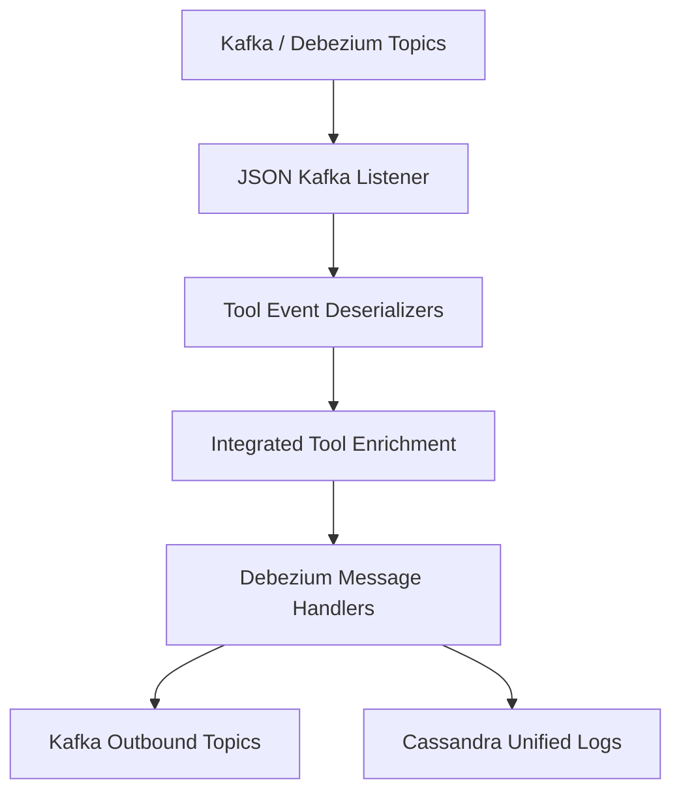
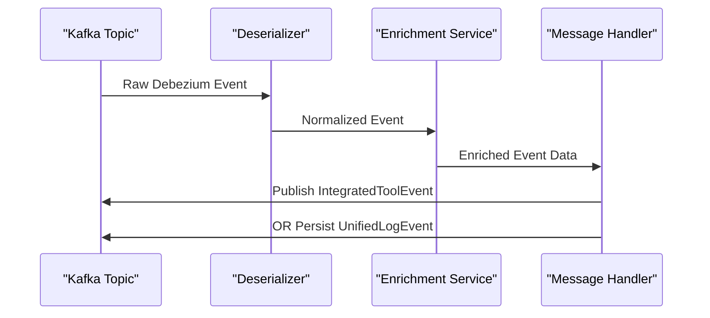

# Stream Service Deserializers and Handlers

This module is part of the **OpenFrame Stream Service** and is responsible for converting raw change-data-capture (CDC) and tool-specific events into normalized, enriched events, then routing them to downstream destinations such as Kafka and Cassandra.

It sits between **Kafka/Debezium ingestion** and **event persistence or fan-out**, providing:

- Tool-specific **event deserialization**
- Unified event typing and timestamps
- Message validation and filtering
- Destination-specific **message handling**

---

## Architectural Context

The module integrates closely with:

- **stream_service_app_and_kafka_processing** – Kafka Streams and listeners
- **stream_service_event_mapping_and_models** – Event type mappings and models
- **stream_service_enrichment_services** – Organization, user, and device enrichment

It does not directly manage Kafka consumption or persistence schemas; instead, it focuses on *event interpretation and routing*.

---

## High-Level Architecture

---

## Module Responsibilities

### 1. Event Deserialization

Tool-specific payloads (FleetDM, MeshCentral, Tactical RMM) are normalized into a **DeserializedDebeziumMessage** with:

- Agent / device identifiers
- Source event type
- Human-readable message
- Event timestamp
- Optional error and result payloads

See: [Deserializers](Deserializers.md)

---

### 2. Message Handling and Routing

Normalized events are then:

- Validated
- Transformed into destination-specific models
- Routed based on **operation type** and **destination**

Handlers abstract away persistence and publishing logic.

See: [Handlers](Handlers.md)

---

## Data Flow Summary

---

## Extensibility Guidelines

- **New tools**: Add a new `IntegratedToolEventDeserializer`
- **New destinations**: Implement a new `DebeziumMessageHandler`
- **Filtering logic**: Override `isValidMessage()` in handlers

This design keeps tool logic isolated from transport and storage concerns.

---

## Summary

The `stream_service_deserializers_and_handlers` module is the **interpretation and routing layer** of the OpenFrame streaming pipeline. It ensures that heterogeneous tool events become consistent, enriched, and actionable data across the platform.
