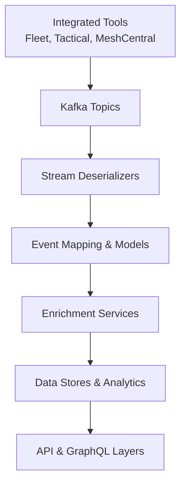
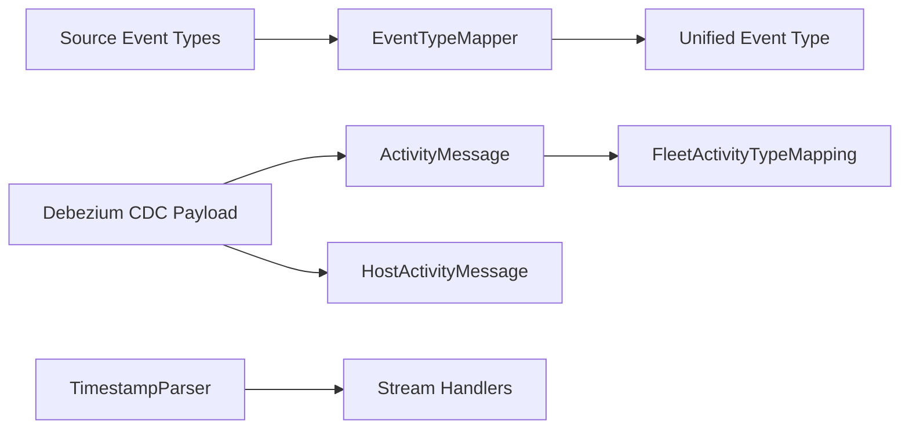

# Stream Service Event Mapping and Models

## Overview

The **stream_service_event_mapping_and_models** module is a core part of the OpenFrame Stream Service. It provides:

- **Canonical event normalization**: Mapping heterogeneous event types emitted by integrated tools (Fleet MDM, Tactical RMM, MeshCentral) into a single `UnifiedEventType` taxonomy.
- **Strongly typed CDC models**: Typed Debezium message wrappers for Fleet activity streams.
- **Human-readable enrichment helpers**: Translating raw Fleet activity codes into user-facing messages.
- **Shared utilities**: Timestamp parsing helpers for CDC payloads.

This module sits between **Kafka/Debezium ingestion** and **downstream enrichment, persistence, and API layers**, ensuring that all events are consistently classified and interpretable across the platform.

---

## Position in the Overall System

At runtime, this module is primarily consumed by:

- **Stream ingestion and handlers** (see stream service deserializers and handlers)
- **Enrichment services** (activity and tool enrichment)
- **Downstream persistence and analytics** (Pinot, MongoDB, APIs)

High-level flow:

---

## Architecture Overview

The module is organized into three conceptual areas:

1. **Event Type Mapping** – Converts tool-specific event identifiers into unified platform-wide event types.
2. **Fleet Activity Models** – Typed CDC models for Fleet MDM activity streams.
3. **Utilities** – Shared helpers used during stream processing.

---

## Core Sub-Modules

### 1. Event Type Mapping

**Purpose:** Normalize raw event identifiers from different tools into a single, consistent taxonomy (`UnifiedEventType`).

**Key Components:**

- `EventTypeMapper`
- `SourceEventTypes`

This logic is foundational for cross-tool analytics, alerting, and UI presentation, allowing the rest of the platform to reason about *what happened* without caring *where it came from*.

➡️ See detailed documentation: [event_type_mapping.md](event_type_mapping.md)

---

### 2. Fleet Activity Models and Messages

**Purpose:** Provide strongly typed models and readable descriptions for Fleet MDM activity streams.

**Key Components:**

- `ActivityMessage`
- `HostActivityMessage`
- `HostActivity`
- `FleetActivityTypeMapping`

These classes ensure Fleet CDC events can be processed safely (no raw JSON casting) and rendered with meaningful messages.

➡️ See detailed documentation: [fleet_activity_models.md](fleet_activity_models.md)

---

### 3. Shared Utilities

**Purpose:** Offer reusable helpers required during stream ingestion and transformation.

**Key Components:**

- `TimestampParser`

This utility standardizes timestamp handling across all integrated tools.

➡️ See detailed documentation: [stream_utilities.md](stream_utilities.md)

---

## How This Module Is Used

1. **Kafka consumers** deserialize CDC events from integrated tools.
2. **EventTypeMapper** translates tool-specific event codes into `UnifiedEventType`.
3. **Typed Debezium models** (`ActivityMessage`, `HostActivityMessage`) expose structured data to handlers.
4. **FleetActivityTypeMapping** enriches Fleet events with human-readable messages.
5. **TimestampParser** normalizes timestamps for storage and querying.

---

## Design Considerations

- **Centralized mapping logic** prevents duplicated and inconsistent event handling across services.
- **Explicit constants (`SourceEventTypes`)** reduce typos and make new integrations safer to add.
- **Fail-safe defaults** (`UnifiedEventType.UNKNOWN`) ensure unknown events do not break the pipeline.
- **Strong typing over raw JSON** improves reliability and maintainability of stream processing code.

---

## Extending the Module

When introducing a new integrated tool or event type:

1. Add constants to `SourceEventTypes`.
2. Register mappings in `EventTypeMapper.initializeDefaultMappings()`.
3. (If Fleet-related) add a human-readable message to `FleetActivityTypeMapping`.
4. Add or reuse typed Debezium message models if new CDC topics are introduced.

This ensures new events automatically flow through enrichment, storage, and APIs without downstream changes.
