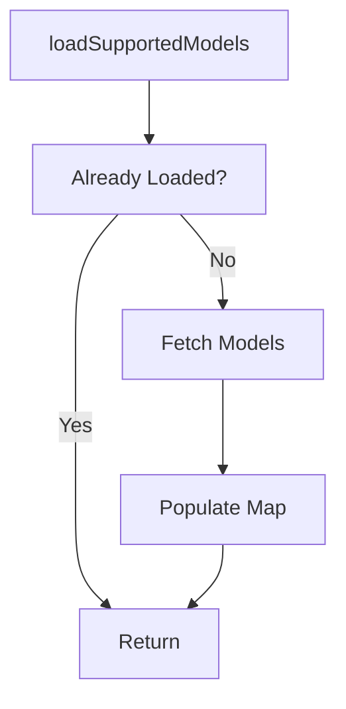

# SupportedModelsService

## Purpose
`SupportedModelsService` discovers and caches the AI models supported by the OpenFrame backend. This allows the client to display friendly model names, validate selections, and adapt UX based on model capabilities.

---

## Core Responsibilities

- Fetch supported AI models from the backend
- Normalize models across multiple providers
- Cache model metadata locally
- Provide lookup and validation helpers

---

## Loading Lifecycle

---

## Data Source

- **Endpoint**: `/chat/api/v1/ai-configuration/supported-models`
- **Authentication**: Bearer token via TokenService

---

## Public API

- `getModelDisplayName(modelName)`
- `getModel(modelName)`
- `getAllModels()`
- `isModelSupported(modelName)`
- `reset()`

---

## Integration Points

- **TokenService** – Provides token and API base URL
- **Chat UI** – Model selectors and informational displays

---

## Failure Behavior

- Network failures are logged
- Service remains in unloaded state
- UI may fall back to raw model identifiers
