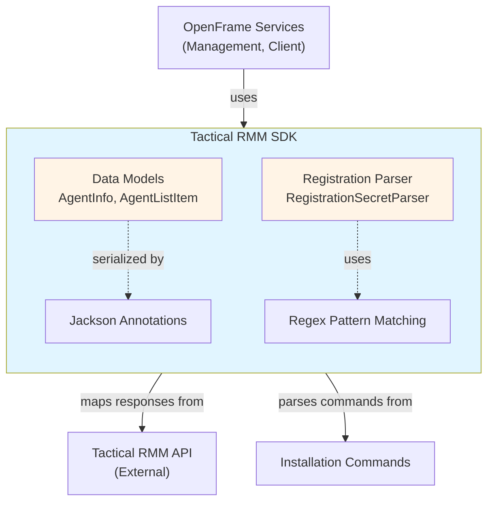
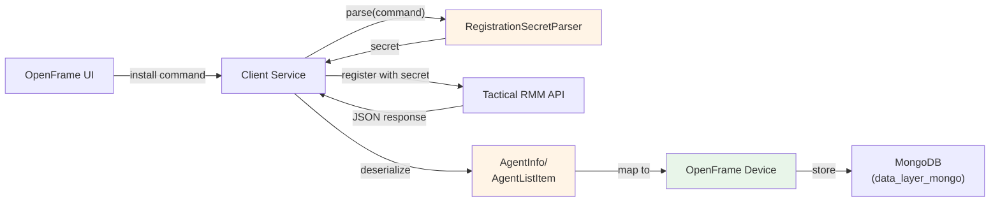

# Tactical RMM SDK

## Overview

The **Tactical RMM SDK** is a lightweight Java client library that provides integration capabilities with [Tactical RMM](https://github.com/amidaware/tacticalrmm), an open-source remote monitoring and management (RMM) platform. This SDK is part of the OpenFrame ecosystem and enables seamless communication between OpenFrame services and Tactical RMM instances for agent management, device monitoring, and system administration.

### Purpose

The SDK serves as a bridge between OpenFrame's unified MSP platform and Tactical RMM deployments, allowing:

- **Agent Registration**: Parse and extract authentication tokens from Tactical RMM installation commands
- **Agent Information Retrieval**: Fetch detailed agent metadata including platform, OS, and hostname
- **Agent List Management**: Query and manage lists of agents with client/site organization
- **API Response Mapping**: Deserialize Tactical RMM API responses into strongly-typed Java objects

### Key Features

- ✅ **Lightweight Design**: Minimal dependencies, focused on data models and utilities
- ✅ **Jackson Integration**: Automatic JSON serialization/deserialization with field mapping
- ✅ **Flexible Parsing**: Robust regex-based extraction of registration secrets from install commands
- ✅ **Backward Compatibility**: Alias methods for legacy integrations
- ✅ **Ignore Unknown Fields**: Resilient to API changes with `@JsonIgnoreProperties`

---

## Architecture Overview

The Tactical RMM SDK follows a simple, focused architecture with three primary components:



### Component Responsibilities

| Component | Responsibility | Key Classes |
|-----------|---------------|-------------|
| **Data Models** | Represent Tactical RMM entities as Java POJOs | `AgentInfo`, `AgentListItem` |
| **Registration Parser** | Extract authentication tokens from install commands | `RegistrationSecretParser` |
| **Jackson Annotations** | Configure JSON mapping for API responses | `@JsonProperty`, `@JsonIgnoreProperties` |

---

## Core Components

### 1. AgentInfo

**Purpose**: Represents detailed agent information returned by Tactical RMM API.

**Key Fields**:
- `agentId` - Unique agent identifier (UUID format)
- `platform` - Operating system platform (e.g., "windows", "linux")
- `operatingSystem` - Detailed OS version string
- `hostname` - Machine hostname

**Usage Context**:
```java
// Typically used when fetching detailed agent information
AgentInfo agent = tacticalRmmClient.getAgentDetails(agentId);
System.out.println("Agent: " + agent.getHostname() + " on " + agent.getPlatform());
```

**JSON Mapping Example**:
```json
{
  "agent_id": "a1b2c3d4-e5f6-7890-abcd-ef1234567890",
  "plat": "windows",
  "operating_system": "Windows 10 Pro 22H2",
  "hostname": "DESKTOP-ABC123"
}
```

---

### 2. AgentListItem

**Purpose**: Represents a lightweight agent entry in list responses (when `detail=false`).

**Key Fields**:
- `id` - Numeric primary key in Tactical RMM database
- `agentId` - UUID identifier (same as AgentInfo)
- `hostname` - Machine hostname
- `site` - Site name in organizational hierarchy
- `client` - Client/customer name

**Special Features**:
- **Backward Compatibility**: Provides `getPk()` alias for `getId()` to support legacy cache services
- **Organizational Context**: Includes client/site for multi-tenant filtering

**Usage Context**:
```java
// Used for listing agents with minimal data transfer
List<AgentListItem> agents = tacticalRmmClient.listAgents(false);
agents.forEach(agent -> 
    System.out.println(agent.getClient() + " / " + agent.getSite() + " / " + agent.getHostname())
);
```

**JSON Mapping Example**:
```json
{
  "id": 42,
  "agent_id": "a1b2c3d4-e5f6-7890-abcd-ef1234567890",
  "hostname": "DESKTOP-ABC123",
  "site": "Main Office",
  "client": "Acme Corporation"
}
```

---

### 3. RegistrationSecretParser

**Purpose**: Extracts authentication tokens from Tactical RMM agent installation commands.

**Key Method**: `parse(String command)` → `String`

**Parsing Logic**:
1. **Primary Pattern**: Case-insensitive search for `--auth` flag with optional quotes
2. **Fallback Pattern**: Simpler pattern without quote handling
3. **Quote Stripping**: Removes surrounding quotes if present
4. **Null Safety**: Returns empty string for null/blank input

**Supported Command Formats**:
```bash
# Windows installer with full command chain
tacticalagent-v2.9.0-windows-amd64.exe /VERYSILENT && "C:\Program Files\TacticalAgent\tacticalrmm.exe" -m install --api http://tactical.example.com --client-id 1 --site-id 1 --agent-type server --auth 15ec17179f1c4db7082386ed631d4bbb

# Linux installer with quoted auth
./tacticalagent -m install --api https://tactical.example.com --auth "15ec17179f1c4db7082386ed631d4bbb"

# Minimal format
--auth 15ec17179f1c4db7082386ed631d4bbb
```

**Usage Context**:
```java
String installCommand = getInstallCommandFromUI();
String secret = RegistrationSecretParser.parse(installCommand);

// Use secret for agent registration
agentRegistrationService.registerAgent(secret, deviceInfo);
```

**Regex Pattern Details**:
- **Primary**: `(?i)--auth\s+([\"']?)([^\"'\s]+)\1`
  - `(?i)` - Case insensitive
  - `--auth\s+` - Match flag with whitespace
  - `([\"']?)` - Optional opening quote (captured for backreference)
  - `([^\"'\s]+)` - Capture token (non-quote, non-space)
  - `\1` - Match same closing quote as opening
- **Fallback**: `(?i)--auth\s+([^\s]+)` - Simple token capture

---

## Integration with OpenFrame

### Service Dependencies

The Tactical RMM SDK is primarily consumed by:

1. **[Management Service](management_service.md)** - Tool integration and agent initialization
   - `IntegratedToolAgentInitializer` uses SDK models for agent provisioning
   - `IntegratedToolController` manages Tactical RMM tool configurations

2. **[Client Service](client_service.md)** - Agent registration and authentication
   - `AgentRegistrationProcessor` uses `RegistrationSecretParser` to validate install commands
   - `AgentAuthController` maps agent data to OpenFrame device models

### Data Flow



### Example Integration Flow

**Scenario**: User installs Tactical RMM agent on a new device

1. **UI Generates Install Command**:
   ```text
   tacticalagent.exe --api http://tactical.local --auth abc123...
   ```

2. **Client Service Parses Secret**:
   ```java
   String secret = RegistrationSecretParser.parse(installCommand);
   // Result: "abc123..."
   ```

3. **Agent Registers with Tactical RMM**:
   - Agent contacts Tactical RMM API using secret
   - Tactical RMM validates and returns agent details

4. **Client Service Fetches Agent Info**:
   ```java
   AgentInfo agentInfo = tacticalRmmClient.getAgent(agentId);
   ```

5. **Map to OpenFrame Device**:
   ```java
   Device device = new Device();
   device.setExternalId(agentInfo.getAgentId());
   device.setHostname(agentInfo.getHostname());
   device.setPlatform(agentInfo.getPlatform());
   deviceRepository.save(device);
   ```

---

## API Response Mapping

### Jackson Configuration

All model classes use Jackson annotations for automatic JSON mapping:

| Annotation | Purpose | Example |
|------------|---------|---------|
| `@JsonIgnoreProperties(ignoreUnknown = true)` | Ignore extra fields from API | Resilient to API version changes |
| `@JsonProperty("field_name")` | Map JSON field to Java property | `@JsonProperty("agent_id")` → `agentId` |

### Field Naming Convention

- **JSON (Tactical RMM API)**: `snake_case` (e.g., `agent_id`, `operating_system`)
- **Java (SDK Models)**: `camelCase` (e.g., `agentId`, `operatingSystem`)

**Mapping is automatic** via `@JsonProperty` annotations.

---

## Usage Examples

### Example 1: Parse Registration Secret

```java
import com.openframe.sdk.tacticalrmm.RegistrationSecretParser;

public class AgentRegistrationService {
    
    public String extractSecret(String installCommand) {
        // Parse the install command
        String secret = RegistrationSecretParser.parse(installCommand);
        
        if (secret.isEmpty()) {
            throw new IllegalArgumentException("No --auth token found in command");
        }
        
        return secret;
    }
}
```

### Example 2: Deserialize Agent List Response

```java
import com.fasterxml.jackson.databind.ObjectMapper;
import com.openframe.sdk.tacticalrmm.model.AgentListItem;

public class TacticalRmmClient {
    
    private final ObjectMapper objectMapper = new ObjectMapper();
    
    public List<AgentListItem> listAgents() throws Exception {
        // Fetch JSON from Tactical RMM API
        String jsonResponse = httpClient.get("/agents/?detail=false");
        
        // Deserialize to list of AgentListItem
        return objectMapper.readValue(
            jsonResponse,
            new TypeReference<List<AgentListItem>>() {}
        );
    }
}
```

### Example 3: Map Agent to OpenFrame Device

```java
import com.openframe.sdk.tacticalrmm.model.AgentInfo;
import com.openframe.data.document.device.Device;

public class DeviceMappingService {
    
    public Device mapToDevice(AgentInfo agentInfo, String organizationId) {
        Device device = new Device();
        device.setExternalId(agentInfo.getAgentId());
        device.setHostname(agentInfo.getHostname());
        device.setOperatingSystem(agentInfo.getOperatingSystem());
        device.setPlatform(agentInfo.getPlatform());
        device.setOrganizationId(organizationId);
        device.setToolType("TACTICAL_RMM");
        
        return device;
    }
}
```

---

## Configuration

### Maven Dependency

```xml
<dependency>
    <groupId>com.openframe</groupId>
    <artifactId>openframe-tacticalrmm-sdk</artifactId>
    <version>${openframe.version}</version>
</dependency>
```

### Required Dependencies

The SDK has minimal external dependencies:

- **Jackson Databind** - JSON serialization/deserialization
- **Java 11+** - Regex pattern matching and modern Java features

---

## Error Handling

### RegistrationSecretParser

**Behavior**:
- Returns **empty string** (`""`) if:
  - Input is `null`
  - Input is blank/empty
  - No `--auth` flag found in command

**Recommended Validation**:
```java
String secret = RegistrationSecretParser.parse(command);
if (secret.isEmpty()) {
    throw new InvalidInstallCommandException("No authentication token found");
}
```

### JSON Deserialization

**Resilience**:
- `@JsonIgnoreProperties(ignoreUnknown = true)` prevents errors from extra fields
- Missing fields result in `null` values (not exceptions)

**Recommended Validation**:
```java
AgentInfo agent = objectMapper.readValue(json, AgentInfo.class);
if (agent.getAgentId() == null) {
    throw new InvalidApiResponseException("Missing required field: agent_id");
}
```

---

## Testing Considerations

### Unit Testing RegistrationSecretParser

```java
@Test
public void testParseWithQuotes() {
    String command = "tacticalagent.exe --auth \"abc123def456\"";
    String result = RegistrationSecretParser.parse(command);
    assertEquals("abc123def456", result);
}

@Test
public void testParseWithoutQuotes() {
    String command = "tacticalagent.exe --auth abc123def456";
    String result = RegistrationSecretParser.parse(command);
    assertEquals("abc123def456", result);
}

@Test
public void testParseCaseInsensitive() {
    String command = "tacticalagent.exe --AUTH abc123def456";
    String result = RegistrationSecretParser.parse(command);
    assertEquals("abc123def456", result);
}

@Test
public void testParseNoAuthFlag() {
    String command = "tacticalagent.exe --api http://example.com";
    String result = RegistrationSecretParser.parse(command);
    assertEquals("", result);
}
```

### Integration Testing with Tactical RMM API

```java
@Test
public void testDeserializeAgentListResponse() throws Exception {
    String json = "[{\"id\":1,\"agent_id\":\"abc-123\",\"hostname\":\"test-host\",\"site\":\"Main\",\"client\":\"Acme\"}]";
    
    List<AgentListItem> agents = objectMapper.readValue(
        json,
        new TypeReference<List<AgentListItem>>() {}
    );
    
    assertEquals(1, agents.size());
    assertEquals("abc-123", agents.get(0).getAgentId());
    assertEquals("test-host", agents.get(0).getHostname());
}
```

---

## Related Documentation

- **[Management Service](management_service.md)** - Tool integration and agent initialization
- **[Client Service](client_service.md)** - Agent registration and device management
- **[Data Layer MongoDB](data_layer_mongo.md)** - Device and organization data persistence
- **[Fleet MDM SDK](fleet_mdm_sdk.md)** - Similar SDK for Fleet MDM integration

---

## External Resources

- **Tactical RMM Official Documentation**: https://docs.tacticalrmm.com/
- **Tactical RMM GitHub Repository**: https://github.com/amidaware/tacticalrmm
- **Tactical RMM API Reference**: https://docs.tacticalrmm.com/api/
- **OpenFrame Documentation**: https://www.flamingo.run/openframe

---

## Troubleshooting

### Issue: Parser Returns Empty String

**Symptoms**: `RegistrationSecretParser.parse()` returns `""` for valid command

**Possible Causes**:
1. Command doesn't contain `--auth` flag
2. Unusual spacing or formatting around `--auth`
3. Secret contains spaces (not supported)

**Solution**:
```java
// Debug: Print the command to verify format
System.out.println("Command: " + command);

// Verify --auth flag exists
if (!command.toLowerCase().contains("--auth")) {
    throw new IllegalArgumentException("Command missing --auth flag");
}
```

### Issue: JSON Deserialization Fails

**Symptoms**: `JsonMappingException` when parsing API response

**Possible Causes**:
1. API response format changed
2. Required field is missing
3. Field type mismatch (e.g., string vs. number)

**Solution**:
```java
// Enable detailed Jackson error messages
objectMapper.enable(DeserializationFeature.FAIL_ON_UNKNOWN_PROPERTIES);

// Log raw JSON for debugging
logger.debug("Raw JSON: {}", jsonResponse);

// Use try-catch for detailed error handling
try {
    AgentInfo agent = objectMapper.readValue(json, AgentInfo.class);
} catch (JsonMappingException e) {
    logger.error("Failed to parse agent info: {}", e.getMessage());
    throw new ApiResponseException("Invalid agent data format", e);
}
```

### Issue: Null Values in Model Fields

**Symptoms**: `agent.getHostname()` returns `null` unexpectedly

**Possible Causes**:
1. Field missing in API response
2. Field name mismatch in `@JsonProperty`
3. API returned `null` value

**Solution**:
```java
// Add null checks in business logic
String hostname = agent.getHostname();
if (hostname == null || hostname.isEmpty()) {
    hostname = "Unknown Host";
}

// Or use Optional pattern
Optional.ofNullable(agent.getHostname())
    .orElseThrow(() -> new InvalidAgentException("Hostname is required"));
```

---

## Future Enhancements

Potential improvements for the SDK:

1. **Additional Models**: Support for more Tactical RMM entities (scripts, checks, tasks)
2. **HTTP Client**: Built-in REST client for direct API communication
3. **Async Support**: CompletableFuture-based async API methods
4. **Validation**: JSR-303 Bean Validation annotations on models
5. **Builder Pattern**: Fluent builders for model construction
6. **Pagination Support**: Models for paginated list responses

---

## Contributing

For questions, issues, or contributions related to the Tactical RMM SDK:

- **OpenMSP Slack Community**: https://www.openmsp.ai/
- **Slack Invite**: https://join.slack.com/t/openmsp/shared_invite/zt-36bl7mx0h-3~U2nFH6nqHqoTPXMaHEHA

---

**Last Updated**: 2024  
**Module Version**: Part of OpenFrame OSS Library  
**Maintained By**: Flamingo/OpenFrame Team
