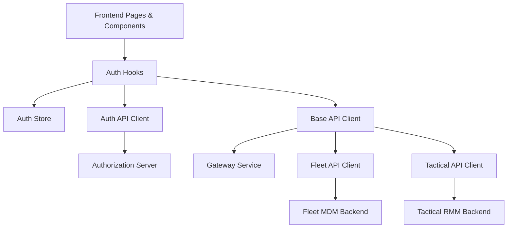

# Tenant Frontend API Clients and Auth Hooks

This module contains the **frontend-side authentication hooks and API client abstractions** used by the OpenFrame tenant frontend. It acts as the boundary between React components/hooks and the backend services exposed through the Gateway, Authorization Server, and tool-specific APIs.

Its responsibilities include:
- Managing authentication state, tenant discovery, and SSO flows
- Providing reusable React hooks for auth-related UX flows
- Providing strongly-typed API client wrappers for tenant, auth, and integrated tools

This module is a critical integration point between the **frontend UI** and backend modules such as the Authorization Server, Gateway Service, and downstream tool APIs.

---

## Architecture Overview

**Key ideas:**
- Hooks manage UI-facing state and flows
- API clients encapsulate authentication, retries, and tenant routing
- The Gateway and Authorization Server remain transparent to UI components

---

## Sub-modules

### Authentication Hooks

These hooks orchestrate authentication, tenant discovery, registration, and SSO flows.

- [Authentication Hooks](Authentication Hooks.md)

---

### API Clients

These clients provide a consistent, authenticated interface to backend APIs.

- [API Clients](API Clients.md)

---

## How This Module Fits in the System

- Relies on **Gateway Service** for request routing and security enforcement
- Relies on **Authorization Server** for OAuth, SSO, and tenant-aware auth
- Used by higher-level domain hooks and stores in `tenant_frontend_domain_hooks_and_stores`

This separation allows frontend features to evolve independently from backend auth and tool integrations.
