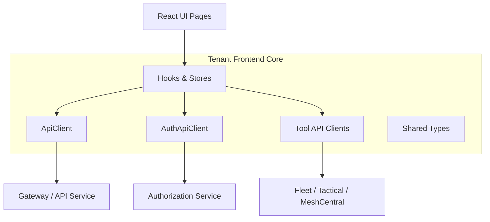

# Tenant Frontend Core – API Clients and Types

## Overview

The **tenant_frontend_core_api_clients_and_types** module is the foundational frontend integration layer for the OpenFrame tenant UI. It provides:

- **Centralized API clients** for tenant, auth, tools, and chat services
- **Strongly typed domain models** shared across pages and hooks
- **Reusable React hooks** encapsulating API access, authentication, and state
- **Zustand stores** for complex, long‑lived UI and streaming state

This module acts as the **contract boundary** between the OpenFrame frontend and backend services (API, Auth, Gateway, Chat, Tools), ensuring consistency, safety, and maintainability.

---

## Responsibilities

- Encapsulate **HTTP + GraphQL communication** via typed clients
- Normalize backend responses into **frontend‑friendly domain types**
- Provide **React hooks** for common workflows (auth, logs, tickets, Mingo chat)
- Centralize **token handling, refresh, and logout flows**
- Support **multi‑tenant SaaS and self‑hosted deployments**

---

## High‑Level Architecture

---

## Main Building Blocks

### 1. Authentication & Tenant Discovery

Provides tenant‑aware authentication, SSO discovery, registration, and logout.

**Key elements:**
- `useAuth` hook
- `TenantInfo`, `TenantDiscoveryResponse`
- Registration & invitation SSO providers

➡ See: **Auth Hooks** documentation

---

### 2. Central API Clients

Abstracts network access, authentication headers, token refresh, and error handling.

**Key clients:**
- `ApiClient` – core REST + GraphQL client
- `AuthApiClient` – auth & OAuth flows
- `FleetApiClient` – Fleet MDM integration
- `TacticalApiClient` – Tactical RMM integration

➡ See: **API Clients** documentation

---

### 3. Domain Types

Defines strongly typed models used across the UI.

**Examples:**
- Devices (`Device`, `ToolConnection`, `InstalledAgent`)
- Logs (`LogEntry`, filters, pagination)
- Policies & queries
- Tickets, dialogs, and messages

➡ See: **Domain Types** documentation

---

### 4. Logs & Observability

Hooks and components for querying, filtering, and displaying logs.

**Key parts:**
- `useLogs`, `useLogFilters`, `useLogDetails`
- Cursor‑based pagination
- `LogsTable` with imperative refresh API

➡ See: **Logs Module** documentation

---

### 5. Tickets & Dialogs

Implements ticketing and conversational workflows.

**Key parts:**
- Dialog list & details hooks
- Message pagination and polling
- Zustand dialog stores

➡ See: **Tickets & Dialogs** documentation

---

### 6. Mingo AI Chat Integration

Supports AI‑assisted conversations with streaming messages and approvals.

**Key parts:**
- `useMingoDialog` hook
- `MingoApiService`
- `MingoMessagesStore`
- Dialog & message GraphQL types

➡ See: **Mingo Chat** documentation

---

### 7. Deployment Detection

Detects cloud vs self‑hosted vs development deployments.

**Key parts:**
- `useDeployment` hook
- Global deployment store

➡ See: **Deployment Detection** documentation

---

## Relationship to Other Modules

- **Backend APIs**: api_service_core, authorization_service_core, gateway_service_core
- **Chat Backend**: chat_client_app_services
- **Shared UI Types**: frontend_chat_shared_types

This module is the **frontend counterpart** to those backend services, translating API contracts into ergonomic frontend abstractions.

---

## Design Principles

- **Single source of truth** for API access and types
- **Tenant‑first** design (every request is tenant‑aware)
- **Strong typing over duplication**
- **Hooks over direct API calls** in UI code
- **Graceful auth recovery** via token refresh and forced logout

---

## When to Extend This Module

Add new functionality here when:
- A new backend endpoint needs a reusable client
- A new domain concept requires shared types
- Multiple pages need the same data‑fetching logic

Avoid adding page‑specific UI logic; keep this module focused on **integration and contracts**.
