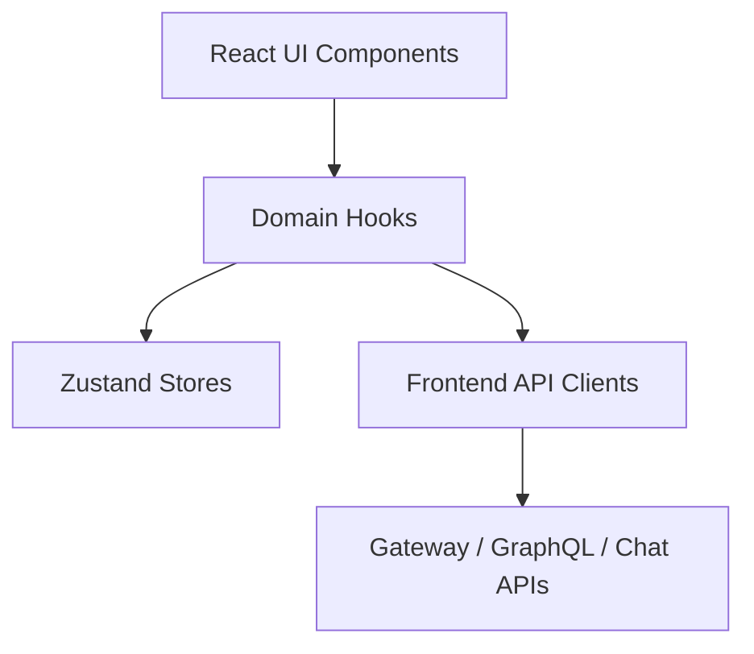

# Tenant Frontend Domain Hooks and Stores

This module contains the **domain-level React hooks, Zustand stores, and shared type definitions** used by the OpenFrame tenant frontend. It acts as the bridge between UI components and backend APIs (GraphQL and REST), providing:

- Strongly typed domain models (devices, logs, dialogs, policies)
- Reusable data-fetching hooks
- Centralized client-side state via Zustand
- Encapsulation of pagination, filtering, and error handling logic

The module is intentionally UI-framework-aware (React + hooks) while remaining **domain-oriented**, so business concepts like *Devices*, *Logs*, *Dialogs*, and *Mingo AI chats* are first-class citizens.

---

## Architectural Position

This module sits **above API clients** and **below UI components**:

- **Hooks** orchestrate API calls and state updates
- **Stores** persist and normalize state across views
- **Types** ensure consistency across the frontend

---

## Major Sub-Domains

### Devices Domain

Provides the unified **Device** model used across the UI, including hardware, OS, network, MDM, tags, agents, and tool connections.

- Single source of truth for device shape
- Normalizes data from multiple backend systems

See: [tenant_frontend_devices_domain.md](tenant_frontend_devices_domain.md)

---

### Deployment Detection

Global deployment awareness (cloud, self-hosted, development) backed by a Zustand store.

- One-time initialization in the browser
- Exposes convenience helpers (`isCloud`, `isSelfHosted`, etc.)

See: [tenant_frontend_deployment_hook.md](tenant_frontend_deployment_hook.md)

---

### Logs Domain

End-to-end log browsing support including:

- Log listing with cursor pagination
- Server-side filtering and search
- Log detail retrieval
- UI table integration via imperative refs

See: [tenant_frontend_logs_domain.md](tenant_frontend_logs_domain.md)

---

### Mingo AI Chat Domain

Implements the frontend state and API coordination for **Mingo AI dialogs**:

- Dialog lifecycle management
- Message streaming and segmentation
- Approval workflows
- Real-time typing and unread tracking

See: [tenant_frontend_mingo_domain.md](tenant_frontend_mingo_domain.md)

---

### Tickets & Dialogs Domain

Handles ticket-style dialogs used for client/admin conversations:

- Dialog lists (active & archived)
- Dialog details and message history
- Polling and real-time message merging
- Separate admin vs client message streams

See: [tenant_frontend_tickets_domain.md](tenant_frontend_tickets_domain.md)

---

### Settings, Policies, and Scripts

Smaller focused hooks and types supporting:

- Integrated tools configuration
- AI policy templates
- Script metadata retrieval

These are lightweight domains that follow the same hook + type pattern.

---

## Design Principles

1. **Domain-first modeling** – types reflect business concepts, not backend quirks
2. **Hooks as orchestration layers** – UI components stay declarative
3. **Zustand for shared state** – predictable, debuggable stores
4. **GraphQL response isolation** – GraphQL-specific shapes stay at the edge
5. **Pagination & filtering are reusable concerns**

---

## When to Add to This Module

Add new hooks or stores here when:

- The logic represents a reusable business concept
- Multiple components depend on the same data lifecycle
- State must persist across routes or panels

Avoid placing pure presentational logic here.

---

## Summary

`tenant_frontend_domain_hooks_and_stores` is the **core frontend domain layer** for OpenFrame tenants. It enables complex UI behavior while keeping components clean, typed, and focused on rendering.
