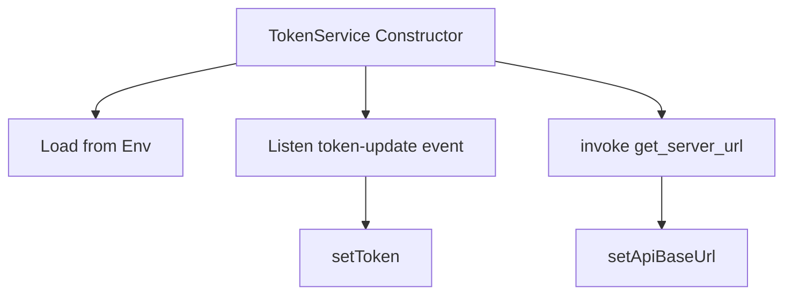

# TokenService

## Purpose
`TokenService` is the authentication and configuration backbone of the chat client. It manages:

- Access tokens used for API authentication
- The OpenFrame API base URL
- Synchronization with the native Tauri runtime

It is implemented as a singleton to guarantee consistent state across the application.

---

## Core Responsibilities

- Listen for token updates from the Rust backend
- Request tokens on demand via Tauri commands
- Discover and normalize the API base URL
- Notify subscribers of token or API URL changes

---

## Initialization Flow

---

## Key APIs

- `getCurrentToken()` – Returns the active token or null
- `requestToken()` – Requests a token from the native layer
- `ensureTokenReady()` – Blocks until token and API URL are available
- `onTokenUpdate()` – Subscribe to token changes
- `onApiUrlUpdate()` – Subscribe to API URL changes

---

## Security Considerations

- Tokens are **never logged in full**; logs are masked
- Token acquisition is delegated to the native layer
- The client never persists tokens to disk

---

## Integration Points

- **DialogGraphQLService** – Requires a valid token for all GraphQL calls
- **SupportedModelsService** – Uses token and API URL for REST calls
- **Tauri Runtime** – Source of truth for auth state

---

## Failure Modes

- Missing token: triggers a request to the native layer
- Missing API URL: retries discovery via Tauri
- Hard failure: throws a controlled error preventing unauthorized requests
